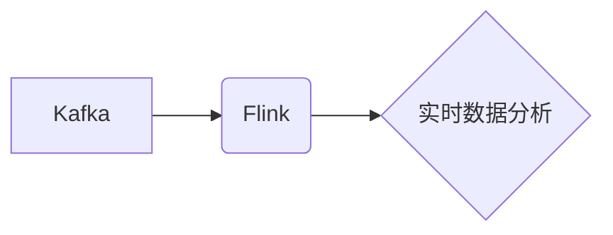

> Kafka, Flink, 流处理, 实时数据分析, 消息队列, 异步处理, 

## 1. 背景介绍

在当今数据爆炸的时代，实时数据处理和分析已成为各行各业的核心竞争力。Kafka作为高吞吐量、低延迟的消息队列系统，能够高效地收集、存储和传输海量数据。而Flink作为一款强大的流处理引擎，能够对实时数据进行高效的处理、分析和计算。将Kafka和Flink整合在一起，可以构建一个强大的实时数据处理平台，实现对实时数据的实时分析和应用。

## 2. 核心概念与联系

### 2.1 Kafka

Kafka是一个分布式、高吞吐量、低延迟的消息队列系统，它可以用于存储和传输海量数据。Kafka的核心概念包括：

* **主题(Topic):**  Kafka中的数据存储单元，类似于消息队列。
* **分区(Partition):** 主题被划分为多个分区，每个分区是一个独立的消息队列。
* **消费者(Consumer):** 从主题中读取消息的应用程序。
* **生产者(Producer):** 将消息发送到主题的应用程序。

### 2.2 Flink

Flink是一个分布式流处理引擎，它可以处理实时数据流，并进行各种数据处理操作，例如：

* **窗口操作:** 对数据流进行分组和聚合。
* **转换操作:** 对数据流进行转换和过滤。
* **连接操作:** 将来自不同数据源的数据流连接起来。

### 2.3 Kafka-Flink 集成

Kafka-Flink集成是指将Kafka和Flink结合起来，实现对实时数据的实时处理和分析。

**架构图:**



## 3. 核心算法原理 & 具体操作步骤

### 3.1 算法原理概述

Kafka-Flink集成主要基于以下算法原理：

* **消息订阅:** Flink的消费者可以订阅Kafka中的主题，并从主题中读取消息。
* **数据流处理:** Flink可以对从Kafka读取的消息进行各种数据处理操作，例如窗口操作、转换操作和连接操作。
* **结果输出:** Flink可以将处理后的结果输出到其他系统，例如数据库、文件系统或其他消息队列。

### 3.2 算法步骤详解

1. **配置Kafka连接:** 在Flink程序中配置Kafka连接信息，包括Kafka集群地址、主题名称、消费者组等。
2. **创建Kafka消费者:** 使用Flink提供的Kafka消费者API创建Kafka消费者，并指定要订阅的主题。
3. **读取Kafka消息:** Kafka消费者从Kafka主题中读取消息，并将消息传递给Flink的流处理程序。
4. **数据处理:** Flink的流处理程序对从Kafka读取的消息进行处理，例如窗口操作、转换操作和连接操作。
5. **结果输出:** Flink将处理后的结果输出到其他系统，例如数据库、文件系统或其他消息队列。

### 3.3 算法优缺点

**优点:**

* **高吞吐量:** Kafka和Flink都是高吞吐量系统，可以处理海量数据。
* **低延迟:** Kafka和Flink都支持低延迟数据处理，可以满足实时数据分析的需求。
* **可扩展性:** Kafka和Flink都是分布式系统，可以根据需要进行水平扩展。

**缺点:**

* **复杂性:** Kafka-Flink集成需要一定的技术复杂度，需要对Kafka和Flink有一定的了解。
* **维护成本:** Kafka和Flink都是复杂的系统，需要一定的维护成本。

### 3.4 算法应用领域

Kafka-Flink集成可以应用于各种领域，例如：

* **实时数据分析:** 对实时数据进行分析，例如用户行为分析、市场趋势分析等。
* **实时告警:** 对实时数据进行监控，并触发告警，例如系统故障告警、异常数据告警等。
* **实时推荐:** 对实时数据进行分析，并生成实时推荐，例如商品推荐、内容推荐等。

## 4. 数学模型和公式 & 详细讲解 & 举例说明

### 4.1 数学模型构建

Kafka-Flink集成可以抽象为一个数据流处理模型，其中数据流可以表示为一个时间序列，每个时间点对应一个数据元素。

**数据流模型:**

```
D(t) = {d1(t), d2(t), ..., dn(t)}
```

其中：

* D(t) 表示在时间点t的数据流。
* di(t) 表示在时间点t的第i个数据元素。

### 4.2 公式推导过程

Kafka-Flink集成中的数据处理操作可以表示为一系列数学公式，例如：

* **窗口操作:** 对数据流进行分组和聚合，可以表示为：

```
W(t) = aggregate(D(t-w), D(t-w+1), ..., D(t))
```

其中：

* W(t) 表示在时间点t的窗口结果。
* w 表示窗口大小。
* aggregate() 表示聚合函数。

* **转换操作:** 对数据流进行转换和过滤，可以表示为：

```
T(t) = transform(D(t))
```

其中：

* T(t) 表示在时间点t的转换结果。
* transform() 表示转换函数。

### 4.3 案例分析与讲解

例如，我们可以使用Kafka-Flink集成来实现实时用户行为分析。

* **数据源:** 用户行为数据，例如点击事件、浏览记录等，通过Kafka发布到主题。
* **数据处理:** Flink消费者从Kafka主题中读取用户行为数据，并对数据进行窗口操作和转换操作，例如：
    * 将用户行为数据分组，根据用户ID进行分组。
    * 计算每个用户在特定时间窗口内的点击次数、浏览次数等指标。
* **结果输出:** Flink将处理后的结果输出到数据库，用于实时用户行为分析。

## 5. 项目实践：代码实例和详细解释说明

### 5.1 开发环境搭建

* **Java环境:** 安装JDK 8 或以上版本。
* **Flink环境:** 下载并安装Flink，并配置Flink集群。
* **Kafka环境:** 下载并安装Kafka，并配置Kafka集群。

### 5.2 源代码详细实现

```java
import org.apache.flink.api.common.functions.MapFunction;
import org.apache.flink.streaming.api.datastream.DataStream;
import org.apache.flink.streaming.api.environment.StreamExecutionEnvironment;
import org.apache.flink.streaming.connectors.kafka.FlinkKafkaConsumer;
import org.apache.flink.streaming.connectors.kafka.FlinkKafkaProducer;

public class KafkaFlinkExample {

    public static void main(String[] args) throws Exception {
        // 创建Flink运行环境
        StreamExecutionEnvironment env = StreamExecutionEnvironment.getExecutionEnvironment();

        // Kafka消费者配置
        FlinkKafkaConsumer<String> kafkaConsumer = new FlinkKafkaConsumer<>("my-topic", new StringSchema(), "localhost:9092");

        // 创建数据流
        DataStream<String> dataStream = env.addSource(kafkaConsumer);

        // 数据转换
        DataStream<String> transformedStream = dataStream.map(new MapFunction<String, String>() {
            @Override
            public String map(String value) throws Exception {
                return value.toUpperCase();
            }
        });

        // Kafka生产者配置
        FlinkKafkaProducer<String> kafkaProducer = new FlinkKafkaProducer<>("output-topic", new StringSchema(), "localhost:9092");

        // 将数据输出到Kafka主题
        transformedStream.addSink(kafkaProducer);

        // 执行任务
        env.execute("KafkaFlinkExample");
    }
}
```

### 5.3 代码解读与分析

* **Kafka消费者:** 使用FlinkKafkaConsumer类创建Kafka消费者，并指定Kafka集群地址、主题名称和数据序列化器。
* **数据流:** 使用env.addSource()方法将Kafka消费者添加到Flink运行环境中，创建数据流。
* **数据转换:** 使用map()方法对数据流进行转换，将数据转换为大写。
* **Kafka生产者:** 使用FlinkKafkaProducer类创建Kafka生产者，并指定Kafka集群地址、主题名称和数据序列化器。
* **数据输出:** 使用addSink()方法将数据流输出到Kafka主题。

### 5.4 运行结果展示

运行代码后，Kafka消费者将从“my-topic”主题中读取数据，并将数据转换为大写，然后输出到“output-topic”主题。

## 6. 实际应用场景

### 6.1 实时用户行为分析

* **数据源:** 用户点击事件、浏览记录、购买记录等数据，通过Kafka发布到主题。
* **数据处理:** Flink消费者从Kafka主题中读取用户行为数据，并对数据进行窗口操作和转换操作，例如：
    * 将用户行为数据分组，根据用户ID进行分组。
    * 计算每个用户在特定时间窗口内的点击次数、浏览次数、购买次数等指标。
* **结果输出:** Flink将处理后的结果输出到数据库，用于实时用户行为分析。

### 6.2 实时告警系统

* **数据源:** 系统监控数据，例如CPU使用率、内存使用率、网络流量等数据，通过Kafka发布到主题。
* **数据处理:** Flink消费者从Kafka主题中读取监控数据，并对数据进行窗口操作和转换操作，例如：
    * 计算每个指标在特定时间窗口内的平均值、最大值、最小值等指标。
    * 比较指标值与预设阈值，如果超过阈值，则触发告警。
* **结果输出:** Flink将告警信息输出到告警系统，例如邮件、短信、微信等。

### 6.3 实时推荐系统

* **数据源:** 用户行为数据、商品信息等数据，通过Kafka发布到主题。
* **数据处理:** Flink消费者从Kafka主题中读取数据，并对数据进行窗口操作和转换操作，例如：
    * 计算每个用户在特定时间窗口内的商品浏览次数、购买次数等指标。
    * 根据用户行为数据和商品信息，生成实时商品推荐。
* **结果输出:** Flink将推荐结果输出到推荐系统，例如网站、APP等。

### 6.4 未来应用展望

随着数据量的不断增长和实时数据处理需求的不断增加，Kafka-Flink集成将有更广泛的应用场景，例如：

* **实时金融交易分析:** 对实时金融交易数据进行分析，例如交易风险控制、欺诈检测等。
* **实时医疗数据分析:** 对实时医疗数据进行分析，例如疾病诊断、患者监测等。
* **实时工业控制:** 对实时工业数据进行分析，例如设备故障预测、生产过程优化等。

## 7. 工具和资源推荐

### 7.1 学习资源推荐

* **Apache Kafka官网:** https://kafka.apache.org/
* **Apache Flink官网:** https://flink.apache.org/
* **Kafka-Flink集成官方文档:** https://flink.apache.org/docs/stable/connectors/kafka.html

### 7.2 开发工具推荐

* **IntelliJ IDEA:** https://www.jetbrains.com/idea/
* **Eclipse:** https://www.eclipse.org/

### 7.3 相关论文推荐

* **Kafka: A Distributed Streaming Platform:** https://static.googleusercontent.com/media/research.google.com/en//pubs/archive/43011.pdf
* **Apache Flink: A Unified Engine for Batch and Stream Processing:** https://www.researchgate.net/publication/324971010_Apache_Flink_A_Unified_Engine_for_Batch_and_Stream_Processing

## 8. 总结：未来发展趋势与挑战

### 8.1 研究成果总结

Kafka-Flink集成已经成为一种成熟的实时数据处理方案，它能够高效地处理海量数据，并满足实时数据分析的需求。

### 8.2 未来发展趋势

* **更强大的