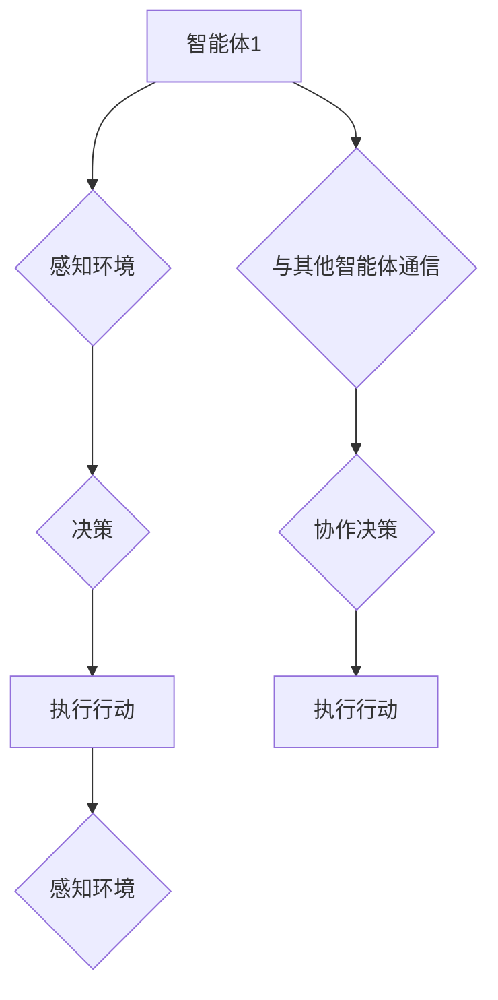

> 多智能体协作，智能体，协作算法，分布式系统，机器学习，强化学习

## 1. 背景介绍

在当今科技日新月异的时代，多智能体协作（Multiagent Collaboration）已成为人工智能领域研究的热点之一。它涉及多个智能体在共同目标下进行协作，并通过交互和信息共享来完成复杂任务。这种协作模式在许多领域都有广泛的应用，例如无人驾驶、机器人协作、网络安全、金融交易等。

传统的单智能体系统难以应对复杂环境下的挑战，而多智能体协作系统则能够通过智能体的分工协作，提高系统的鲁棒性、适应性以及效率。然而，多智能体协作也面临着许多挑战，例如智能体间的通信、协调、决策以及信任问题等。

## 2. 核心概念与联系

**2.1 智能体 (Agent)**

智能体是多智能体系统中的基本单元，它是一个能够感知环境、做出决策并执行行动的独立实体。智能体可以是软件程序、机器人、人或其他任何能够进行自主行为的系统。

**2.2 协作 (Collaboration)**

协作是指多个智能体在共同目标下进行合作，通过信息共享、资源分配和任务分配等方式来完成共同目标。

**2.3 多智能体系统 (Multiagent System)**

多智能体系统是由多个智能体组成的复杂系统，这些智能体之间相互作用，协同完成任务。

**2.4 协作算法 (Collaboration Algorithm)**

协作算法是多智能体系统中实现协作的关键技术，它定义了智能体之间的交互方式、决策机制以及任务分配策略。

**2.5 分布式系统 (Distributed System)**

分布式系统是指由多个相互连接的计算机节点组成的系统，每个节点都具有独立的计算能力和存储资源。多智能体系统通常是分布式系统的一部分。

**2.6 机器学习 (Machine Learning)**

机器学习是人工智能领域的一个重要分支，它通过算法学习数据中的模式，从而提高系统的性能。机器学习可以应用于多智能体协作系统中，例如智能体决策、任务分配和协作策略优化等。

**2.7 强化学习 (Reinforcement Learning)**

强化学习是一种机器学习方法，它通过奖励和惩罚机制来训练智能体，使其在特定环境中做出最优决策。强化学习可以应用于多智能体协作系统中，例如智能体之间的合作策略学习和环境适应性增强等。

**2.8 Mermaid 流程图**



## 3. 核心算法原理 & 具体操作步骤

### 3.1 算法原理概述

多智能体协作算法的目的是使多个智能体能够有效地协作完成共同目标。这些算法通常涉及以下几个方面：

* **通信协议:** 定义智能体之间如何交换信息。
* **决策机制:** 定义智能体如何根据接收到的信息做出决策。
* **任务分配策略:** 定义如何将任务分配给不同的智能体。
* **协作策略:** 定义智能体如何协调行动，以实现共同目标。

### 3.2 算法步骤详解

以下是一个典型的多智能体协作算法步骤：

1. **环境感知:** 智能体感知周围环境的信息，例如位置、目标、障碍物等。
2. **信息共享:** 智能体将感知到的信息与其他智能体共享。
3. **协作决策:** 智能体根据共享的信息和自身的知识，共同做出决策。
4. **任务分配:** 根据决策结果，将任务分配给不同的智能体。
5. **行动执行:** 智能体执行分配给自己的任务。
6. **状态更新:** 智能体根据行动结果更新自身的状态，并继续循环执行上述步骤。

### 3.3 算法优缺点

**优点:**

* **鲁棒性:** 多智能体系统能够容忍部分智能体故障，仍然能够完成任务。
* **适应性:** 多智能体系统能够根据环境变化动态调整策略，提高适应性。
* **效率:** 多智能体系统能够通过分工协作，提高任务完成效率。

**缺点:**

* **复杂性:** 多智能体系统比单智能体系统更加复杂，需要更复杂的算法和架构。
* **通信开销:** 多智能体系统需要频繁进行信息交换，可能会导致通信开销增加。
* **协调难度:** 多智能体系统需要协调多个智能体的行动，难度较高。

### 3.4 算法应用领域

多智能体协作算法在许多领域都有广泛的应用，例如：

* **无人驾驶:** 多辆无人驾驶汽车协同行驶，避免碰撞，提高交通效率。
* **机器人协作:** 多个机器人协同完成复杂任务，例如组装、搬运、探索等。
* **网络安全:** 多个智能体协同防御网络攻击，提高网络安全。
* **金融交易:** 多个智能体协同进行交易决策，提高投资收益。

## 4. 数学模型和公式 & 详细讲解 & 举例说明

### 4.1 数学模型构建

多智能体协作系统可以抽象为一个博弈模型，其中每个智能体都是一个博弈玩家，每个智能体的行动都会影响其他智能体的收益。

**状态空间:**  S = {s1, s2, ..., sn}，其中si表示系统在某个时刻的状态。

**行动空间:** A = {a1, a2, ..., am}，其中ai表示智能体i可以采取的行动。

**收益函数:**  R(si, ai1, ai2, ..., ain)，其中si表示系统在某个时刻的状态，ai1, ai2, ..., ain分别表示每个智能体的行动，R(si, ai1, ai2, ..., ain)表示每个智能体在该状态下采取这些行动的收益。

### 4.2 公式推导过程

在博弈模型中，每个智能体都会试图选择能够最大化自身收益的行动。可以使用纳什均衡的概念来分析智能体的行为。

**纳什均衡:**  一个策略组合，使得每个智能体在其他智能体策略已知的情况下，都无法通过单方面改变自己的策略来获得更高的收益。

### 4.3 案例分析与讲解

例如，考虑两个智能体进行合作捕鱼的场景。

* **状态空间:**  S = {有鱼, 没有鱼}
* **行动空间:** A = {合作捕鱼, 独自捕鱼}
* **收益函数:**

    * 如果两个智能体都合作捕鱼，则收益为 R(有鱼, 合作, 合作) = 10
    * 如果一个智能体合作捕鱼，另一个智能体独自捕鱼，则收益为 R(有鱼, 合作, 独自) = 5, R(有鱼, 独自, 合作) = 5
    * 如果两个智能体都独自捕鱼，则收益为 R(有鱼, 独自, 独自) = 2

在该场景下，纳什均衡策略是两个智能体都合作捕鱼，因为在这种策略下，每个智能体都无法通过单方面改变自己的策略来获得更高的收益。

## 5. 项目实践：代码实例和详细解释说明

### 5.1 开发环境搭建

* 操作系统: Ubuntu 20.04
* Python 版本: 3.8
* 必要的库: numpy, matplotlib, networkx

### 5.2 源代码详细实现

```python
import numpy as np
import matplotlib.pyplot as plt
import networkx as nx

# 定义智能体类
class Agent:
    def __init__(self, id, num_neighbors):
        self.id = id
        self.num_neighbors = num_neighbors
        self.state = None
        self.action = None

    def perceive(self, state):
        self.state = state

    def decide(self, neighbors_actions):
        # 决策逻辑
        pass

    def act(self):
        # 执行行动
        pass

# 定义多智能体系统类
class MultiagentSystem:
    def __init__(self, num_agents, num_neighbors):
        self.agents = [Agent(i, num_neighbors) for i in range(num_agents)]
        self.graph = nx.Graph()
        self.graph.add_nodes_from(range(num_agents))

    def run(self):
        # 系统运行循环
        while True:
            # 智能体感知环境
            for agent in self.agents:
                agent.perceive(self.get_environment_state())

            # 智能体决策
            for agent in self.agents:
                neighbors_actions = self.get_neighbors_actions(agent)
                agent.decide(neighbors_actions)

            # 智能体执行行动
            for agent in self.agents:
                agent.act()

            # 更新环境状态
            self.update_environment_state()

    def get_environment_state(self):
        # 获取环境状态
        pass

    def get_neighbors_actions(self, agent):
        # 获取邻居智能体的行动
        pass

    def update_environment_state(self):
        # 更新环境状态
        pass

# 实例化多智能体系统
system = MultiagentSystem(num_agents=5, num_neighbors=2)

# 启动系统运行
system.run()
```

### 5.3 代码解读与分析

* **智能体类:** 定义了智能体的基本属性和行为，包括感知环境、决策和执行行动。
* **多智能体系统类:** 定义了多智能体系统的整体结构和运行逻辑，包括环境状态、邻居智能体信息获取、智能体决策和行动执行等。
* **运行循环:** 多智能体系统运行的循环，包括感知环境、决策、行动执行和环境状态更新等步骤。

### 5.4 运行结果展示

运行代码后，可以观察到智能体在环境中进行交互和协作，完成共同目标。例如，可以观察到智能体如何根据环境状态和邻居智能体的行动做出决策，以及如何协调行动以完成任务。

## 6. 实际应用场景

### 6.1 无人驾驶

多智能体协作可以应用于无人驾驶汽车的协同行驶，例如：

* **车队行驶:** 多辆无人驾驶汽车可以协同行驶，形成车队，提高交通效率和安全性。
* **自动泊车:** 多辆无人驾驶汽车可以协同完成自动泊车，节省停车时间和空间。

### 6.2 机器人协作

多智能体协作可以应用于多个机器人协同完成复杂任务，例如：

* **组装:** 多个机器人可以协同完成复杂产品的组装，提高效率和精度。
* **搬运:** 多个机器人可以协同完成重物搬运，提高搬运效率和安全性。
* **探索:** 多个机器人可以协同探索未知环境，提高探索效率和安全性。

### 6.3 网络安全

多智能体协作可以应用于网络安全领域，例如：

* **入侵检测:** 多个智能体可以协同分析网络流量，提高入侵检测的准确率和效率。
* **恶意软件防御:** 多个智能体可以协同防御恶意软件攻击，提高网络安全。

### 6.4 金融交易

多智能体协作可以应用于金融交易领域，例如：

* **投资决策:** 多个智能体可以协同进行投资决策，提高投资收益和风险控制。
* **风险管理:** 多个智能体可以协同进行风险管理，降低金融机构的风险敞口。

### 6.5 未来应用展望

随着人工智能技术的不断发展，多智能体协作将在更多领域得到应用，例如：

* **医疗保健:** 多个智能体可以协同诊断疾病、制定治疗方案和提供远程医疗服务。
* **教育:** 多个智能体可以协同提供个性化教育服务，提高学生的学习效率和兴趣。
* **