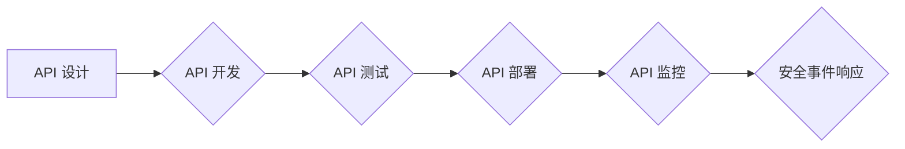

> OWASP, API 安全, 安全风险, 攻击向量, 防御策略, 编码规范, 安全测试

## 1. 背景介绍

随着互联网和移动应用的蓬勃发展，API（应用程序接口）已成为现代软件架构的核心组成部分。API 允许不同应用程序之间进行数据交换和功能调用，从而实现软件系统的互联互通。然而，API 的开放性和便捷性也带来了新的安全风险。攻击者可以利用 API 的漏洞进行数据泄露、系统入侵、业务逻辑篡改等恶意活动。

OWASP（开放 Web 应用安全项目）是一个致力于提高 Web 应用安全的非营利组织。OWASP 发布了《OWASP API 安全风险清单》，该清单列出了 API 常见的安全风险和攻击向量，为开发人员和安全人员提供了一份宝贵的参考指南。

## 2. 核心概念与联系

### 2.1 API 安全风险

API 安全风险是指通过攻击 API 的漏洞，导致应用程序或系统安全受到威胁的可能性。这些风险可能导致数据泄露、系统崩溃、业务逻辑篡改等严重后果。

### 2.2 攻击向量

攻击向量是指攻击者利用漏洞攻击目标系统的特定方法。常见的 API 攻击向量包括：

* **SQL 注入:** 攻击者通过恶意输入注入 SQL 代码，从而获取数据库中的敏感信息或执行恶意操作。
* **跨站脚本攻击 (XSS):** 攻击者通过注入恶意脚本，在目标用户的浏览器中执行恶意代码，从而窃取用户数据或控制用户行为。
* **身份验证绕过:** 攻击者通过欺骗或利用漏洞绕过身份验证机制，获取未经授权的访问权限。
* **拒绝服务攻击 (DoS):** 攻击者通过发送大量请求，使 API 服务器无法正常响应，从而导致服务中断。

### 2.3 OWASP API 安全风险清单

OWASP API 安全风险清单列出了 10 个主要的 API 安全风险，并提供了详细的描述、攻击向量和防御策略。

**Mermaid 流程图:**



## 3. 核心算法原理 & 具体操作步骤

### 3.1  算法原理概述

API 安全风险的识别和防御需要结合多种算法和技术，例如：

* **正则表达式:** 用于识别恶意输入，例如 SQL 注入和 XSS 攻击。
* **数据验证:** 对用户输入进行严格的验证，确保其符合预期格式和范围。
* **身份验证和授权:** 使用强密码、多因素身份验证和角色权限控制等机制，确保只有授权用户才能访问 API。
* **加密:** 使用 HTTPS 等协议加密 API 通信，防止数据被窃取。

### 3.2  算法步骤详解

**数据验证:**

1. 收集用户输入数据。
2. 使用正则表达式或其他验证规则检查数据格式和范围。
3. 如果数据不符合预期，则拒绝请求或提示用户修改输入。

**身份验证:**

1. 用户提交身份验证请求，包含用户名、密码或其他身份信息。
2. 系统验证用户身份信息，并生成身份验证令牌。
3. 用户在后续请求中携带身份验证令牌，以证明其身份。

**加密:**

1. 使用 HTTPS 协议加密 API 通信，确保数据在传输过程中不被窃取。
2. 使用加密算法对敏感数据进行加密，防止未经授权的访问。

### 3.3  算法优缺点

**正则表达式:**

* **优点:** 简单易用，可以识别多种类型的恶意输入。
* **缺点:** 难以识别复杂的攻击模式，容易受到攻击者的绕过。

**数据验证:**

* **优点:** 可以有效防止数据格式错误和范围越界等问题。
* **缺点:** 需要仔细设计验证规则，否则可能导致合法请求被拒绝。

**身份验证:**

* **优点:** 可以确保只有授权用户才能访问 API。
* **缺点:** 需要维护用户身份信息，存在被攻击的风险。

**加密:**

* **优点:** 可以保护数据在传输过程中不被窃取。
* **缺点:** 需要额外的计算资源和网络带宽。

### 3.4  算法应用领域

上述算法广泛应用于 API 安全领域，例如：

* **API 网关:** 用于对所有 API 请求进行过滤和验证。
* **API 管理平台:** 用于管理和监控 API 的生命周期。
* **安全信息和事件管理 (SIEM) 系统:** 用于收集和分析 API 安全事件。

## 4. 数学模型和公式 & 详细讲解 & 举例说明

### 4.1  数学模型构建

API 安全风险的评估可以采用数学模型进行量化分析。例如，可以构建一个基于攻击向量概率和影响程度的风险评估模型。

**风险 = 攻击向量概率 * 影响程度**

其中：

* 攻击向量概率是指特定攻击向量被成功利用的概率。
* 影响程度是指攻击成功后造成的损失程度。

### 4.2  公式推导过程

攻击向量概率和影响程度可以通过历史数据、威胁情报和专家评估等方式进行估计。

**攻击向量概率 = 历史攻击次数 / 总攻击次数**

**影响程度 = 损失金额 / 总资产值**

### 4.3  案例分析与讲解

假设一个 API 遭受 SQL 注入攻击的风险。

* 历史数据显示，该 API 在过去一年中遭受了 10 次 SQL 注入攻击，总攻击次数为 100 次。
* 专家评估认为，如果 SQL 注入攻击成功，可能会导致数据库数据泄露，造成 100 万美元的损失。
* 该 API 的总资产值为 1000 万美元。

根据上述数据，我们可以计算该 API 的 SQL 注入攻击风险：

* 攻击向量概率 = 10 / 100 = 0.1
* 影响程度 = 100 万 / 1000 万 = 0.1

**风险 = 0.1 * 0.1 = 0.01**

该 API 的 SQL 注入攻击风险为 0.01，属于较低的风险等级。

## 5. 项目实践：代码实例和详细解释说明

### 5.1  开发环境搭建

* 操作系统: Ubuntu 20.04
* 编程语言: Python 3.8
* 框架: Flask

### 5.2  源代码详细实现

```python
from flask import Flask, request, jsonify

app = Flask(__name__)

# 定义一个简单的 API 路由
@app.route('/api/data', methods=['GET'])
def get_data():
    # 从请求参数中获取用户 ID
    user_id = request.args.get('user_id')

    # 对用户 ID 进行验证
    if not user_id:
        return jsonify({'error': 'user_id is required'}), 400
    if not user_id.isdigit():
        return jsonify({'error': 'user_id must be a number'}), 400

    # 模拟从数据库获取数据
    data = {'user_id': user_id, 'name': 'John Doe'}

    return jsonify(data)

if __name__ == '__main__':
    app.run(debug=True)
```

### 5.3  代码解读与分析

* 该代码定义了一个简单的 Flask API，提供了一个 `/api/data` 路由，用于获取用户数据。
* 在路由函数中，代码首先从请求参数中获取 `user_id`，并进行验证，确保 `user_id` 是数字类型。
* 如果验证通过，代码模拟从数据库获取数据，并返回 JSON 格式的数据。

### 5.4  运行结果展示

运行上述代码后，可以访问 `http://127.0.0.1:5000/api/data?user_id=123`，获取用户 ID 为 123 的数据。

## 6. 实际应用场景

API 安全风险的识别和防御在各种实际应用场景中都至关重要，例如：

* **电商平台:** API 用于处理订单、支付、库存管理等业务，需要确保 API 的安全性，防止数据泄露和欺诈行为。
* **金融机构:** API 用于处理银行转账、信用卡支付等敏感业务，需要确保 API 的安全性，防止资金损失和用户隐私泄露。
* **医疗机构:** API 用于处理患者信息、预约挂号等业务，需要确保 API 的安全性，防止医疗数据的泄露和滥用。

### 6.4  未来应用展望

随着 API 的日益普及，API 安全风险将变得更加突出。未来，API 安全领域将朝着以下方向发展：

* **自动化安全测试:** 使用自动化工具进行 API 安全测试，提高测试效率和覆盖率。
* **机器学习和人工智能:** 利用机器学习和人工智能技术，识别新的攻击模式和漏洞。
* **零信任架构:** 采用零信任架构，对所有 API 请求进行严格验证，即使来自内部网络的请求也需要进行授权。

## 7. 工具和资源推荐

### 7.1  学习资源推荐

* OWASP API 安全风险清单: https://owasp.org/www-project-api-security-top-ten/
* OWASP API 安全指南: https://owasp.org/www-project-api-security-guide/
* SANS Institute API 安全课程: https://www.sans.org/cyber-security-courses/api-security

### 7.2  开发工具推荐

* Postman: 用于测试和调试 API 的工具。
* Burp Suite: 用于 Web 应用安全测试的工具。
* ZAP: 用于 Web 应用安全测试的开源工具。

### 7.3  相关论文推荐

* OWASP API Security Top 10: 2019
* API Security: A Comprehensive Survey
* Towards Secure API Design: A Survey of Best Practices

## 8. 总结：未来发展趋势与挑战

### 8.1  研究成果总结

OWASP API 安全风险清单和相关研究成果为 API 安全提供了重要的理论基础和实践指南。

### 8.2  未来发展趋势

API 安全领域将朝着自动化、智能化和零信任架构的方向发展。

### 8.3  面临的挑战

API 安全面临着不断变化的攻击威胁、复杂的架构和缺乏专业人才等挑战。

### 8.4  研究展望

未来研究将重点关注：

* 自动化 API 安全测试和漏洞发现技术。
* 基于机器学习和人工智能的 API 安全防御技术。
* API 安全最佳实践和标准的制定和推广。

## 9. 附录：常见问题与解答

**常见问题:**

* 如何识别 API 安全风险？
* 如何防御 API 攻击？
* 如何进行 API 安全测试？

**解答:**

* 可以参考 OWASP API 安全风险清单，结合实际应用场景进行风险评估。
* 可以采用数据验证、身份验证、加密等技术防御 API 攻击。
* 可以使用 Postman、Burp Suite 等工具进行 API 安全测试。


作者：禅与计算机程序设计艺术 / Zen and the Art of Computer Programming 
<end_of_turn>