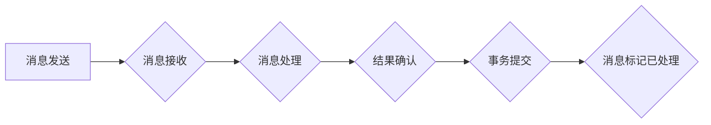

> exactly-once语义,分布式系统,消息队列,事务一致性,幂等性,代码实现,Java,Spring Cloud Stream

## 1. 背景介绍

在分布式系统中，数据一致性和可靠性至关重要。当多个服务组件之间进行数据交换时，如何确保消息被处理一次，且仅处理一次，成为一个关键问题。这就是“exactly-once语义”的由来。

exactly-once语义是指在分布式系统中，消息被处理一次，且仅处理一次，无论发生什么异常情况。它保证了消息的可靠性和数据一致性，避免了数据冗余和冲突。

传统的分布式系统中，消息处理通常采用“at-least-once”语义，即消息可能会被重复处理。虽然这种方式可以保证消息不会丢失，但可能会导致数据不一致。为了解决这个问题，exactly-once语义应运而生。

## 2. 核心概念与联系

exactly-once语义的实现依赖于以下几个核心概念：

* **消息唯一标识:** 每个消息都需要一个唯一的标识符，以便系统能够区分不同的消息。
* **事务处理:** 消息处理过程需要被封装成一个事务，确保消息的原子性。
* **幂等性:** 消息处理操作需要具备幂等性，即多次执行相同的操作不会导致状态发生改变。

**Mermaid 流程图:**



## 3. 核心算法原理 & 具体操作步骤

### 3.1  算法原理概述

exactly-once语义的实现通常采用以下两种主要算法：

* **基于事务的实现:** 将消息处理过程封装成一个事务，确保消息的原子性。如果消息处理过程中发生异常，事务会回滚，保证消息不会被重复处理。
* **基于消息标记的实现:** 在消息处理完成后，将消息标记为已处理，并持久化存储。如果消息再次被接收，系统会根据消息标记判断是否已经处理过，从而避免重复处理。

### 3.2  算法步骤详解

**基于事务的实现:**

1. 消息发送方将消息发送到消息队列。
2. 消息接收方从消息队列中接收消息。
3. 消息接收方将消息处理过程封装成一个事务。
4. 事务执行过程中，如果发生异常，事务会回滚，消息会被重新发送到消息队列。
5. 如果事务执行成功，消息会被标记为已处理，并提交事务。

**基于消息标记的实现:**

1. 消息发送方将消息发送到消息队列。
2. 消息接收方从消息队列中接收消息。
3. 消息接收方检查消息是否已经处理过。
4. 如果消息未被处理过，则进行消息处理。
5. 消息处理完成后，将消息标记为已处理，并持久化存储。

### 3.3  算法优缺点

**基于事务的实现:**

* **优点:** 能够保证消息的原子性，避免消息重复处理。
* **缺点:** 需要依赖数据库事务，可能会增加系统复杂度和性能开销。

**基于消息标记的实现:**

* **优点:** 不依赖数据库事务，性能开销较低。
* **缺点:** 需要维护消息标记，可能会增加系统复杂度。

### 3.4  算法应用领域

exactly-once语义广泛应用于以下领域:

* **金融交易:** 确保交易的原子性和可靠性。
* **电商平台:** 保证订单的准确性和一致性。
* **物流系统:** 跟踪货物状态，避免重复操作。
* **数据同步:** 保证数据的一致性。

## 4. 数学模型和公式 & 详细讲解 & 举例说明

### 4.1  数学模型构建

假设一个分布式系统中，有N个服务组件，每个组件都负责处理消息。消息的发送和接收过程可以抽象为一个状态机，其中每个状态代表消息的处理状态。

状态机状态：

* **发送状态:** 消息被发送到消息队列。
* **接收状态:** 消息被接收方接收。
* **处理状态:** 消息被处理完成。
* **确认状态:** 消息处理结果被确认。

### 4.2  公式推导过程

exactly-once语义的实现需要满足以下条件:

* **消息唯一性:** 每个消息必须具有唯一的标识符。
* **事务原子性:** 消息处理过程必须是一个原子操作，要么全部成功，要么全部失败。
* **幂等性:** 消息处理操作必须具备幂等性，即多次执行相同的操作不会导致状态发生改变。

### 4.3  案例分析与讲解

例如，在电商平台中，订单处理过程可以抽象为一个状态机:

1. **发送状态:** 用户提交订单，订单信息被发送到消息队列。
2. **接收状态:** 订单处理服务接收订单信息。
3. **处理状态:** 订单处理服务根据订单信息进行处理，例如库存扣减、支付处理等。
4. **确认状态:** 订单处理结果被确认，订单状态更新为已完成。

为了保证exactly-once语义，订单处理过程需要被封装成一个事务，确保事务的原子性。如果订单处理过程中发生异常，事务会回滚，订单状态不会被更新，避免重复处理。

## 5. 项目实践：代码实例和详细解释说明

### 5.1  开发环境搭建

* JDK 1.8 或以上
* Maven 或 Gradle
* Spring Boot 2.x

### 5.2  源代码详细实现

```java
@Service
public class OrderProcessor {

    @Autowired
    private OrderRepository orderRepository;

    @RabbitListener(queues = "orderQueue")
    public void processOrder(Order order) {
        // 开启事务
        TransactionTemplate transactionTemplate = new TransactionTemplate(transactionManager);
        transactionTemplate.execute(status -> {
            // 处理订单
            orderRepository.save(order);
            // ... 其他订单处理逻辑
            return null;
        });
    }
}
```

### 5.3  代码解读与分析

* `@Service` 注解将 `OrderProcessor` 类标记为服务组件。
* `@Autowired` 注解注入 `OrderRepository` 组件，用于持久化订单数据。
* `@RabbitListener` 注解监听名为 `orderQueue` 的消息队列。
* `processOrder` 方法接收订单消息，并使用 `TransactionTemplate` 开启事务。
* 事务内执行订单处理逻辑，包括持久化订单数据和执行其他订单处理操作。
* 如果事务执行过程中发生异常，事务会回滚，订单状态不会被更新，避免重复处理。

### 5.4  运行结果展示

当用户提交订单时，订单信息会被发送到 `orderQueue` 消息队列。`OrderProcessor` 组件会从消息队列中接收订单信息，并执行订单处理逻辑。如果订单处理成功，订单状态会被更新为已完成。

## 6. 实际应用场景

exactly-once语义在分布式系统中广泛应用，例如：

* **金融交易:** 确保交易的原子性和可靠性，避免资金损失。
* **电商平台:** 保证订单的准确性和一致性，避免订单重复处理。
* **物流系统:** 跟踪货物状态，避免重复操作。
* **数据同步:** 保证数据的一致性，避免数据冲突。

## 7. 工具和资源推荐

### 7.1  学习资源推荐

* **书籍:**
    * 《分布式系统设计与实践》
    * 《Kafka: The Definitive Guide》
    * 《Designing Data-Intensive Applications》

* **博客:**
    * Martin Fowler 博客
    * Spring Cloud Stream 官方博客

### 7.2  开发工具推荐

* **消息队列:** Kafka, RabbitMQ, ActiveMQ
* **分布式事务管理:** Spring Cloud Stream, Apache Pulsar
* **数据库:** MySQL, PostgreSQL, MongoDB

### 7.3  相关论文推荐

* **Exactly-Once Semantics for Message Processing in Distributed Systems**
* **A Survey of Exactly-Once Processing in Distributed Systems**

## 8. 总结：未来发展趋势与挑战

exactly-once语义是分布式系统中保证数据一致性和可靠性的关键技术。随着分布式系统的不断发展，exactly-once语义的应用场景将会更加广泛。

### 8.1  研究成果总结

目前，exactly-once语义的实现方法主要包括基于事务的实现和基于消息标记的实现。两种方法各有优缺点，需要根据实际应用场景选择合适的实现方式。

### 8.2  未来发展趋势

* **更智能的exactly-once语义实现:** 利用机器学习等技术，实现更智能的exactly-once语义实现，例如自动检测和修复消息处理错误。
* **支持更复杂的消息处理场景:** 支持更复杂的消息处理场景，例如异步消息处理、消息路由等。
* **提高exactly-once语义的性能:** 优化exactly-once语义的实现，提高其性能和效率。

### 8.3  面临的挑战

* **复杂性:** exactly-once语义的实现需要考虑多个因素，例如消息唯一性、事务原子性、幂等性等，实现起来比较复杂。
* **性能:** exactly-once语义的实现可能会增加系统性能开销，需要进行优化。
* **兼容性:** 不同消息队列和分布式事务管理系统之间可能存在兼容性问题，需要进行适配。

### 8.4  研究展望

未来，exactly-once语义的研究将继续深入，探索更智能、更高效、更易于使用的实现方法，为分布式系统的发展提供更强大的保障。

## 9. 附录：常见问题与解答

* **Q: exactly-once语义和at-least-once语义有什么区别？**

* **A:** exactly-once语义保证消息被处理一次，且仅处理一次，而at-least-once语义保证消息会被处理至少一次。

* **Q: 如何实现exactly-once语义？**

* **A:** 可以使用基于事务的实现或基于消息标记的实现。

* **Q: exactly-once语义的实现会带来哪些性能开销？**

* **A:** 可能会增加系统性能开销，例如事务管理开销和消息标记存储开销。

* **Q: 如何选择合适的exactly-once语义实现方式？**

* **A:** 需要根据实际应用场景选择合适的实现方式，例如高性能场景可以选择基于消息标记的实现，而需要高可靠性的场景可以选择基于事务的实现。


作者：禅与计算机程序设计艺术 / Zen and the Art of Computer Programming 
<end_of_turn>