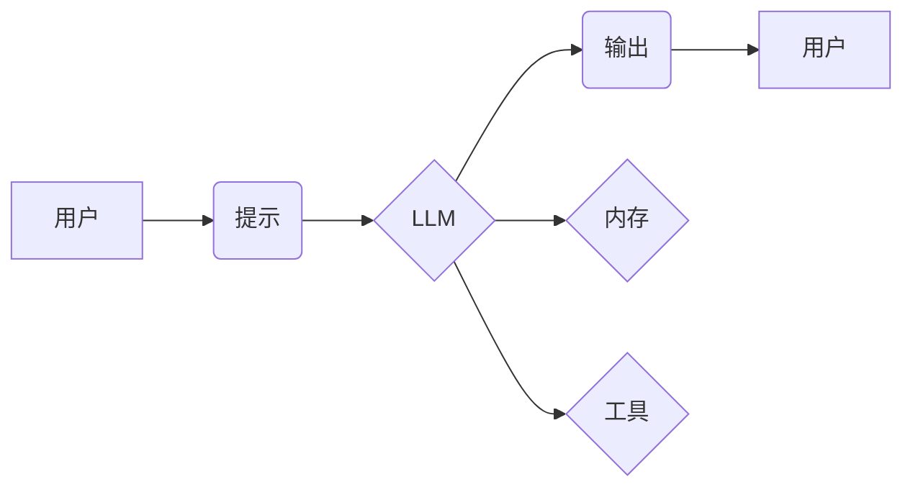

> LangChain, 语言模型, 应用开发, 编程框架, AI, 自然语言处理, 聊天机器人, 代码生成

## 1. 背景介绍

近年来，大型语言模型（LLM）的快速发展，如GPT-3、LaMDA等，为自然语言处理（NLP）领域带来了革命性的变革。这些模型展现出惊人的文本生成、翻译、摘要等能力，为各种应用场景提供了无限可能。然而，直接使用LLM往往需要复杂的代码编写和模型调优，对开发者门槛较高。

为了降低LLM应用的开发难度，并更好地利用其强大的能力，LangChain应运而生。LangChain是一个开源的框架，旨在简化LLM的应用开发，并提供丰富的工具和组件，帮助开发者构建更强大的AI应用。

## 2. 核心概念与联系

LangChain的核心概念是将LLM与其他工具和数据源进行集成，形成一个完整的AI应用生态系统。

**核心组件：**

* **模型（Model）：** LangChain支持多种LLM，包括OpenAI的GPT系列、HuggingFace的Transformers等。
* **提示（Prompt）：**  用于引导LLM生成特定类型的输出。LangChain提供多种提示模板和生成工具，帮助开发者设计更有效的提示。
* **链（Chain）：**  将多个组件组合在一起，形成一个完整的任务流程。例如，可以将LLM与搜索引擎、数据库等工具集成，构建一个能够回答复杂问题的智能问答系统。
* **内存（Memory）：**  用于存储和管理对话历史，帮助LLM理解上下文，并提供更自然流畅的交互体验。
* **工具（Tool）：**  提供额外的功能，例如计算、数据处理、网络请求等，扩展LLM的能力。

**架构图：**



## 3. 核心算法原理 & 具体操作步骤

### 3.1  算法原理概述

LangChain的核心算法原理是基于**提示工程**和**链式调用**。

* **提示工程:** 通过精心设计提示，引导LLM生成期望的输出。LangChain提供多种提示模板和生成工具，帮助开发者优化提示效果。
* **链式调用:** 将多个组件组合在一起，形成一个完整的任务流程。LangChain支持多种链类型，例如文本生成链、问答链、代码生成链等。

### 3.2  算法步骤详解

1. **定义任务:** 明确需要完成的任务，例如文本摘要、代码生成、问答等。
2. **选择模型:** 根据任务需求选择合适的LLM模型。
3. **设计提示:** 根据任务和模型的特点，设计有效的提示，引导LLM生成期望的输出。
4. **构建链:** 将LLM、提示、内存、工具等组件组合在一起，构建一个完整的任务流程。
5. **测试和优化:** 测试链的性能，并根据实际情况进行优化，例如调整提示、添加工具等。

### 3.3  算法优缺点

**优点:**

* **易于使用:** LangChain提供简洁易用的API，降低了LLM应用开发的难度。
* **灵活定制:**  开发者可以根据需求灵活定制链的结构和组件，构建个性化的AI应用。
* **丰富的工具和组件:** LangChain提供丰富的工具和组件，例如搜索引擎、数据库、代码库等，扩展LLM的能力。

**缺点:**

* **依赖LLM模型:** LangChain的性能依赖于所使用的LLM模型，模型能力有限，则应用效果也会受限。
* **链式调用复杂:**  构建复杂的链式调用可能需要较高的编程经验和理解能力。

### 3.4  算法应用领域

LangChain的应用领域非常广泛，包括：

* **聊天机器人:**  构建更智能、更自然的聊天机器人。
* **问答系统:**  构建能够回答复杂问题的智能问答系统。
* **文本生成:**  生成各种类型的文本，例如文章、故事、诗歌等。
* **代码生成:**  根据自然语言描述生成代码。
* **数据分析:**  利用LLM对数据进行分析和理解。

## 4. 数学模型和公式 & 详细讲解 & 举例说明

LangChain本身并不依赖于特定的数学模型，而是基于LLM的文本生成能力进行应用开发。

然而，在构建特定类型的应用时，可能会用到一些数学模型和公式，例如：

* **概率模型:** 用于计算LLM生成不同文本的概率。
* **信息检索模型:** 用于搜索和检索相关信息。
* **机器学习模型:** 用于训练和优化LLM模型。

## 5. 项目实践：代码实例和详细解释说明

### 5.1  开发环境搭建

1. 安装Python 3.7+
2. 安装必要的库，例如：
    ```bash
    pip install langchain transformers openai
    ```

### 5.2  源代码详细实现

以下是一个简单的LangChain代码示例，演示如何使用LLM生成文本：

```python
from langchain.llms import OpenAI
from langchain.prompts import PromptTemplate

# 初始化LLM模型
llm = OpenAI(temperature=0.7)

# 定义提示模板
template = """
你是一个非常棒的作家，请写一篇关于{topic}的文章。
"""

# 创建提示对象
prompt = PromptTemplate(template=template, input_variables=["topic"])

# 设置主题
topic = "人工智能"

# 生成文本
response = llm(prompt.format(topic=topic))

# 打印结果
print(response)
```

### 5.3  代码解读与分析

* **初始化LLM模型:** 使用`OpenAI`类初始化OpenAI的LLM模型。
* **定义提示模板:** 使用`PromptTemplate`类定义提示模板，并指定输入变量。
* **创建提示对象:** 使用模板和输入变量创建提示对象。
* **生成文本:** 使用LLM模型和提示对象生成文本。
* **打印结果:** 打印生成的文本。

### 5.4  运行结果展示

运行以上代码，将会生成一篇关于人工智能的文章。

## 6. 实际应用场景

LangChain在实际应用场景中展现出强大的潜力，例如：

* **智能客服:**  构建能够理解用户需求并提供个性化服务的智能客服系统。
* **内容创作:**  帮助作家、记者等创作高质量的文本内容。
* **教育辅助:**  为学生提供个性化的学习辅导和知识解答。
* **代码辅助:**  帮助程序员编写代码、查找错误和生成代码文档。

### 6.4  未来应用展望

随着LLM技术的不断发展，LangChain的应用场景将会更加广泛，例如：

* **多模态应用:**  将LLM与图像、音频等多模态数据进行融合，构建更智能的应用。
* **边缘计算:**  将LangChain部署到边缘设备上，实现低延迟、高效率的AI应用。
* **个性化定制:**  根据用户的需求和偏好，定制个性化的AI应用。

## 7. 工具和资源推荐

### 7.1  学习资源推荐

* **LangChain官方文档:** https://python.langchain.com/docs/
* **HuggingFace Transformers:** https://huggingface.co/docs/transformers/index
* **OpenAI API文档:** https://platform.openai.com/docs/api-reference

### 7.2  开发工具推荐

* **VS Code:** https://code.visualstudio.com/
* **PyCharm:** https://www.jetbrains.com/pycharm/

### 7.3  相关论文推荐

* **LangChain: Towards General-Purpose AI Applications with Language Models:** https://arxiv.org/abs/2204.08522

## 8. 总结：未来发展趋势与挑战

LangChain作为一种开源的LLM应用框架，为开发者提供了便捷的工具和组件，降低了LLM应用开发的难度。未来，LangChain将会朝着以下方向发展：

* **更强大的功能:**  持续集成新的工具和组件，扩展LLM的能力。
* **更易于使用:**  提供更友好的用户界面和更简洁的API，降低开发门槛。
* **更广泛的应用:**  应用于更多领域，例如多模态应用、边缘计算等。

然而，LangChain也面临一些挑战：

* **模型能力限制:**  LangChain的性能依赖于所使用的LLM模型，模型能力有限，则应用效果也会受限。
* **数据安全和隐私:**  LLM模型的训练和应用需要大量数据，如何保证数据安全和隐私是一个重要问题。
* **伦理问题:**  LLM模型可能会产生偏见或歧视性输出，如何解决伦理问题是一个需要认真思考的问题。

## 9. 附录：常见问题与解答

**Q1: 如何选择合适的LLM模型？**

**A1:**  选择合适的LLM模型取决于具体的应用场景和需求。例如，对于需要生成高质量文本的应用，可以选择GPT-3等强大的模型；对于需要快速响应的应用，可以选择轻量级的模型。

**Q2: 如何优化提示效果？**

**A2:**  可以通过以下方式优化提示效果：

* 使用更具体的语言描述任务。
* 提供更多的上下文信息。
* 使用提示模板和生成工具。

**Q3: 如何解决LLM模型的偏见问题？**

**A3:**  可以通过以下方式解决LLM模型的偏见问题：

* 使用更公平、更代表性的训练数据。
* 开发针对偏见问题的检测和修正算法。
* 提高对LLM模型输出的监督和控制。


作者：禅与计算机程序设计艺术 / Zen and the Art of Computer Programming 
<end_of_turn>