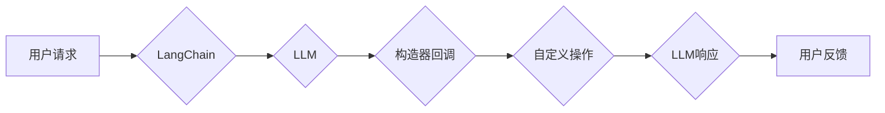

> LangChain, 构造器回调, 编程, AI, 自然语言处理, 应用场景, 实践

## 1. 背景介绍

在人工智能领域，自然语言处理（NLP）技术取得了长足的进步，使得机器能够理解和生成人类语言。LangChain 是一个强大的开源框架，旨在简化开发基于大型语言模型（LLM）的应用程序的过程。它提供了一系列工具和组件，帮助开发者构建更复杂、更智能的 NLP 应用。

构造器回调是 LangChain 中一个重要的功能，它允许开发者在 LLM 的调用过程中进行自定义操作，从而扩展 LLM 的功能和应用场景。

## 2. 核心概念与联系

### 2.1  LangChain

LangChain 是一个用于构建基于大型语言模型的应用程序的开源框架。它提供了一系列工具和组件，帮助开发者简化开发流程，提高开发效率。

### 2.2  LLM

大型语言模型（LLM）是近年来发展起来的一种强大的人工智能模型，能够理解和生成人类语言。例如，GPT-3、BERT 和 LaMDA 等都是著名的 LLM。

### 2.3  构造器回调

构造器回调是 LangChain 中一个重要的功能，它允许开发者在 LLM 的调用过程中进行自定义操作。

**Mermaid 流程图**



## 3. 核心算法原理 & 具体操作步骤

### 3.1  算法原理概述

构造器回调的核心原理是将自定义操作插入到 LLM 的调用流程中。当用户发出请求时，LangChain 会首先调用 LLM 进行处理，然后根据配置，触发构造器回调函数。

### 3.2  算法步骤详解

1. **用户发出请求:** 用户向 LangChain 应用发送一个请求。
2. **LangChain 解析请求:** LangChain 解析用户的请求，并确定需要调用的 LLM 和相应的参数。
3. **调用 LLM:** LangChain 调用 LLM 处理请求，获取 LLM 的响应。
4. **触发构造器回调:** 根据配置，LangChain 触发构造器回调函数。
5. **自定义操作:** 构造器回调函数执行自定义操作，例如：
    * 修改 LLM 的输入或输出
    * 从外部数据源获取信息
    * 调用其他服务
6. **返回结果:** 构造器回调函数返回处理后的结果，LangChain 将其作为最终响应返回给用户。

### 3.3  算法优缺点

**优点:**

* **扩展性:** 构造器回调允许开发者扩展 LLM 的功能，实现定制化的应用场景。
* **灵活性:** 开发者可以根据需求灵活地配置构造器回调函数，实现不同的操作逻辑。
* **可维护性:** 将自定义操作封装到构造器回调函数中，可以提高代码的可维护性和可读性。

**缺点:**

* **复杂性:** 使用构造器回调可能会增加代码的复杂度，需要开发者对 LangChain 和 LLM 有更深入的了解。
* **性能影响:** 构造器回调函数的执行可能会影响 LLM 的响应速度。

### 3.4  算法应用领域

* **聊天机器人:** 使用构造器回调可以实现聊天机器人的个性化对话，例如根据用户的历史聊天记录进行个性化回复。
* **文本生成:** 使用构造器回调可以对 LLM 生成的文本进行修改和优化，例如添加上下文信息、调整语气风格等。
* **数据分析:** 使用构造器回调可以将 LLM 的结果与外部数据源进行关联分析，例如从文本中提取关键信息并进行统计分析。

## 4. 数学模型和公式 & 详细讲解 & 举例说明

### 4.1  数学模型构建

构造器回调本身并不依赖于特定的数学模型，它是一个基于程序逻辑的机制。

### 4.2  公式推导过程

由于构造器回调的实现主要依赖于代码逻辑，因此没有特定的数学公式需要推导。

### 4.3  案例分析与讲解

假设我们想要构建一个聊天机器人，它能够根据用户的性别进行个性化回复。我们可以使用构造器回调来实现这个功能。

**代码示例:**

```python
from langchain.llms import OpenAI
from langchain.chains import ConversationChain
from langchain.prompts import PromptTemplate

llm = OpenAI(temperature=0)
prompt_template = PromptTemplate(
    input_variables=["user_gender", "user_message"],
    template="You are a friendly chatbot. The user is {user_gender}. {user_message}"
)

conversation = ConversationChain(
    llm=llm,
    prompt=prompt_template,
    memory=ConversationBufferMemory(max_messages=5)
)

# 在构造器回调中获取用户性别
def get_user_gender(message):
    # 使用正则表达式或其他方法提取用户性别
    # 例如，如果用户说 "我是女生"，则返回 "female"
    return "female"

# 将构造器回调添加到 ConversationChain 中
conversation.add_callback(get_user_gender)

# 与聊天机器人进行对话
response = conversation.run("你好")
print(response)
```

在这个例子中，`get_user_gender` 函数作为构造器回调，在每次对话时都会被调用，并根据用户的输入提取性别信息。然后，`PromptTemplate` 会将用户的性别信息传递给 LLM，从而生成个性化的回复。

## 5. 项目实践：代码实例和详细解释说明

### 5.1  开发环境搭建

1. 安装 Python 3.7 或更高版本。
2. 安装 LangChain 库：`pip install langchain`
3. 安装 OpenAI 库：`pip install openai`
4. 创建 OpenAI 账户并获取 API 密钥。

### 5.2  源代码详细实现

```python
from langchain.llms import OpenAI
from langchain.chains import ConversationChain
from langchain.prompts import PromptTemplate
from langchain.memory import ConversationBufferMemory
from langchain.callbacks import BaseCallback

class GenderDetectorCallback(BaseCallback):
    def __init__(self):
        super().__init__()

    def on_message(self, message, turn_number, history):
        # 使用正则表达式或其他方法提取用户性别
        # 例如，如果用户说 "我是女生"，则返回 "female"
        if "女生" in message:
            return {"user_gender": "female"}
        elif "男生" in message:
            return {"user_gender": "male"}
        else:
            return None

llm = OpenAI(temperature=0)
prompt_template = PromptTemplate(
    input_variables=["user_gender", "user_message"],
    template="You are a friendly chatbot. The user is {user_gender}. {user_message}"
)

conversation = ConversationChain(
    llm=llm,
    prompt=prompt_template,
    memory=ConversationBufferMemory(max_messages=5),
    callbacks=[GenderDetectorCallback()]
)

# 与聊天机器人进行对话
response = conversation.run("你好")
print(response)
```

### 5.3  代码解读与分析

* `GenderDetectorCallback` 类继承自 `BaseCallback`，实现了 `on_message` 方法，用于在每次对话时提取用户性别信息。
* `ConversationChain` 中添加了 `GenderDetectorCallback` 到 `callbacks` 列表中，使得该回调函数在对话过程中被触发。
* `PromptTemplate` 中使用 `user_gender` 变量来动态生成个性化的回复。

### 5.4  运行结果展示

当用户输入 "你好" 时，聊天机器人会根据用户的性别信息生成相应的回复。

## 6. 实际应用场景

### 6.1  个性化客服

使用构造器回调可以根据用户的历史聊天记录、购买行为等信息，提供个性化的客服服务。

### 6.2  智能问答

在智能问答系统中，可以使用构造器回调来根据用户的提问内容，从不同的知识库中获取相关信息，并生成更准确的答案。

### 6.3  内容创作

可以使用构造器回调来辅助内容创作，例如根据用户的主题要求，生成不同风格的文案。

### 6.4  未来应用展望

随着人工智能技术的不断发展，构造器回调将在更多领域得到应用，例如：

* **代码生成:** 使用构造器回调可以根据用户的需求，生成不同类型的代码。
* **数据分析:** 使用构造器回调可以将 LLM 的结果与外部数据源进行关联分析，实现更深入的数据挖掘。
* **游戏开发:** 使用构造器回调可以为游戏角色添加更智能的行为和对话。

## 7. 工具和资源推荐

### 7.1  学习资源推荐

* **LangChain 官方文档:** https://python.langchain.com/docs/
* **OpenAI 文档:** https://platform.openai.com/docs/

### 7.2  开发工具推荐

* **VS Code:** https://code.visualstudio.com/
* **PyCharm:** https://www.jetbrains.com/pycharm/

### 7.3  相关论文推荐

* **LangChain: Towards AI-Powered Applications with Language Models:** https://arxiv.org/abs/2204.05217

## 8. 总结：未来发展趋势与挑战

### 8.1  研究成果总结

构造器回调是 LangChain 中一个重要的功能，它为开发者提供了扩展 LLM 功能和应用场景的强大工具。

### 8.2  未来发展趋势

未来，构造器回调的功能将会更加强大，例如：

* 支持更复杂的自定义操作
* 提供更丰富的回调类型
* 与其他 AI 工具和服务进行集成

### 8.3  面临的挑战

* 如何提高构造器回调的性能和效率
* 如何确保构造器回调的安全性
* 如何更好地管理和维护复杂的构造器回调系统

### 8.4  研究展望

未来，我们将继续研究和改进构造器回调的功能，使其能够更好地服务于人工智能应用的开发和推广。

## 9. 附录：常见问题与解答

### 9.1  Q: 如何配置构造器回调？

A: 在 `ConversationChain` 或其他 LangChain 组件中，可以通过 `callbacks` 参数添加构造器回调函数。

### 9.2  Q: 构造器回调的执行时机是什么时候？

A: 构造器回调会在 LLM 调用前后执行，具体执行时机取决于回调函数的类型和配置。

### 9.3  Q: 构造器回调可以访问哪些信息？

A: 构造器回调可以访问 LLM 的输入、输出、对话历史等信息。

### 9.4  Q: 如何确保构造器回调的安全性？

A: 在设计和使用构造器回调时，需要考虑安全问题，例如：

* 限制回调函数的权限
* 对输入数据进行安全过滤
* 使用沙盒环境运行回调函数


作者：禅与计算机程序设计艺术 / Zen and the Art of Computer Programming 
<end_of_turn>