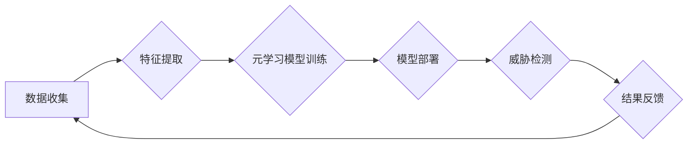

> 元学习，网络安全，威胁检测，机器学习，深度学习，数据映射

## 1. 背景介绍

网络安全威胁日益复杂，传统的安全检测方法难以有效应对不断演变的攻击手段。传统的安全检测方法主要依赖于已知的攻击特征和规则，而新型攻击往往具有高度的隐蔽性和针对性，难以被传统方法识别。因此，迫切需要一种能够主动学习和适应新威胁的智能化安全检测方法。

元学习（Meta-Learning）作为一种机器学习的范式，能够通过学习学习算法，快速适应新的任务和数据。它在网络安全领域具有巨大的潜力，可以用于构建更智能、更有效的威胁检测系统。

## 2. 核心概念与联系

元学习的核心思想是学习如何学习。它通过训练一个“学习者”模型，使其能够从少量数据中快速学习新的任务。

**元学习的流程可以概括为以下步骤：**

1. **训练阶段：** 使用大量数据训练一个元学习模型，使其能够学习如何学习。
2. **测试阶段：** 在测试阶段，给元学习模型一个新的任务和少量数据。
3. **快速适应：** 元学习模型利用其学习到的知识，快速适应新的任务，并进行预测或分类。

**元学习与网络安全威胁检测的联系：**

元学习可以用于构建一个能够主动学习和适应新威胁的威胁检测系统。

**元学习在网络安全威胁检测中的应用场景：**

* **恶意软件检测：** 元学习可以学习不同恶意软件的特征，并快速识别新的恶意软件。
* **入侵检测：** 元学习可以学习网络攻击的模式，并及时发现入侵行为。
* **漏洞挖掘：** 元学习可以学习软件的漏洞特征，并帮助发现新的漏洞。

**Mermaid 流程图：**



## 3. 核心算法原理 & 具体操作步骤

### 3.1  算法原理概述

基于元学习的网络安全威胁检测算法的核心原理是利用元学习模型学习如何从少量数据中快速学习新的任务，从而能够快速适应新的威胁。

**具体来说，该算法可以分为以下几个步骤：**

1. **数据预处理：** 收集网络安全相关数据，并进行清洗、格式化等预处理操作。
2. **特征提取：** 从预处理后的数据中提取特征，例如网络流量特征、系统日志特征等。
3. **元学习模型训练：** 使用元学习算法训练一个元学习模型，使其能够学习如何从少量数据中快速学习新的任务。
4. **模型部署：** 将训练好的元学习模型部署到网络安全系统中。
5. **威胁检测：** 当系统检测到新的网络活动时，将相关数据输入到元学习模型中，模型根据其学习到的知识快速学习新的任务，并进行威胁检测。

### 3.2  算法步骤详解

**1. 数据预处理：**

* 数据收集：从网络设备、系统日志、安全信息和事件管理（SIEM）系统等收集网络安全相关数据。
* 数据清洗：去除数据中的噪声、重复数据和无效数据。
* 数据格式化：将数据转换为适合元学习模型训练的格式。

**2. 特征提取：**

* 使用机器学习算法或人工特征工程方法提取网络安全相关的特征。
* 例如，可以提取网络流量特征、系统调用特征、进程特征、文件特征等。

**3. 元学习模型训练：**

* 选择合适的元学习算法，例如MAML、Prototypical Networks等。
* 使用训练数据训练元学习模型，使其能够学习如何从少量数据中快速学习新的任务。

**4. 模型部署：**

* 将训练好的元学习模型部署到网络安全系统中。
* 模型可以部署在网络边缘、安全信息和事件管理（SIEM）系统或云平台等。

**5. 威胁检测：**

* 当系统检测到新的网络活动时，将相关数据输入到元学习模型中。
* 模型根据其学习到的知识快速学习新的任务，并进行威胁检测。
* 例如，可以判断网络流量是否为恶意流量、系统日志是否包含攻击行为等。

### 3.3  算法优缺点

**优点：**

* **快速适应新威胁：** 元学习模型能够快速学习新的任务，从而能够适应不断变化的网络威胁环境。
* **低样本需求：** 元学习模型只需要少量数据即可学习新的任务，这对于数据稀缺的网络安全领域非常有益。
* **泛化能力强：** 元学习模型能够从多个任务中学习，从而具有较强的泛化能力。

**缺点：**

* **训练复杂度高：** 元学习模型的训练过程相对复杂，需要大量的计算资源和时间。
* **数据依赖性强：** 元学习模型的性能取决于训练数据的质量和数量。
* **解释性差：** 元学习模型的决策过程相对复杂，难以解释其决策依据。

### 3.4  算法应用领域

* **恶意软件检测：** 快速识别新的恶意软件。
* **入侵检测：** 发现网络攻击行为。
* **漏洞挖掘：** 发现软件漏洞。
* **网络流量分析：** 识别异常网络流量。
* **安全事件响应：** 自动化安全事件响应。

## 4. 数学模型和公式 & 详细讲解 & 举例说明

### 4.1  数学模型构建

元学习模型通常采用基于梯度的优化算法进行训练，例如随机梯度下降（SGD）或Adam。

**目标函数：**

$$
L(\theta) = \sum_{i=1}^{N} \mathcal{L}(f_{\theta}(x_i), y_i)
$$

其中：

* $\theta$ 是模型参数。
* $N$ 是训练样本数量。
* $\mathcal{L}$ 是损失函数。
* $f_{\theta}(x_i)$ 是模型对样本 $x_i$ 的预测结果。
* $y_i$ 是样本 $x_i$ 的真实标签。

**梯度下降：**

$$
\theta = \theta - \eta \nabla_{\theta} L(\theta)
$$

其中：

* $\eta$ 是学习率。
* $\nabla_{\theta} L(\theta)$ 是目标函数关于参数 $\theta$ 的梯度。

### 4.2  公式推导过程

元学习模型的训练过程可以看作是一个嵌套的优化过程。

**外层优化：**

目标是找到一个能够快速适应新任务的元学习模型参数 $\theta$.

**内层优化：**

对于每个新任务，使用元学习模型参数 $\theta$ 训练一个具体的模型 $f_{\theta}(x)$，并使用梯度下降算法进行优化。

### 4.3  案例分析与讲解

**MAML（Model-Agnostic Meta-Learning）算法：**

MAML 是一种常用的元学习算法，它可以应用于各种机器学习模型。

**MAML 算法的训练过程：**

1. **初始化模型参数 $\theta$。**
2. **对于每个任务 $t$：**
    * **抽取任务 $t$ 的训练数据 $D_t$ 和测试数据 $D_t'$。**
    * **使用梯度下降算法对模型参数 $\theta$ 进行更新，使其能够在任务 $t$ 的训练数据上达到最佳性能。**
3. **更新模型参数 $\theta$，使其能够在所有任务上达到最佳性能。**

## 5. 项目实践：代码实例和详细解释说明

### 5.1  开发环境搭建

* **操作系统：** Ubuntu 20.04 LTS
* **编程语言：** Python 3.8
* **深度学习框架：** PyTorch 1.8.1
* **其他依赖库：** NumPy, Pandas, Matplotlib

### 5.2  源代码详细实现

```python
import torch
import torch.nn as nn
import torch.optim as optim

# 定义元学习模型
class MetaLearner(nn.Module):
    def __init__(self, input_size, hidden_size, output_size):
        super(MetaLearner, self).__init__()
        self.fc1 = nn.Linear(input_size, hidden_size)
        self.fc2 = nn.Linear(hidden_size, output_size)

    def forward(self, x):
        x = torch.relu(self.fc1(x))
        x = self.fc2(x)
        return x

# 定义元学习训练函数
def meta_train(model, optimizer, train_loader, epochs):
    for epoch in range(epochs):
        for batch_idx, (data, target) in enumerate(train_loader):
            # 前向传播
            output = model(data)
            # 计算损失
            loss = nn.MSELoss()(output, target)
            # 反向传播
            optimizer.zero_grad()
            loss.backward()
            # 更新参数
            optimizer.step()

# 定义元学习测试函数
def meta_test(model, test_loader):
    # 测试集上的损失
    test_loss = 0
    # 测试集上的准确率
    correct = 0
    total = 0
    with torch.no_grad():
        for data, target in test_loader:
            output = model(data)
            test_loss += nn.MSELoss()(output, target).item()
            _, predicted = torch.max(output.data, 1)
            total += target.size(0)
            correct += (predicted == target).sum().item()
    test_loss /= len(test_loader)
    accuracy = 100 * correct / total
    return test_loss, accuracy

# 实例化模型、优化器和训练器
model = MetaLearner(input_size=10, hidden_size=50, output_size=1)
optimizer = optim.Adam(model.parameters(), lr=0.001)
train_loader = ... # 训练数据加载器
test_loader = ... # 测试数据加载器

# 元学习训练
meta_train(model, optimizer, train_loader, epochs=10)

# 元学习测试
test_loss, accuracy = meta_test(model, test_loader)
print(f'Test Loss: {test_loss:.4f}')
print(f'Accuracy: {accuracy:.2f}%')
```

### 5.3  代码解读与分析

* **模型定义：** 代码中定义了一个简单的元学习模型，它是一个多层感知机（MLP）。
* **训练函数：** `meta_train` 函数实现了元学习的训练过程，它使用梯度下降算法对模型参数进行更新。
* **测试函数：** `meta_test` 函数实现了元学习模型在测试集上的评估。
* **实例化和训练：** 代码实例化了模型、优化器和数据加载器，并调用了 `meta_train` 函数进行训练。
* **测试结果：** 训练完成后，调用 `meta_test` 函数评估模型性能，并打印测试损失和准确率。

### 5.4  运行结果展示

运行代码后，会输出测试损失和准确率。

## 6. 实际应用场景

### 6.1  恶意软件检测

元学习可以用于构建一个能够快速识别新的恶意软件的检测系统。

**具体来说，可以：**

* 使用元学习模型学习不同恶意软件的特征。
* 当检测到新的文件时，将文件特征输入到元学习模型中，模型根据其学习到的知识快速判断文件是否为恶意软件。

### 6.2  入侵检测

元学习可以用于构建一个能够及时发现入侵行为的入侵检测系统。

**具体来说，可以：**

* 使用元学习模型学习网络攻击的模式。
* 当检测到新的网络活动时，将网络活动特征输入到元学习模型中，模型根据其学习到的知识判断网络活动是否