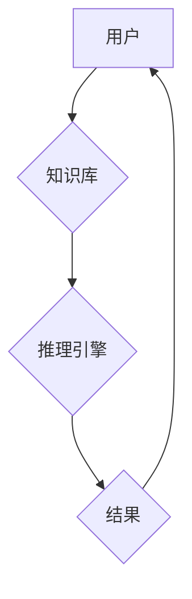

> 专家系统,人工智能,规则引擎,知识库,推理机制,代码实例,Python

## 1. 背景介绍

专家系统是人工智能领域中的一种重要分支，它旨在模拟人类专家在特定领域内的知识和推理能力，从而解决复杂问题。专家系统通常由知识库、推理引擎和用户界面三个主要部分组成。知识库存储了专家在该领域积累的经验和知识，推理引擎根据知识库中的规则和事实进行逻辑推理，最终得出结论或建议。

随着人工智能技术的不断发展，专家系统在各个领域得到了广泛应用，例如医学诊断、金融分析、法律咨询等。然而，传统的专家系统往往存在一些局限性，例如知识的表达和更新困难、推理能力有限等。近年来，随着深度学习等新兴技术的出现，专家系统也开始朝着更加智能化、自动化方向发展。

## 2. 核心概念与联系

**2.1 知识库**

知识库是专家系统中最核心的部分，它存储了专家在特定领域内的知识和经验。知识库的构建需要专家进行深入的分析和总结，并将知识以可机器理解的形式进行表达。常见的知识表示方法包括规则、事实、概念网等。

**2.2 推理引擎**

推理引擎是专家系统执行推理过程的核心组件，它根据知识库中的规则和事实进行逻辑推理，最终得出结论或建议。常见的推理方法包括前向推理、后向推理、基于规则的推理等。

**2.3 用户界面**

用户界面是专家系统与用户交互的桥梁，它负责将专家系统的推理结果以易于理解的方式呈现给用户。用户界面通常包括输入界面、输出界面和交互界面等。

**2.4 专家系统架构**



## 3. 核心算法原理 & 具体操作步骤

**3.1 算法原理概述**

专家系统中的推理算法通常基于逻辑推理和规则匹配。

* **逻辑推理:** 逻辑推理是指根据已知的逻辑规则和事实，推导出新的结论。常见的逻辑推理方法包括演绎推理、归纳推理和 Abductive reasoning。
* **规则匹配:** 规则匹配是指根据专家系统中的规则库，匹配用户输入的查询或问题，并根据匹配的结果进行推理和决策。

**3.2 算法步骤详解**

1. **知识库构建:** 首先需要收集和整理专家在特定领域的知识和经验，并将其以可机器理解的形式存储在知识库中。
2. **用户输入:** 用户通过用户界面输入查询或问题。
3. **规则匹配:** 推理引擎根据用户输入，匹配知识库中的相关规则。
4. **推理过程:** 推理引擎根据匹配的规则和知识库中的事实，进行逻辑推理，得出结论或建议。
5. **结果输出:** 推理引擎将推理结果以易于理解的方式呈现给用户。

**3.3 算法优缺点**

**优点:**

* **可解释性强:** 专家系统的推理过程是基于明确的规则和事实，因此其推理结果易于理解和解释。
* **领域专长:** 专家系统可以模拟人类专家的知识和经验，在特定领域内具有很高的专业水平。
* **可维护性好:** 专家系统的知识库可以定期更新和维护，以适应不断变化的知识和环境。

**缺点:**

* **知识工程成本高:** 构建专家系统需要大量的专家知识和时间投入。
* **知识迁移困难:** 专家系统通常针对特定领域进行开发，难以迁移到其他领域。
* **推理能力有限:** 传统的专家系统推理能力有限，难以处理复杂、模糊的知识和问题。

**3.4 算法应用领域**

* 医学诊断
* 金融分析
* 法律咨询
* 工业控制
* 教育培训

## 4. 数学模型和公式 & 详细讲解 & 举例说明

**4.1 数学模型构建**

专家系统中的知识可以表示为逻辑公式，例如：

* **规则:** 如果 A 并且 B，那么 C。
* **事实:** A 是真的。

这些逻辑公式可以构建成一个数学模型，用于描述专家系统的知识和推理过程。

**4.2 公式推导过程**

可以使用逻辑推理规则，例如 Modus Ponens 和 Modus Tollens，从知识库中的规则和事实推导出新的结论。

**4.3 案例分析与讲解**

例如，假设我们有一个专家系统用于诊断感冒，其知识库包含以下规则和事实：

* **规则1:** 如果患者有发烧并且咳嗽，那么患者患感冒。
* **规则2:** 如果患者有头痛并且鼻塞，那么患者患感冒。
* **事实1:** 患者有发烧。
* **事实2:** 患者有咳嗽。

根据规则1和事实1、事实2，我们可以推导出结论：患者患感冒。

## 5. 项目实践：代码实例和详细解释说明

**5.1 开发环境搭建**

* Python 3.x
* Rule Engine 库 (例如: `drools`, `Jess`)

**5.2 源代码详细实现**

```python
# 使用 Python 的 Rule Engine 库实现专家系统

# 知识库
knowledge_base = {
    "rule1": {
        "conditions": ["fever", "cough"],
        "conclusion": "cold"
    },
    "rule2": {
        "conditions": ["headache", "nasal_congestion"],
        "conclusion": "cold"
    }
}

# 用户输入
symptoms = ["fever", "cough"]

# 推理过程
for rule_name, rule_data in knowledge_base.items():
    if all(symptom in symptoms for symptom in rule_data["conditions"]):
        print(f"根据规则 {rule_name}, 患者可能患感冒.")

```

**5.3 代码解读与分析**

* 知识库使用字典存储规则，每个规则包含条件和结论。
* 用户输入的症状存储在 `symptoms` 列表中。
* 循环遍历知识库中的规则，检查用户输入的症状是否满足规则的条件。
* 如果满足条件，则打印相应的结论。

**5.4 运行结果展示**

```
根据规则 rule1, 患者可能患感冒.
```

## 6. 实际应用场景

**6.1 医学诊断**

专家系统可以辅助医生诊断疾病，例如根据患者的症状和病史，推断出可能的疾病诊断。

**6.2 金融分析**

专家系统可以帮助金融分析师分析市场趋势，识别投资机会，并进行风险评估。

**6.3 法律咨询**

专家系统可以帮助律师分析法律法规，寻找相关案例，并提供法律建议。

**6.4 未来应用展望**

随着人工智能技术的不断发展，专家系统将在更多领域得到应用，例如自动驾驶、机器人控制、个性化教育等。

## 7. 工具和资源推荐

**7.1 学习资源推荐**

* **书籍:**
    * Expert Systems: Principles and Programming
    * Artificial Intelligence: A Modern Approach
* **在线课程:**
    * Coursera: Artificial Intelligence
    * edX: Introduction to Artificial Intelligence

**7.2 开发工具推荐**

* **Drools:** 一个开源的规则引擎。
* **Jess:** 一个基于 Java 的规则引擎。
* **Protégé:** 一个用于构建知识库的工具。

**7.3 相关论文推荐**

* **The Expert System Shell:** A Tutorial
* **A Survey of Expert Systems**

## 8. 总结：未来发展趋势与挑战

**8.1 研究成果总结**

专家系统作为人工智能领域的重要分支，取得了显著的成果，在多个领域得到了广泛应用。

**8.2 未来发展趋势**

* **智能化:** 专家系统将更加智能化，能够处理更加复杂、模糊的知识和问题。
* **自动化:** 专家系统的知识更新和推理过程将更加自动化，减少人工干预。
* **融合:** 专家系统将与其他人工智能技术融合，例如深度学习、自然语言处理等，形成更加强大的智能系统。

**8.3 面临的挑战**

* **知识获取:** 专家系统仍然面临着知识获取和表达的挑战，如何有效地从专家那里获取知识，并将其转化为机器可理解的形式，仍然是一个难题。
* **推理能力:** 传统的专家系统推理能力有限，难以处理复杂、模糊的知识和问题。
* **可解释性:** 随着专家系统变得更加智能化，其推理过程也更加复杂，如何保证其可解释性，让用户能够理解其推理结果，仍然是一个挑战。

**8.4 研究展望**

未来，专家系统研究将继续朝着智能化、自动化、融合的方向发展，并致力于解决知识获取、推理能力和可解释性等挑战。


## 9. 附录：常见问题与解答

**9.1 如何构建专家系统的知识库？**

构建专家系统的知识库需要专家进行深入的分析和总结，并将知识以可机器理解的形式进行表达。常见的知识表示方法包括规则、事实、概念网等。

**9.2 如何选择合适的推理引擎？**

选择合适的推理引擎取决于专家系统的具体应用场景和需求。常见的推理方法包括前向推理、后向推理、基于规则的推理等。

**9.3 如何评估专家系统的性能？**

专家系统的性能可以评估其准确率、效率、可解释性等指标。

作者：禅与计算机程序设计艺术 / Zen and the Art of Computer Programming


<end_of_turn>