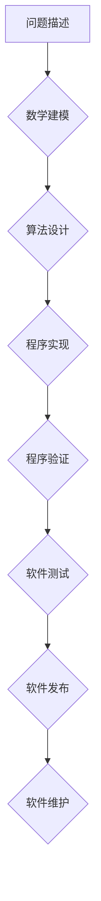

>不变性原理，数学建模，算法设计，程序验证，软件可靠性，代码复用，软件架构

## 1. 背景介绍

在软件开发领域，我们常常面临着复杂系统的设计和维护挑战。随着软件规模的不断扩大，代码的复杂度也随之增加，导致软件缺陷的产生率上升，维护成本增加。如何提高软件的可靠性和可维护性，是软件开发领域永恒的追求。

数学思维，特别是不变性原理，为解决这些问题提供了强大的工具。不变性原理的核心思想是，在程序执行过程中，某些特定的状态或属性始终保持不变，这些不变性可以作为程序正确性的保证。

## 2. 核心概念与联系

**不变性原理**是指在程序执行过程中，某些特定的状态或属性始终保持不变。这些不变性可以是数据结构的性质、算法的中间结果、程序的执行流程等。

**数学建模**是将现实世界的问题用数学语言和符号进行描述和抽象，从而方便地进行分析和解决。

**算法设计**是根据问题的具体要求，设计出一种能够有效解决问题的步骤或方法。

**程序验证**是通过数学证明或自动工具来验证程序的正确性，确保程序能够按照预期执行。

**软件可靠性**是指软件能够在规定的环境下，持续可靠地执行其功能的能力。

**代码复用**是指将已经开发好的代码模块重新利用到新的项目中，提高开发效率和代码质量。

**软件架构**是指软件系统的整体结构和设计，包括软件模块之间的关系、数据流、控制流等。

**Mermaid 流程图**



## 3. 核心算法原理 & 具体操作步骤

### 3.1  算法原理概述

不变性原理可以应用于算法设计和程序验证。在算法设计中，我们可以利用不变性原理来设计更简洁、更有效的算法。在程序验证中，我们可以利用不变性原理来证明程序的正确性。

### 3.2  算法步骤详解

**使用不变性原理设计算法的步骤：**

1. **识别不变性：** 首先，我们需要识别程序执行过程中哪些状态或属性始终保持不变。
2. **证明不变性：** 然后，我们需要用数学方法证明这些不变性的正确性。
3. **利用不变性：** 最后，我们可以利用这些不变性来简化算法的设计和实现。

**使用不变性原理验证程序的步骤：**

1. **选择不变性：** 首先，我们需要选择程序执行过程中哪些状态或属性作为不变性。
2. **建立数学模型：** 然后，我们需要建立一个数学模型来描述程序的执行过程。
3. **证明不变性：** 最后，我们需要用数学方法证明这些不变性在程序执行过程中始终保持不变。

### 3.3  算法优缺点

**优点：**

* **提高算法效率：** 利用不变性原理可以简化算法的设计和实现，提高算法的效率。
* **提高程序可靠性：** 利用不变性原理可以证明程序的正确性，提高程序的可靠性。
* **提高代码复用性：** 利用不变性原理可以设计出更抽象、更通用的代码模块，提高代码的复用性。

**缺点：**

* **需要一定的数学基础：** 使用不变性原理需要一定的数学基础，例如逻辑推理、集合论、数学归纳法等。
* **需要一定的编程经验：** 使用不变性原理需要一定的编程经验，才能更好地理解程序的执行过程和状态变化。

### 3.4  算法应用领域

不变性原理在软件开发领域有着广泛的应用，例如：

* **程序验证：** 使用不变性原理可以验证程序的正确性，确保程序能够按照预期执行。
* **代码优化：** 使用不变性原理可以优化程序的执行效率，减少程序的运行时间和资源消耗。
* **软件架构设计：** 使用不变性原理可以设计出更稳定、更可维护的软件架构。
* **人工智能：** 使用不变性原理可以设计出更智能、更可靠的人工智能算法。

## 4. 数学模型和公式 & 详细讲解 & 举例说明

### 4.1  数学模型构建

我们可以用数学模型来描述程序的执行过程和状态变化。例如，我们可以用状态转移图来描述程序的执行流程，用逻辑表达式来描述程序的条件判断，用数学函数来描述程序的计算过程。

### 4.2  公式推导过程

我们可以用数学公式来推导程序的正确性。例如，我们可以用数学归纳法来证明程序的循环语句能够正确执行，用逻辑推理来证明程序的条件判断能够正确执行。

### 4.3  案例分析与讲解

**例子：**

假设我们有一个程序，它需要计算一个整数的阶乘。我们可以用数学模型来描述这个程序的执行过程：

* **状态变量：** n (整数)
* **状态转移规则：**
    * 如果 n = 0，则返回 1。
    * 否则，返回 n * (n-1)!。

我们可以用数学公式来推导这个程序的正确性：

* **阶乘定义：** n! = n * (n-1) * (n-2) * ... * 2 * 1
* **数学归纳法：**
    * **基础步骤：** 当 n = 0 时，0! = 1，程序返回正确的结果。
    * **归纳假设：** 假设当 n = k 时，k! = k * (k-1)!。
    * **归纳步骤：** 当 n = k+1 时，
        (k+1)! = (k+1) * k!
        = (k+1) * k * (k-1)!
        = (k+1) * (k * (k-1)!)
        = (k+1) * k!
        程序返回正确的结果。

因此，我们可以证明这个程序能够正确计算整数的阶乘。

## 5. 项目实践：代码实例和详细解释说明

### 5.1  开发环境搭建

* 操作系统：Windows/macOS/Linux
* 编程语言：Python
* 开发工具：VS Code/Atom/Sublime Text

### 5.2  源代码详细实现

```python
def factorial(n):
    """
    计算整数n的阶乘。

    Args:
        n: 整数

    Returns:
        整数n的阶乘
    """
    if n == 0:
        return 1
    else:
        return n * factorial(n-1)

# 测试代码
n = 5
result = factorial(n)
print(f"{n}! = {result}")
```

### 5.3  代码解读与分析

* 函数 `factorial(n)` 计算整数 `n` 的阶乘。
* 函数使用递归的方式计算阶乘。
* 当 `n` 等于 0 时，函数返回 1。
* 否则，函数返回 `n` 乘以 `n-1` 的阶乘。
* 测试代码调用 `factorial(5)` 函数，计算 5 的阶乘，并打印结果。

### 5.4  运行结果展示

```
5! = 120
```

## 6. 实际应用场景

不变性原理在软件开发领域有着广泛的应用，例如：

* **数据库事务处理：** 在数据库事务处理中，我们可以利用不变性原理来保证事务的原子性、一致性、隔离性和持久性。
* **并发编程：** 在并发编程中，我们可以利用不变性原理来保证程序的正确性和安全性。
* **安全系统：** 在安全系统中，我们可以利用不变性原理来验证安全策略的正确性，防止安全漏洞的发生。

### 6.4  未来应用展望

随着人工智能和软件工程的发展，不变性原理将在更多领域得到应用，例如：

* **自动程序验证：** 利用不变性原理可以开发出自动程序验证工具，提高软件可靠性。
* **智能代码生成：** 利用不变性原理可以开发出智能代码生成工具，提高开发效率。
* **软件架构设计：** 利用不变性原理可以设计出更安全、更可靠的软件架构。

## 7. 工具和资源推荐

### 7.1  学习资源推荐

* **书籍：**
    * 《程序员的数学》
    * 《算法导论》
    * 《数学建模》
* **在线课程：**
    * Coursera: Algorithms, Part I
    * edX: Introduction to Computer Science and Programming Using Python
* **网站：**
    * MathWorld: https://mathworld.wolfram.com/
    * Stack Overflow: https://stackoverflow.com/

### 7.2  开发工具推荐

* **IDE:**
    * Visual Studio Code: https://code.visualstudio.com/
    * IntelliJ IDEA: https://www.jetbrains.com/idea/
* **版本控制系统:**
    * Git: https://git-scm.com/

### 7.3  相关论文推荐

* **论文：**
    * Hoare, C. A. R. (1969). An axiomatic basis for computer programming. Communications of the ACM, 12(10), 576-583.
    * Dijkstra, E. W. (1968). A note on two problems in connexion with graphs. Numerische Mathematik, 10(1), 269-271.

## 8. 总结：未来发展趋势与挑战

### 8.1  研究成果总结

不变性原理为软件开发提供了强大的工具，可以提高软件的可靠性、可维护性和复用性。

### 8.2  未来发展趋势

未来，不变性原理将在以下方面得到发展：

* **自动程序验证：** 利用人工智能和机器学习技术，开发出更智能、更强大的自动程序验证工具。
* **智能代码生成：** 利用不变性原理和机器学习技术，开发出能够自动生成高质量代码的工具。
* **软件架构设计：** 利用不变性原理设计出更安全、更可靠的软件架构。

### 8.3  面临的挑战

不变性原理的应用也面临着一些挑战：

* **数学基础：** 使用不变性原理需要一定的数学基础，这对于一些程序员来说是一个门槛。
* **复杂性：** 对于复杂软件系统，应用不变性原理可能比较困难。
* **工具支持：** 目前，用于应用不变性原理的工具还比较有限。

### 8.4  研究展望

未来，我们需要继续研究和探索不变性原理的应用，开发出更强大的工具和技术，以提高软件的可靠性和安全性。

## 9. 附录：常见问题与解答

**问题：** 如何识别程序执行过程中不变的属性？

**解答：** 可以通过分析程序的代码逻辑、数据流和状态变化来识别不变的属性。例如，程序中的一些变量可能始终保持不变，或者某些数据结构的性质可能始终保持不变。

**问题：** 如何证明程序的正确性？

**解答：** 可以使用数学证明或自动工具来证明程序的正确性。数学证明需要使用逻辑推理和数学公式来证明程序的正确性。自动工具可以自动分析程序的代码并验证其正确性。

**问题：** 使用不变性原理的优势是什么？

**解答：** 使用不变性原理可以提高软件的可靠性、可维护性和复用性。它可以帮助我们设计更简洁、更有效的算法，并验证程序的正确性。


作者：禅与计算机程序设计艺术 / Zen and the Art of Computer Programming 
<end_of_turn>