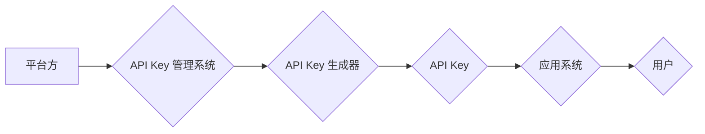

> API Key, 分级管理, 安全, 权限控制, 策略配置, 审计追踪, 身份验证, 访问控制

## 1. 背景介绍

在当今以 API 为核心的软件架构中，API Key 作为一种身份验证和访问控制机制，扮演着至关重要的角色。它允许开发者安全地访问应用程序的资源和功能，同时为平台方提供了精细化的权限管理和安全保障。然而，随着 API 的日益普及和应用场景的不断扩展，传统的单一 API Key 管理模式已难以满足日益复杂的业务需求。

传统的单一 API Key 管理模式存在以下问题：

* **安全性不足:** 单一 API Key 的泄露将导致整个应用程序的安全性受到威胁。
* **权限控制不够精细:** 单一 API Key 通常拥有全面的访问权限，难以实现针对不同用户或应用的细粒度权限控制。
* **审计追踪困难:** 单一 API Key 的使用情况难以追踪，难以进行有效的安全审计和风险控制。

为了解决这些问题，分级 API Key 管理模式应运而生。

## 2. 核心概念与联系

分级 API Key 管理模式的核心思想是将 API Key 分为不同的等级，并为每个等级赋予不同的权限和访问范围。通过这种方式，可以实现更精细的权限控制、更强的安全性保障和更有效的审计追踪。

**分级 API Key 管理模式的架构:**



**核心概念:**

* **API Key:** 用于身份验证和访问控制的唯一标识符。
* **API Key 管理系统:** 用于生成、分配、管理和审计 API Key 的系统。
* **API Key 生成器:** 用于生成 API Key 的组件。
* **权限等级:** 根据访问权限和范围，将 API Key 分为不同的等级。
* **策略配置:** 用于定义不同权限等级的访问规则和限制。
* **审计追踪:** 记录 API Key 的使用情况，以便进行安全审计和风险控制。

## 3. 核心算法原理 & 具体操作步骤

### 3.1  算法原理概述

分级 API Key 管理模式的核心算法原理是基于权限等级和策略配置的访问控制机制。

* **权限等级:** 将 API Key 分为不同的等级，例如：基础级、高级级、超级管理员级等。每个等级对应不同的访问权限和范围。
* **策略配置:** 为每个权限等级定义相应的访问规则和限制，例如：允许访问哪些资源、哪些操作、限制访问频率等。

当用户使用 API Key 进行访问时，API Key 管理系统会根据 API Key 的等级和策略配置，判断用户是否具备访问权限。

### 3.2  算法步骤详解

1. **API Key 生成:** 平台方使用 API Key 生成器生成 API Key，并为其分配相应的权限等级。
2. **API Key 分配:** 平台方将 API Key 分配给不同的用户或应用。
3. **API 调用:** 用户或应用使用 API Key 进行 API 调用。
4. **权限验证:** API Key 管理系统接收 API 调用请求，并根据 API Key 的等级和策略配置，验证用户或应用是否具备访问权限。
5. **访问控制:** 如果用户或应用具备访问权限，则允许访问资源或执行操作；否则，拒绝访问。
6. **审计追踪:** API Key 管理系统记录 API 调用请求的详细信息，包括 API Key、用户或应用标识、访问时间、访问资源等，以便进行安全审计和风险控制。

### 3.3  算法优缺点

**优点:**

* **安全性增强:** 分级 API Key 管理模式可以有效降低 API 泄露带来的风险。
* **权限控制精细化:** 可以根据不同的用户或应用需求，配置不同的访问权限。
* **审计追踪便捷:** 可以方便地追踪 API Key 的使用情况，进行安全审计和风险控制。

**缺点:**

* **管理复杂度增加:** 需要维护多个 API Key 和策略配置，管理难度相对较高。
* **开发成本增加:** 需要对应用程序进行相应的修改，以支持分级 API Key 管理模式。

### 3.4  算法应用领域

分级 API Key 管理模式广泛应用于以下领域:

* **云计算平台:** 为不同的用户或应用提供不同的服务和资源访问权限。
* **移动应用:** 为不同的用户提供不同的功能和服务。
* **金融服务:** 为不同的用户提供不同的金融产品和服务。
* **物联网:** 为不同的设备提供不同的数据访问权限。

## 4. 数学模型和公式 & 详细讲解 & 举例说明

### 4.1  数学模型构建

我们可以使用集合论和关系论来构建分级 API Key 管理模式的数学模型。

* **用户集合:** U = {u1, u2, ..., un}，其中 ui 表示第 i 个用户。
* **应用集合:** A = {a1, a2, ..., am}，其中 ai 表示第 i 个应用。
* **资源集合:** R = {r1, r2, ..., rn}，其中 ri 表示第 i 个资源。
* **权限等级集合:** L = {l1, l2, ..., lk}，其中 li 表示第 i 个权限等级。

**权限关系:**

* 我们可以用一个关系 R(U, A, L, R) 来表示用户、应用、权限等级和资源之间的关系。
* 关系 R(u, a, l, r) 表示用户 u 拥有权限等级 l 的应用 a，可以访问资源 r。

### 4.2  公式推导过程

**权限验证公式:**

```
P(u, a, r) = ∃l ∈ L, R(u, a, l, r) ∧ l ∈ L(a)
```

其中:

* P(u, a, r) 表示用户 u 是否拥有访问应用 a 资源 r 的权限。
* L(a) 表示应用 a 所对应的权限等级集合。

### 4.3  案例分析与讲解

**案例:**

假设我们有一个云计算平台，用户可以申请不同的服务和资源。平台方定义了三个权限等级：基础级、高级级和超级管理员级。

* 基础级用户可以访问基本的计算资源和存储资源。
* 高级级用户可以访问高级的计算资源和存储资源，还可以创建和管理自己的虚拟机。
* 超级管理员级用户可以访问所有资源，并可以管理整个平台。

**分析:**

当用户申请访问某个资源时，平台方会根据用户的权限等级和资源的访问权限规则，进行权限验证。

如果用户的权限等级满足资源的访问权限规则，则用户可以访问该资源；否则，用户将被拒绝访问。

## 5. 项目实践：代码实例和详细解释说明

### 5.1  开发环境搭建

* 操作系统: Ubuntu 20.04 LTS
* 编程语言: Python 3.8
* 框架: Flask

### 5.2  源代码详细实现

```python
from flask import Flask, request, jsonify

app = Flask(__name__)

# API Key 管理字典
api_keys = {
    "key1": {"level": "basic", "resources": ["compute", "storage"]},
    "key2": {"level": "advanced", "resources": ["compute", "storage", "vm"]},
}

@app.route('/api/resource', methods=['GET'])
def access_resource():
    api_key = request.headers.get('Authorization')
    if api_key in api_keys:
        user_level = api_keys[api_key]["level"]
        requested_resource = request.args.get('resource')
        if requested_resource in api_keys[api_key]["resources"]:
            return jsonify({"message": "Access granted!"})
        else:
            return jsonify({"message": "Access denied!"}), 403
    else:
        return jsonify({"message": "Invalid API Key!"}), 401

if __name__ == '__main__':
    app.run(debug=True)
```

### 5.3  代码解读与分析

* **API Key 管理字典:** `api_keys` 字典用于存储 API Key 的信息，包括权限等级和可访问资源。
* **访问资源接口:** `/api/resource` 接口用于模拟访问资源的操作。
* **权限验证:** 在访问资源接口时，系统会从请求头中获取 API Key，并根据 API Key 的信息进行权限验证。
* **访问控制:** 如果用户具备访问权限，则返回成功响应；否则，返回拒绝访问的响应。

### 5.4  运行结果展示

当使用有效的 API Key 访问 `/api/resource` 接口时，系统会返回 "Access granted!" 的响应。

当使用无效的 API Key 或没有权限访问的资源时，系统会返回相应的错误响应。

## 6. 实际应用场景

### 6.1  云计算平台

在云计算平台中，分级 API Key 管理模式可以用于控制用户对不同资源的访问权限。例如，基础级用户可以访问基本的计算资源和存储资源，而高级级用户可以访问更高级的资源，例如虚拟机和数据库。

### 6.2  移动应用

在移动应用中，分级 API Key 管理模式可以用于控制用户对不同功能的访问权限。例如，免费用户可以访问基本的应用功能，而付费用户可以访问高级功能，例如无广告和额外的功能。

### 6.3  金融服务

在金融服务中，分级 API Key 管理模式可以用于控制用户对不同金融产品的访问权限。例如，普通用户可以访问基本的银行账户和转账功能，而专业用户可以访问更高级的功能，例如投资理财和贷款申请。

### 6.4  未来应用展望

随着 API 的日益普及和应用场景的不断扩展，分级 API Key 管理模式将有更广泛的应用前景。例如，在物联网领域，可以用于控制设备对数据的访问权限；在区块链领域，可以用于管理智能合约的执行权限。

## 7. 工具和资源推荐

### 7.1  学习资源推荐

* **API Key 管理最佳实践:** https://developer.mozilla.org/en-US/docs/Web/HTTP/Authentication#API_Keys
* **API 安全指南:** https://owasp.org/www-project-api-security/

### 7.2  开发工具推荐

* **Flask:** https://flask.palletsprojects.com/en/2.2.x/
* **FastAPI:** https://fastapi.tiangolo.com/

### 7.3  相关论文推荐

* **API Key Management for Secure Cloud Computing:** https://ieeexplore.ieee.org/document/8807774
* **A Survey on API Security:** https://dl.acm.org/doi/10.1145/3442188.3445970

## 8. 总结：未来发展趋势与挑战

### 8.1  研究成果总结

分级 API Key 管理模式是一种有效的 API 安全性和权限控制机制，可以有效降低 API 泄露带来的风险，并实现更精细的权限控制。

### 8.2  未来发展趋势

* **更智能的权限管理:** 利用机器学习和人工智能技术，实现更智能的权限管理，例如根据用户的行为和历史记录动态调整权限。
* **更安全的 API Key 生成和管理:** 使用更安全的算法和技术生成和管理 API Key，例如基于生物特征的 API Key 和多因素身份验证。
* **更完善的审计追踪机制:** 建立更完善的审计追踪机制，能够记录 API Key 的所有使用情况，并进行实时监控和分析。

### 8.3  面临的挑战

* **管理复杂度:** 分级 API Key 管理模式的管理复杂度较高，需要维护多个 API Key 和策略配置。
* **开发成本:** 需要对应用程序进行相应的修改，以支持分级 API Key 管理模式，这可能会增加开发成本。
* **安全漏洞:** 即使采用分级 API Key 管理模式，也可能存在安全漏洞，需要不断进行安全评估和漏洞修复。

### 8.4  研究展望

未来，我们将继续研究和