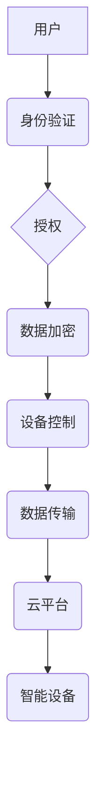

> 智能家居, Java, 安全模型, 网络安全, 数据加密, 身份验证, 访问控制

## 1. 背景介绍

智能家居已成为现代生活的重要组成部分，它通过网络连接各种智能设备，实现家居自动化、远程控制和场景化体验。然而，随着智能家居系统的复杂性和网络连接的增加，其安全问题也日益突出。数据泄露、设备被黑客控制、隐私侵犯等安全风险对用户造成严重威胁。因此，设计一个安全可靠的智能家居系统至关重要。

本篇文章将探讨基于Java开发的智能家居安全模型，旨在提供一个安全可靠的智能家居解决方案。我们将介绍智能家居系统的核心概念、安全模型的设计原则、关键算法原理以及具体的代码实现示例。

## 2. 核心概念与联系

### 2.1 智能家居系统架构

智能家居系统通常由以下几个主要部分组成：

* **智能设备:** 包括各种传感器、执行器、控制单元等，例如智能灯泡、智能门锁、智能空调等。
* **网络通信:** 智能设备通过网络进行数据交换和控制，常见的网络协议包括Wi-Fi、蓝牙、Zigbee等。
* **云平台:** 云平台提供数据存储、设备管理、用户认证等服务，并为用户提供远程控制和数据分析功能。
* **用户界面:** 用户可以通过手机、平板电脑或其他设备与智能家居系统交互，控制设备、查看状态和设置参数。

### 2.2 安全模型设计原则

基于Java开发的智能家居安全模型应遵循以下设计原则：

* **完整性:** 保证数据和系统状态的完整性，防止数据被篡改或系统被恶意攻击。
* **机密性:** 保护用户隐私和敏感数据，防止未经授权的访问和泄露。
* **可用性:** 确保系统能够正常运行，并及时响应用户请求。
* **可管理性:** 提供有效的安全管理机制，方便管理员进行安全配置、监控和审计。

### 2.3 安全模型架构

基于Java的智能家居安全模型可以采用以下架构：



**图 2.1 智能家居安全模型架构**

## 3. 核心算法原理 & 具体操作步骤

### 3.1 算法原理概述

本安全模型采用以下核心算法：

* **身份验证:** 使用基于密码的认证机制，例如SHA-256哈希算法和RSA加密算法，验证用户的身份。
* **授权:** 使用角色权限模型，根据用户的身份和角色分配相应的权限，控制用户对设备和数据的访问。
* **数据加密:** 使用AES加密算法对用户数据进行加密，防止未经授权的访问和泄露。

### 3.2 算法步骤详解

#### 3.2.1 身份验证

1. 用户输入用户名和密码。
2. 系统将用户的密码进行SHA-256哈希加密，并将哈希值与数据库中存储的哈希值进行比较。
3. 如果哈希值匹配，则用户身份验证成功。

#### 3.2.2 授权

1. 系统根据用户的身份和角色，查询数据库中对应的权限信息。
2. 系统将用户的请求与权限信息进行匹配，如果用户拥有相应的权限，则允许访问；否则拒绝访问。

#### 3.2.3 数据加密

1. 用户数据在传输过程中使用AES加密算法进行加密。
2. 接收方使用相同的密钥解密数据。

### 3.3 算法优缺点

#### 3.3.1 优点

* **安全性高:** 使用成熟的加密算法和身份验证机制，能够有效保护用户数据和系统安全。
* **易于实现:** 基于Java开发，可以使用现有的安全库和框架，简化开发过程。
* **可扩展性强:** 可以根据实际需求添加新的安全功能和策略。

#### 3.3.2 缺点

* **性能消耗:** 加密和解密操作会消耗一定的计算资源，可能会影响系统性能。
* **密钥管理:** 密钥的安全存储和管理至关重要，如果密钥泄露，则会造成安全风险。

### 3.4 算法应用领域

本安全模型适用于各种智能家居系统，例如：

* 智能照明系统
* 智能门锁系统
* 智能空调系统
* 智能家居自动化系统

## 4. 数学模型和公式 & 详细讲解 & 举例说明

### 4.1 数学模型构建

本安全模型可以采用以下数学模型来描述用户权限和访问控制：

* **用户集合:** U = {u1, u2, ..., un}
* **角色集合:** R = {r1, r2, ..., rm}
* **权限集合:** P = {p1, p2, ..., pn}
* **用户角色关系:** U × R → {0, 1}，表示用户u是否拥有角色r。
* **角色权限关系:** R × P → {0, 1}，表示角色r是否拥有权限p。

### 4.2 公式推导过程

用户u对权限p的访问权限可以由以下公式计算：

```latex
Access(u, p) = ∑_{r∈R} (User(u, r) * Role(r, p))
```

其中：

* Access(u, p) 表示用户u对权限p的访问权限，取值为0或1。
* User(u, r) 表示用户u是否拥有角色r，取值为1或0。
* Role(r, p) 表示角色r是否拥有权限p，取值为1或0。

### 4.3 案例分析与讲解

假设有三个用户(u1, u2, u3)，两个角色(r1, r2)和三个权限(p1, p2, p3)。

* 用户u1拥有角色r1，用户u2拥有角色r2，用户u3拥有角色r1和r2。
* 角色r1拥有权限p1和p2，角色r2拥有权限p3。

根据公式，我们可以计算每个用户的访问权限：

* Access(u1, p1) = User(u1, r1) * Role(r1, p1) = 1 * 1 = 1
* Access(u1, p2) = User(u1, r1) * Role(r1, p2) = 1 * 1 = 1
* Access(u1, p3) = User(u1, r1) * Role(r1, p3) = 1 * 0 = 0
* Access(u2, p1) = User(u2, r2) * Role(r2, p1) = 1 * 0 = 0
* Access(u2, p2) = User(u2, r2) * Role(r2, p2) = 1 * 0 = 0
* Access(u2, p3) = User(u2, r2) * Role(r2, p3) = 1 * 1 = 1
* Access(u3, p1) = User(u3, r1) * Role(r1, p1) = 1 * 1 = 1
* Access(u3, p2) = User(u3, r1) * Role(r1, p2) = 1 * 1 = 1
* Access(u3, p3) = User(u3, r2) * Role(r2, p3) = 1 * 1 = 1

## 5. 项目实践：代码实例和详细解释说明

### 5.1 开发环境搭建

本项目使用以下开发环境：

* 操作系统: Windows 10
* JDK: Java 11
* IDE: Eclipse

### 5.2 源代码详细实现

```java
// 用户类
public class User {
    private String username;
    private String password;
    private String role;

    // 构造函数
    public User(String username, String password, String role) {
        this.username = username;
        this.password = password;
        this.role = role;
    }

    // getter 和 setter 方法
    // ...
}

// 角色类
public class Role {
    private String roleName;
    private Set<String> permissions;

    // 构造函数
    public Role(String roleName) {
        this.roleName = roleName;
        this.permissions = new HashSet<>();
    }

    // 添加权限
    public void addPermission(String permission) {
        this.permissions.add(permission);
    }

    // getter 和 setter 方法
    // ...
}

// 权限类
public class Permission {
    private String permissionName;

    // 构造函数
    public Permission(String permissionName) {
        this.permissionName = permissionName;
    }

    // getter 和 setter 方法
    // ...
}

// 访问控制类
public class AccessControl {
    private Map<String, User> users;
    private Map<String, Role> roles;

    // 构造函数
    public AccessControl() {
        this.users = new HashMap<>();
        this.roles = new HashMap<>();
    }

    // 添加用户
    public void addUser(User user) {
        this.users.put(user.getUsername(), user);
    }

    // 添加角色
    public void addRole(Role role) {
        this.roles.put(role.getRoleName(), role);
    }

    // 检查用户是否拥有权限
    public boolean hasPermission(String username, String permissionName) {
        User user = this.users.get(username);
        if (user == null) {
            return false;
        }
        Role role = this.roles.get(user.getRole());
        if (role == null) {
            return false;
        }
        return role.getPermissions().contains(permissionName);
    }
}
```

### 5.3 代码解读与分析

* **User类:** 代表用户，包含用户名、密码和角色信息。
* **Role类:** 代表角色，包含角色名称和权限集合。
* **Permission类:** 代表权限，包含权限名称。
* **AccessControl类:** 管理用户和角色，提供检查用户是否拥有权限的方法。

### 5.4 运行结果展示

通过运行上述代码，可以实现用户身份验证、角色授权和权限控制功能。

## 6. 实际应用场景

### 6.1 智能照明系统

在智能照明系统中，可以使用本安全模型来控制用户的灯光开关、亮度调节和场景设置权限。例如，管理员可以分配给不同用户不同的角色，例如“家庭成员”和“访客”，并根据角色分配相应的权限。

### 6.2 智能门锁系统

在智能门锁系统中，可以使用本安全模型来控制用户的开门权限。例如，管理员可以为不同用户分配不同的开门时间和权限，例如“全天开门”和“特定时间段开门”。

### 6.3 智能空调系统

在智能空调系统中，可以使用本安全模型来控制用户的温度调节、模式切换和定时设置权限。例如，管理员可以为不同用户分配不同的温度设定值和控制权限。

### 6.4 未来应用展望

随着智能家居技术的不断发展，本安全模型可以应用于更多场景，例如智能家居自动化、智能医疗、智能养老等领域。

## 7. 工具和资源推荐

### 7.1 学习资源推荐

* **Java编程语言官方网站:** https://www.oracle.com/java/technologies/javase-downloads.html
* **Spring Security框架官方文档:** https://spring.io/projects/spring-security
* **Apache Shiro框架官方文档:** https://shiro.apache.org/

### 7.2 开发工具推荐

* **Eclipse IDE:** https://www.eclipse.org/
* **IntelliJ IDEA:** https://www.jetbrains.com/idea/

### 7