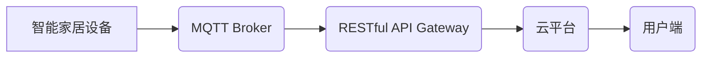

> MQTT, RESTful API, 智能家居, 设备状态监测, 物联网, 数据传输, 远程控制

## 1. 背景介绍

随着物联网技术的快速发展，智能家居已成为现代生活的重要组成部分。智能家居系统通过网络连接各种智能设备，实现对家居环境的自动化控制和远程管理。设备状态监测是智能家居系统的重要功能之一，它能够实时获取设备运行状态，并根据状态进行相应的控制或报警。

传统的智能家居设备状态监测方式通常依赖于局域网或专有协议，存在以下问题：

* **网络连接依赖性强:**  设备状态监测需要依赖于稳定的网络连接，一旦网络中断，就无法获取设备状态信息。
* **协议兼容性差:**  不同设备厂商使用的协议不统一，导致设备之间难以互联互通。
* **数据传输效率低:**  传统的通信协议数据传输效率较低，难以满足实时监测的需求。

为了解决上述问题，本文提出了一种基于MQTT协议和RESTful API的智能家居设备状态监测方案。

## 2. 核心概念与联系

### 2.1 MQTT协议

MQTT（Message Queuing Telemetry Transport）是一种轻量级的消息传输协议，专门设计用于物联网应用场景。它具有以下特点：

* **轻量级:**  MQTT协议本身体积小，占用资源少，适合资源受限的设备使用。
* **低功耗:**  MQTT协议采用发布/订阅模式，减少数据传输量，降低设备功耗。
* **可靠性高:**  MQTT协议支持消息确认机制，确保消息可靠传输。
* **跨平台支持:**  MQTT协议支持多种平台和编程语言，易于集成。

### 2.2 RESTful API

RESTful API（Representational State Transfer Application Programming Interface）是一种基于HTTP协议的软件架构风格，用于构建Web服务。它具有以下特点：

* **资源导向:**  RESTful API将数据视为资源，通过统一的接口进行访问和操作。
* **状态转移:**  RESTful API通过HTTP方法（GET、POST、PUT、DELETE等）进行状态转移，实现数据操作。
* **缓存机制:**  RESTful API支持缓存机制，提高数据访问效率。
* **可扩展性强:**  RESTful API易于扩展和维护，可以轻松集成到不同的系统中。

### 2.3 核心架构

基于MQTT协议和RESTful API的智能家居设备状态监测方案的架构如图所示：



**架构说明:**

* 智能家居设备通过MQTT协议与MQTT Broker进行通信，发布设备状态信息。
* MQTT Broker将设备状态信息转发给RESTful API Gateway。
* RESTful API Gateway将设备状态信息转换为RESTful API格式，并提供给云平台。
* 云平台将设备状态信息存储、分析和展示，并通过用户端向用户提供设备状态信息。

## 3. 核心算法原理 & 具体操作步骤

### 3.1  算法原理概述

本方案的核心算法是基于MQTT协议的设备状态发布和订阅机制，以及RESTful API的资源访问和操作机制。

* **MQTT协议:**  设备使用MQTT协议发布设备状态信息，订阅云平台的控制指令。
* **RESTful API:**  云平台使用RESTful API提供设备状态查询、控制和报警等功能。

### 3.2  算法步骤详解

1. **设备端:**
    * 设备接收到用户指令或自身状态变化时，将状态信息转换为MQTT消息格式。
    * 设备连接到MQTT Broker，订阅云平台的控制指令主题。
    * 设备发布设备状态信息到指定主题。

2. **MQTT Broker:**
    * MQTT Broker接收设备发布的设备状态信息。
    * MQTT Broker将设备状态信息转发给RESTful API Gateway。

3. **RESTful API Gateway:**
    * RESTful API Gateway接收MQTT Broker转发来的设备状态信息。
    * RESTful API Gateway将设备状态信息转换为RESTful API格式。
    * RESTful API Gateway将设备状态信息存储到云平台数据库。

4. **云平台:**
    * 云平台接收RESTful API Gateway发送的设备状态信息。
    * 云平台将设备状态信息进行存储、分析和展示。
    * 云平台根据设备状态信息，向用户端发送设备状态信息和控制指令。

5. **用户端:**
    * 用户端通过Web或移动应用连接到云平台。
    * 用户端可以查询设备状态信息、控制设备和设置报警规则。

### 3.3  算法优缺点

**优点:**

* **轻量级、低功耗:**  MQTT协议和RESTful API都是轻量级的协议，适合资源受限的设备使用。
* **可靠性高:**  MQTT协议支持消息确认机制，确保消息可靠传输。
* **跨平台支持:**  MQTT协议和RESTful API支持多种平台和编程语言，易于集成。
* **可扩展性强:**  RESTful API易于扩展和维护，可以轻松集成到不同的系统中。

**缺点:**

* **安全性:**  MQTT协议和RESTful API都需要进行安全认证和加密，以确保数据安全。
* **复杂度:**  系统架构相对复杂，需要对MQTT协议和RESTful API有深入了解。

### 3.4  算法应用领域

基于MQTT协议和RESTful API的智能家居设备状态监测方案可以应用于以下领域:

* 智能家居
* 工业自动化
* 医疗保健
* 交通运输

## 4. 数学模型和公式 & 详细讲解 & 举例说明

### 4.1  数学模型构建

本方案中，设备状态信息可以表示为一个二元组 (设备ID, 状态值)，其中设备ID是唯一的标识符，状态值可以是数字、字符串或布尔值。

### 4.2  公式推导过程

由于本方案主要基于协议和架构，没有复杂的数学公式推导过程。

### 4.3  案例分析与讲解

假设有一个智能灯泡设备，其状态值可以是 "开" 或 "关"。

* 当用户通过手机APP控制灯泡打开时，设备会发布 MQTT 消息 (设备ID: 123, 状态值: 开)。
* 云平台接收到消息后，将状态值更新到数据库中。
* 用户可以通过APP查询灯泡的状态，并根据状态进行相应的控制。

## 5. 项目实践：代码实例和详细解释说明

### 5.1  开发环境搭建

* 操作系统: Ubuntu 20.04
* 开发工具: Eclipse IDE
* MQTT Broker: Mosquitto
* RESTful API Framework: Spring Boot

### 5.2  源代码详细实现

由于篇幅限制，这里只提供部分代码示例。

**设备端代码示例 (Python):**

```python
import paho.mqtt.client as mqtt

# MQTT Broker地址
MQTT_BROKER_ADDRESS = "mqtt.example.com"

# 设备ID
DEVICE_ID = "123"

# MQTT主题
TOPIC = "home/devices/123/status"

def on_connect(client, userdata, flags, rc):
    if rc == 0:
        print("Connected to MQTT Broker!")
        client.subscribe(TOPIC)
    else:
        print("Connection failed!")

def on_message(client, userdata, msg):
    print("Received message:", msg.payload.decode())

client = mqtt.Client()
client.on_connect = on_connect
client.on_message = on_message
client.connect(MQTT_BROKER_ADDRESS)
client.loop_forever()

# 发布设备状态信息
def publish_status(status):
    client.publish(TOPIC, status)

# 示例代码
publish_status("开")
```

**云平台代码示例 (Java):**

```java
import org.springframework.boot.SpringApplication;
import org.springframework.boot.autoconfigure.SpringBootApplication;
import org.springframework.web.bind.annotation.GetMapping;
import org.springframework.web.bind.annotation.RestController;

@SpringBootApplication
public class SmartHomeApplication {

    public static void main(String[] args) {
        SpringApplication.run(SmartHomeApplication.class, args);
    }

    @RestController
    public class DeviceController {

        @GetMapping("/devices/{deviceId}/status")
        public String getDeviceStatus(String deviceId) {
            // 从数据库查询设备状态
            String status = "未知";
            return status;
        }
    }
}
```

### 5.3  代码解读与分析

* **设备端代码:**  使用Python语言编写，连接到MQTT Broker，订阅主题，发布设备状态信息。
* **云平台代码:**  使用Java语言编写，基于Spring Boot框架构建RESTful API，提供设备状态查询功能。

### 5.4  运行结果展示

* 设备端运行后，会连接到MQTT Broker，并发布设备状态信息。
* 云平台运行后，可以访问RESTful API接口，查询设备状态信息。

## 6. 实际应用场景

### 6.1 智能家居场景

* **远程控制:**  用户可以通过手机APP远程控制智能家居设备，例如开关灯、调节温度、控制窗帘等。
* **场景自动化:**  用户可以设置场景自动化规则，例如当用户回家时，自动打开灯光、调节温度等。
* **设备状态监测:**  系统可以实时监测设备运行状态，例如电器是否正常工作、门窗是否关闭等，并进行报警提醒。

### 6.2 工业自动化场景

* **设备监控:**  系统可以实时监控设备运行状态，例如温度、压力、流量等，并进行异常报警。
* **生产过程优化:**  系统可以收集设备运行数据，分析生产过程，优化生产效率。
* **远程维护:**  系统可以远程诊断设备故障，并提供维护建议。

### 6.3 医疗保健场景

* **远程医疗:**  系统可以远程监测患者健康状况，例如血压、心率、血糖等，并及时提醒医生。
* **智能护理:**  系统可以帮助智能护理机器人完成患者护理任务，例如提醒服药、监测体温等。
* **医疗数据分析:**  系统可以收集患者医疗数据，进行分析，辅助医生诊断和治疗。

### 6.4 未来应用展望

随着物联网技术的不断发展，基于MQTT协议和RESTful API的智能家居设备状态监测方案将有更广泛的应用场景，例如：

* **智慧城市:**  用于监控城市环境、交通状况、公共安全等。
* **智慧农业:**  用于监测作物生长状况、土壤湿度、气象条件等。
* **智慧交通:**  用于监控车辆运行状况、交通流量、道路拥堵等。

## 7. 工具和资源推荐

### 7.1 学习资源推荐

* **MQTT协议:**  https://mqtt.org/
* **RESTful API:**  https://restfulapi.net/
* **Spring Boot:**  https://spring.io/projects/spring-boot

### 7.2 开发工具推荐

* **Eclipse IDE:**  https://www.eclipse.org/
* **IntelliJ IDEA:**  https://www.jetbrains.com/idea/
* **Visual Studio Code:**  https://code.visualstudio.com/

### 7.3 相关论文推荐

* **MQTT协议:**  
    * Paho MQTT Client Library: https://github.com/eclipse/paho.mqtt.python
* **RESTful API:**
    * RESTful Web Services: https://restfulapi.net/

## 8. 总结：未来发展趋势与挑战

### 8.1 研究成果总结

本文介绍了一种基于MQTT协议和RESTful API的智能家居设备状态监测方案，该方案具有轻量级、低功耗、可靠性高、跨平台支持等特点。

### 8.2 未来发展趋势

* **人工智能集成:**  将人工智能技术集成到设备状态监测方案中，实现设备状态预测、故障诊断等功能。
* **边缘计算:**  将