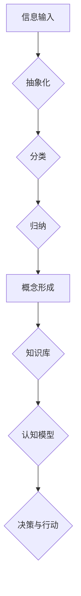

> 复杂系统、概念形成、认知模型、人工智能、深度学习、神经网络、抽象思维

## 1. 背景介绍

在当今数据爆炸的时代，人工智能（AI）正以惊人的速度发展，其核心在于模拟人类的认知能力，特别是复杂思想的形成。然而，人类如何形成复杂思想，将分散的信息整合为有意义的概念，仍然是一个未解之谜。

从生物学角度来看，人类的大脑是一个极其复杂的网络，由数十亿的神经元组成。这些神经元通过复杂的连接和信号传递，共同完成信息处理和认知任务。当我们接触到新的信息时，大脑会通过学习和记忆，将这些信息与已有的知识和经验进行关联，从而形成新的概念。

从计算机科学角度来看，人工智能试图通过算法和数据来模拟人类的认知过程。深度学习作为人工智能的重要分支，通过多层神经网络，学习从数据中提取特征和模式，从而实现对复杂信息的理解和处理。

## 2. 核心概念与联系

**2.1 概念形成的本质**

概念形成是将分散的信息整合为有意义的整体的过程，它涉及到以下几个关键要素：

* **抽象化:** 从具体的事物中提取出共同的特征和属性，形成抽象的概念。
* **分类:** 将事物按照一定的标准进行分类，建立概念之间的关系。
* **归纳:** 从具体的例子中总结出通用的规律，形成概念的定义。

**2.2 人工智能与概念形成**

人工智能试图通过算法和数据来模拟人类的认知过程，包括概念形成。深度学习算法通过学习大量的样本数据，能够自动提取特征和模式，从而形成概念。

**2.3 核心概念与联系的Mermaid流程图**



## 3. 核心算法原理 & 具体操作步骤

**3.1 算法原理概述**

深度学习算法的核心原理是多层神经网络，通过层层叠加的激活函数和权重参数，学习从数据中提取特征和模式。

**3.2 算法步骤详解**

1. **数据预处理:** 将原始数据进行清洗、转换和特征工程，使其适合深度学习算法的训练。
2. **网络结构设计:** 根据任务需求，设计多层神经网络的结构，包括神经元数量、连接方式和激活函数等。
3. **参数初始化:** 为神经网络中的权重参数进行随机初始化。
4. **前向传播:** 将输入数据通过神经网络层层传递，最终得到输出结果。
5. **损失函数计算:** 计算输出结果与真实值的差异，即损失函数的值。
6. **反向传播:** 根据损失函数的梯度，调整神经网络中的权重参数，使其朝着降低损失函数的方向更新。
7. **迭代训练:** 重复前向传播、损失函数计算和反向传播的过程，直到损失函数达到预设的阈值。

**3.3 算法优缺点**

**优点:**

* 能够自动提取特征，无需人工特征工程。
* 能够处理海量数据，学习复杂模式。
* 在图像识别、自然语言处理等领域取得了突破性进展。

**缺点:**

* 训练数据量大，计算资源消耗高。
* 训练过程黑盒化，难以解释模型的决策过程。
* 对数据质量要求高，容易受到噪声和偏差的影响。

**3.4 算法应用领域**

* **图像识别:** 人脸识别、物体检测、图像分类。
* **自然语言处理:** 机器翻译、文本摘要、情感分析。
* **语音识别:** 语音转文本、语音助手。
* **推荐系统:** 商品推荐、内容推荐。
* **医疗诊断:** 病情预测、疾病诊断。

## 4. 数学模型和公式 & 详细讲解 & 举例说明

**4.1 数学模型构建**

深度学习算法的核心是神经网络，其数学模型可以表示为一个多层感知机（MLP）。

**4.2 公式推导过程**

* **激活函数:** 激活函数将神经元的输入映射到输出，常用的激活函数包括 sigmoid 函数、ReLU 函数等。

* **损失函数:** 损失函数衡量模型预测结果与真实值的差异，常用的损失函数包括均方误差（MSE）、交叉熵损失等。

* **梯度下降:** 梯度下降算法用于更新神经网络的权重参数，使其朝着降低损失函数的方向更新。

**4.3 案例分析与讲解**

以图像分类为例，假设我们有一个包含猫和狗的图像数据集。

* **输入数据:** 每张图像被表示为一个向量，其中每个元素代表图像像素的灰度值。
* **神经网络结构:** 我们设计一个包含多层神经元的网络，例如输入层、隐藏层和输出层。
* **训练过程:** 通过梯度下降算法，训练网络的参数，使其能够将猫和狗的图像分类正确。

## 5. 项目实践：代码实例和详细解释说明

**5.1 开发环境搭建**

使用 Python 语言和 TensorFlow 或 PyTorch 深度学习框架。

**5.2 源代码详细实现**

```python
import tensorflow as tf

# 定义神经网络模型
model = tf.keras.models.Sequential([
    tf.keras.layers.Flatten(input_shape=(28, 28)),
    tf.keras.layers.Dense(128, activation='relu'),
    tf.keras.layers.Dense(10, activation='softmax')
])

# 编译模型
model.compile(optimizer='adam',
              loss='sparse_categorical_crossentropy',
              metrics=['accuracy'])

# 训练模型
model.fit(x_train, y_train, epochs=10)

# 评估模型
loss, accuracy = model.evaluate(x_test, y_test)
print('Test loss:', loss)
print('Test accuracy:', accuracy)
```

**5.3 代码解读与分析**

* `tf.keras.models.Sequential`: 创建一个顺序模型，神经层按顺序连接。
* `tf.keras.layers.Flatten`: 将多维输入数据转换为一维向量。
* `tf.keras.layers.Dense`: 全连接层，每个神经元连接到上一层的所有神经元。
* `activation='relu'`: 使用 ReLU 激活函数。
* `optimizer='adam'`: 使用 Adam 优化器更新模型参数。
* `loss='sparse_categorical_crossentropy'`: 使用稀疏类别交叉熵损失函数。
* `metrics=['accuracy']`: 使用准确率作为评估指标。

**5.4 运行结果展示**

训练完成后，模型将输出测试集上的损失值和准确率。

## 6. 实际应用场景

**6.1 医疗诊断**

深度学习算法可以用于分析医学图像，辅助医生诊断疾病。例如，可以用于检测肺癌、乳腺癌等。

**6.2 自动驾驶**

深度学习算法可以用于训练自动驾驶汽车，使其能够识别道路、交通信号灯和行人等。

**6.3 金融风险管理**

深度学习算法可以用于分析金融数据，识别欺诈交易和预测市场风险。

**6.4 未来应用展望**

随着人工智能技术的不断发展，深度学习算法将在更多领域得到应用，例如个性化教育、智能家居、科学研究等。

## 7. 工具和资源推荐

**7.1 学习资源推荐**

* **书籍:**
    * 深度学习 (Deep Learning) - Ian Goodfellow, Yoshua Bengio, Aaron Courville
    * 构建深度学习模型 (Hands-On Machine Learning with Scikit-Learn, Keras & TensorFlow) - Aurélien Géron
* **在线课程:**
    * 深度学习 Specialization - Andrew Ng (Coursera)
    * fast.ai - Practical Deep Learning for Coders

**7.2 开发工具推荐**

* **TensorFlow:** Google 开发的开源深度学习框架。
* **PyTorch:** Facebook 开发的开源深度学习框架。
* **Keras:** TensorFlow 的高层API，易于使用。

**7.3 相关论文推荐**

* AlexNet: ImageNet Classification with Deep Convolutional Neural Networks (2012)
* VGGNet: Very Deep Convolutional Networks for Large-Scale Image Recognition (2014)
* ResNet: Deep Residual Learning for Image Recognition (2015)

## 8. 总结：未来发展趋势与挑战

**8.1 研究成果总结**

深度学习算法取得了显著的成果，在图像识别、自然语言处理等领域取得了突破性进展。

**8.2 未来发展趋势**

* **模型更深更广:** 研究更深层次、更广阔结构的神经网络。
* **数据更丰富更有效:** 利用更多数据和更有效的训练方法，提高模型性能。
* **解释性更强:** 研究更可解释的深度学习模型，理解模型的决策过程。
* **应用更广泛:** 将深度学习应用于更多领域，解决更复杂的问题。

**8.3 面临的挑战**

* **数据获取和标注:** 深度学习算法需要大量数据进行训练，数据获取和标注成本高。
* **计算资源:** 训练深度学习模型需要大量的计算资源，成本高昂。
* **模型可解释性:** 深度学习模型的决策过程难以解释，缺乏透明度。
* **伦理问题:** 深度学习算法可能存在偏见和歧视，需要关注伦理问题。

**8.4 研究展望**

未来，深度学习研究将继续朝着更深、更广、更强、更普的趋势发展，为人类社会带来更多福祉。

## 9. 附录：常见问题与解答

**9.1 什么是深度学习？**

深度学习是一种机器学习的子领域，它使用多层神经网络来学习数据特征和模式。

**9.2 深度学习算法有哪些？**

常见的深度学习算法包括卷积神经网络（CNN）、循环神经网络（RNN）、生成对抗网络（GAN）等。

**9.3 如何训练深度学习模型？**

训练深度学习模型需要使用大量数据，并使用梯度下降算法优化模型参数。

**9.4 深度学习的应用领域有哪些？**

深度学习的应用领域非常广泛，包括图像识别、自然语言处理、语音识别、推荐系统、医疗诊断等。


作者：禅与计算机程序设计艺术 / Zen and the Art of Computer Programming 
<end_of_turn>