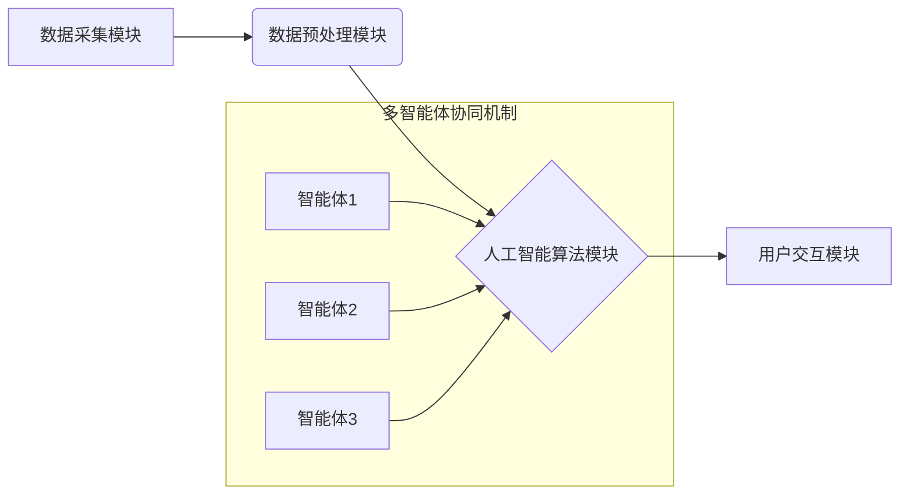

> 多智能体协同、智能医疗、机器学习、深度学习、自然语言处理、医疗诊断、个性化治疗

## 1. 背景介绍

随着人工智能技术的飞速发展，智能医疗系统已成为医疗保健领域的一项重要创新，旨在通过利用人工智能算法和技术来提高医疗诊断的准确性、效率和个性化程度。智能医疗系统通常由多个智能模块组成，每个模块负责特定的任务，例如图像识别、自然语言处理、数据分析等。然而，这些智能模块往往是独立运行的，缺乏协同合作，难以充分发挥其各自的优势，从而限制了智能医疗系统的整体性能。

多智能体协同机制作为一种新的智能系统架构，旨在通过协调多个智能体的行为，实现协同工作，从而提高系统的整体性能和智能水平。在智能医疗系统中，多智能体协同机制可以有效解决智能模块之间信息孤岛问题，促进数据共享和知识融合，从而实现更精准、更个性化的医疗服务。

## 2. 核心概念与联系

**2.1 多智能体协同**

多智能体协同是指多个独立的智能体在特定环境下，通过信息交换和协作，共同完成复杂任务的机制。每个智能体都具有自主决策能力和局部知识，但缺乏全局信息，需要通过协同合作才能获得最佳的解决方案。

**2.2 智能医疗系统**

智能医疗系统是指利用人工智能技术，对医疗数据进行分析和处理，辅助医生进行诊断、治疗和决策的系统。智能医疗系统通常包含以下几个核心模块：

* **数据采集模块:** 收集患者的医疗数据，例如病历、影像、基因信息等。
* **数据预处理模块:** 对采集到的医疗数据进行清洗、转换和格式化，使其能够被人工智能算法处理。
* **人工智能算法模块:** 利用机器学习、深度学习等人工智能算法对医疗数据进行分析和处理，例如进行疾病诊断、预测患者风险、辅助医生制定治疗方案等。
* **用户交互模块:** 提供用户友好的界面，方便医生和患者与智能医疗系统进行交互。

**2.3 多智能体协同机制在智能医疗系统中的应用**

在智能医疗系统中，多智能体协同机制可以有效解决以下问题：

* **信息孤岛问题:** 智能医疗系统中各个模块之间存在信息孤岛问题，导致数据共享和知识融合不足。多智能体协同机制可以打破信息孤岛，促进数据共享和知识融合，从而提高系统的整体性能。
* **决策效率问题:** 传统的智能医疗系统往往依赖于单一的智能模块进行决策，决策效率较低。多智能体协同机制可以将多个智能模块进行协同决策，提高决策效率和准确性。
* **个性化医疗需求:** 每个患者的医疗需求都是独特的，传统的智能医疗系统难以满足个性化医疗需求。多智能体协同机制可以根据患者的个体特征，协同多个智能模块提供个性化的医疗服务。

**2.4 架构图**



## 3. 核心算法原理 & 具体操作步骤

**3.1 算法原理概述**

多智能体协同机制在智能医疗系统中的应用主要依赖于以下核心算法：

* **强化学习:** 强化学习算法可以训练智能体在特定环境下采取最优行动，以最大化奖励。在智能医疗系统中，强化学习可以用于训练智能体进行疾病诊断、治疗方案推荐等任务。
* **图神经网络:** 图神经网络是一种专门用于处理图结构数据的深度学习算法。在智能医疗系统中，图神经网络可以用于分析患者的医疗历史、基因信息等图结构数据，进行疾病预测、风险评估等任务。
* **联邦学习:** 联邦学习是一种分布式机器学习算法，可以训练模型而无需将数据集中到一个中心服务器。在智能医疗系统中，联邦学习可以用于训练模型，同时保护患者隐私。

**3.2 算法步骤详解**

以强化学习为例，其在智能医疗系统中的应用步骤如下：

1. **环境建模:** 建立一个模拟患者医疗状态的虚拟环境，包括患者的症状、病史、检查结果等信息。
2. **智能体设计:** 设计一个智能体，使其能够根据环境信息做出决策，例如推荐治疗方案、调整药物剂量等。
3. **奖励函数设计:** 设计一个奖励函数，用于评估智能体决策的优劣。例如，如果智能体推荐的治疗方案能够有效缓解患者症状，则奖励函数会给予较高的奖励。
4. **强化学习训练:** 利用强化学习算法，训练智能体在虚拟环境中学习，使其能够做出最优决策。
5. **模型部署:** 将训练好的智能体模型部署到实际的医疗系统中，用于辅助医生进行诊断和治疗。

**3.3 算法优缺点**

**优点:**

* 能够学习复杂的医疗知识，提高诊断和治疗的准确性。
* 可以根据患者的个体特征，提供个性化的医疗服务。
* 能够提高医疗效率，减少医疗成本。

**缺点:**

* 需要大量的医疗数据进行训练，数据获取和标注成本较高。
* 算法模型的解释性较差，难以理解智能体决策的逻辑。
* 存在伦理和安全问题，例如数据隐私保护、算法偏见等。

**3.4 算法应用领域**

* **疾病诊断:** 利用机器学习算法分析患者的症状、病史、检查结果等信息，辅助医生进行疾病诊断。
* **治疗方案推荐:** 根据患者的病情、个人特征等信息，推荐最合适的治疗方案。
* **药物研发:** 利用深度学习算法分析药物分子结构和生物活性，加速药物研发过程。
* **医疗影像分析:** 利用计算机视觉算法分析医学影像，辅助医生进行疾病诊断和治疗方案制定。

## 4. 数学模型和公式 & 详细讲解 & 举例说明

**4.1 数学模型构建**

在多智能体协同机制中，可以构建一个数学模型来描述智能体之间的交互和协作关系。例如，可以使用图论模型来表示智能体之间的连接关系，以及每个智能体拥有的知识和能力。

**4.2 公式推导过程**

在强化学习算法中，可以使用Bellman方程来推导智能体的价值函数。Bellman方程描述了智能体在不同状态下采取不同行动的价值。

**4.3 案例分析与讲解**

假设有两个智能体，分别负责诊断和治疗。

* 智能体1负责根据患者的症状和病史进行疾病诊断。
* 智能体2负责根据诊断结果推荐治疗方案。

这两个智能体可以通过信息交换和协作，提高诊断和治疗的准确性。例如，智能体1可以将诊断结果传递给智能体2，智能体2可以根据诊断结果推荐更精准的治疗方案。

## 5. 项目实践：代码实例和详细解释说明

**5.1 开发环境搭建**

* 操作系统: Ubuntu 20.04
* Python 版本: 3.8
* 必要的库: TensorFlow, PyTorch, NumPy, Pandas

**5.2 源代码详细实现**

```python
# 智能体1: 诊断智能体
class DiagnosisAgent:
    def __init__(self):
        # 初始化诊断模型
        self.diagnosis_model = ...

    def diagnose(self, patient_data):
        # 使用诊断模型对患者数据进行诊断
        diagnosis_result = self.diagnosis_model.predict(patient_data)
        return diagnosis_result

# 智能体2: 治疗智能体
class TreatmentAgent:
    def __init__(self):
        # 初始化治疗模型
        self.treatment_model = ...

    def recommend_treatment(self, diagnosis_result):
        # 使用治疗模型根据诊断结果推荐治疗方案
        treatment_plan = self.treatment_model.recommend(diagnosis_result)
        return treatment_plan

# 主程序
if __name__ == "__main__":
    diagnosis_agent = DiagnosisAgent()
    treatment_agent = TreatmentAgent()

    # 获取患者数据
    patient_data = ...

    # 智能体1进行诊断
    diagnosis_result = diagnosis_agent.diagnose(patient_data)

    # 智能体2根据诊断结果推荐治疗方案
    treatment_plan = treatment_agent.recommend_treatment(diagnosis_result)

    # 输出治疗方案
    print(treatment_plan)
```

**5.3 代码解读与分析**

* 代码中定义了两个智能体类: `DiagnosisAgent` 和 `TreatmentAgent`。
* `DiagnosisAgent` 类负责根据患者数据进行疾病诊断，`TreatmentAgent` 类负责根据诊断结果推荐治疗方案。
* 主程序中实例化了两个智能体，并调用其方法进行诊断和治疗方案推荐。

**5.4 运行结果展示**

运行代码后，将输出患者的治疗方案。

## 6. 实际应用场景

**6.1 疾病诊断辅助**

多智能体协同机制可以辅助医生进行疾病诊断，例如，一个智能体负责分析患者的症状和病史，另一个智能体负责分析患者的影像数据，共同辅助医生做出更准确的诊断。

**6.2 个性化治疗方案推荐**

根据患者的个体特征，多智能体协同机制可以推荐个性化的治疗方案，例如，一个智能体负责分析患者的基因信息，另一个智能体负责分析患者的药物反应，共同推荐最适合患者的治疗方案。

**6.3 远程医疗服务**

多智能体协同机制可以支持远程医疗服务，例如，一个智能体负责收集患者的远程医疗数据，另一个智能体负责与医生进行远程会诊，共同提供远程医疗服务。

**6.4 未来应用展望**

随着人工智能技术的不断发展，多智能体协同机制在智能医疗系统中的应用将更加广泛，例如：

* **智能手术机器人:** 多智能体协同机制可以控制智能手术机器人，实现更精准、更安全的微创手术。
* **智能药物研发:** 多智能体协同机制可以加速药物研发过程，例如，一个智能体负责分析药物分子结构，另一个智能体负责模拟药物在人体内的作用机制。
* **智能健康管理:** 多智能体协同机制可以帮助患者进行智能健康管理，例如，一个智能体负责分析患者的健康数据，另一个智能体负责提供个性化的健康建议。

## 7. 工具和资源推荐

**7.1 学习资源推荐**

* **书籍:**
    * 《多智能体系统》
    * 《强化学习：原理、算法和应用》
* **在线课程:**
    * Coursera: 强化学习
    * edX: 多智能体系统

**7.2 开发工具推荐**

* **TensorFlow:** 深度学习框架
* **PyTorch:** 深度学习框架
* **OpenAI Gym:** 强化学习环境

**7.3 相关论文推荐**

* **Multi-Agent Reinforcement Learning for Healthcare**
* **Federated Learning for Healthcare: A Survey**
* **Graph Neural Networks for Healthcare Applications**

## 8. 总结：未来发展趋势与挑战

**8.1 研究成果总结**

多智能体协同机制在智能医疗系统中的应用取得了显著的成果，例如，在疾病诊断、治疗方案推荐、远程医疗服务等方面取得了良好的效果。

**8.2 未来发展趋势**

* **更强大的算法模型:** 未来将开发更强大的算法模型，例如，基于图神经网络的智能体协同机制，能够更好地处理医疗数据的复杂关系。
* **更广泛的应用场景:** 多智能体协同机制将应用于更广泛的医疗场景，例如，智能手术机器人、智能药物研发、智能健康管理等。
* **更安全的隐私保护机制:** 未来将开发更安全的隐私保护机制，确保患者数据的安全和隐私。

**8.3 面临的挑战**

* **数据获取和标注:** 医疗数据获取和标注成本较高，需要开发更有效的获取和标注方法。
* **算法解释性