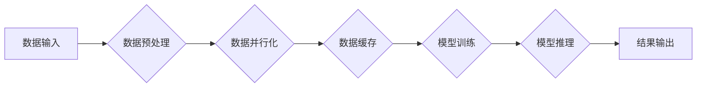

> 大语言模型，I/O 优化，数据处理，模型训练，性能提升，工程实践

## 1. 背景介绍

大语言模型 (LLM) 近年来取得了令人瞩目的成就，在自然语言处理、文本生成、机器翻译等领域展现出强大的能力。然而，随着模型规模的不断扩大，训练和部署这些模型面临着越来越大的挑战，其中 I/O 优化尤为关键。

传统的训练方法往往依赖于磁盘 I/O，而磁盘 I/O 速度相对较慢，成为模型训练和推理过程中的瓶颈。为了解决这个问题，研究者们提出了各种 I/O 优化技术，旨在提高数据读写效率，加速模型训练和推理速度。

本文将深入探讨大语言模型的 I/O 优化技术，涵盖核心概念、算法原理、工程实践等方面，旨在帮助读者理解 I/O 优化在 LLM 中的重要性，并掌握相关的优化方法。

## 2. 核心概念与联系

**2.1  I/O 瓶颈**

在 LLM 训练过程中，模型需要不断读取和写入大量数据，例如训练数据、模型参数等。这些数据通常存储在磁盘上，而磁盘 I/O 速度远低于 CPU 和 GPU 的处理速度，导致 I/O 成为模型训练和推理过程中的瓶颈。

**2.2  I/O 优化目标**

I/O 优化的目标是减少数据读写时间，提高数据传输效率，从而加速模型训练和推理速度。

**2.3  I/O 优化技术**

常见的 I/O 优化技术包括：

* **数据预加载:** 预先加载模型需要的数据到内存中，避免频繁的磁盘访问。
* **数据并行化:** 将数据拆分成多个部分，并行读取和写入，提高数据传输效率。
* **缓存机制:** 利用缓存存储频繁访问的数据，减少磁盘访问次数。
* **数据压缩:** 将数据压缩存储，减少数据传输量。
* **异步 I/O:** 将数据读写操作异步化，避免阻塞主线程。

**2.4  I/O 优化与模型架构**

I/O 优化技术与模型架构密切相关。例如，对于 Transformer 模型，由于其需要处理大量注意力计算，数据并行化和缓存机制尤为重要。

**Mermaid 流程图**



## 3. 核心算法原理 & 具体操作步骤

### 3.1  算法原理概述

数据预加载是一种常用的 I/O 优化技术，其原理是将模型训练过程中需要的数据预先加载到内存中，避免频繁的磁盘访问。

### 3.2  算法步骤详解

1. **数据预读:** 在模型训练开始之前，预先读取一部分训练数据到内存中。
2. **数据分批:** 将预读的数据分成多个小批次，方便模型训练。
3. **数据循环:** 在模型训练过程中，循环使用内存中的数据批次进行训练。
4. **数据补充:** 当内存中的数据批次用完时，从磁盘中读取新的数据批次，并补充到内存中。

### 3.3  算法优缺点

**优点:**

* 减少磁盘 I/O 次数，提高数据读写效率。
* 降低模型训练时间。

**缺点:**

* 需要额外的内存空间存储预加载的数据。
* 预加载的数据量需要根据模型规模和训练数据大小进行调整。

### 3.4  算法应用领域

数据预加载技术广泛应用于各种机器学习模型的训练，例如深度学习模型、自然语言处理模型等。

## 4. 数学模型和公式 & 详细讲解 & 举例说明

### 4.1  数学模型构建

假设模型训练需要读取 `N` 个数据样本，每个样本大小为 `S` 字节，内存大小为 `M` 字节。

数据预加载的效率可以表示为：

```latex
Efficiency = \frac{Time_{without\_preload} - Time_{with\_preload}}{Time_{without\_preload}}
```

其中：

* `Time_{without\_preload}`: 不使用数据预加载的训练时间。
* `Time_{with\_preload}`: 使用数据预加载的训练时间。

### 4.2  公式推导过程

数据预加载可以减少磁盘 I/O 次数，从而降低训练时间。

假设每个磁盘 I/O 操作需要 `T` 秒，则不使用数据预加载的训练时间可以表示为：

```latex
Time_{without\_preload} = \frac{N \times S}{Bandwidth} + Time_{computation}
```

其中：

* `Bandwidth`: 磁盘读写带宽。
* `Time_{computation}`: 模型训练的计算时间。

使用数据预加载后，可以将数据预先加载到内存中，减少磁盘 I/O 次数。

假设预加载的数据量为 `P` 个数据样本，则使用数据预加载的训练时间可以表示为：

```latex
Time_{with\_preload} = \frac{(N - P) \times S}{Bandwidth} + Time_{computation}
```

因此，数据预加载的效率可以表示为：

```latex
Efficiency = \frac{Time_{without\_preload} - Time_{with\_preload}}{Time_{without\_preload}} = \frac{\frac{P \times S}{Bandwidth}}{Time_{without\_preload}}
```

### 4.3  案例分析与讲解

假设模型训练需要读取 10000 个数据样本，每个样本大小为 1024 字节，内存大小为 1GB，磁盘读写带宽为 100 MB/s。

不使用数据预加载的训练时间为：

```latex
Time_{without\_preload} = \frac{10000 \times 1024}{100 \times 1024 \times 8} + Time_{computation} = 125 + Time_{computation}
```

如果预加载 1000 个数据样本，则使用数据预加载的训练时间为：

```latex
Time_{with\_preload} = \frac{(10000 - 1000) \times 1024}{100 \times 1024 \times 8} + Time_{computation} = 112.5 + Time_{computation}
```

因此，数据预加载的效率为：

```latex
Efficiency = \frac{125 - 112.5}{125} = 0.1
```

## 5. 项目实践：代码实例和详细解释说明

### 5.1  开发环境搭建

* 操作系统: Ubuntu 20.04
* Python 版本: 3.8
* 深度学习框架: PyTorch 1.8

### 5.2  源代码详细实现

```python
import torch
import torch.nn as nn
import numpy as np

# 定义一个简单的线性模型
class LinearModel(nn.Module):
    def __init__(self, input_size, output_size):
        super(LinearModel, self).__init__()
        self.linear = nn.Linear(input_size, output_size)

    def forward(self, x):
        return self.linear(x)

# 创建模型实例
model = LinearModel(input_size=10, output_size=5)

# 定义损失函数和优化器
criterion = nn.MSELoss()
optimizer = torch.optim.Adam(model.parameters(), lr=0.01)

# 数据预加载
data_size = 10000
batch_size = 32
data = np.random.randn(data_size, 10)
labels = np.random.randn(data_size, 5)

# 将数据预加载到内存中
data_loader = torch.utils.data.DataLoader(
    torch.utils.data.TensorDataset(torch.from_numpy(data), torch.from_numpy(labels)),
    batch_size=batch_size,
    shuffle=False,
)

# 模型训练
for epoch in range(10):
    for batch_idx, (data, target) in enumerate(data_loader):
        # 前向传播
        output = model(data)
        # 计算损失
        loss = criterion(output, target)
        # 反向传播
        optimizer.zero_grad()
        loss.backward()
        # 更新参数
        optimizer.step()

    print(f'Epoch: {epoch+1}, Loss: {loss.item()}')
```

### 5.3  代码解读与分析

* 代码首先定义了一个简单的线性模型，并创建了模型实例。
* 然后定义了损失函数和优化器。
* 数据预加载部分将训练数据和标签预加载到内存中，并使用 DataLoader 创建数据迭代器。
* 模型训练部分循环迭代数据，进行前向传播、损失计算、反向传播和参数更新。

### 5.4  运行结果展示

运行代码后，会输出每个 epoch 的损失值，可以观察到损失值随着训练的进行而逐渐降低。

## 6. 实际应用场景

### 6.1  自然语言处理

在自然语言处理任务中，例如文本分类、机器翻译等，数据预加载可以有效提高模型训练速度。

### 6.2  图像识别

在图像识别任务中，数据预加载可以加速模型训练，并提高模型的准确率。

### 6.3  语音识别

在语音识别任务中，数据预加载可以提高模型的实时性，并降低延迟。

### 6.4  未来应用展望

随着大语言模型规模的不断扩大，数据预加载技术将变得更加重要。未来，数据预加载技术可能会结合其他优化技术，例如模型并行化、混合精度训练等，进一步提高模型训练和推理效率。

## 7. 工具和资源推荐

### 7.1  学习资源推荐

* **论文:**
    * "Efficient Data Loading for Large-Scale Deep Learning"
    * "Data Parallelism for Deep Learning"
* **博客:**
    * https://pytorch.org/tutorials/beginner/data_loading_tutorial.html
    * https://www.tensorflow.org/tutorials/load_data

### 7.2  开发工具推荐

* **PyTorch:** https://pytorch.org/
* **TensorFlow:** https://www.tensorflow.org/

### 7.3  相关论文推荐

* "Attention Is All You Need"
* "BERT: Pre-training of Deep Bidirectional Transformers for Language Understanding"

## 8. 总结：未来发展趋势与挑战

### 8.1  研究成果总结

本文深入探讨了大语言模型的 I/O 优化技术，涵盖了核心概念、算法原理、工程实践等方面。数据预加载技术是提高模型训练效率的重要手段，可以有效减少磁盘 I/O 次数，降低训练时间。

### 8.2  未来发展趋势

未来，数据预加载技术可能会结合其他优化技术，例如模型并行化、混合精度训练等，进一步提高模型训练和推理效率。

### 8.3  面临的挑战

* 如何更高效地预加载数据，减少内存占用。
* 如何根据不同的模型架构和训练数据选择合适的预加载策略。
* 如何在分布式训练环境中实现数据预加载。

### 8.4  研究展望

未来，我们将继续研究数据预加载技术，探索更有效的预加载策略，并将其应用于更大型的语言模型训练。

## 9. 附录：常见问题与解答

**问题 1:** 数据预加载需要多少内存空间？

**答案:** 数据预加载所需的内存空间取决于模型规模、训练数据大小和预加载的数据量。

**问题 2:** 数据预加载会影响模型的训练效果吗？

**答案:** 数据预加载一般不会影响模型的训练效果，但如果预加载的数据量过大，可能会导致内存溢出。

**问题 3:** 如何选择合适的预加载