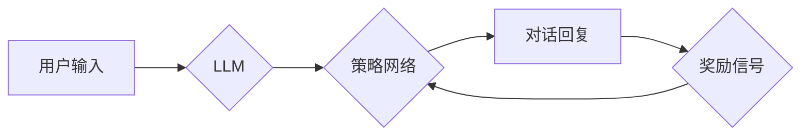

> 大语言模型，ReAct框架，对话系统，文本生成，强化学习，自然语言处理

## 1. 背景介绍

近年来，大语言模型（LLM）在自然语言处理（NLP）领域取得了显著进展，展现出强大的文本生成、翻译、问答等能力。这些模型通常基于Transformer架构，通过海量文本数据进行预训练，并能够在各种下游任务中进行微调。然而，现有的LLM在对话系统应用中仍然存在一些挑战，例如：

* **缺乏上下文理解能力:** LLMs通常只能处理有限长度的文本上下文，难以理解长对话中的语义关联。
* **生成文本缺乏多样性和流畅性:** LLMs生成的文本往往过于机械和重复，缺乏自然语言的流畅性和多样性。
* **难以进行个性化定制:** 现有的LLMs通常是通用的，难以满足不同用户或场景的个性化需求。

为了解决这些问题，研究者们提出了各种改进方法，其中ReAct框架是一个值得关注的方案。ReAct框架将强化学习与LLMs相结合，通过奖励机制引导模型生成更符合用户期望的对话回复。

## 2. 核心概念与联系

ReAct框架的核心思想是将对话系统视为一个马尔可夫决策过程（MDP），其中：

* **状态:** 当前对话的上下文信息。
* **动作:** 模型生成的对话回复。
* **奖励:** 用户对回复的评价，例如满意度、相关性等。

ReAct框架利用强化学习算法，例如策略梯度算法，学习一个策略函数，该函数能够根据当前对话状态生成最优的对话回复，从而最大化累积奖励。

**ReAct框架架构图:**



## 3. 核心算法原理 & 具体操作步骤

### 3.1  算法原理概述

ReAct框架的核心算法是策略梯度算法，其目标是学习一个策略函数，该函数能够最大化累积奖励。策略梯度算法的基本思想是：

1. 通过采样策略网络生成的行动，收集奖励信号。
2. 计算策略网络参数的梯度，该梯度指示了如何调整参数以提高奖励。
3. 使用梯度更新策略网络参数，从而改进策略函数。

### 3.2  算法步骤详解

1. **初始化:** 初始化策略网络参数，并设置学习率等超参数。
2. **采样:** 根据当前对话状态，使用策略网络生成一个对话回复。
3. **奖励:** 根据用户对回复的评价，获得奖励信号。
4. **梯度计算:** 计算策略网络参数的梯度，该梯度基于奖励信号和策略网络生成的行动。
5. **参数更新:** 使用梯度更新策略网络参数，从而改进策略函数。
6. **重复:** 重复步骤2-5，直到策略网络收敛或达到预设的训练轮数。

### 3.3  算法优缺点

**优点:**

* **能够学习到复杂的策略:** 策略梯度算法能够学习到复杂的策略函数，从而生成更符合用户期望的对话回复。
* **能够处理连续动作空间:** 策略梯度算法能够处理连续动作空间，例如生成文本的长度和内容。

**缺点:**

* **训练不稳定:** 策略梯度算法的训练过程可能不稳定，需要仔细调参才能获得良好的效果。
* **样本效率低:** 策略梯度算法需要大量的样本数据才能训练出一个有效的策略函数。

### 3.4  算法应用领域

策略梯度算法在强化学习领域有着广泛的应用，例如：

* **游戏AI:** 训练游戏AI代理，使其能够学习玩游戏并取得高分。
* **机器人控制:** 训练机器人控制策略，使其能够完成复杂的任务。
* **推荐系统:** 训练推荐系统，使其能够推荐用户感兴趣的内容。

## 4. 数学模型和公式 & 详细讲解 & 举例说明

### 4.1  数学模型构建

ReAct框架将对话系统建模为一个马尔可夫决策过程（MDP），其中：

* **状态空间:** S = {s1, s2, ..., sn}，表示所有可能的对话状态。
* **动作空间:** A = {a1, a2, ..., am}，表示所有可能的对话回复。
* **状态转移概率:** P(st+1|st, at)，表示从状态st执行动作at后转移到状态st+1的概率。
* **奖励函数:** R(st, at)，表示在状态st执行动作at获得的奖励。

### 4.2  公式推导过程

策略梯度算法的目标是学习一个策略函数π(at|st)，该函数能够最大化累积奖励。策略梯度算法的基本公式如下：

```latex
\theta_{t+1} = \theta_t + \alpha \nabla_{\theta} J(\theta)
```

其中：

* θ表示策略网络的参数。
* α表示学习率。
* J(θ)表示策略函数的期望奖励。

### 4.3  案例分析与讲解

假设一个简单的对话系统，用户输入“你好”，模型生成回复“你好，请问有什么可以帮您吗？”。在这个例子中：

* 状态空间：包含用户输入和模型回复等信息。
* 动作空间：包含所有可能的回复。
* 奖励函数：根据用户对回复的评价进行设置，例如满意度、相关性等。

使用策略梯度算法，模型可以学习到一个策略函数，该函数能够根据用户输入生成最合适的回复，从而最大化累积奖励。

## 5. 项目实践：代码实例和详细解释说明

### 5.1  开发环境搭建

ReAct框架的开发环境需要包含以下软件：

* Python 3.x
* TensorFlow 或 PyTorch
* NLTK 或 spaCy 等自然语言处理库

### 5.2  源代码详细实现

ReAct框架的源代码实现可以参考开源项目或论文中的代码示例。

### 5.3  代码解读与分析

代码解读需要根据具体的实现细节进行分析，例如：

* 策略网络的架构和参数设置。
* 奖励函数的设计和计算方法。
* 训练过程中的超参数调优。

### 5.4  运行结果展示

运行结果展示需要根据具体的实验设置和数据进行分析，例如：

* 模型在不同对话场景下的性能表现。
* 模型生成的对话回复的质量和多样性。
* 模型的训练时间和资源消耗。

## 6. 实际应用场景

ReAct框架在以下实际应用场景中具有潜在价值：

* **聊天机器人:** 开发更智能、更自然的聊天机器人，能够更好地理解用户需求并提供更精准的回复。
* **虚拟助手:** 构建更强大的虚拟助手，能够帮助用户完成各种任务，例如日程安排、信息查询、购物等。
* **教育机器人:** 开发教育机器人，能够与学生进行互动学习，提供个性化的教学内容和反馈。

### 6.4  未来应用展望

随着大语言模型和强化学习技术的不断发展，ReAct框架有望在更多领域得到应用，例如：

* **医疗保健:** 开发医疗诊断助手，帮助医生更快、更准确地诊断疾病。
* **金融服务:** 开发金融咨询机器人，帮助用户进行理财规划和投资决策。
* **法律服务:** 开发法律咨询机器人，帮助用户了解法律法规和解决法律问题。

## 7. 工具和资源推荐

### 7.1  学习资源推荐

* **论文:** ReAct: Reinforcement Learning for Dialogue Systems
* **博客:** OpenAI Blog, DeepMind Blog
* **在线课程:** Coursera, Udacity

### 7.2  开发工具推荐

* **TensorFlow:** 开源深度学习框架
* **PyTorch:** 开源深度学习框架
* **NLTK:** 自然语言处理库
* **spaCy:** 自然语言处理库

### 7.3  相关论文推荐

* **Seq2Seq Learning with Neural Networks**
* **Attention Is All You Need**
* **Policy Gradient Methods for Reinforcement Learning**

## 8. 总结：未来发展趋势与挑战

### 8.1  研究成果总结

ReAct框架为对话系统应用提供了新的思路和方法，将强化学习与大语言模型相结合，能够学习到更符合用户期望的对话策略。

### 8.2  未来发展趋势

未来ReAct框架的发展趋势包括：

* **模型规模和能力的提升:** 利用更强大的计算资源和更大的训练数据集，训练更强大的大语言模型，从而提升对话系统的性能。
* **多模态对话系统的研究:** 将ReAct框架扩展到多模态对话系统，例如文本、语音、图像等，从而提供更丰富的交互体验。
* **个性化对话系统的开发:** 利用用户数据和行为特征，开发个性化的对话系统，能够根据用户的喜好和需求提供定制化的服务。

### 8.3  面临的挑战

ReAct框架也面临一些挑战，例如：

* **数据标注的困难:** 训练高质量的对话数据需要大量的标注工作，这对于资源有限的团队来说是一个挑战。
* **模型训练的复杂性:** ReAct框架的训练过程比较复杂，需要专业的技术人员进行操作和调参。
* **伦理和安全问题:** 大语言模型的应用可能带来一些伦理和安全问题，例如生成虚假信息、传播偏见等，需要引起足够的重视和关注。

### 8.4  研究展望

未来，ReAct框架的研究将继续朝着更智能、更安全、更可持续的方向发展，为人类社会带来更多价值。

## 9. 附录：常见问题与解答

**常见问题:**

* ReAct框架的训练需要多长时间？
* ReAct框架的硬件要求是什么？
* ReAct框架的开源代码在哪里可以找到？

**解答:**

* ReAct框架的训练时间取决于模型规模、数据集大小和硬件配置等因素，通常需要几天到几周的时间。
* ReAct框架的硬件要求取决于模型规模，一般需要配备GPU加速器。
* ReAct框架的开源代码可以参考相关论文或开源项目。


作者：禅与计算机程序设计艺术 / Zen and the Art of Computer Programming 
<end_of_turn>