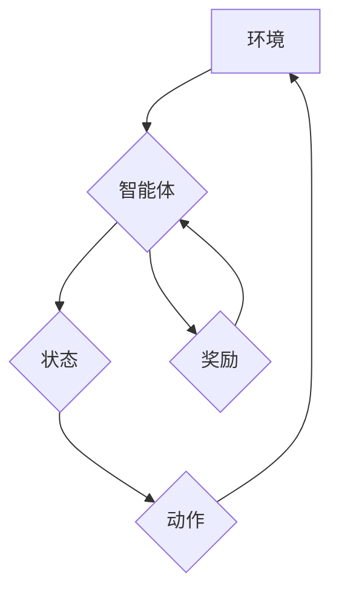

> 强化学习，Reinforcement Learning，电子竞技，eSports，游戏AI，策略决策，深度学习，神经网络

## 1. 背景介绍

电子竞技 (eSports) 正迅速发展成为一项全球性的现象，吸引了数百万玩家和观众。随着游戏技术的进步，游戏AI的水平也得到了显著提升。传统的基于规则的游戏AI已经难以满足玩家对更智能、更具挑战性的游戏体验的需求。强化学习 (Reinforcement Learning，RL) 作为一种机器学习方法，为电子竞技游戏AI的发展提供了新的可能性。

强化学习的核心思想是通过奖励机制来训练智能体，使其在环境中采取最优策略以获得最大奖励。与监督学习不同，强化学习不需要明确的标签数据，而是通过试错和学习来不断优化策略。

## 2. 核心概念与联系

**2.1 强化学习核心概念**

* **智能体 (Agent):**  在游戏环境中做出决策的实体，例如游戏角色。
* **环境 (Environment):** 智能体所处的环境，包括游戏世界、游戏规则和玩家行为等。
* **状态 (State):** 环境在特定时刻的描述，例如游戏地图、角色位置、资源数量等。
* **动作 (Action):** 智能体可以采取的行动，例如移动、攻击、使用技能等。
* **奖励 (Reward):** 智能体采取特定动作后获得的反馈，可以是正向奖励（例如获得胜利）或负向奖励（例如被击杀）。
* **策略 (Policy):** 智能体根据当前状态选择动作的规则，可以是基于规则的策略或基于学习的策略。

**2.2 强化学习与电子竞技的联系**

在电子竞技游戏中，智能体可以看作是游戏角色，环境是游戏世界，状态是游戏中的各种信息，动作是角色可以采取的行动，奖励是游戏中的胜利或失败等结果。通过强化学习算法，我们可以训练智能体学习最优的策略，使其在游戏中取得胜利。

**2.3 强化学习架构**



## 3. 核心算法原理 & 具体操作步骤

### 3.1 算法原理概述

强化学习算法的核心是通过不断地试错和学习来优化策略。智能体在环境中采取行动，根据环境的反馈获得奖励。通过对奖励的累积和反馈，智能体逐渐学习到最优的策略，从而在环境中取得最佳结果。

常见的强化学习算法包括：

* **Q-学习:**  通过构建一个Q表来存储每个状态-动作对的价值函数，并通过迭代更新Q表来学习最优策略。
* **SARSA:** 与Q-学习类似，但SARSA在更新Q表时使用的是当前智能体采取的动作，而不是最优动作。
* **Deep Q-Network (DQN):** 将深度神经网络应用于Q-学习，可以处理更复杂的决策问题。

### 3.2 算法步骤详解

以Q-学习为例，其具体操作步骤如下：

1. **初始化Q表:**  将Q表初始化为一个包含所有状态-动作对的矩阵，每个元素的值都设置为0。
2. **选择动作:** 根据当前状态和Q表中的值，选择一个动作。可以使用ε-贪婪策略，即以概率ε随机选择一个动作，否则选择Q值最大的动作。
3. **执行动作:** 在环境中执行选择的动作，并观察环境的反馈，包括下一个状态和奖励。
4. **更新Q值:** 根据Bellman方程更新Q表中的值，即Q(s, a) = Q(s, a) + α[r + γmaxQ(s', a') - Q(s, a)]，其中α是学习率，γ是折扣因子，r是奖励，s'是下一个状态，a'是下一个状态对应的最优动作。
5. **重复步骤2-4:**  重复以上步骤，直到智能体学习到最优策略。

### 3.3 算法优缺点

**优点:**

* 可以学习复杂的策略。
* 不需要明确的标签数据。
* 可以应用于各种环境。

**缺点:**

* 训练时间长。
* 需要大量的样本数据。
* 容易陷入局部最优。

### 3.4 算法应用领域

强化学习算法在电子竞技游戏AI、机器人控制、自动驾驶、推荐系统等领域都有广泛的应用。

## 4. 数学模型和公式 & 详细讲解 & 举例说明

### 4.1 数学模型构建

强化学习的数学模型可以概括为一个马尔可夫决策过程 (MDP)，它由以下四个要素组成：

* **状态空间 S:** 所有可能的系统状态的集合。
* **动作空间 A:** 在每个状态下智能体可以采取的所有动作的集合。
* **转移概率 P(s', r | s, a):** 从状态 s 执行动作 a 后转移到状态 s' 并获得奖励 r 的概率。
* **奖励函数 R(s, a):** 智能体在状态 s 执行动作 a 后获得的奖励。

### 4.2 公式推导过程

强化学习的目标是找到一个最优策略 π(s)，使得智能体在环境中获得最大的累积奖励。最优策略可以利用Bellman方程来推导：

```latex
V^*(s) = \max_a \sum_{s', r} P(s', r | s, a) [R(s, a) + \gamma V^*(s')]
```

其中：

* V^*(s) 是状态 s 的最优价值函数。
* γ 是折扣因子，控制未来奖励的权重。

### 4.3 案例分析与讲解

例如，在一个简单的游戏环境中，智能体可以选择向上、向下、向左、向右四个动作。每个动作都会导致智能体进入一个新的状态，并获得相应的奖励。通过Bellman方程，我们可以迭代地更新每个状态的价值函数，最终找到最优策略，使得智能体在游戏中获得最大的奖励。

## 5. 项目实践：代码实例和详细解释说明

### 5.1 开发环境搭建

* Python 3.x
* TensorFlow 或 PyTorch 深度学习框架
* OpenAI Gym 游戏环境

### 5.2 源代码详细实现

```python
import gym
import tensorflow as tf

# 定义DQN网络
class DQN(tf.keras.Model):
    def __init__(self):
        super(DQN, self).__init__()
        self.dense1 = tf.keras.layers.Dense(64, activation='relu')
        self.dense2 = tf.keras.layers.Dense(64, activation='relu')
        self.output = tf.keras.layers.Dense(4)  # 4个动作

    def call(self, x):
        x = self.dense1(x)
        x = self.dense2(x)
        return self.output(x)

# 创建DQN模型
model = DQN()

# 定义损失函数和优化器
optimizer = tf.keras.optimizers.Adam(learning_rate=0.001)
loss_fn = tf.keras.losses.MeanSquaredError()

# 训练循环
for episode in range(1000):
    state = env.reset()
    done = False
    total_reward = 0

    while not done:
        # 选择动作
        action = tf.argmax(model(tf.expand_dims(state, axis=0))).numpy()[0]

        # 执行动作
        next_state, reward, done, _ = env.step(action)

        # 更新Q值
        with tf.GradientTape() as tape:
            target_q = reward + gamma * tf.reduce_max(model(tf.expand_dims(next_state, axis=0)))
            q_value = model(tf.expand_dims(state, axis=0))[action]
            loss = loss_fn(target_q, q_value)

        gradients = tape.gradient(loss, model.trainable_variables)
        optimizer.apply_gradients(zip(gradients, model.trainable_variables))

        state = next_state
        total_reward += reward

    print(f"Episode {episode+1}, Total Reward: {total_reward}")

```

### 5.3 代码解读与分析

* 代码首先定义了DQN网络结构，包括两个全连接层和一个输出层。
* 然后创建DQN模型实例，并定义损失函数和优化器。
* 训练循环中，智能体在环境中进行交互，选择动作，执行动作，并根据环境的反馈更新Q值。
* 损失函数计算了预测Q值与目标Q值之间的误差，优化器根据误差更新模型参数。

### 5.4 运行结果展示

训练完成后，智能体可以根据学习到的策略在环境中进行游戏，并获得更高的奖励。

## 6. 实际应用场景

### 6.1 游戏AI

强化学习可以用于训练游戏AI，使其能够学习更复杂的策略，例如在策略游戏 (例如围棋、Go) 中与人类玩家对抗，或者在动作游戏 (例如Dota 2、StarCraft II) 中与其他AI玩家竞争。

### 6.2 自动化决策

强化学习可以用于自动化决策，例如在金融市场中进行交易、在物流系统中优化配送路线、在医疗领域中辅助诊断。

### 6.3 机器人控制

强化学习可以用于训练机器人控制算法，使其能够在复杂的环境中自主导航、执行任务、与人类交互。

### 6.4 未来应用展望

随着强化学习算法的不断发展，其在电子竞技和其它领域的应用前景更加广阔。未来，我们可能会看到更加智能、更加逼真的游戏AI，以及更加高效、更加智能的自动化系统。

## 7. 工具和资源推荐

### 7.1 学习资源推荐

* **书籍:**
    * Reinforcement Learning: An Introduction by Richard S. Sutton and Andrew G. Barto
    * Deep Reinforcement Learning Hands-On by Maxim Lapan
* **在线课程:**
    * Deep Reinforcement Learning Specialization by DeepLearning.AI
    * Reinforcement Learning by David Silver (University of DeepMind)

### 7.2 开发工具推荐

* **OpenAI Gym:** 一个用于强化学习研究和开发的开源游戏环境。
* **TensorFlow:** 一个开源深度学习框架。
* **PyTorch:** 另一个开源深度学习框架。

### 7.3 相关论文推荐

* Deep Q-Network (DQN) by Volodymyr Mnih et al. (2015)
* Proximal Policy Optimization Algorithms (PPO) by John Schulman et al. (2017)
* Asynchronous Methods for Deep Reinforcement Learning by David Silver et al. (2016)

## 8. 总结：未来发展趋势与挑战

### 8.1 研究成果总结

强化学习在电子竞技游戏AI领域取得了显著的成果，例如AlphaGo、AlphaStar等AI系统已经战胜了人类世界冠军。这些成果证明了强化学习的强大潜力，也为电子竞技游戏AI的发展指明了方向。

### 8.2 未来发展趋势

* **更复杂的策略:** 未来，强化学习算法将能够学习更复杂的策略，例如在更复杂的策略游戏中与人类玩家对抗，或者在更复杂的现实世界中执行任务。
* **更强大的计算能力:** 随着计算能力的不断提升，强化学习算法能够处理更复杂的数据，学习更复杂的模型。
* **更有效的算法:** 研究人员将继续开发更有效的强化学习算法，例如能够更快地学习、更有效地利用资源的算法。

### 8.3 面临的挑战

* **数据效率:** 强化学习算法通常需要大量的样本数据才能学习到有效的策略，这在某些情况下可能是一个挑战。
* **可解释性:** 强化学习模型的决策过程通常是不可解释的，这使得其应用在一些安全关键领域受到