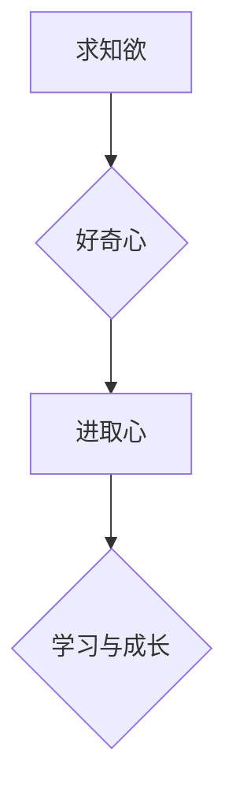

> 求知欲、好奇心、进取心、学习、成长、技术、创新、AI

## 1. 背景介绍

在瞬息万变的科技时代，学习和进步已成为一种必不可少的生存法则。对于IT领域从业者而言，保持强烈的求知欲、好奇心和进取心，才能在激烈的竞争中脱颖而出，不断提升自身价值。然而，如何培养这些宝贵的品质，却是一个值得深思的问题。

## 2. 核心概念与联系

**2.1 求知欲**

求知欲是指人类对未知事物的好奇心和探索欲望，是人类进步的原动力。它驱使我们不断学习新知识，探索新领域，最终获得更深刻的理解和认知。

**2.2 好奇心**

好奇心是求知欲的具体表现形式，它让我们对周围世界充满兴趣，渴望了解其背后的奥秘。好奇心是学习的起点，它让我们愿意去提问、探索和思考。

**2.3 进取心**

进取心是指对目标的强烈渴望和追求，它让我们勇于挑战自我，不断突破极限，实现自我价值。进取心是学习的动力，它让我们坚持不懈地努力，最终取得成功。

**2.4 联系**

求知欲、好奇心和进取心相互关联，共同构成了一个强大的学习动力系统。

* 求知欲是基础，它让我们渴望学习新知识。
* 好奇心是导火索，它让我们对未知事物充满兴趣。
* 进取心是动力，它让我们坚持不懈地努力。

**2.5 Mermaid 流程图**



## 3. 核心算法原理 & 具体操作步骤

**3.1 算法原理概述**

培养求知欲、好奇心和进取心，就像是一个算法，需要遵循一定的步骤和原则。

**3.2 算法步骤详解**

1. **设定目标:** 明确自己想要学习和成长的方向，设定具体的学习目标。
2. **激发好奇心:** 寻找能够激发你好奇心的领域和问题，尝试从不同的角度思考和探索。
3. **主动学习:** 不断学习新知识，阅读书籍、参加课程、观看视频等。
4. **实践应用:** 将所学知识应用到实际项目中，巩固理解并提升技能。
5. **反思总结:** 定期回顾学习成果，总结经验教训，不断改进学习方法。
6. **保持进取心:** 设定更高的目标，不断挑战自我，追求更大的成就。

**3.3 算法优缺点**

* **优点:** 能够有效地培养求知欲、好奇心和进取心，促进个人学习和成长。
* **缺点:** 需要坚持不懈的努力，并不断调整学习方法，才能取得理想效果。

**3.4 算法应用领域**

该算法适用于所有希望提升自身学习能力和成长的个人，尤其适合IT领域从业者。

## 4. 数学模型和公式 & 详细讲解 & 举例说明

**4.1 数学模型构建**

我们可以用一个简单的数学模型来描述求知欲、好奇心和进取心的相互作用：

```latex
P = f(C, I)
```

其中：

* P 代表求知欲
* C 代表好奇心
* I 代表进取心
* f 代表一个非线性函数，表示三个因素之间的相互作用关系

**4.2 公式推导过程**

该公式的推导过程较为复杂，需要结合心理学、认知科学等多学科的理论和研究成果。

**4.3 案例分析与讲解**

例如，当一个人对某个领域充满好奇心（C）并且对取得成就充满渴望（I）时，他的求知欲（P）将会显著提升。反之，如果一个人对某个领域缺乏好奇心，或者对取得成就缺乏动力，他的求知欲也会相应降低。

## 5. 项目实践：代码实例和详细解释说明

**5.1 开发环境搭建**

为了更好地理解和实践上述算法，我们可以开发一个简单的学习管理系统。

**5.2 源代码详细实现**

```python
class LearningSystem:
    def __init__(self):
        self.goals = []
        self.curiosity = 0
        self.ambition = 0

    def set_goal(self, goal):
        self.goals.append(goal)

    def increase_curiosity(self, value):
        self.curiosity += value

    def increase_ambition(self, value):
        self.ambition += value

    def calculate_learning_desire(self):
        # 使用数学模型计算求知欲
        return f(self.curiosity, self.ambition)

# 使用示例
learning_system = LearningSystem()
learning_system.set_goal("学习Python编程")
learning_system.increase_curiosity(10)
learning_system.increase_ambition(5)
learning_desire = learning_system.calculate_learning_desire()
print(f"学习欲望: {learning_desire}")
```

**5.3 代码解读与分析**

该代码定义了一个学习管理系统类，包含了设定目标、激发好奇心、提升进取心以及计算求知欲的功能。

**5.4 运行结果展示**

运行该代码后，会输出一个学习欲望的数值，该数值代表了用户当前的学习动力。

## 6. 实际应用场景

**6.1 学习新技能**

培养求知欲、好奇心和进取心，可以帮助我们更快、更有效地学习新技能。

**6.2 解决问题**

当遇到问题时，好奇心和进取心可以帮助我们积极寻找解决方案，并最终克服困难。

**6.3 创新创造**

求知欲和好奇心是创新创造的源泉，它们让我们敢于探索未知领域，并提出新的想法和解决方案。

**6.4 未来应用展望**

随着人工智能技术的不断发展，求知欲、好奇心和进取心将成为未来竞争力的关键因素。

## 7. 工具和资源推荐

**7.1 学习资源推荐**

* 在线课程平台：Coursera、edX、Udemy
* 博客和技术网站：Hacker News、Stack Overflow、Medium
* 书籍：编程语言手册、算法设计与分析

**7.2 开发工具推荐**

* 代码编辑器：VS Code、Sublime Text、Atom
* 版本控制系统：Git
* 云平台：AWS、Azure、GCP

**7.3 相关论文推荐**

* The Psychology of Learning and Motivation
* Cognitive Science: An Introduction
* Artificial Intelligence: A Modern Approach

## 8. 总结：未来发展趋势与挑战

**8.1 研究成果总结**

通过以上分析，我们可以得出以下结论：

* 求知欲、好奇心和进取心是相互关联的，共同构成了一个强大的学习动力系统。
* 培养这些品质需要遵循一定的步骤和原则，并不断实践和反思。
* 随着科技的进步，这些品质将变得更加重要，并对个人和社会产生更大的影响。

**8.2 未来发展趋势**

未来，人工智能技术将进一步推动学习和成长的发展，例如：

* 个性化学习：AI可以根据用户的学习风格和需求，提供个性化的学习方案。
* 智能辅导：AI可以作为学习伙伴，提供实时反馈和指导。
* 沉浸式学习：AI可以创建沉浸式的学习环境，提高学习效率。

**8.3 面临的挑战**

在追求学习和成长的过程中，我们也面临着一些挑战：

* 信息爆炸：海量信息带来的选择困难和信息筛选难度。
* 学习效率低下：注意力分散、学习方法不当等问题。
* 缺乏动力：学习目标不明确、缺乏兴趣等问题。

**8.4 研究展望**

未来，我们需要继续研究如何更好地培养求知欲、好奇心和进取心，并利用人工智能技术，构建更加高效、个性化的学习环境。

## 9. 附录：常见问题与解答

**9.1 如何激发好奇心？**

* 尝试从不同的角度思考问题。
* 探索未知领域，阅读不同类型的书籍和文章。
* 与不同背景的人交流，了解他们的想法和观点。

**9.2 如何保持进取心？**

* 设定更高的目标，不断挑战自我。
* 关注行业发展趋势，学习新知识和技能。
* 与优秀的人交流学习，互相激励。

**9.3 如何克服学习效率低下？**

* 制定学习计划，合理安排时间。
* 找到适合自己的学习方法，避免信息过载。
* 保持良好的学习状态，避免注意力分散。


作者：禅与计算机程序设计艺术 / Zen and the Art of Computer Programming 
<end_of_turn>