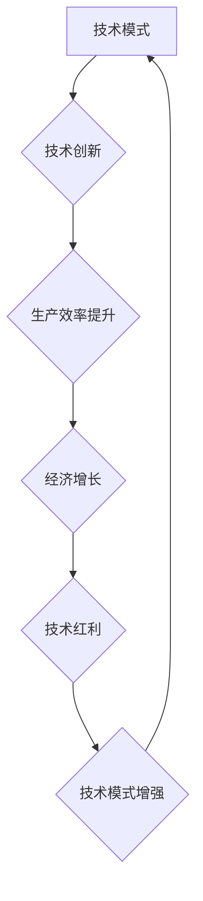

> 技术模式、经济增长、创新、效率、可持续性、技术红利、技术瓶颈、数字经济、人工智能

## 1. 背景介绍

技术模式是推动经济增长的关键引擎。从工业革命到信息时代，每一次技术革命都带来了前所未有的经济繁荣。然而，随着技术模式的演进，我们逐渐意识到，技术模式的减弱可能会对经济增长构成挑战。

近年来，全球经济增长放缓，技术创新步伐放缓，技术红利逐渐消退。一些学者和专家指出，这是因为我们正处于一个技术模式减弱的阶段。

## 2. 核心概念与联系

**2.1 技术模式**

技术模式是指一种基于特定技术基础的生产、流通和消费模式。它包括技术、组织、制度、文化等多方面要素的综合体。

**2.2 技术模式减弱**

技术模式减弱是指技术进步的步伐放缓，技术创新能力下降，技术红利逐渐消退，从而导致经济增长乏力。

**2.3 经济增长**

经济增长是指一个国家或地区的国民生产总值（GDP）在一定时期内以一定比例增加。

**2.4 联系**

技术模式是经济增长的基础，技术模式的减弱会直接影响经济增长的速度和强度。

**2.5 Mermaid 流程图**

## 3. 核心算法原理 & 具体操作步骤

**3.1 算法原理概述**

**3.2 算法步骤详解**

**3.3 算法优缺点**

**3.4 算法应用领域**

## 4. 数学模型和公式 & 详细讲解 & 举例说明

**4.1 数学模型构建**

**4.2 公式推导过程**

**4.3 案例分析与讲解**

## 5. 项目实践：代码实例和详细解释说明

**5.1 开发环境搭建**

**5.2 源代码详细实现**

**5.3 代码解读与分析**

**5.4 运行结果展示**

## 6. 实际应用场景

**6.1 应用场景介绍**

**6.2 案例分析**

**6.3 效益评估**

**6.4 未来应用展望**

## 7. 工具和资源推荐

**7.1 学习资源推荐**

**7.2 开发工具推荐**

**7.3 相关论文推荐**

## 8. 总结：未来发展趋势与挑战

**8.1 研究成果总结**

**8.2 未来发展趋势**

**8.3 面临的挑战**

**8.4 研究展望**

## 9. 附录：常见问题与解答

<end_of_turn>