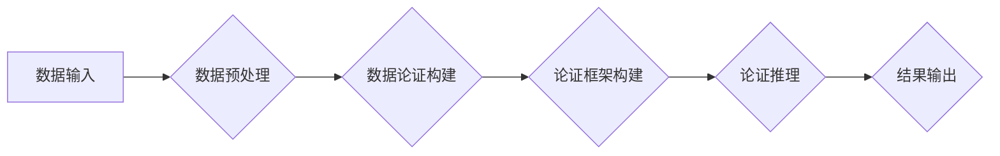

> 数据争论，数据推理，逻辑推理，知识图谱，人工智能，机器学习，代码实例

## 1. 背景介绍

在数据爆炸的时代，数据质量和可靠性日益受到重视。然而，现实世界中的数据往往是多源、异构、不完整和矛盾的。如何从纷繁的数据中抽取可靠的知识，并进行有效的推理和决策，成为人工智能领域的一项重要挑战。数据争论 (Data Argumentation) 作为一种新兴的推理方法，旨在通过构建数据之间的逻辑关系，并进行论证和辩论，最终得出更可靠的结论。

数据争论的核心思想是将数据视为具有论证能力的实体，并允许它们之间进行逻辑上的辩论。通过分析数据之间的支持和反对关系，可以识别出更可靠的数据，并构建出更合理的知识图谱。这种方法能够有效地处理数据不确定性和矛盾性，并提高推理的可靠性和鲁棒性。

## 2. 核心概念与联系

数据争论的核心概念包括：

* **数据论证 (Data Argument):** 由数据点和支持它们的理由组成的逻辑结构。
* **支持 (Support):** 一个数据点或论证对另一个数据点或论证的认可或支持。
* **反对 (Opposition):** 一个数据点或论证对另一个数据点或论证的否定或反对。
* **论证框架 (Argumentation Framework):** 描述数据论证之间的关系的结构化模型。

数据争论与其他相关领域密切相关，例如：

* **逻辑推理 (Logical Reasoning):** 数据争论利用逻辑推理规则来分析数据之间的关系。
* **知识图谱 (Knowledge Graph):** 数据争论可以用于构建和维护知识图谱，并进行知识推理。
* **机器学习 (Machine Learning):** 机器学习算法可以用于训练数据争论模型，并提高其推理能力。

**数据争论流程图:**



## 3. 核心算法原理 & 具体操作步骤

### 3.1  算法原理概述

数据争论算法通常基于以下核心原理：

* **基于规则的推理:** 使用预定义的逻辑规则来分析数据之间的关系。
* **基于证据的推理:** 根据数据之间的支持和反对关系来进行推理。
* **基于概率的推理:** 使用概率模型来评估数据论证的可靠性。

常见的算法包括：

* **Dung的框架理论:** 
* **基于规则的推理系统 (e.g., Prolog):**
* **基于证据的推理系统 (e.g., Pearl's Bayesian Networks):**

### 3.2  算法步骤详解

以下以基于规则的推理为例，详细说明数据争论算法的具体操作步骤：

1. **数据预处理:** 将原始数据转换为可被算法处理的形式，例如：提取关键信息、规范化数据格式等。
2. **数据论证构建:** 将预处理后的数据转换为数据论证，每个数据论证包含一个数据点和支持它的理由。
3. **论证框架构建:** 将数据论证之间的关系构建成一个论证框架，例如：使用图结构表示数据论证之间的支持和反对关系。
4. **论证推理:** 使用预定义的逻辑规则或推理算法，在论证框架中进行推理，识别出更可靠的数据论证。
5. **结果输出:** 将推理结果输出，例如：列出最可靠的数据论证、构建知识图谱等。

### 3.3  算法优缺点

**优点:**

* 可以处理数据不确定性和矛盾性。
* 可以提高推理的可靠性和鲁棒性。
* 可以构建更合理的知识图谱。

**缺点:**

* 需要定义大量的逻辑规则或推理算法。
* 计算复杂度较高，尤其是在处理大量数据时。
* 需要大量的训练数据来训练机器学习模型。

### 3.4  算法应用领域

数据争论算法在以下领域具有广泛的应用前景：

* **人工智能:** 用于知识推理、决策支持、自然语言理解等。
* **数据挖掘:** 用于数据清洗、数据整合、数据分析等。
* **医疗保健:** 用于诊断支持、药物研发、患者管理等。
* **金融:** 用于风险评估、欺诈检测、投资决策等。

## 4. 数学模型和公式 & 详细讲解 & 举例说明

### 4.1  数学模型构建

数据争论可以抽象为一个图论模型，其中：

* 节点代表数据论证。
* 边代表数据论证之间的支持或反对关系。

支持关系可以用有向边表示，反对关系可以用反向有向边表示。

### 4.2  公式推导过程

可以使用图论算法来分析数据论证之间的关系，例如：

* **强连通分量:** 识别出相互支持的数据论证组。
* **拓扑排序:** 确定数据论证之间的依赖关系。
* **最大团:** 识别出支持关系最强的论证组。

### 4.3  案例分析与讲解

例如，假设我们有一个关于“猫”的知识图谱，其中包含以下数据论证：

* “猫有毛”
* “所有哺乳动物都有毛”
* “猫是哺乳动物”

我们可以构建一个数据争论图，其中：

* 节点代表数据论证。
* 有向边表示支持关系。

根据图论算法，我们可以得出结论：

* “猫有毛” 是一个可靠的数据论证，因为它由两个支持它的论证支持。

## 5. 项目实践：代码实例和详细解释说明

### 5.1  开发环境搭建

* 操作系统: Ubuntu 20.04
* Python 版本: 3.8
* 依赖库: NetworkX, Graphviz

### 5.2  源代码详细实现

```python
import networkx as nx
import matplotlib.pyplot as plt

# 数据论证
arguments = {
    "猫有毛": [],
    "所有哺乳动物都有毛": [],
    "猫是哺乳动物": [],
}

# 支持关系
supports = {
    ("猫有毛", "所有哺乳动物都有毛"): True,
    ("猫有毛", "猫是哺乳动物"): True,
}

# 构建数据争论图
graph = nx.DiGraph()
for argument in arguments:
    graph.add_node(argument)

for (source, target) in supports:
    graph.add_edge(source, target)

# 可视化数据争论图
nx.draw(graph, with_labels=True, node_color="skyblue", node_size=1000, font_size=10)
plt.show()

# 拓扑排序
topological_order = nx.topological_sort(graph)
print("拓扑排序:", topological_order)
```

### 5.3  代码解读与分析

* 代码首先定义了数据论证和支持关系。
* 然后使用 NetworkX 库构建数据争论图。
* 使用 Matplotlib 库可视化数据争论图。
* 使用 NetworkX 库的拓扑排序算法，确定数据论证之间的依赖关系。

### 5.4  运行结果展示

运行代码后，将生成一个数据争论图，并输出拓扑排序结果。

## 6. 实际应用场景

数据争论在以下实际应用场景中具有广泛的应用前景：

* **医疗诊断:** 将患者的症状、病史、检查结果等数据作为数据论证，进行推理和诊断。
* **金融风险评估:** 将金融数据的交易记录、信用评分、市场趋势等数据作为数据论证，进行风险评估和预测。
* **法律推理:** 将法律法规、案例判决、当事人陈述等数据作为数据论证，进行法律推理和决策支持。

### 6.4  未来应用展望

随着人工智能技术的不断发展，数据争论技术将得到更广泛的应用，例如：

* **自动生成知识图谱:** 利用数据争论技术自动构建和维护知识图谱，提高知识的发现和利用效率。
* **智能决策支持:** 利用数据争论技术为决策者提供更可靠和合理的决策建议。
* **个性化服务:** 利用数据争论技术为用户提供个性化的产品和服务推荐。

## 7. 工具和资源推荐

### 7.1  学习资源推荐

* **书籍:**
    * "Argumentation in Artificial Intelligence" by  
    * "Computational Models of Argumentation" by  
* **在线课程:**
    * Coursera: "Argumentation and Debate"
    * edX: "Logic and Argumentation"

### 7.2  开发工具推荐

* **NetworkX:** Python 库，用于构建和分析图论模型。
* **Graphviz:** 图形可视化工具，用于可视化数据争论图。
* **Prolog:** 逻辑推理语言，用于实现基于规则的推理算法。

### 7.3  相关论文推荐

* "Dung's Framework Theory" by  
* "Argumentation Schemes" by  
* "Abductive Argumentation" by  

## 8. 总结：未来发展趋势与挑战

### 8.1  研究成果总结

数据争论技术近年来取得了显著进展，在人工智能、数据挖掘、医疗保健等领域具有广泛的应用前景。

### 8.2  未来发展趋势

未来数据争论技术的发展趋势包括：

* **更强大的推理能力:** 开发更强大的推理算法，能够处理更复杂的数据关系。
* **更灵活的推理框架:** 建立更灵活的推理框架，能够适应不同的应用场景。
* **更有效的可视化工具:** 开发更有效的可视化工具，能够直观地展示数据争论的结果。

### 8.3  面临的挑战

数据争论技术还面临着一些挑战：

* **数据质量问题:** 数据争论的可靠性依赖于数据质量，如何处理不完整、不准确的数据仍然是一个难题。
* **推理效率问题:** 处理大量数据时，数据争论的推理效率仍然是一个瓶颈。
* **解释性问题:** 数据争论的推理结果往往难以解释，如何提高推理结果的可解释性是一个重要问题。

### 8.4  研究展望

未来，数据争论技术将继续朝着更智能、更可靠、更可解释的方向发展，并在人工智能领域发挥越来越重要的作用。

## 9. 附录：常见问题与解答

**Q1: 数据争论与逻辑推理有什么区别？**

**A1:** 数据争论和逻辑推理都是推理方法，但数据争论更注重数据之间的关系和支持，而逻辑推理更注重逻辑规则的应用。

**Q2: 数据争论的应用场景有哪些？**

**A2:** 数据争论的应用场景包括医疗诊断、金融风险评估、法律推理等。

**Q3: 如何评估数据争论的可靠性？**

**A3:** 可以使用图论算法、概率模型等方法来评估数据争论的可靠性。

**作者：禅与计算机程序设计艺术 / Zen and the Art of Computer Programming**<end_of_turn>

<end_of_turn>