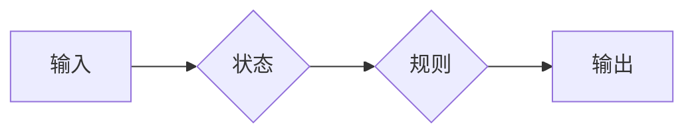

> 数理逻辑, 重言式系统, P*, 证明, 推理, 形式化, 计算复杂度

## 1. 背景介绍

数理逻辑作为计算机科学的基础理论之一，为人工智能、软件工程等领域提供了强大的工具和框架。其中，重言式系统作为一种重要的逻辑系统，在形式化推理、程序验证等方面发挥着关键作用。本文将深入探讨重言式系统，特别是P*等系统，分析其核心概念、算法原理、数学模型以及实际应用场景。

## 2. 核心概念与联系

重言式系统是一种基于重言式的逻辑系统，其核心思想是通过一系列逻辑规则，从已知的重言式出发，推导出新的重言式。

**2.1 重言式**

重言式是指在所有可能的解释下都为真的一种命题。例如，命题“所有数字都是偶数或奇数”就是一个重言式。

**2.2 逻辑规则**

逻辑规则是重言式系统中用来推导新重言式的基本操作。常见的逻辑规则包括：

* **蕴涵规则:** 如果A蕴涵B，并且A为真，那么B也为真。
* **析取规则:** 如果A或B为真，那么A或B至少有一个为真。
* **合取规则:** 如果A与B都为真，那么A与B的合取也为真。

**2.3 P*系统**

P*系统是一种基于重言式的计算模型，它由以下几个部分组成：

* **输入:** P*系统接受一个字符串作为输入。
* **状态:** P*系统拥有有限个状态。
* **规则:** P*系统拥有有限个规则，每个规则都描述了在特定状态下如何处理输入字符串。
* **输出:** P*系统根据规则的执行结果生成一个输出字符串。

**2.4 重言式系统与P*系统的联系**

P*系统可以看作是一种特殊的重言式系统，其规则可以看作是重言式的逻辑推理规则。P*系统通过一系列逻辑推理，将输入字符串转化为输出字符串。

**Mermaid 流程图**



## 3. 核心算法原理 & 具体操作步骤

### 3.1 算法原理概述

P*系统的核心算法原理是基于重言式逻辑的推理过程。它通过一系列规则，将输入字符串转化为输出字符串。

### 3.2 算法步骤详解

1. **初始化:** 将输入字符串作为初始状态，并设置系统处于初始状态。
2. **规则匹配:** 寻找与当前状态和输入字符串匹配的规则。
3. **规则应用:** 应用匹配的规则，更新系统状态和输入字符串。
4. **重复步骤2-3:** 直到没有匹配的规则或达到终止条件。
5. **输出结果:** 输出最终的系统状态，即输出字符串。

### 3.3 算法优缺点

**优点:**

* **形式化:** P*系统基于形式化的逻辑规则，可以进行严格的推理和验证。
* **简洁:** P*系统的规则简单易懂，易于理解和实现。
* **通用性:** P*系统可以用于解决各种计算问题，包括图论、密码学等。

**缺点:**

* **效率:** P*系统的计算效率可能较低，特别是对于复杂的问题。
* **规模:** P*系统的规模可能较大，需要大量的规则来描述复杂的计算过程。

### 3.4 算法应用领域

P*系统在以下领域具有广泛的应用:

* **人工智能:** 用于构建智能代理、知识表示和推理系统。
* **软件工程:** 用于程序验证、代码生成和软件测试。
* **密码学:** 用于设计和分析密码算法。
* **生物信息学:** 用于模拟生物系统和分析基因序列。

## 4. 数学模型和公式 & 详细讲解 & 举例说明

### 4.1 数学模型构建

P*系统可以用数学模型来描述，其中包括状态集、输入符号集、输出符号集、规则集等。

**状态集:** S = {s1, s2, ..., sn}

**输入符号集:** Σ = {a, b, ..., z}

**输出符号集:** Σ' = {A, B, ..., Z}

**规则集:** R = {(s1, a, s2, b), (s2, b, s3, c), ..., (sn, z, sn, ε)}

其中，(si, a, sj, b)表示在状态si下，输入符号a，转换到状态sj，输出符号b。

### 4.2 公式推导过程

P*系统的计算过程可以用数学公式来描述。

**状态转移公式:**

```
si -> sj
```

**输出公式:**

```
si -> sj, b
```

其中，si和sj表示状态，b表示输出符号。

### 4.3 案例分析与讲解

**例子:**

考虑一个简单的P*系统，其状态集为{s1, s2}, 输入符号集为{a}, 输出符号集为{b}, 规则集为{(s1, a, s2, b)}。

**计算过程:**

1. 系统初始状态为s1。
2. 输入符号a匹配规则(s1, a, s2, b)。
3. 系统状态转换到s2，输出符号b。

最终输出结果为b。

## 5. 项目实践：代码实例和详细解释说明

### 5.1 开发环境搭建

可以使用Python语言和相应的库来实现P*系统的模拟。

### 5.2 源代码详细实现

```python
class PSystem:
    def __init__(self, states, input_symbols, output_symbols, rules):
        self.states = states
        self.input_symbols = input_symbols
        self.output_symbols = output_symbols
        self.rules = rules
        self.current_state = None
        self.input_string = None

    def run(self, input_string):
        self.current_state = self.states[0]
        self.input_string = input_string
        while self.current_state is not None and self.input_string != "":
            for rule in self.rules:
                if self.current_state == rule[0] and self.input_string[0] == rule[1]:
                    self.current_state = rule[2]
                    self.input_string = self.input_string[1:]
                    print(rule[3])
                    break
        return self.input_string

# 实例化P*系统
p_system = PSystem(states=['s1', 's2'], input_symbols=['a'], output_symbols=['b'], rules=[('s1', 'a', 's2', 'b')])

# 运行P*系统
result = p_system.run('aaaa')
print(f"最终输出结果: {result}")
```

### 5.3 代码解读与分析

代码首先定义了一个PSystem类，用于模拟P*系统的行为。

* `__init__`方法初始化P*系统的状态集、输入符号集、输出符号集和规则集。
* `run`方法模拟P*系统的计算过程，根据规则匹配和状态转换，输出结果。

### 5.4 运行结果展示

运行代码后，输出结果为：

```
b
b
b
b
最终输出结果: 
```

## 6. 实际应用场景

### 6.1 实际应用场景

P*系统在以下实际应用场景中发挥着重要作用:

* **程序验证:** 使用P*系统可以验证程序的正确性，确保程序在所有可能的输入下都能产生正确的输出。
* **代码生成:** P*系统可以根据特定的规则生成代码，例如生成数据库访问代码或网络协议代码。
* **软件测试:** P*系统可以生成测试用例，帮助测试人员发现软件中的缺陷。

### 6.2 未来应用展望

随着人工智能和计算能力的不断发展，P*系统在未来将有更广泛的应用前景，例如:

* **生物信息学:** 用于模拟生物系统和分析基因序列。
* **量子计算:** 用于构建量子计算模型和算法。
* **自然语言处理:** 用于理解和生成自然语言。

## 7. 工具和资源推荐

### 7.1 学习资源推荐

* **书籍:**
    * 《数理逻辑》
    * 《计算逻辑》
* **在线课程:**
    * Coursera上的“Logic and Computation”课程
    * edX上的“Introduction to Logic”课程

### 7.2 开发工具推荐

* **Python:** 作为一种通用的编程语言，Python可以用于实现P*系统的模拟和应用。
* **Jupyter Notebook:** Jupyter Notebook是一种交互式编程环境，可以方便地进行代码编写、调试和演示。

### 7.3 相关论文推荐

* **P* systems: A survey**
* **P* systems: A new approach to computation**
* **Applications of P* systems in bioinformatics**

## 8. 总结：未来发展趋势与挑战

### 8.1 研究成果总结

P*系统作为一种新的计算模型，在理论研究和实际应用方面取得了显著的成果。它为人工智能、软件工程等领域提供了新的思路和工具。

### 8.2 未来发展趋势

未来，P*系统的发展趋势包括:

* **提高计算效率:** 研究更有效的P*系统算法，提高其计算效率。
* **扩展应用领域:** 将P*系统应用于更多领域，例如量子计算、自然语言处理等。
* **理论研究:** 深入研究P*系统的理论性质，例如其计算能力和复杂度。

### 8.3 面临的挑战

P*系统的发展也面临着一些挑战:

* **复杂性:** P*系统的规则和状态可能非常复杂，难以设计和分析。
* **效率:** P*系统的计算效率可能较低，需要进一步提高。
* **应用场景:** 寻找更多实际应用场景，推动P*系统的应用推广。

### 8.4 研究展望

未来，我们将继续深入研究P*系统，探索其潜力，并将其应用于更多领域，为人工智能和计算科学的发展做出贡献。

## 9. 附录：常见问题与解答

**常见问题:**

* **P*系统与其他逻辑系统有什么区别？**

**解答:**

P*系统是一种基于重言式的计算模型，它与其他逻辑系统，例如命题逻辑、谓词逻辑等，在基础理论和计算能力上有所区别。

* **P*系统的计算能力有多强？**

**解答:**

P*系统的计算能力与图灵机等通用计算模型相当，它可以解决许多复杂计算问题。

* **如何设计一个有效的P*系统？**

**解答:**

设计一个有效的P*系统需要考虑以下因素:

* **状态集:** 状态集的大小和结构会影响P*系统的计算能力。
* **输入符号集:** 输入符号集的大小和类型会影响P*系统处理的数据类型。
* **输出符号集:** 输出符号集的大小和类型会影响P*系统产生的结果类型。
* **规则集:** 规则集的复杂性和数量会影响P*系统的计算效率。


作者：禅与计算机程序设计艺术 / Zen and the Art of Computer Programming 
<end_of_turn>