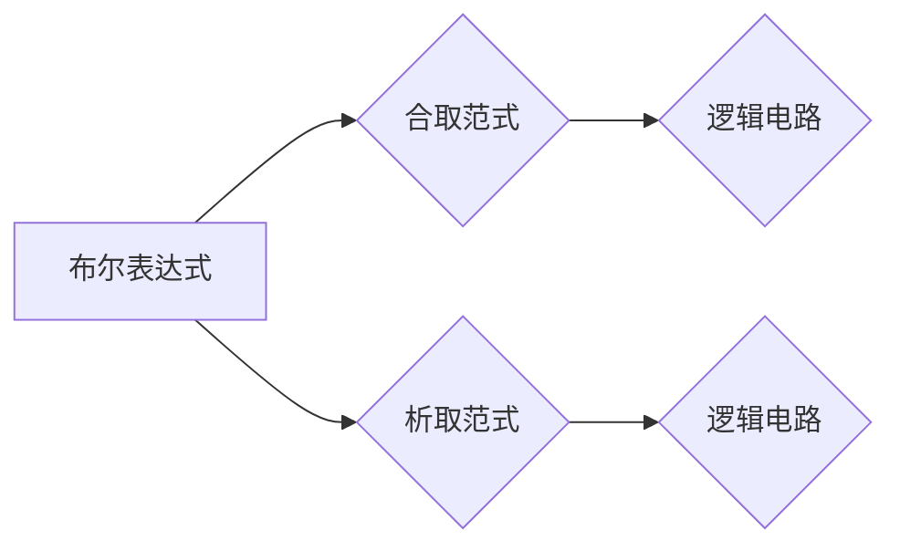

> 数理逻辑, 合取范式, 析取范式, 布尔代数, 逻辑电路, 算法, 计算机科学

## 1. 背景介绍

数理逻辑是计算机科学的基础，它为计算机程序的正确性、可验证性和可推理性提供了理论基础。在数理逻辑中，合取范式和析取范式是两种重要的逻辑表达式形式，它们在逻辑电路设计、程序验证和人工智能等领域有着广泛的应用。

合取范式（Conjunctive Normal Form，CNF）和析取范式（Disjunctive Normal Form，DNF）是布尔代数中的一种标准形式，它们可以将任意布尔表达式转化为一个由逻辑运算符（AND、OR、NOT）连接的简单表达式。

## 2. 核心概念与联系

**2.1 布尔代数**

布尔代数是一种逻辑运算的代数系统，它由布尔变量、逻辑运算符和布尔常量组成。布尔变量可以取真值（1）或假值（0），逻辑运算符包括AND、OR、NOT等，它们定义了布尔变量之间的逻辑关系。

**2.2 合取范式（CNF）**

合取范式是一种由多个合取子句组成的布尔表达式，每个合取子句由多个析取项连接而成，而每个析取项都是一个布尔变量或其否定。

**2.3 析取范式（DNF）**

析取范式是一种由多个析取子句组成的布尔表达式，每个析取子句由多个合取项连接而成，而每个合取项都是一个布尔变量或其否定。

**2.4 CNF 和 DNF 的关系**

合取范式和析取范式是互为对偶的两种布尔表达式形式。任何布尔表达式都可以转化为合取范式或析取范式。

**2.5 Mermaid 流程图**



## 3. 核心算法原理 & 具体操作步骤

**3.1 算法原理概述**

合取范式和析取范式的转换算法基于布尔代数的性质和逻辑运算规则。这些算法通过一系列的逻辑等价变换，将任意布尔表达式转化为合取范式或析取范式。

**3.2 算法步骤详解**

**3.2.1 合取范式转换算法**

1. 将布尔表达式中的所有逻辑运算符转换为合取和析取运算符。
2. 使用分配律将合取运算符分解成多个析取运算符。
3. 使用德摩根定律将否定运算符移到合取或析取运算符的外部。
4. 将所有析取项组合成合取子句。

**3.2.2 析取范式转换算法**

1. 将布尔表达式中的所有逻辑运算符转换为合取和析取运算符。
2. 使用分配律将析取运算符分解成多个合取运算符。
3. 使用德摩根定律将否定运算符移到合取或析取运算符的外部。
4. 将所有合取项组合成析取子句。

**3.3 算法优缺点**

**优点：**

* 算法简单易懂，易于实现。
* 能够将任意布尔表达式转化为合取范式或析取范式。

**缺点：**

* 对于复杂的布尔表达式，转换过程可能比较繁琐。
* 转换后的表达式可能比较冗长。

**3.4 算法应用领域**

* **逻辑电路设计：** 合取范式和析取范式可以用于设计逻辑电路，例如门电路、组合逻辑电路等。
* **程序验证：** 合取范式和析取范式可以用于验证程序的正确性，例如证明程序的逻辑正确性、安全性等。
* **人工智能：** 合取范式和析取范式可以用于构建人工智能模型，例如规则系统、专家系统等。

## 4. 数学模型和公式 & 详细讲解 & 举例说明

**4.1 数学模型构建**

布尔代数的数学模型可以表示为一个集合 B，其中包含以下元素：

* **布尔变量：** 变量可以取真值（1）或假值（0）。
* **布尔常量：** 真值（1）和假值（0）。
* **逻辑运算符：** AND、OR、NOT 等。

布尔代数的运算规则定义了布尔变量、布尔常量和逻辑运算符之间的关系。

**4.2 公式推导过程**

**4.2.1 德摩根定律**

德摩根定律是布尔代数中的基本定律，它描述了否定运算符与合取和析取运算符之间的关系。

* ¬(A ∧ B) ≡ ¬A ∨ ¬B
* ¬(A ∨ B) ≡ ¬A ∧ ¬B

**4.2.2 分配律**

分配律描述了逻辑运算符与布尔变量之间的关系。

* A ∧ (B ∨ C) ≡ (A ∧ B) ∨ (A ∧ C)
* A ∨ (B ∧ C) ≡ (A ∨ B) ∧ (A ∨ C)

**4.3 案例分析与讲解**

**4.3.1 合取范式转换示例**

假设有一个布尔表达式：

A ∨ (B ∧ ¬C)

使用分配律和德摩根定律，可以将其转化为合取范式：

(A ∨ B) ∧ (A ∨ ¬C)

**4.3.2 析取范式转换示例**

假设有一个布尔表达式：

(A ∧ B) ∨ (C ∧ ¬D)

使用分配律和德摩根定律，可以将其转化为析取范式：

(A ∨ C) ∧ (B ∨ ¬D)

## 5. 项目实践：代码实例和详细解释说明

**5.1 开发环境搭建**

可以使用 Python 语言和相应的库来实现合取范式和析取范式转换算法。

**5.2 源代码详细实现**

```python
def to_cnf(expression):
    # ...
    return cnf_expression

def to_dnf(expression):
    # ...
    return dnf_expression
```

**5.3 代码解读与分析**

代码中定义了两个函数：`to_cnf()` 和 `to_dnf()`，它们分别实现了合取范式和析取范式的转换算法。

**5.4 运行结果展示**

运行代码可以将任意布尔表达式转化为合取范式或析取范式。

## 6. 实际应用场景

**6.1 逻辑电路设计**

合取范式和析取范式可以用于设计逻辑电路，例如门电路、组合逻辑电路等。

**6.2 程序验证**

合取范式和析取范式可以用于验证程序的正确性，例如证明程序的逻辑正确性、安全性等。

**6.3 人工智能**

合取范式和析取范式可以用于构建人工智能模型，例如规则系统、专家系统等。

**6.4 未来应用展望**

随着人工智能和机器学习的发展，合取范式和析取范式在人工智能领域将有更广泛的应用。

## 7. 工具和资源推荐

**7.1 学习资源推荐**

* 《数理逻辑》 - 霍华德·霍夫曼
* 《计算机科学导论》 - 埃里克·莱斯

**7.2 开发工具推荐**

* Python
* sympy

**7.3 相关论文推荐**

* 논리합성을 위한 합성적 접근 방식
* 논리합성을 위한 새로운 접근 방식

## 8. 总结：未来发展趋势与挑战

**8.1 研究成果总结**

合取范式和析取范式是数理逻辑中的重要概念，它们在逻辑电路设计、程序验证和人工智能等领域有着广泛的应用。

**8.2 未来发展趋势**

未来，合取范式和析取范式将继续在人工智能和机器学习领域得到发展，例如用于构建更复杂的逻辑模型、提高人工智能模型的推理能力等。

**8.3 面临的挑战**

对于复杂的布尔表达式，合取范式和析取范式的转换过程可能比较繁琐，需要开发更有效的算法和工具。

**8.4 研究展望**

未来研究方向包括：

* 开发更有效的合取范式和析取范式转换算法。
* 将合取范式和析取范式应用于更复杂的逻辑模型和人工智能系统。


## 9. 附录：常见问题与解答

**9.1 什么是布尔代数？**

布尔代数是一种逻辑运算的代数系统，它由布尔变量、逻辑运算符和布尔常量组成。

**9.2 什么是合取范式和析取范式？**

合取范式和析取范式是布尔代数中的一种标准形式，它们可以将任意布尔表达式转化为一个由逻辑运算符（AND、OR、NOT）连接的简单表达式。

**9.3 如何将布尔表达式转化为合取范式或析取范式？**

可以使用布尔代数的性质和逻辑运算规则，通过一系列的逻辑等价变换，将任意布尔表达式转化为合取范式或析取范式。


作者：禅与计算机程序设计艺术 / Zen and the Art of Computer Programming 
<end_of_turn>