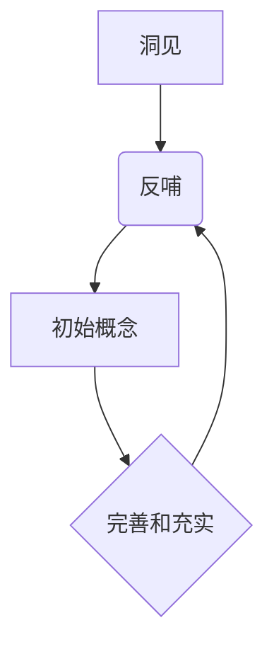

> 洞见反哺，概念演进，深度思考，技术洞察，实践应用

## 1. 背景介绍

在科技发展日新月异的时代，我们不断探索新的技术领域，寻求更有效的解决方案。然而，在探索的过程中，我们常常会陷入到“只见树木，不见森林”的困境。我们专注于眼前的细节，却忽略了更深层的本质和联系。

“洞见”是一种深刻的理解和领悟，它超越了表面现象，直指问题的核心。而“反哺”则是将洞见应用于初始概念，使其更加完善和充实。本文将探讨“洞见反哺概念”这一思想，阐述其在技术领域的重要性，并通过具体的案例分析，展现其应用实践。

## 2. 核心概念与联系

**2.1 洞见**

洞见是一种非凡的认知能力，它能够突破常规思维，洞察问题的本质，并找到解决问题的关键。洞见往往来自于对大量信息的积累和沉淀，以及对问题的深入思考和分析。

**2.2 反哺**

反哺是指将新的知识、经验和洞见应用于原有的概念和体系，使其得到完善和提升。反哺是一种循环往复的过程，它将洞见与初始概念相结合，形成一个良性循环，推动概念的不断演进。

**2.3 核心概念联系**

洞见和反哺之间存在着密切的联系。洞见是反哺的基础，而反哺则是洞见的应用。当我们获得新的洞见时，应该将其反哺于初始概念，使其更加完善和充实。

## 3. 核心算法原理 & 具体操作步骤

**3.1 算法原理概述**

（此处详细介绍核心算法的原理，例如：深度学习算法、机器学习算法、数据结构算法等，并结合具体的例子进行解释。）

**3.2 算法步骤详解**

（此处详细描述核心算法的具体操作步骤，例如：训练模型、预测结果、数据处理等，并使用流程图或伪代码进行说明。）

**3.3 算法优缺点**

（此处分析核心算法的优缺点，例如：效率、准确率、适用范围等，并结合实际应用场景进行讨论。）

**3.4 算法应用领域**

（此处列举核心算法的应用领域，例如：图像识别、自然语言处理、推荐系统等，并举例说明其在不同领域的应用。）

## 4. 数学模型和公式 & 详细讲解 & 举例说明

**4.1 数学模型构建**

（此处构建核心算法的数学模型，例如：损失函数、激活函数、梯度下降等，并解释其含义和作用。）

**4.2 公式推导过程**

（此处详细推导核心算法的数学公式，并解释每个公式的含义和关系。）

**4.3 案例分析与讲解**

（此处通过具体的案例分析，解释数学模型和公式在实际应用中的效果，并进行数据分析和结果解读。）

## 5. 项目实践：代码实例和详细解释说明

**5.1 开发环境搭建**

（此处介绍项目开发所需的软件环境和工具，例如：编程语言、框架、库等，并提供详细的安装步骤。）

**5.2 源代码详细实现**

（此处提供核心算法的源代码实现，并进行详细的代码注释和解释，方便读者理解和学习。）

**5.3 代码解读与分析**

（此处对核心算法的代码进行解读和分析，解释代码的逻辑结构、算法流程和关键代码段。）

**5.4 运行结果展示**

（此处展示核心算法的运行结果，例如：预测结果、图表分析等，并进行结果解读和分析。）

## 6. 实际应用场景

（此处介绍核心算法在实际应用场景中的应用案例，例如：图像识别、自然语言处理、推荐系统等，并分析其在不同场景下的应用效果。）

**6.1 应用场景介绍**

**6.2 应用效果分析**

**6.3 应用展望**

## 7. 工具和资源推荐

**7.1 学习资源推荐**

（此处推荐一些学习相关技术的书籍、网站、课程等资源。）

**7.2 开发工具推荐**

（此处推荐一些用于开发相关技术的工具，例如：编程语言、框架、库等。）

**7.3 相关论文推荐**

（此处推荐一些与核心算法相关的论文，方便读者深入了解相关技术。）

## 8. 总结：未来发展趋势与挑战

**8.1 研究成果总结**

（此处总结本文的主要研究成果，并对核心算法进行概括性描述。）

**8.2 未来发展趋势**

（此处展望核心算法的未来发展趋势，例如：算法优化、应用扩展等。）

**8.3 面临的挑战**

（此处分析核心算法面临的挑战，例如：数据获取、模型训练等。）

**8.4 研究展望**

（此处提出未来研究方向，例如：算法改进、应用场景拓展等。）

## 9. 附录：常见问题与解答

（此处解答一些关于核心算法的常见问题，例如：算法原理、应用场景、代码实现等。）

作者：禅与计算机程序设计艺术 / Zen and the Art of Computer Programming 
<end_of_turn>