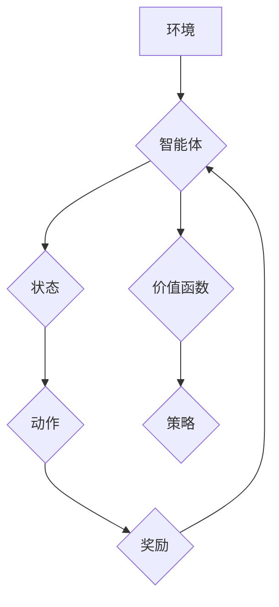

> 深度学习，强化学习，Q-learning，神经网络，价值函数，策略梯度，深度强化学习

## 1. 背景介绍

强化学习 (Reinforcement Learning, RL) 作为机器学习的一个重要分支，旨在训练智能体在与环境交互的过程中学习最优策略，以最大化累积奖励。传统的 Q-learning 算法在解决离散状态和动作空间的问题上表现出色，但当面对复杂环境和高维连续动作空间时，其性能会受到限制。

深度学习 (Deep Learning) 的兴起为强化学习带来了新的机遇。深度神经网络 (DNN) 能够学习复杂非线性映射关系，从而有效地处理高维数据和连续动作空间。将深度学习与强化学习相结合，即深度强化学习 (Deep Reinforcement Learning, DRL)，成为了近年来研究的热点领域。

## 2. 核心概念与联系

**2.1 强化学习基本概念**

强化学习的核心在于智能体与环境的交互过程。智能体通过与环境交互，获得奖励或惩罚，并根据这些反馈调整其行为策略，以最大化累积奖励。

* **智能体 (Agent):**  学习和决策的实体。
* **环境 (Environment):** 智能体所处的外部世界。
* **状态 (State):** 环境的当前描述。
* **动作 (Action):** 智能体在特定状态下可以执行的操作。
* **奖励 (Reward):** 环境对智能体动作的反馈，可以是正向奖励或负向惩罚。
* **策略 (Policy):** 智能体在不同状态下选择动作的规则。

**2.2 Q-learning 算法原理**

Q-learning 是一种基于价值函数的强化学习算法。其核心思想是学习一个 Q-表，其中 Q(s, a) 表示在状态 s 下执行动作 a 的期望累积奖励。

**2.3 深度学习与强化学习的结合**

深度学习可以用于学习复杂的价值函数和策略。将深度神经网络应用于 Q-learning 算法，即深度 Q-learning，可以有效地处理高维数据和连续动作空间。

**2.4 深度 Q-learning 架构**

深度 Q-learning 的典型架构包括：

* **深度神经网络 (DNN):** 用于估计价值函数 Q(s, a)。
* **经验回放 (Experience Replay):** 从历史经验中随机采样数据，用于训练 DNN。
* **目标网络 (Target Network):** 用于稳定训练过程，避免过拟合。

**Mermaid 流程图**



## 3. 核心算法原理 & 具体操作步骤

### 3.1 算法原理概述

深度 Q-learning 算法的核心是学习一个深度神经网络，该网络能够估计在给定状态下执行特定动作的期望累积奖励。

算法的基本步骤如下：

1. 初始化深度神经网络参数。
2. 从环境中收集经验数据 (状态、动作、奖励、下一个状态)。
3. 将经验数据存储在经验回放缓冲区中。
4. 从经验回放缓冲区中随机采样数据，并使用采样数据更新深度神经网络参数。
5. 重复步骤 3 和 4，直到网络收敛。

### 3.2 算法步骤详解

1. **初始化:**

   * 初始化深度神经网络参数。
   * 初始化经验回放缓冲区。

2. **环境交互:**

   * 智能体从环境中获取当前状态。
   * 根据当前策略选择动作。
   * 执行动作，并获得奖励和下一个状态。

3. **经验存储:**

   * 将 (状态, 动作, 奖励, 下一个状态) 存储到经验回放缓冲区中。

4. **经验回放:**

   * 从经验回放缓冲区中随机采样多个经验数据。

5. **目标网络更新:**

   * 使用目标网络计算目标 Q 值。

6. **深度神经网络更新:**

   * 使用梯度下降算法更新深度神经网络参数，以最小化预测 Q 值与目标 Q 值之间的误差。

7. **策略更新:**

   * 根据更新后的深度神经网络，更新策略。

8. **重复步骤 2-7:**

   * 重复上述步骤，直到网络收敛或达到预设的训练时间。

### 3.3 算法优缺点

**优点:**

* 可以处理高维数据和连续动作空间。
* 学习能力强，能够学习复杂的策略。
* 具有较好的泛化能力。

**缺点:**

* 训练过程复杂，需要大量的计算资源。
* 容易陷入局部最优解。
* 训练不稳定，需要精心调参。

### 3.4 算法应用领域

深度 Q-learning 算法在许多领域都有广泛的应用，例如：

* **游戏 AI:** 训练游戏 AI 玩家，例如 AlphaGo、AlphaStar。
* **机器人控制:** 控制机器人执行复杂任务，例如导航、抓取。
* **推荐系统:** 建议用户感兴趣的内容，例如电影、音乐、商品。
* **金融交易:** 自动化交易策略，例如股票投资、期货交易。

## 4. 数学模型和公式 & 详细讲解 & 举例说明

### 4.1 数学模型构建

深度 Q-learning 的核心是学习一个 Q 函数，该函数估计在给定状态 s 和动作 a 下的期望累积奖励。

**Q(s, a)** = E[R_t+1 + γ * max_a' Q(s', a') | s_t = s, a_t = a]

其中：

* **R_t+1:** 下一个时间步的奖励。
* **γ:** 折扣因子，控制未来奖励的权重。
* **s':** 下一个状态。
* **a':** 下一个动作。

### 4.2 公式推导过程

深度 Q-learning 算法使用梯度下降算法更新 Q 函数的参数。目标函数是 Q 函数预测值与目标 Q 值之间的误差。

**Loss = (Q(s, a) - Q_target)^2**

其中：

* **Q_target:** 目标 Q 值，由目标网络计算。

### 4.3 案例分析与讲解

假设一个智能体在玩一个简单的游戏，游戏环境有两种状态 (s1, s2) 和两种动作 (a1, a2)。

* 在状态 s1 执行动作 a1 的奖励为 1，执行动作 a2 的奖励为 -1。
* 在状态 s2 执行动作 a1 的奖励为 -1，执行动作 a2 的奖励为 1。

使用深度 Q-learning 算法，智能体可以学习到以下 Q 函数：

* Q(s1, a1) = 1
* Q(s1, a2) = -1
* Q(s2, a1) = -1
* Q(s2, a2) = 1

通过学习这些 Q 值，智能体可以做出最优策略，即在状态 s1 时执行动作 a1，在状态 s2 时执行动作 a2。

## 5. 项目实践：代码实例和详细解释说明

### 5.1 开发环境搭建

* Python 3.x
* TensorFlow 或 PyTorch
* OpenAI Gym

### 5.2 源代码详细实现

```python
import tensorflow as tf
import numpy as np
from tensorflow.keras.models import Sequential
from tensorflow.keras.layers import Dense

# 定义深度神经网络模型
model = Sequential()
model.add(Dense(64, activation='relu', input_shape=(4,)))
model.add(Dense(64, activation='relu'))
model.add(Dense(2))

# 定义损失函数和优化器
optimizer = tf.keras.optimizers.Adam(learning_rate=0.001)
loss_fn = tf.keras.losses.MeanSquaredError()

# 定义经验回放缓冲区
replay_buffer = []

# 训练循环
for episode in range(num_episodes):
    state = env.reset()
    done = False
    total_reward = 0

    while not done:
        # 选择动作
        action = np.argmax(model.predict(state.reshape(1, -1)))

        # 执行动作
        next_state, reward, done, _ = env.step(action)

        # 存储经验
        replay_buffer.append((state, action, reward, next_state, done))

        # 更新状态
        state = next_state

        # 更新总奖励
        total_reward += reward

    # 从经验回放缓冲区中采样数据
    batch_size = 32
    batch = random.sample(replay_buffer, batch_size)

    # 计算目标 Q 值
    target_q_values = np.array([
        max(model.predict(next_state.reshape(1, -1)))
        for next_state, _, _, _, _ in batch
    ])

    # 更新模型参数
    with tf.GradientTape() as tape:
        q_values = model.predict(np.array([state.reshape(1, -1) for state, _, _, _, _ in batch]))
        loss = loss_fn(q_values, target_q_values)

    gradients = tape.gradient(loss, model.trainable_variables)
    optimizer.apply_gradients(zip(gradients, model.trainable_variables))

# 保存模型
model.save('deep_q_learning_model.h5')
```

### 5.3 代码解读与分析

* 代码首先定义了深度神经网络模型，该模型包含两层全连接层。
* 然后定义了损失函数和优化器，用于训练模型。
* 经验回放缓冲区用于存储训练数据。
* 训练循环中，智能体与环境交互，收集经验数据并存储到缓冲区中。
* 从缓冲区中随机采样数据，计算目标 Q 值，并使用梯度下降算法更新模型参数。
* 最后，保存训练好的模型。

### 5.4 运行结果展示

运行代码后，智能体将在环境中学习并逐渐提高其性能。

## 6. 实际应用场景

### 6.1 游戏 AI

深度 Q-learning 算法在游戏 AI 领域取得了显著的成果，例如 AlphaGo 和 AlphaStar。

* AlphaGo 使用深度 Q-learning 算法学习围棋策略，并战胜了世界冠军。
* AlphaStar 使用深度 Q-learning 算法学习星际争霸 II 策略，并战胜了职业玩家。

### 6.2 机器人控制

深度 Q-learning 算法可以用于控制机器人执行复杂任务，例如导航、抓取和组装。

* 深度 Q-learning 算法可以帮助机器人学习在复杂环境中导航，避开障碍物并到达目标位置。
* 深度 Q-learning 算法可以帮助机器人学习抓取和放置物体，例如在工业生产线中。

### 6.3 推荐系统

深度 Q-learning 算法可以用于构建推荐系统，例如推荐电影、音乐和商品。

* 深度 Q-learning 算法可以帮助推荐系统学习用户偏好，并推荐用户感兴趣的内容。

### 6.4 未来应用展望

深度 Q-learning 算法在未来将有更广泛的应用，例如：

* 自动驾驶
* 医疗诊断
* 金融交易

## 7. 工具和资源推荐

### 7.1 学习资源推荐

* **书籍:**
    * Reinforcement Learning: An Introduction by Richard S. Sutton and Andrew G. Barto
    * Deep Reinforcement Learning Hands-On by Maxim Lapan
* **在线课程:**
    * Deep Reinforcement Learning Specialization by DeepLearning.AI
    * Reinforcement Learning by David Silver (University of DeepMind)

### 7.2 开发工具推荐

* **TensorFlow:** https://www.tensorflow.org/
* **PyTorch:** https://pytorch.org/
* **OpenAI Gym:** https://gym.openai.com/