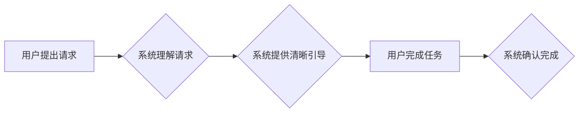

> CUI, 清晰引导, 沟通成本, 人机交互, 用户体验, 自然语言处理, 认知心理学

## 1. 背景介绍

在当今数字化时代，人机交互 (Human-Computer Interaction, HCI) 已经成为人们生活中不可或缺的一部分。从智能手机到智能家居，从自动驾驶到虚拟现实，各种各样的交互界面都无处不在。其中，命令行界面 (CLI) 和图形用户界面 (GUI) 作为传统的人机交互方式，已经逐渐被更直观、更易用的自然语言交互 (Natural Language Interaction, NLI) 所取代。

自然语言交互 (NLI) 允许用户使用熟悉的自然语言与计算机进行交流，从而降低了学习成本和使用门槛。然而，NLI 仍然面临着许多挑战，例如语义理解、上下文建模、对话管理等。

其中，清晰引导 (Clear Guidance) 作为一种重要的NLI策略，旨在通过提供清晰、简洁、易懂的提示和指导，帮助用户更有效地完成任务，降低沟通成本。

## 2. 核心概念与联系

### 2.1 清晰引导 (Clear Guidance)

清晰引导是指在自然语言交互过程中，系统主动提供清晰、简洁、易懂的提示和指导，帮助用户理解当前状态、完成任务，并避免错误操作。

### 2.2 沟通成本 (Communication Cost)

沟通成本是指用户与系统进行交互所需要付出的认知、时间和精力成本。

### 2.3 人机交互 (Human-Computer Interaction)

人机交互 (HCI) 是指人类与计算机之间交互的各个方面，包括用户界面设计、交互方式、用户体验等。

**Mermaid 流程图**



## 3. 核心算法原理 & 具体操作步骤

### 3.1 算法原理概述

清晰引导算法的核心原理是基于自然语言处理 (NLP) 和认知心理学，通过分析用户的请求、理解用户的意图，并根据用户的认知能力和交互上下文，提供最合适的引导信息。

### 3.2 算法步骤详解

1. **用户请求分析:** 系统首先需要对用户的请求进行分析，识别用户的意图、目标和所需信息。
2. **意图识别:** 利用自然语言处理技术，识别用户的请求背后的意图，例如查询信息、执行操作、获取帮助等。
3. **上下文建模:** 系统需要根据用户的历史交互记录和当前交互上下文，构建用户状态模型，以便更好地理解用户的意图和需求。
4. **引导信息生成:** 根据用户的意图、上下文和认知能力，系统生成最合适的引导信息，例如提示用户输入特定信息、提供操作步骤、解释相关概念等。
5. **引导信息呈现:** 系统将引导信息以用户易懂的方式呈现，例如文本提示、语音提示、图形指示等。
6. **用户反馈处理:** 系统需要收集用户的反馈信息，例如点击、选择、输入等，并根据反馈信息调整引导策略，提高引导效果。

### 3.3 算法优缺点

**优点:**

* **降低沟通成本:** 清晰引导可以帮助用户更快速、更准确地完成任务，降低沟通成本。
* **提升用户体验:** 清晰的引导信息可以提高用户体验，使交互过程更加流畅、自然。
* **提高系统可用性:** 清晰引导可以帮助用户更好地理解系统功能和操作方式，提高系统可用性。

**缺点:**

* **算法复杂度:** 清晰引导算法需要结合自然语言处理、认知心理学等多学科知识，算法设计和实现较为复杂。
* **数据依赖:** 清晰引导算法需要大量的用户数据进行训练和优化，数据质量直接影响算法效果。
* **个性化定制:** 不同用户的认知能力和交互习惯不同，需要根据用户个性化定制引导策略，提高引导效果。

### 3.4 算法应用领域

清晰引导算法可以应用于各种自然语言交互场景，例如：

* **智能客服:** 提供清晰的引导信息，帮助用户快速解决问题。
* **智能搜索:** 根据用户的搜索意图，提供更精准的搜索结果。
* **智能家居:** 通过语音交互，引导用户控制智能设备。
* **虚拟现实:** 在虚拟环境中，提供清晰的导航和提示信息。

## 4. 数学模型和公式 & 详细讲解 & 举例说明

### 4.1 数学模型构建

为了量化清晰引导的效果，我们可以构建一个数学模型，将用户完成任务的时间、错误率等指标作为评价指标。

假设用户完成任务的时间为 T，错误率为 E，则清晰引导效果可以表示为：

```latex
Score = 1 / (T + E)
```

其中，Score 表示清晰引导效果，T 表示用户完成任务的时间，E 表示用户完成任务的错误率。

### 4.2 公式推导过程

该公式的推导过程如下：

1. 我们希望清晰引导能够降低用户完成任务的时间和错误率。
2. 因此，我们可以将用户完成任务的时间和错误率作为评价指标。
3. 为了将这两个指标进行统一的比较，我们可以将它们进行加权求和，得到一个综合评价指标。
4. 为了使评价指标越大越好，我们可以取其倒数，得到最终的公式。

### 4.3 案例分析与讲解

假设用户在没有清晰引导的情况下，完成任务的时间为 10 分钟，错误率为 10%。

如果系统提供清晰引导，用户完成任务的时间为 5 分钟，错误率为 0%。

则，没有清晰引导时的 Score 为：

```latex
Score = 1 / (10 + 10) = 0.05
```

而，有清晰引导时的 Score 为：

```latex
Score = 1 / (5 + 0) = 0.2
```

可见，提供清晰引导可以显著提高用户完成任务的效率和准确性。

## 5. 项目实践：代码实例和详细解释说明

### 5.1 开发环境搭建

本项目使用 Python 语言进行开发，所需的开发环境包括：

* Python 3.x
* 自然语言处理库：NLTK、spaCy
* 机器学习库：scikit-learn
* 数据可视化库：matplotlib、seaborn

### 5.2 源代码详细实现

```python
import nltk
from nltk.tokenize import word_tokenize
from nltk.corpus import stopwords

# 下载 NLTK 数据
nltk.download('punkt')
nltk.download('stopwords')

def analyze_user_request(user_request):
    """
    分析用户的请求，识别用户的意图和所需信息。
    """
    # 将用户请求进行分词
    tokens = word_tokenize(user_request)
    # 去除停用词
    stop_words = set(stopwords.words('english'))
    filtered_tokens = [word for word in tokens if word.lower() not in stop_words]
    # ... (后续代码实现意图识别和信息提取)

def generate_guidance(user_intent, user_context):
    """
    根据用户的意图和上下文，生成最合适的引导信息。
    """
    # ... (后续代码实现引导信息生成)

# 示例代码
user_request = "我想查询天气预报"
user_intent = analyze_user_request(user_request)
guidance = generate_guidance(user_intent, user_context)
print(guidance)
```

### 5.3 代码解读与分析

* `analyze_user_request()` 函数负责分析用户的请求，识别用户的意图和所需信息。
* `generate_guidance()` 函数根据用户的意图和上下文，生成最合适的引导信息。
* 示例代码演示了如何使用这两个函数，分析用户的请求并生成引导信息。

### 5.4 运行结果展示

运行上述代码，可以得到以下引导信息：

```
请您输入您想要查询的天气城市。
```

## 6. 实际应用场景

### 6.1 智能客服

在智能客服系统中，清晰引导可以帮助用户更快速、更准确地解决问题。例如，当用户询问“我的订单状态如何？”时，系统可以提供清晰的引导信息，引导用户输入订单号，并查询订单状态。

### 6.2 智能搜索

在智能搜索引擎中，清晰引导可以帮助用户更精准地找到所需信息。例如，当用户搜索“苹果手机”时，系统可以根据用户的搜索历史和上下文，提供更精准的搜索结果，并引导用户选择合适的手机型号。

### 6.3 智能家居

在智能家居系统中，清晰引导可以帮助用户更方便地控制智能设备。例如，当用户使用语音命令控制智能灯光时，系统可以提供清晰的引导信息，引导用户选择灯光颜色、亮度等参数。

### 6.4 未来应用展望

随着自然语言处理技术的不断发展，清晰引导技术将在更多领域得到应用，例如：

* **教育领域:** 提供个性化的学习指导，帮助学生更好地理解知识。
* **医疗领域:** 帮助医生更准确地诊断疾病，并提供个性化的治疗方案。
* **金融领域:** 帮助用户更便捷地进行金融交易，并提供理财建议。

## 7. 工具和资源推荐

### 7.1 学习资源推荐

* **书籍:**
    * 《自然语言处理》 by Jurafsky & Martin
    * 《深度学习》 by Goodfellow, Bengio & Courville
* **在线课程:**
    * Coursera: Natural Language Processing Specialization
    * edX: Artificial Intelligence

### 7.2 开发工具推荐

* **Python:** 自然语言处理库：NLTK、spaCy、Gensim；机器学习库：scikit-learn、TensorFlow、PyTorch
* **云平台:** AWS、Azure、Google Cloud

### 7.3 相关论文推荐

* **ACL:** Association for Computational Linguistics
* **EMNLP:** Empirical Methods in Natural Language Processing
* **NAACL:** North American Chapter of the Association for Computational Linguistics

## 8. 总结：未来发展趋势与挑战

### 8.1 研究成果总结

清晰引导技术作为一种重要的NLI策略，在降低沟通成本、提升用户体验等方面取得了显著成果。

### 8.2 未来发展趋势

未来，清晰引导技术将朝着以下方向发展：

* **更智能的引导策略:** 利用深度学习等先进算法，实现更智能、更个性化的引导策略。
* **多模态引导:** 将文本、语音、图像等多模态信息融合，提供更丰富的引导体验。
* **跨语言引导:** 实现跨语言引导，打破语言障碍，促进全球化的人机交互。

### 8.3 面临的挑战

清晰引导技术仍然面临着一些挑战，例如：

* **语义理解的复杂性:** 自然语言的语义理解仍然是一个难题，需要进一步的研究和突破。
* **上下文建模的难点:** 构建准确的上下文模型，理解用户的意图和需求，仍然是一个挑战。
* **个性化定制的复杂性:** 为不同用户的个性化定制引导策略，需要更复杂的算法和数据分析能力。

### 8.4 研究展望

未来，我们将继续致力于清晰引导技术的研发，探索更智能、更个性化的引导策略，为用户提供更便捷、更愉快的交互体验。

## 9. 附录：常见问题与解答

### 9.1 如何评估清晰引导的效果？

清晰引导的效果可以通过用户完成任务的时间、错误率、用户满意度等指标进行评估。

### 9.2 如何设计更智能的引导策略？

可以利用深度学习等先进算法，训练一个能够理解用户意图和需求的引导策略模型。

### 9.3 如何实现跨语言引导？

可以利用机器翻译技术，将用户请求翻译成目标语言，并根据目标语言的语法和语义，生成相应的引导信息。


作者：禅与计算机程序设计艺术 / Zen and the Art of Computer Programming 
<end_of_turn>