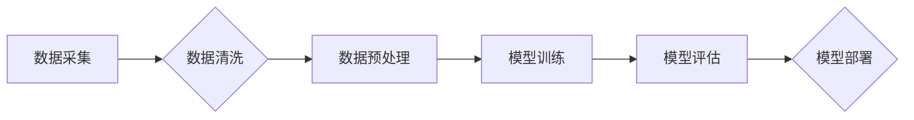

> 生成式AI，AIGC，脏数据，幻觉，模型训练，数据质量，伦理问题

## 1. 背景介绍

近年来，生成式人工智能（Generative AI）技术蓬勃发展，其强大的文本、图像、音频等多模态生成能力引发了广泛关注和热议。从ChatGPT的惊艳问世到DALL-E 2的艺术创作，生成式AIGC展现出巨大的潜力，被誉为“第四次工业革命”的催化剂。然而，伴随着技术的快速发展，也随之而来的是一系列伦理问题和技术挑战。其中，数据质量问题尤为突出，它直接影响着生成式AIGC模型的准确性、可靠性和安全性。

## 2. 核心概念与联系

**2.1 生成式AIGC**

生成式AIGC是指利用人工智能技术，从已有的数据中学习模式和规律，并生成新的、类似于训练数据的内容。常见的生成式AIGC模型包括：

* **文本生成模型:** GPT-3、LaMDA、BERT等
* **图像生成模型:** DALL-E 2、Stable Diffusion、Midjourney等
* **音频生成模型:** Jukebox、WaveNet等

**2.2 脏数据**

脏数据是指在数据采集、存储、处理过程中出现的错误、缺失、重复、不一致等问题的数据。脏数据会对模型的训练造成负面影响，导致模型生成的结果不准确、不完整甚至产生“幻觉”。

**2.3 幻觉**

在生成式AIGC领域，“幻觉”是指模型生成的输出与真实世界存在显著偏差，甚至完全不符合逻辑或常识的情况。幻觉的产生往往与脏数据密切相关，因为模型会学习并放大数据中的错误信息。

**2.4 数据质量与模型性能的关系**

数据质量是训练生成式AIGC模型的关键因素。高质量的数据可以帮助模型学习到更准确、更完整的知识，从而生成更可靠、更符合实际的输出。反之，脏数据会污染模型的训练过程，导致模型性能下降，甚至产生“幻觉”。

**Mermaid 流程图**



## 3. 核心算法原理 & 具体操作步骤

**3.1 算法原理概述**

生成式AIGC模型通常基于深度学习算法，例如变分自编码器（VAE）和生成对抗网络（GAN）。

* **变分自编码器（VAE）:** VAE是一种无监督学习算法，它将输入数据编码成一个低维表示，然后解码成重建数据。通过训练VAE，可以学习到数据的潜在结构和特征。

* **生成对抗网络（GAN）:** GAN由两个网络组成：生成器和判别器。生成器试图生成逼真的数据，而判别器试图区分真实数据和生成数据。通过对抗训练，生成器可以逐渐学习生成更逼真的数据。

**3.2 算法步骤详解**

**VAE:**

1. **编码器:** 将输入数据映射到一个低维表示空间。
2. **解码器:** 将低维表示空间映射回原始数据空间。
3. **损失函数:** 使用重建误差作为损失函数，训练编码器和解码器。

**GAN:**

1. **生成器:** 从随机噪声中生成数据样本。
2. **判别器:** 判别输入数据是真实数据还是生成数据。
3. **损失函数:** 使用判别器和生成器的损失函数，训练生成器和判别器。

**3.3 算法优缺点**

**VAE:**

* **优点:** 可以学习到数据的潜在结构和特征，生成数据质量相对较高。
* **缺点:** 生成数据可能缺乏多样性，难以生成复杂的数据。

**GAN:**

* **优点:** 可以生成更逼真的数据，具有更高的多样性。
* **缺点:** 训练过程比较复杂，容易出现模式崩溃等问题。

**3.4 算法应用领域**

* **文本生成:** 自动写作、机器翻译、对话系统等
* **图像生成:** 图像合成、图像修复、图像风格迁移等
* **音频生成:** 音频合成、音乐创作、语音识别等

## 4. 数学模型和公式 & 详细讲解 & 举例说明

**4.1 数学模型构建**

**VAE:**

* **编码器:**  z = encoder(x)
* **解码器:** x' = decoder(z)

其中，x是输入数据，z是低维表示，x'是重建数据。

**GAN:**

* **生成器:** x' = generator(z)
* **判别器:** p(real|x) = discriminator(x)

其中，x是真实数据，x'是生成数据，z是随机噪声。

**4.2 公式推导过程**

**VAE:**

* **损失函数:** L = KL(q(z|x)||p(z)) + D(x,x')

其中，KL是Kullback-Leibler散度，D是重建误差。

**GAN:**

* **生成器损失函数:** L_G = -log(D(x'))
* **判别器损失函数:** L_D = -log(D(x)) - log(1-D(x'))

**4.3 案例分析与讲解**

**VAE:**

* 可以用于图像压缩和去噪。

**GAN:**

* 可以用于生成逼真的图像、音频和视频。

## 5. 项目实践：代码实例和详细解释说明

**5.1 开发环境搭建**

* Python 3.x
* TensorFlow/PyTorch
* CUDA

**5.2 源代码详细实现**

```python
# VAE代码示例
import tensorflow as tf

# 定义编码器
encoder = tf.keras.Sequential([
    tf.keras.layers.Input(shape=(28, 28, 1)),
    tf.keras.layers.Conv2D(32, (3, 3), activation='relu'),
    tf.keras.layers.MaxPooling2D((2, 2)),
    tf.keras.layers.Flatten(),
    tf.keras.layers.Dense(128, activation='relu'),
    tf.keras.layers.Dense(2, activation='linear')
])

# 定义解码器
decoder = tf.keras.Sequential([
    tf.keras.layers.Input(shape=(2,)),
    tf.keras.layers.Dense(7 * 7 * 128, activation='relu'),
    tf.keras.layers.Reshape((7, 7, 128)),
    tf.keras.layers.Conv2DTranspose(32, (3, 3), strides=(2, 2), activation='relu'),
    tf.keras.layers.Conv2DTranspose(1, (3, 3), activation='sigmoid')
])

# 定义VAE模型
vae = tf.keras.Model(inputs=encoder.input, outputs=decoder(encoder.output))

# 训练VAE模型
vae.compile(optimizer='adam', loss='binary_crossentropy')
vae.fit(x_train, x_train, epochs=10)

# 生成新的图像
z = tf.random.normal(shape=(1, 2))
generated_image = decoder(z)
```

**5.3 代码解读与分析**

* 编码器将输入图像压缩成一个低维表示。
* 解码器将低维表示解码回图像。
* 损失函数包含重建误差和KL散度，用于训练VAE模型。

**5.4 运行结果展示**

* 可以使用TensorFlow或PyTorch的绘图工具展示生成的图像。

## 6. 实际应用场景

**6.1 文本生成**

* 自动写作：生成新闻报道、产品描述、小说等。
* 机器翻译：将文本从一种语言翻译成另一种语言。
* 对话系统：构建聊天机器人，进行自然语言对话。

**6.2 图像生成**

* 图像合成：生成逼真的图像，例如人脸、场景、物体等。
* 图像修复：修复损坏的图像，例如去除噪点、补全缺失部分等。
* 图像风格迁移：将图像的风格迁移到其他图像。

**6.3 音频生成**

* 音频合成：生成逼真的语音，例如播报、朗读等。
* 音乐创作：生成新的音乐作品。
* 语音识别：将语音转换为文本。

**6.4 未来应用展望**

* 个性化内容生成：根据用户的喜好生成个性化的内容，例如新闻推荐、广告定制等。
* 虚拟现实和增强现实：生成逼真的虚拟场景和增强现实体验。
* 医疗保健：辅助医生诊断疾病、生成医学图像等。

## 7. 工具和资源推荐

**7.1 学习资源推荐**

* **书籍:**
    * Deep Learning by Ian Goodfellow, Yoshua Bengio, and Aaron Courville
    * Generative Deep Learning by David Foster
* **在线课程:**
    * Coursera: Deep Learning Specialization
    * Udacity: Deep Learning Nanodegree
* **博客和网站:**
    * Towards Data Science
    * Machine Learning Mastery

**7.2 开发工具推荐**

* **TensorFlow:** 开源深度学习框架
* **PyTorch:** 开源深度学习框架
* **Keras:** 高级深度学习API

**7.3 相关论文推荐**

* **Generative Adversarial Networks** by Ian Goodfellow et al. (2014)
* **Auto-Encoding Variational Bayes** by Diederik P. Kingma and Max Welling (2013)
* **Attention Is All You Need** by Ashish Vaswani et al. (2017)

## 8. 总结：未来发展趋势与挑战

**8.1 研究成果总结**

生成式AIGC技术取得了显著进展，在文本、图像、音频等多模态生成方面展现出强大的潜力。

**8.2 未来发展趋势**

* **模型规模和能力的提升:** 模型参数规模将继续扩大，模型能力将进一步增强。
* **多模态生成:** 将文本、图像、音频等多种模态融合，生成更丰富、更复杂的內容。
* **个性化生成:** 根据用户的需求和喜好生成个性化的内容。
* **伦理和安全问题:** 

**8.3 面临的挑战**

* **数据质量问题:** 脏数据会污染模型训练，导致模型性能下降。
* **伦理问题:** 生成式AIGC可能被用于生成虚假信息、恶意内容等，需要加强伦理规范和监管。
* **安全问题:** 生成式AIGC模型可能被用于攻击系统、窃取数据等，需要加强安全防护。

**8.4 研究展望**

* 研究更有效的算法和方法，提高模型的生成质量和安全性。
* 开发更完善的伦理规范和监管机制，引导生成式AIGC技术健康发展。
* 加强与其他领域的交叉研究，探索生成式AIGC在更多领域的应用。

## 9. 附录：常见问题与解答

**9.1 如何解决脏数据问题？**

* 数据清洗：删除重复数据、错误数据、缺失数据等。
* 数据预处理：对数据进行标准化、归一化等处理，提高数据质量。
* 使用鲁棒的算法：选择能够抵抗脏数据影响的算法。

**9.2 如何避免生成式AIGC模型产生幻觉？**

* 使用高质量的数据进行训练。
* 采用正则化技术，防止模型过拟合。
* 使用对抗训练，提高模型的鲁棒性。

**9.3 生成式AIGC技术有哪些伦理问题？**

* 虚假信息生成：生成式AIGC模型可以生成逼真的虚假信息，可能被用于欺骗、操纵等。
* 隐私泄露：生成式AIGC