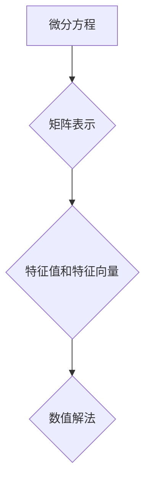

> 矩阵理论，微分方程，线性代数，数值解法，应用场景

## 1. 背景介绍

微分方程是描述物理、化学、生物等自然现象变化规律的数学模型，在科学研究和工程应用中扮演着至关重要的角色。然而，许多微分方程难以求出解析解，因此需要借助数值方法进行求解。矩阵理论作为线性代数的重要分支，为微分方程的数值解法提供了强大的工具和理论基础。

本篇文章将深入探讨矩阵理论在微分方程数值解法中的应用，从核心概念到具体算法原理，再到实际应用场景，全面阐述其理论基础、算法实现以及应用价值。

## 2. 核心概念与联系

### 2.1 矩阵理论基础

矩阵是线性代数中的重要概念，它是一种具有特定结构的数阵，可以表示线性变换、系统方程等。矩阵的运算规则，如加法、减法、乘法、转置等，为微分方程的数值解法提供了必要的工具。

### 2.2 微分方程的矩阵表示

许多微分方程可以表示为矩阵形式，例如线性微分方程组：

```
dx/dt = Ax
```

其中，x是状态向量，A是系数矩阵。将微分方程组转化为矩阵形式，可以利用矩阵理论的运算规则进行求解。

### 2.3 矩阵的特征值和特征向量

矩阵的特征值和特征向量是矩阵理论中的重要概念，它们可以帮助我们理解矩阵的性质和行为。特征值和特征向量在微分方程的数值解法中扮演着关键角色，例如在求解线性微分方程组时，可以使用特征值和特征向量来找到通解。

**Mermaid 流程图**



## 3. 核心算法原理 & 具体操作步骤

### 3.1 算法原理概述

矩阵理论为微分方程的数值解法提供了多种算法，其中最常用的包括欧拉法、Runge-Kutta方法等。这些算法都基于对微分方程进行离散化，将连续时间区间划分为若干个时间步长，然后在每个时间步长上利用矩阵运算近似求解微分方程的解。

### 3.2 算法步骤详解

以欧拉法为例，其步骤如下：

1. 将微分方程转化为矩阵形式。
2. 将时间区间划分为若干个时间步长，例如Δt。
3. 在每个时间步长上，利用欧拉公式近似求解微分方程的解：

```
x(t+Δt) = x(t) + Δt * A * x(t)
```

其中，x(t)是当前时刻的状态向量，x(t+Δt)是下一个时间步长的状态向量。

4. 重复步骤3，直到达到最终时间。

### 3.3 算法优缺点

欧拉法简单易实现，但精度较低，容易出现数值振荡。Runge-Kutta方法则具有更高的精度，但计算量更大。

### 3.4 算法应用领域

矩阵理论和基于矩阵的数值解法广泛应用于各种领域，例如：

* **物理学:** 模拟物理系统的运动，例如天体运动、弹性波传播等。
* **化学:** 研究化学反应动力学，例如反应速率、浓度变化等。
* **生物学:** 模拟生物系统的行为，例如种群增长、疾病传播等。
* **工程学:** 设计和分析工程系统，例如结构稳定性、控制系统性能等。

## 4. 数学模型和公式 & 详细讲解 & 举例说明

### 4.1 数学模型构建

对于一个线性微分方程组：

```
dx/dt = Ax
```

其中，x是状态向量，A是系数矩阵。我们可以将这个微分方程组转化为矩阵形式：

```
d/dt [x1, x2, ..., xn]^T = A * [x1, x2, ..., xn]^T
```

### 4.2 公式推导过程

欧拉法是一种常用的数值解法，其基本思想是将微分方程离散化，利用微分方程的定义近似求解解的下一个时间步长。

欧拉法的公式为：

```
x(t+Δt) = x(t) + Δt * A * x(t)
```

其中，Δt是时间步长，A是系数矩阵。

### 4.3 案例分析与讲解

假设我们有一个线性微分方程组：

```
dx/dt = [2 -1; 1 2] * x
```

其中，x = [x1, x2]^T。

我们可以使用欧拉法求解这个微分方程组。假设初始条件为x(0) = [1, 0]^T，时间步长为Δt = 0.1。

根据欧拉法的公式，我们可以计算出x(0.1)，x(0.2)，...，x(t)的近似值。

## 5. 项目实践：代码实例和详细解释说明

### 5.1 开发环境搭建

本项目使用Python语言进行开发，需要安装NumPy和Matplotlib库。

```
pip install numpy matplotlib
```

### 5.2 源代码详细实现

```python
import numpy as np
import matplotlib.pyplot as plt

# 定义系数矩阵A
A = np.array([[2, -1], [1, 2]])

# 定义初始条件x(0)
x0 = np.array([1, 0])

# 定义时间步长Δt
dt = 0.1

# 定义时间区间
t = np.arange(0, 1, dt)

# 使用欧拉法求解微分方程组
x = np.zeros((len(t), 2))
x[0] = x0

for i in range(1, len(t)):
    x[i] = x[i-1] + dt * A @ x[i-1]

# 绘制解的轨迹
plt.plot(x[:, 0], x[:, 1])
plt.xlabel('x1')
plt.ylabel('x2')
plt.title('微分方程数值解')
plt.show()
```

### 5.3 代码解读与分析

代码首先定义了系数矩阵A和初始条件x0，然后定义了时间步长Δt和时间区间。

然后，代码使用欧拉法求解微分方程组，将解存储在数组x中。

最后，代码使用Matplotlib库绘制解的轨迹。

### 5.4 运行结果展示

运行代码后，将生成一个二维平面上的曲线，表示微分方程的解的轨迹。

## 6. 实际应用场景

### 6.1 物理模拟

在物理模拟中，矩阵理论和数值解法可以用于模拟各种物理现象，例如天体运动、弹性波传播、流体流动等。

### 6.2 控制系统设计

在控制系统设计中，矩阵理论和数值解法可以用于分析和设计控制系统，例如自动驾驶、机器人控制等。

### 6.3 经济预测

在经济预测中，矩阵理论和数值解法可以用于构建经济模型，预测经济指标的变化趋势。

### 6.4 未来应用展望

随着计算机技术的发展，矩阵理论和数值解法在微分方程应用领域将有更广泛的应用前景，例如：

* **人工智能:** 用于训练神经网络模型，提高模型的精度和效率。
* **生物信息学:** 用于分析生物数据，例如基因表达谱、蛋白质结构等。
* **金融建模:** 用于构建金融模型，预测金融市场风险和收益。

## 7. 工具和资源推荐

### 7.1 学习资源推荐

* **书籍:**
    * 《线性代数及其应用》
    * 《数值分析》
    * 《微分方程》
* **在线课程:**
    * Coursera: 线性代数、数值分析
    * edX: 微分方程

### 7.2 开发工具推荐

* **Python:** 广泛应用于科学计算和数据分析，拥有丰富的库和工具。
* **NumPy:** 用于数值计算，提供高效的数组操作和线性代数运算。
* **SciPy:** 用于科学计算，提供各种数值解法和优化算法。
* **Matplotlib:** 用于数据可视化，可以生成各种类型的图表和图形。

### 7.3 相关论文推荐

* **Numerical Methods for Ordinary Differential Equations**
* **Matrix Methods in Differential Equations**
* **Applications of Matrix Theory in Engineering**

## 8. 总结：未来发展趋势与挑战

### 8.1 研究成果总结

矩阵理论为微分方程的数值解法提供了强大的工具和理论基础，在科学研究和工程应用中发挥着重要作用。

### 8.2 未来发展趋势

未来，矩阵理论和数值解法将继续发展，主要趋势包括：

* **更高效的算法:** 开发更高效、更精确的数值解法，例如高阶Runge-Kutta方法、谱方法等。
* **并行计算:** 利用并行计算技术加速数值解法的计算速度。
* **机器学习:** 将机器学习技术应用于数值解法，提高算法的鲁棒性和适应性。

### 8.3 面临的挑战

尽管矩阵理论和数值解法取得了显著进展，但仍然面临一些挑战，例如：

* **复杂微分方程:** 对于复杂微分方程，例如非线性微分方程、偏微分方程，数值解法仍然存在困难。
* **计算精度:** 即使使用高精度算法，数值解法仍然存在一定的误差，需要不断提高计算精度。
* **算法复杂度:** 一些数值解法具有较高的计算复杂度，需要进一步优化算法效率。

### 8.4 研究展望

未来，我们将继续深入研究矩阵理论和数值解法，致力于开发更高效、更精确、更鲁棒的数值解法，为科学研究和工程应用提供更强大的工具。

## 9. 附录：常见问题与解答

### 9.1 如何选择合适的数值解法？

选择合适的数值解法需要考虑微分方程的类型、精度要求、计算效率等因素。

### 9.2 如何评估数值解法的精度？

可以使用理论解或实验数据与数值解进行比较，评估数值解法的精度。

### 9.3 如何处理数值解法的稳定性问题？

可以通过调整时间步长、使用稳定性改进方法等方式来处理数值解法的稳定性问题。


作者：禅与计算机程序设计艺术 / Zen and the Art of Computer Programming 
<end_of_turn>