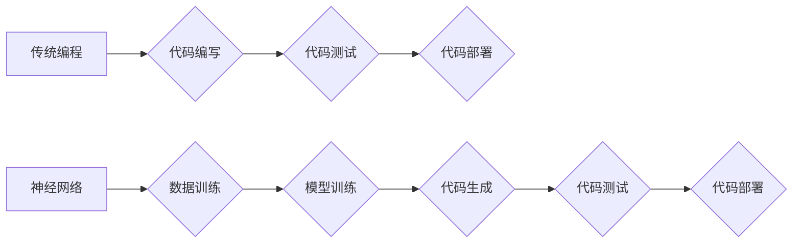

> 神经网络，传统编程，机器学习，深度学习，自动代码生成，人工智能，软件开发

## 1. 背景介绍

随着人工智能（AI）技术的飞速发展，特别是深度学习领域的突破，神经网络已经展现出强大的学习和推理能力，在图像识别、自然语言处理、语音识别等领域取得了令人瞩目的成就。这不禁引发了一个重要的思考：神经网络是否能够取代传统编程，成为未来软件开发的主流方式？

传统编程依赖于人类的逻辑思维和代码编写能力，程序员需要明确地定义算法步骤和数据处理流程。而神经网络则通过学习海量数据，自动发现模式和规律，从而实现对问题的解决。这种学习方式与人类的认知方式存在着本质的区别，也为神经网络在软件开发领域带来了新的可能性。

## 2. 核心概念与联系

### 2.1 神经网络

神经网络是一种模仿人脑神经网络结构的计算模型。它由大量的节点（神经元）组成，这些节点通过连接和权重相互连接，形成复杂的网络结构。每个神经元接收来自其他神经元的输入信号，对其进行处理，并输出到其他神经元。通过调整连接权重，神经网络可以学习数据中的模式和规律。

### 2.2 传统编程

传统编程是指使用人类语言（如C、Java、Python等）编写程序，明确地定义算法步骤和数据处理流程。程序员需要对计算机的底层结构和操作机制有深入的了解，才能编写出高效、可靠的程序。

### 2.3 自动代码生成

自动代码生成是指利用机器学习算法，从自然语言描述或数据结构中自动生成代码。神经网络可以学习代码的语法结构和语义关系，从而实现对代码的自动生成。

**Mermaid 流程图**



## 3. 核心算法原理 & 具体操作步骤

### 3.1 算法原理概述

自动代码生成算法通常基于深度学习模型，例如循环神经网络（RNN）和 transformers。这些模型能够学习代码的语法结构和语义关系，并根据输入的自然语言描述或数据结构生成相应的代码。

### 3.2 算法步骤详解

1. **数据准备:** 收集大量的代码数据集，并将其转换为机器可理解的格式。
2. **模型训练:** 使用深度学习模型训练，学习代码的语法结构和语义关系。
3. **代码生成:** 根据输入的自然语言描述或数据结构，利用训练好的模型生成相应的代码。
4. **代码测试:** 对生成的代码进行测试，确保其正确性和可靠性。

### 3.3 算法优缺点

**优点:**

* 自动化代码生成，提高开发效率。
* 降低代码编写错误的可能性。
* 能够生成更复杂的代码。

**缺点:**

* 训练数据量大，需要大量的计算资源。
* 生成的代码可能缺乏可读性和可维护性。
* 难以处理复杂的业务逻辑。

### 3.4 算法应用领域

* 代码补全和建议
* 代码翻译
* 代码注释生成
* 自动化测试用例生成

## 4. 数学模型和公式 & 详细讲解 & 举例说明

### 4.1 数学模型构建

自动代码生成算法通常基于循环神经网络（RNN）或 transformers 模型。这些模型使用矩阵运算和激活函数来处理序列数据，例如代码中的字符或单词。

**RNN 模型:**

RNN 模型使用隐藏状态来存储序列信息，并通过循环连接将信息传递到下一个时间步。

**Transformers 模型:**

Transformers 模型使用注意力机制来捕捉序列中的长距离依赖关系，并通过多头注意力机制和编码器-解码器结构来处理序列数据。

### 4.2 公式推导过程

RNN 和 Transformers 模型的具体公式推导过程比较复杂，涉及到矩阵运算、激活函数、注意力机制等多个方面。

### 4.3 案例分析与讲解

可以参考一些开源的自动代码生成工具，例如 GitHub 的 Codex 项目，来了解具体的模型架构和训练方法。

## 5. 项目实践：代码实例和详细解释说明

### 5.1 开发环境搭建

可以使用 Python 语言和相关的深度学习框架（例如 TensorFlow 或 PyTorch）来搭建自动代码生成项目的开发环境。

### 5.2 源代码详细实现

由于篇幅限制，这里只提供一个简单的代码生成示例，具体实现细节可以参考开源项目或相关文献。

```python
# 使用 TensorFlow 构建一个简单的 RNN 模型
import tensorflow as tf

# 定义模型输入和输出
input_tensor = tf.keras.Input(shape=(max_length,))
output_tensor = tf.keras.layers.LSTM(units=128)(input_tensor)
output_tensor = tf.keras.layers.Dense(units=vocab_size, activation='softmax')(output_tensor)

# 创建模型
model = tf.keras.Model(inputs=input_tensor, outputs=output_tensor)

# 训练模型
model.compile(optimizer='adam', loss='sparse_categorical_crossentropy', metrics=['accuracy'])
model.fit(x_train, y_train, epochs=10)

# 代码生成
input_sequence = ['def', ' ', 'function', '(', 'x', ')', ':']
generated_sequence = model.predict(input_sequence)
```

### 5.3 代码解读与分析

这段代码定义了一个简单的 RNN 模型，用于生成代码序列。模型输入是一个长度为 `max_length` 的字符序列，输出是一个概率分布，表示每个字符出现的可能性。

### 5.4 运行结果展示

训练完成后，可以使用模型生成新的代码序列。生成的代码序列可能并不完美，但可以作为开发的起点，并通过后续的修改和完善来提高代码质量。

## 6. 实际应用场景

### 6.1 代码补全和建议

自动代码生成可以用于代码补全和建议，帮助程序员更快地编写代码。例如，当程序员输入部分代码后，自动代码生成工具可以根据上下文预测下一个代码片段，并提供建议。

### 6.2 代码翻译

自动代码生成可以用于将代码从一种编程语言翻译成另一种编程语言。这可以帮助程序员更容易地阅读和理解来自不同来源的代码。

### 6.3 代码注释生成

自动代码生成可以用于生成代码注释，帮助程序员理解代码的功能和逻辑。

### 6.4 未来应用展望

随着人工智能技术的不断发展，自动代码生成技术将有更广泛的应用场景，例如：

* 自动生成测试用例
* 自动生成软件文档
* 自动生成代码修复方案

## 7. 工具和资源推荐

### 7.1 学习资源推荐

* **书籍:**
    * "Deep Learning" by Ian Goodfellow, Yoshua Bengio, and Aaron Courville
    * "Hands-On Machine Learning with Scikit-Learn, Keras & TensorFlow" by Aurélien Géron
* **在线课程:**
    * Coursera: Deep Learning Specialization
    * Udacity: Deep Learning Nanodegree

### 7.2 开发工具推荐

* **TensorFlow:** https://www.tensorflow.org/
* **PyTorch:** https://pytorch.org/
* **Hugging Face Transformers:** https://huggingface.co/transformers/

### 7.3 相关论文推荐

* "Attention Is All You Need" by Vaswani et al. (2017)
* "BERT: Pre-training of Deep Bidirectional Transformers for Language Understanding" by Devlin et al. (2018)

## 8. 总结：未来发展趋势与挑战

### 8.1 研究成果总结

自动代码生成技术取得了显著的进展，能够生成高质量的代码，并应用于多个领域。

### 8.2 未来发展趋势

未来，自动代码生成技术将朝着以下方向发展：

* 更强大的模型架构
* 更丰富的训练数据
* 更强的泛化能力
* 更人性化的交互方式

### 8.3 面临的挑战

自动代码生成技术还面临着一些挑战：

* 难以处理复杂的业务逻辑
* 生成的代码的可读性和可维护性
* 数据安全和隐私问题

### 8.4 研究展望

未来，需要进一步研究如何提高自动代码生成技术的鲁棒性和可靠性，使其能够更好地服务于软件开发领域。

## 9. 附录：常见问题与解答

**常见问题:**

* 自动代码生成是否会取代程序员？
* 自动代码生成技术有哪些局限性？
* 如何学习自动代码生成技术？

**解答:**

* 自动代码生成技术可以提高开发效率，但不会完全取代程序员。程序员仍然需要负责设计、架构和测试软件系统。
* 自动代码生成技术目前还存在一些局限性，例如难以处理复杂的业务逻辑和生成高质量的代码注释。
* 可以通过学习深度学习、自然语言处理和软件工程等相关知识来学习自动代码生成技术。


作者：禅与计算机程序设计艺术 / Zen and the Art of Computer Programming 
<end_of_turn>