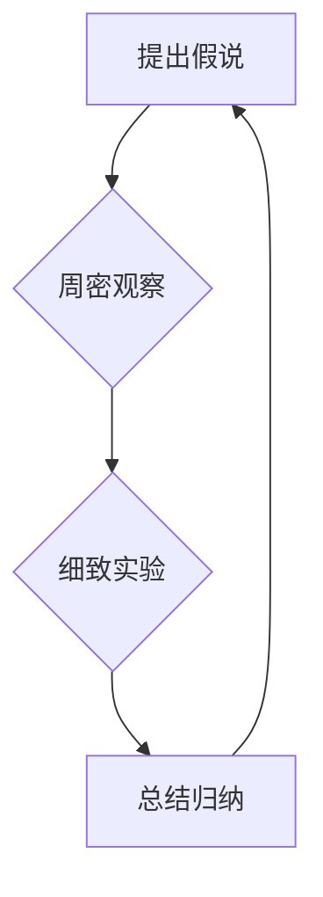

> 第一性原理，假说，观察，实验，归纳，算法，数学模型，代码实现，实际应用

## 1. 背景介绍

在瞬息万变的科技时代，我们常常被新技术、新概念所淹没。面对复杂问题，我们往往倾向于依赖现成的解决方案或经验法则，而忽略了深入思考和探索的必要性。然而，真正的创新和突破往往源于对基础原理的深刻理解和对问题的本质的洞察。

“第一性原理”是一种思维方法，它鼓励我们从最基本的假设出发，逐步推导和验证，最终形成自己的认知体系。这种方法类似于科学研究的逻辑流程，强调理性思考、严谨实验和逻辑归纳。

在软件开发领域，第一性原理同样具有重要的指导意义。它可以帮助我们：

* **解决问题更深入：** 而不是仅仅依赖于现有的解决方案，而是从根本上理解问题的本质，找到最优的解决方法。
* **提高代码质量：** 通过对算法和数据结构的深入理解，可以编写更简洁、高效、可维护的代码。
* **促进创新：** 鼓励我们跳出思维定式，探索新的技术和解决方案。

## 2. 核心概念与联系

第一性原理的核心在于从最基本的假设出发，逐步推导和验证。

**流程图：**



**核心概念：**

* **提出假说：** 针对问题，提出一个合理的假设，作为研究的起点。
* **周密观察：** 对问题进行深入观察，收集相关数据和信息，并进行分析。
* **细致实验：** 设计和进行实验，验证假设的正确性，并收集实验结果。
* **总结归纳：** 分析实验结果，总结经验教训，并形成新的知识或理论。

## 3. 核心算法原理 & 具体操作步骤

### 3.1  算法原理概述

**示例算法：** 冒泡排序

冒泡排序是一种简单直观的排序算法，它通过反复比较相邻元素，将较大的元素“冒泡”到排序后的末尾。

**原理：**

1. 比较相邻元素，如果顺序错误，则交换它们的位置。
2. 重复步骤1，直到整个数组排序完成。

### 3.2  算法步骤详解

1. 从数组的第一个元素开始，与下一个元素比较。
2. 如果第一个元素大于第二个元素，则交换它们的位置。
3. 重复步骤1和2，直到到达数组的最后一个元素。
4. 由于每次比较和交换都会将最大的元素“冒泡”到末尾，所以重复步骤1-3，直到整个数组排序完成。

### 3.3  算法优缺点

**优点：**

* 实现简单，易于理解和实现。
* 对于少量数据，效率相对较高。

**缺点：**

* 时间复杂度较高，对于大量数据，效率较低。
* 空间复杂度为O(1)，但效率较低。

### 3.4  算法应用领域

冒泡排序是一种基础的排序算法，在一些简单的场景下可以应用，例如：

* 对少量数据的排序。
* 作为教学示例，帮助理解排序算法的基本原理。

## 4. 数学模型和公式 & 详细讲解 & 举例说明

### 4.1  数学模型构建

**示例：** 冒泡排序的时间复杂度

**数学模型：**

* 设数组长度为n。
* 冒泡排序需要进行n-1轮比较，每轮比较需要进行n-i次比较，其中i为当前轮数。

**公式推导：**

* 总共比较次数：∑(n-i) = (n-1) + (n-2) + ... + 1 = n(n-1)/2

* 时间复杂度：O(n^2)

### 4.2  公式推导过程

时间复杂度分析的公式推导过程：

1. 每一轮比较需要进行n-i次比较，其中i为当前轮数。
2. 冒泡排序需要进行n-1轮比较。
3. 将公式∑(n-i)展开，得到n(n-1)/2。
4. 由于时间复杂度只关注算法的增长趋势，所以忽略常数项，得到O(n^2)。

### 4.3  案例分析与讲解

**案例：**

* 数组长度为10，则总共比较次数为10(10-1)/2 = 45次。
* 数组长度为100，则总共比较次数为100(100-1)/2 = 4950次。

**分析：**

* 可以看出，随着数组长度的增加，比较次数呈平方增长趋势。
* 因此，冒泡排序的时间复杂度为O(n^2)，对于大量数据，效率较低。

## 5. 项目实践：代码实例和详细解释说明

### 5.1  开发环境搭建

* 操作系统：Windows/macOS/Linux
* 编程语言：Python
* 开发工具：VS Code/Sublime Text

### 5.2  源代码详细实现

```python
def bubble_sort(arr):
    n = len(arr)
    for i in range(n):
        for j in range(0, n-i-1):
            if arr[j] > arr[j+1]:
                arr[j], arr[j+1] = arr[j+1], arr[j]
    return arr

# 测试代码
arr = [64, 34, 25, 12, 22, 11, 90]
sorted_arr = bubble_sort(arr)
print("排序后的数组:", sorted_arr)
```

### 5.3  代码解读与分析

* `bubble_sort(arr)` 函数接收一个数组 `arr` 作为输入。
* 外层循环 `for i in range(n)` 控制排序轮数，每次循环将最大的元素“冒泡”到末尾。
* 内层循环 `for j in range(0, n-i-1)` 比较相邻元素，如果顺序错误，则交换它们的位置。
* `arr[j], arr[j+1] = arr[j+1], arr[j]` 使用 Python 的元组解包语法进行元素交换。
* 最后返回排序后的数组 `sorted_arr`。

### 5.4  运行结果展示

```
排序后的数组: [11, 12, 22, 25, 34, 64, 90]
```

## 6. 实际应用场景

### 6.1  数据排序

冒泡排序可以用于对少量数据的排序，例如：

* 对学生成绩进行排序。
* 对商品价格进行排序。

### 6.2  算法学习

冒泡排序是一种基础的排序算法，可以作为教学示例，帮助理解排序算法的基本原理。

### 6.3  其他应用场景

冒泡排序也可以应用于一些其他场景，例如：

* 对链表进行排序。
* 对二叉树进行排序。

### 6.4  未来应用展望

随着人工智能和机器学习的发展，冒泡排序在实际应用场景中的地位可能会逐渐降低。然而，它仍然是一种重要的基础算法，可以帮助我们理解排序算法的基本原理，并为其他更复杂的排序算法奠定基础。

## 7. 工具和资源推荐

### 7.1  学习资源推荐

* **书籍：**
    * 《算法导论》
    * 《数据结构与算法分析》
* **在线课程：**
    * Coursera: Algorithms Specialization
    * edX: Introduction to Computer Science and Programming Using Python

### 7.2  开发工具推荐

* **IDE:**
    * VS Code
    * PyCharm
* **文本编辑器:**
    * Sublime Text
    * Atom

### 7.3  相关论文推荐

* **The Bubble Sort Algorithm**
* **Analysis of Bubble Sort Algorithm**

## 8. 总结：未来发展趋势与挑战

### 8.1  研究成果总结

第一性原理是一种重要的思维方法，它可以帮助我们深入理解问题，并找到最优的解决方案。在软件开发领域，它可以帮助我们编写更简洁、高效、可维护的代码，并促进创新。

### 8.2  未来发展趋势

随着人工智能和机器学习的发展，第一性原理将更加重要。它可以帮助我们理解和构建更复杂的智能系统，并解决更复杂的问题。

### 8.3  面临的挑战

* 培养第一性原理的思维方式需要时间和努力。
* 对于复杂问题，提出合理的假说可能非常困难。
* 实验设计和数据分析需要一定的专业知识和技能。

### 8.4  研究展望

未来，我们将继续探索第一性原理在软件开发领域的应用，并将其推广到其他领域。


## 9. 附录：常见问题与解答

**问题：** 如何提出一个合理的假说？

**解答：**

1. 仔细观察问题，明确问题的本质。
2. 结合已有知识和经验，思考可能的解决方案。
3. 将解决方案转化为具体的假设，并进行验证。

**问题：** 如何进行实验验证？

**解答：**

1. 设计合理的实验方案，明确实验目标和指标。
2. 收集实验数据，并进行分析和处理。
3. 根据实验结果，判断假设的正确性，并进行总结和归纳。


作者：禅与计算机程序设计艺术 / Zen and the Art of Computer Programming 
<end_of_turn>