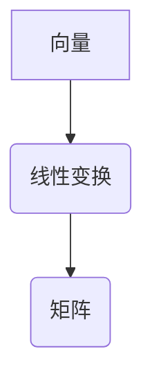

> 线性代数，矩阵，向量，线性变换，特征值，特征向量，应用场景，Python

## 1. 背景介绍

线性代数作为数学领域的重要分支，为计算机科学、数据科学、人工智能等领域提供了强大的工具和理论基础。它以向量、矩阵和线性变换为核心概念，揭示了数据和系统之间的内在联系，为解决复杂问题提供了高效的算法和方法。

在现代科技发展日新月异的时代，线性代数的应用场景日益广泛。从图像处理、机器学习到金融建模、物理模拟，线性代数都扮演着至关重要的角色。

## 2. 核心概念与联系

### 2.1 向量

向量是线性代数的基本概念之一，它可以表示一个有大小和方向的量。在二维空间中，向量通常用有序数对 (x, y) 表示，其中 x 和 y 分别代表向量在 x 轴和 y 轴上的分量。

### 2.2 矩阵

矩阵是一种将数排列成行和列的矩形阵列。矩阵可以表示线性变换，并通过矩阵运算进行组合和叠加。

### 2.3 线性变换

线性变换是一种将向量映射到另一个向量空间的函数，它满足以下两个性质：

* **加性:** T(u + v) = T(u) + T(v)
* **齐次性:** T(cu) = cT(u)

其中，u 和 v 是向量，c 是标量。

### 2.4 核心概念联系

线性代数的核心概念相互联系，形成一个完整的理论体系。向量可以看作是线性空间中的元素，矩阵可以表示线性变换，而线性变换则将向量从一个空间映射到另一个空间。



## 3. 核心算法原理 & 具体操作步骤

### 3.1 算法原理概述

线性代数的核心算法包括矩阵分解、求逆、特征值和特征向量等。这些算法为解决线性方程组、优化问题、数据分析等提供了高效的工具。

### 3.2 算法步骤详解

#### 3.2.1 矩阵分解

矩阵分解是指将一个矩阵分解成多个简单矩阵的乘积。常见的矩阵分解方法包括：

* **LU 分解:** 将一个矩阵分解成一个下三角矩阵 L 和一个上三角矩阵 U。
* **QR 分解:** 将一个矩阵分解成一个正交矩阵 Q 和一个上三角矩阵 R。
* **奇异值分解 (SVD):** 将一个矩阵分解成三个矩阵的乘积，其中一个矩阵是正交矩阵，另一个矩阵是上三角矩阵，第三个矩阵是正交矩阵。

#### 3.2.2 求逆

矩阵的逆是一个特殊的矩阵，满足以下条件：

A * A⁻¹ = A⁻¹ * A = I

其中，A 是原矩阵，A⁻¹ 是逆矩阵，I 是单位矩阵。

求逆算法通常使用高斯消元法或 LU 分解法。

#### 3.2.3 特征值和特征向量

特征值和特征向量是线性变换的重要性质。特征值是线性变换对应的标量，特征向量是对应的非零向量。

特征值和特征向量可以通过求解特征方程来得到：

det(A - λI) = 0

其中，A 是线性变换矩阵，λ 是特征值，I 是单位矩阵。

### 3.3 算法优缺点

线性代数算法具有以下优点：

* **高效性:** 许多线性代数算法具有良好的时间复杂度和空间复杂度。
* **通用性:** 线性代数算法可以应用于各种领域，例如图像处理、机器学习、数据分析等。
* **可解释性:** 线性代数算法的原理相对简单，易于理解和解释。

然而，线性代数算法也存在一些缺点：

* **数值稳定性:** 一些线性代数算法对输入数据敏感，容易出现数值错误。
* **内存消耗:** 处理大型矩阵时，线性代数算法可能需要消耗大量的内存。

### 3.4 算法应用领域

线性代数算法广泛应用于以下领域：

* **图像处理:** 图像压缩、图像恢复、图像增强等。
* **机器学习:** 线性回归、逻辑回归、支持向量机等算法都依赖于线性代数。
* **数据分析:** 数据降维、数据聚类、数据可视化等。
* **物理模拟:** 刚体动力学、流体力学、量子力学等。

## 4. 数学模型和公式 & 详细讲解 & 举例说明

### 4.1 数学模型构建

线性代数的核心数学模型是向量空间和线性变换。

* **向量空间:** 向量空间是一个集合，其中元素是向量，并且满足以下条件：
    * 向量加法封闭性：两个向量的和仍然在向量空间内。
    * 标量乘法封闭性：标量与向量的乘积仍然在向量空间内。
    * 存在零向量：一个特殊的向量，满足与任何向量的加法都等于该向量本身。
    * 存在逆向量：对于每个向量，存在一个逆向量，使得它们的和等于零向量。

* **线性变换:** 线性变换是一种将向量空间映射到另一个向量空间的函数，它满足以下两个性质：
    * **加性:** T(u + v) = T(u) + T(v)
    * **齐次性:** T(cu) = cT(u)

### 4.2 公式推导过程

#### 4.2.1 矩阵乘法

矩阵乘法是一种将两个矩阵组合成一个新矩阵的操作。

如果 A 是一个 m × n 矩阵，B 是一个 n × p 矩阵，则它们的乘积 C 是一个 m × p 矩阵，其中每个元素 c<sub>ij</sub> 是 A 的第 i 行和 B 的第 j 列的点积。

```
C<sub>ij</sub> = Σ<sub>k=1</sub><sup>n</sup> A<sub>ik</sub> * B<sub>kj</sub>
```

#### 4.2.2 矩阵求逆

矩阵的逆是一个特殊的矩阵，满足以下条件：

A * A⁻¹ = A⁻¹ * A = I

其中，A 是原矩阵，A⁻¹ 是逆矩阵，I 是单位矩阵。

求逆算法通常使用高斯消元法或 LU 分解法。

#### 4.2.3 特征值和特征向量

特征值和特征向量可以通过求解特征方程来得到：

det(A - λI) = 0

其中，A 是线性变换矩阵，λ 是特征值，I 是单位矩阵。

### 4.3 案例分析与讲解

#### 4.3.1 图像压缩

图像压缩算法利用线性代数的矩阵分解和奇异值分解技术，将图像数据降维，从而减少存储空间和传输带宽。

#### 4.3.2 机器学习

许多机器学习算法，例如线性回归和支持向量机，都依赖于线性代数的矩阵运算和求逆算法。

## 5. 项目实践：代码实例和详细解释说明

### 5.1 开发环境搭建

本项目使用 Python 语言进行开发，并使用 NumPy 和 SciPy 库进行线性代数运算。

### 5.2 源代码详细实现

```python
import numpy as np

# 定义一个矩阵
A = np.array([[1, 2], [3, 4]])

# 计算矩阵的转置
A_transpose = A.transpose()

# 计算矩阵的逆
A_inverse = np.linalg.inv(A)

# 计算矩阵的特征值和特征向量
eigenvalues, eigenvectors = np.linalg.eig(A)

# 打印结果
print("矩阵 A:")
print(A)
print("矩阵 A 的转置:")
print(A_transpose)
print("矩阵 A 的逆:")
print(A_inverse)
print("矩阵 A 的特征值:")
print(eigenvalues)
print("矩阵 A 的特征向量:")
print(eigenvectors)
```

### 5.3 代码解读与分析

* `np.array()` 函数用于创建 NumPy 数组。
* `A.transpose()` 函数用于计算矩阵的转置。
* `np.linalg.inv()` 函数用于计算矩阵的逆。
* `np.linalg.eig()` 函数用于计算矩阵的特征值和特征向量。

### 5.4 运行结果展示

运行上述代码，将输出矩阵 A、其转置、逆、特征值和特征向量。

## 6. 实际应用场景

### 6.1 图像处理

线性代数在图像处理中应用广泛，例如：

* **图像压缩:** 利用矩阵分解和奇异值分解技术，将图像数据降维，从而减少存储空间和传输带宽。
* **图像增强:** 使用线性变换来增强图像的对比度、清晰度和色彩。
* **图像识别:** 利用特征值和特征向量来提取图像的特征，用于图像识别和分类。

### 6.2 机器学习

线性代数是机器学习的基础，许多机器学习算法都依赖于线性代数的矩阵运算和求逆算法，例如：

* **线性回归:** 使用线性方程来预测连续变量。
* **逻辑回归:** 使用线性方程来预测分类变量。
* **支持向量机:** 使用线性代数来找到最佳的分隔超平面。

### 6.3 数据分析

线性代数在数据分析中用于：

* **数据降维:** 使用主成分分析 (PCA) 等技术将高维数据降维，从而减少数据维度和提高计算效率。
* **数据聚类:** 使用 k 均值聚类等算法将数据点分组，从而发现数据中的潜在结构。
* **数据可视化:** 使用线性变换来将高维数据投影到二维或三维空间，从而进行可视化分析。

### 6.4 未来应用展望

随着人工智能和机器学习的快速发展，线性代数在未来将有更广泛的应用场景，例如：

* **深度学习:** 深度学习算法依赖于大量的矩阵运算，线性代数将继续发挥重要作用。
* **自然语言处理:** 线性代数可以用于文本分析、情感识别和机器翻译等任务。
* **生物信息学:** 线性代数可以用于基因组分析、蛋白质结构预测和药物发现等领域。

## 7. 工具和资源推荐

### 7.1 学习资源推荐

* **书籍:**
    * 《线性代数及其应用》 - Gilbert Strang
    * 《线性代数及其应用》 - David C. Lay
* **在线课程:**
    * MIT 线性代数课程 (https://ocw.mit.edu/courses/mathematics/18-06-linear-algebra-spring-2010/)
    * Coursera 线性代数课程 (https://www.coursera.org/search?query=linear%20algebra)

### 7.2 开发工具推荐

* **Python:** Python 是一个流行的编程语言，拥有丰富的科学计算库，例如 NumPy 和 SciPy。
* **NumPy:** NumPy 是 Python 的数值计算库，提供了高效的数组操作和线性代数函数。
* **SciPy:** SciPy 是 Python 的科学计算库，提供了更高级的科学计算功能，包括线性代数、优化、积分等。

### 7.3 相关论文推荐

* **Singular Value Decomposition:** Golub, G. H., & Van Loan, C. F. (1996). Matrix computations. Johns Hopkins University Press.
* **Eigenvalue Decomposition:** Golub, G. H., & Van Loan, C. F. (1996). Matrix computations. Johns Hopkins University Press.

## 8. 总结：未来发展趋势与挑战

### 8.1 研究成果总结

线性代数作为数学领域的重要分支，为计算机科学、数据科学、人工智能等领域提供了强大的工具和理论基础。

### 8.2 未来发展趋势

随着人工智能和机器学习的快速发展，线性代数在未来将有更广泛的应用场景，例如：

* **深度学习:** 深度学习算法依赖于大量的矩阵运算，线性代数将继续发挥重要作用。
* **自然语言处理:** 线性代数可以用于文本分析、情感识别和机器翻译