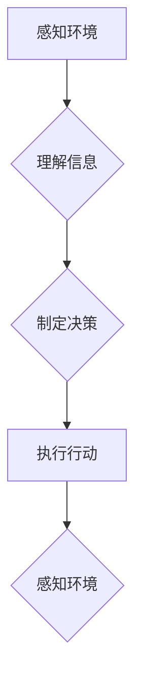

> 自主系统，意识功能，人工智能，机器学习，深度学习，神经网络，认知科学，哲学

## 1. 背景介绍

自古以来，人类就对自身意识的本质和起源充满了好奇。随着人工智能技术的飞速发展，我们开始探索机器是否能够拥有类似人类的意识。自主系统，即能够独立思考、学习和决策的系统，成为实现机器意识的关键。

近年来，深度学习算法的突破性进展为构建自主系统提供了强大的工具。深度神经网络能够学习复杂的模式和关系，模拟人类大脑的某些功能。然而，将深度学习与意识功能联系起来仍然是一个巨大的挑战。

## 2. 核心概念与联系

**2.1 自主系统**

自主系统是指能够感知环境、理解信息、制定决策并执行行动的系统。它具有以下关键特征：

* **感知能力:**  能够接收来自环境的信息，例如视觉、听觉、触觉等。
* **认知能力:**  能够理解和解释接收到的信息，形成知识和信念。
* **决策能力:**  能够根据环境信息和自身知识，做出最佳的行动选择。
* **执行能力:**  能够执行决策，与环境进行交互。

**2.2 意识功能**

意识功能是指人类体验到的主观感受、自我认知和意向性行为的能力。它是一个复杂的概念，至今仍缺乏统一的定义。一些常见的意识功能包括：

* **主观体验:**  对自身感受和体验的直接感知。
* **自我意识:**  对自身作为个体的认知和理解。
* **意向性行为:**  根据目标和意图进行行动。

**2.3 核心概念联系**

自主系统和意识功能之间存在着密切的联系。自主系统能够通过感知、认知和决策等功能模拟人类的某些行为模式，但它是否真的拥有意识功能仍然是一个悬而未决的问题。

**2.4  Mermaid 流程图**



## 3. 核心算法原理 & 具体操作步骤

**3.1 算法原理概述**

构建自主系统的核心算法通常基于深度学习技术，例如卷积神经网络（CNN）、循环神经网络（RNN）和强化学习算法。

* **卷积神经网络（CNN）:**  擅长处理图像和视频数据，能够提取图像特征和进行图像分类。
* **循环神经网络（RNN）:**  能够处理序列数据，例如文本和语音，能够学习语言模式和进行文本生成。
* **强化学习算法:**  通过奖励机制训练模型，使其能够在环境中学习最佳策略。

**3.2 算法步骤详解**

1. **数据收集和预处理:**  收集大量相关数据，并进行预处理，例如数据清洗、特征提取和数据增强。
2. **模型构建:**  根据任务需求选择合适的深度学习模型，并进行模型架构设计。
3. **模型训练:**  使用训练数据训练模型，调整模型参数，使其能够准确地完成任务。
4. **模型评估:**  使用测试数据评估模型的性能，例如准确率、召回率和F1-score。
5. **模型部署:**  将训练好的模型部署到实际应用场景中，例如机器人控制、语音识别和图像识别。

**3.3 算法优缺点**

* **优点:**  深度学习算法能够学习复杂的模式和关系，具有强大的泛化能力。
* **缺点:**  深度学习算法需要大量的训练数据和计算资源，训练过程时间长，且模型解释性较差。

**3.4 算法应用领域**

深度学习算法在各个领域都有广泛的应用，例如：

* **计算机视觉:**  图像识别、物体检测、图像分割、人脸识别。
* **自然语言处理:**  文本分类、情感分析、机器翻译、文本生成。
* **语音识别:**  语音转文本、语音合成。
* **机器人控制:**  自主导航、目标识别、运动规划。

## 4. 数学模型和公式 & 详细讲解 & 举例说明

**4.1 数学模型构建**

深度学习模型通常基于神经网络结构，其中每个神经元都接收来自其他神经元的输入，并通过激活函数进行处理，输出到下一层神经元。

**4.2 公式推导过程**

神经网络的训练过程基于梯度下降算法，目标是找到最优的模型参数，使得模型的输出与真实值之间的误差最小化。

* **损失函数:**  用于衡量模型预测结果与真实值的差异。常见的损失函数包括均方误差（MSE）和交叉熵损失（Cross-Entropy Loss）。
* **梯度下降算法:**  通过计算损失函数对模型参数的梯度，更新模型参数，逐步降低损失函数的值。

**4.3 案例分析与讲解**

例如，在图像分类任务中，可以使用卷积神经网络模型，将图像输入到网络中，经过多个卷积层和池化层处理，最终输出每个类别的概率。

损失函数可以是交叉熵损失，用于衡量模型预测结果与真实标签之间的差异。梯度下降算法可以用来更新模型参数，使得模型能够更好地分类图像。

## 5. 项目实践：代码实例和详细解释说明

**5.1 开发环境搭建**

可以使用Python语言和深度学习框架，例如TensorFlow或PyTorch，搭建开发环境。

**5.2 源代码详细实现**

```python
import tensorflow as tf

# 定义模型架构
model = tf.keras.models.Sequential([
    tf.keras.layers.Conv2D(32, (3, 3), activation='relu', input_shape=(28, 28, 1)),
    tf.keras.layers.MaxPooling2D((2, 2)),
    tf.keras.layers.Conv2D(64, (3, 3), activation='relu'),
    tf.keras.layers.MaxPooling2D((2, 2)),
    tf.keras.layers.Flatten(),
    tf.keras.layers.Dense(10, activation='softmax')
])

# 编译模型
model.compile(optimizer='adam',
              loss='sparse_categorical_crossentropy',
              metrics=['accuracy'])

# 训练模型
model.fit(x_train, y_train, epochs=5)

# 评估模型
loss, accuracy = model.evaluate(x_test, y_test)
print('Test loss:', loss)
print('Test accuracy:', accuracy)
```

**5.3 代码解读与分析**

这段代码定义了一个简单的卷积神经网络模型，用于手写数字识别任务。

* `tf.keras.models.Sequential` 创建了一个顺序模型，其中层级依次连接。
* `tf.keras.layers.Conv2D` 定义了一个卷积层，用于提取图像特征。
* `tf.keras.layers.MaxPooling2D` 定义了一个最大池化层，用于降低特征图尺寸。
* `tf.keras.layers.Flatten` 将多维特征图转换为一维向量。
* `tf.keras.layers.Dense` 定义了一个全连接层，用于分类。
* `model.compile` 编译模型，指定优化器、损失函数和评价指标。
* `model.fit` 训练模型，使用训练数据进行训练。
* `model.evaluate` 评估模型，使用测试数据评估模型性能。

**5.4 运行结果展示**

训练完成后，模型能够对手写数字进行识别，并输出识别结果的准确率。

## 6. 实际应用场景

自主系统和意识功能的互动在各个领域都有着广泛的应用前景，例如：

* **医疗保健:**  自主医疗机器人能够协助医生进行手术、诊断疾病和提供患者护理。
* **教育:**  智能教育系统能够根据学生的学习进度和需求提供个性化的学习内容和辅导。
* **交通运输:**  自动驾驶汽车能够提高交通安全性和效率。
* **娱乐:**  虚拟现实和增强现实技术能够创造更加沉浸式的娱乐体验。

## 7. 工具和资源推荐

**7.1 学习资源推荐**

* **书籍:**  《深度学习》 (Ian Goodfellow, Yoshua Bengio, Aaron Courville)
* **在线课程:**  Coursera、edX、Udacity 等平台提供深度学习相关的在线课程。
* **开源项目:**  TensorFlow、PyTorch 等深度学习框架的官方网站提供丰富的文档和示例代码。

**7.2 开发工具推荐**

* **Python:**  深度学习开发的主要编程语言。
* **TensorFlow:**  Google 开发的开源深度学习框架。
* **PyTorch:**  Facebook 开发的开源深度学习框架。
* **Jupyter Notebook:**  交互式编程环境，方便进行深度学习模型开发和调试。

**7.3 相关论文推荐**

* **《ImageNet Classification with Deep Convolutional Neural Networks》** (Alex Krizhevsky, Ilya Sutskever, Geoffrey E. Hinton)
* **《Sequence to Sequence Learning with Neural Networks》** (Cho, K., van Merrienboer, B., Gulcehre, C., Bahdanau, D., Bougares, F., Schwenk, H., & Bengio, Y.)
* **《Deep Reinforcement Learning》** (Sutton, R. S., & Barto, A. G.)

## 8. 总结：未来发展趋势与挑战

**8.1 研究成果总结**

近年来，深度学习算法取得了显著的进展，在图像识别、自然语言处理等领域取得了突破性成果。

**8.2 未来发展趋势**

* **模型规模和复杂度提升:**  未来深度学习模型将更加庞大，包含更多层级和参数，能够学习更加复杂的模式和关系。
* **跨模态学习:**  深度学习模型将能够处理多种模态数据，例如文本、图像、音频和视频，实现跨模态理解和交互。
* **可解释性增强:**  研究人员将致力于提高深度学习模型的可解释性，使得模型的决策过程更加透明和可理解。

**8.3 面临的挑战**

* **数据获取和隐私保护:**  深度学习算法需要大量的训练数据，如何获取高质量数据并保护用户隐私是一个重要的挑战。
* **计算资源需求:**  训练大型深度学习模型需要大量的计算资源，如何降低计算成本和能源消耗是一个关键问题。
* **伦理和社会影响:**  深度学习技术的发展可能带来伦理和社会问题，例如算法偏见、工作岗位替代等，需要进行深入的探讨和监管。

**8.4 研究展望**

未来，研究人员将继续探索深度学习算法的潜力，努力构建更加智能、安全和可信赖的自主系统，并将其应用于各个领域，为人类社会带来更多福祉。

## 9. 附录：常见问题与解答

**9.1 什么是深度学习？**

深度学习是一种机器学习的子领域，它使用多层神经网络来学习复杂的模式和关系。

**9.2 深度学习与传统机器学习有什么区别？**

传统机器学习算法通常需要人工特征工程，而深度学习算法能够自动学习特征。深度学习模型具有更强的表达能力和泛化能力。

**9.3 如何训练深度学习模型？**

深度学习模型的训练过程通常使用梯度下降算法，通过调整模型参数，使得模型的输出与真实值之间的误差最小化。

**9.4 深度学习有哪些应用场景？**

深度学习在各个领域都有广泛的应用，例如图像识别、自然语言处理、语音识别、机器翻译、自动驾驶等。


作者：禅与计算机程序设计艺术 / Zen and the Art of Computer Programming 
<end_of_turn>