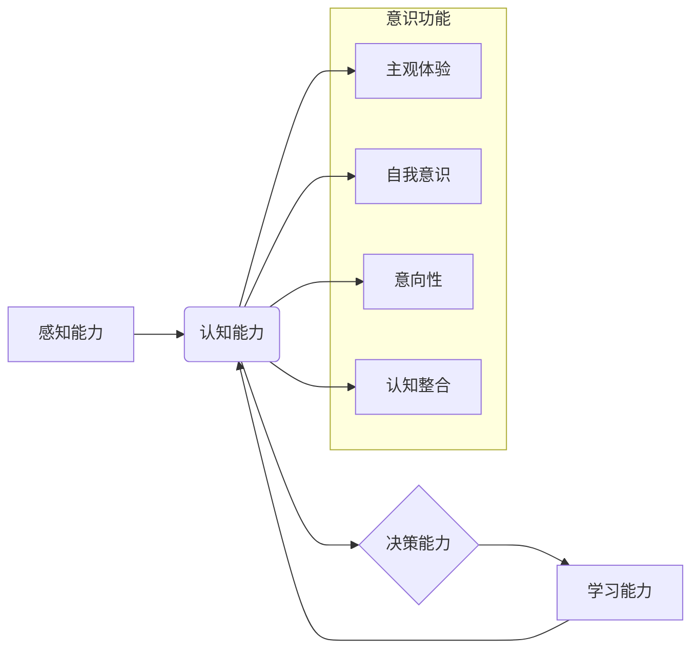

> 自主系统，意识功能，人工智能，机器学习，深度学习，神经网络，认知科学，哲学

## 1. 背景介绍

自古以来，人类就对自身意识的本质充满了好奇和探索。随着人工智能技术的飞速发展，我们开始尝试将意识功能融入到机器系统中，构建出真正具有自主思考和决策能力的智能体。然而，将抽象的意识概念转化为可实现的算法和技术，仍然是一个巨大的挑战。

当前，人工智能领域取得了令人瞩目的进展，例如在图像识别、自然语言处理、游戏策略等方面展现出强大的能力。然而，这些系统仍然局限于特定的任务和数据范围，缺乏真正的理解和创造能力。

自主系统与意识功能的整合，是人工智能领域下一个重要的研究方向。它将推动人工智能技术迈向更高级的阶段，并对人类社会产生深远的影响。

## 2. 核心概念与联系

**2.1 自主系统**

自主系统是指能够独立完成任务、适应环境变化、自主学习和决策的智能系统。它需要具备以下核心能力：

* **感知能力:** 能够从环境中获取信息，例如图像、声音、文本等。
* **认知能力:** 能够对获取的信息进行理解、分析和推理，形成知识和模型。
* **决策能力:** 能够根据自身目标和环境情况，做出合理的决策和行动。
* **学习能力:** 能够从经验中学习，不断改进自身性能。

**2.2 意识功能**

意识功能是一个复杂的概念，至今仍缺乏统一的定义。一般认为，意识功能包括以下几个方面：

* **主观体验:** 能够感受到自身的存在和感受，例如快乐、悲伤、疼痛等。
* **自我意识:** 能够认识到自身是一个独立的个体，并与外界环境区分开来。
* **意向性:** 能够设定目标并为之努力，具有自主的意志和行动力。
* **认知整合:** 能够将不同领域的知识和经验整合在一起，形成一个统一的认知世界。

**2.3 核心概念联系**

自主系统与意识功能之间存在着密切的联系。

* 自主系统需要具备一定的意识功能才能真正实现自主决策和行动。例如，一个自主驾驶汽车需要具备感知环境、理解道路规则、预测潜在危险等意识功能，才能安全地行驶。
* 意识功能的实现也依赖于自主系统的强大计算能力和数据处理能力。例如，模拟人类大脑的复杂神经网络结构，需要大量的计算资源和海量数据进行训练。

**2.4 核心概念架构图**



## 3. 核心算法原理 & 具体操作步骤

**3.1 算法原理概述**

自主系统与意识功能的整合，需要结合人工智能、认知科学、神经科学等多学科的知识和技术。目前，一些主要的算法和技术包括：

* **深度学习:** 深度学习算法能够从海量数据中学习复杂的模式和特征，在图像识别、自然语言处理等领域取得了突破性进展。
* **强化学习:** 强化学习算法能够通过与环境交互，学习最优的策略，在游戏、机器人控制等领域展现出强大的能力。
* **神经网络:** 神经网络算法模仿了人类大脑的神经结构和功能，能够学习和处理复杂的信息。
* **认知架构:** 认知架构试图构建一个模拟人类认知过程的系统，包括感知、记忆、推理、决策等模块。

**3.2 算法步骤详解**

具体的操作步骤取决于所选择的算法和技术。例如，使用深度学习算法训练一个自主驾驶汽车，需要以下步骤：

1. **数据收集:** 收集大量的驾驶场景数据，包括图像、视频、传感器数据等。
2. **数据预处理:** 对收集到的数据进行清洗、格式化、标注等处理。
3. **模型构建:** 选择合适的深度学习模型，例如卷积神经网络、循环神经网络等。
4. **模型训练:** 使用训练数据训练深度学习模型，调整模型参数，使其能够准确识别道路场景、预测车辆运动轨迹等。
5. **模型评估:** 使用测试数据评估模型的性能，例如准确率、召回率等。
6. **模型部署:** 将训练好的模型部署到实际的车辆系统中，使其能够实时感知环境、做出决策并控制车辆行驶。

**3.3 算法优缺点**

不同的算法和技术都有其优缺点。例如，深度学习算法能够学习复杂的模式，但需要大量的训练数据和计算资源。强化学习算法能够学习最优策略，但训练过程可能很长且不稳定。

**3.4 算法应用领域**

自主系统与意识功能的整合，有广泛的应用领域，例如：

* **自动驾驶:** 自动驾驶汽车能够自主行驶，提高交通安全和效率。
* **机器人:** 智能机器人能够自主完成各种任务，例如工业生产、家务服务等。
* **医疗保健:** 智能医疗系统能够辅助医生诊断疾病、制定治疗方案等。
* **教育:** 智能教育系统能够个性化教学，提高学习效率。

## 4. 数学模型和公式 & 详细讲解 & 举例说明

**4.1 数学模型构建**

为了描述自主系统与意识功能的整合，我们可以构建一个数学模型，将意识功能抽象为一系列的数学公式和变量。例如，我们可以用一个神经网络模型来模拟人类大脑的结构和功能，并用数学公式来描述神经元的激活函数、连接权重等参数。

**4.2 公式推导过程**

我们可以通过微积分、线性代数等数学工具，推导神经网络模型的学习算法和优化方法。例如，我们可以使用梯度下降算法来更新神经网络的权重，使其能够最小化预测误差。

**4.3 案例分析与讲解**

我们可以通过分析实际案例，例如自动驾驶汽车的决策过程，来理解数学模型是如何应用于自主系统与意识功能的整合。例如，我们可以分析自动驾驶汽车如何感知周围环境、预测其他车辆的运动轨迹、做出避让决策等过程，并用数学公式来描述这些过程。

## 5. 项目实践：代码实例和详细解释说明

**5.1 开发环境搭建**

为了实现自主系统与意识功能的整合，我们需要搭建一个合适的开发环境。例如，我们可以使用Python语言和相关的库，例如TensorFlow、PyTorch等，来开发和训练深度学习模型。

**5.2 源代码详细实现**

我们可以提供一个简单的代码实例，例如训练一个简单的图像识别模型，来展示如何使用深度学习算法实现自主系统的一部分功能。

```python
import tensorflow as tf

# 定义模型结构
model = tf.keras.models.Sequential([
    tf.keras.layers.Conv2D(32, (3, 3), activation='relu', input_shape=(28, 28, 1)),
    tf.keras.layers.MaxPooling2D((2, 2)),
    tf.keras.layers.Conv2D(64, (3, 3), activation='relu'),
    tf.keras.layers.MaxPooling2D((2, 2)),
    tf.keras.layers.Flatten(),
    tf.keras.layers.Dense(10, activation='softmax')
])

# 编译模型
model.compile(optimizer='adam',
              loss='sparse_categorical_crossentropy',
              metrics=['accuracy'])

# 训练模型
model.fit(x_train, y_train, epochs=5)

# 评估模型
loss, accuracy = model.evaluate(x_test, y_test)
print('Test loss:', loss)
print('Test accuracy:', accuracy)
```

**5.3 代码解读与分析**

这段代码定义了一个简单的卷积神经网络模型，用于识别手写数字。

* `tf.keras.models.Sequential` 创建了一个顺序模型，将神经网络层按顺序连接起来。
* `tf.keras.layers.Conv2D` 定义了一个卷积层，用于提取图像特征。
* `tf.keras.layers.MaxPooling2D` 定义了一个最大池化层，用于降低特征图的尺寸。
* `tf.keras.layers.Flatten` 将多维特征图转换为一维向量。
* `tf.keras.layers.Dense` 定义了一个全连接层，用于分类。
* `model.compile` 编译模型，指定优化器、损失函数和评价指标。
* `model.fit` 训练模型，使用训练数据进行迭代训练。
* `model.evaluate` 评估模型，使用测试数据计算损失和准确率。

**5.4 运行结果展示**

训练完成后，我们可以使用测试数据评估模型的性能，例如准确率。

## 6. 实际应用场景

**6.1 自动驾驶**

自动驾驶汽车需要具备感知环境、理解道路规则、预测其他车辆运动轨迹等意识功能，才能安全地行驶。

**6.2 机器人**

智能机器人需要具备自主完成任务的能力，例如工业生产、家务服务等。

**6.3 医疗保健**

智能医疗系统能够辅助医生诊断疾病、制定治疗方案等。

**6.4 未来应用展望**

自主系统与意识功能的整合，将对人类社会产生深远的影响，例如：

* **提高生产效率:** 自动化生产线和智能机器人能够提高生产效率和降低成本。
* **改善生活质量:** 智能家居、智能医疗等应用能够改善人们的生活质量。
* **探索宇宙:** 智能探测器能够探索更深远的宇宙空间。

## 7. 工具和资源推荐

**7.1 学习资源推荐**

* **书籍:**
    * 《深度学习》
    * 《人工智能：现代方法》
    * 《认知科学》
* **在线课程:**
    * Coursera
    * edX
    * Udacity

**7.2 开发工具推荐**

* **Python:** 
* **TensorFlow:** 
* **PyTorch:** 
* **OpenCV:** 

**7.3 相关论文推荐**

* **《Attention Is All You Need》**
* **《Generative Pre-trained Transformer 3》**
* **《AlphaGo》**

## 8. 总结：未来发展趋势与挑战

**8.1 研究成果总结**

近年来，在人工智能、认知科学、神经科学等领域取得了显著进展，为自主系统与意识功能的整合提供了理论基础和技术支撑。

**8.2 未来发展趋势**

未来，自主系统与意识功能的整合将朝着以下方向发展：

* **更强大的计算能力:** 随着计算能力的提升，我们可以训练更复杂的模型，实现更高级的意识功能。
* **更丰富的感知能力:** 我们可以开发更先进的传感器和感知算法，使自主系统能够感知更丰富的环境信息。
* **更强的学习能力:** 我们可以开发更有效的学习算法，使自主系统能够更快、更有效地学习新的知识和技能。

**8.3 面临的挑战**

自主系统与意识功能的整合仍然面临着许多挑战：

* **意识的本质:** 意识的本质仍然是一个未解之谜，我们尚不清楚如何用数学模型和算法来模拟意识。
* **伦理问题:** 自主系统与意识功能的整合可能会引发一些伦理问题，例如人工智能的权利、责任和安全问题。
* **技术瓶颈:** 目前，我们还缺乏实现真正自主意识的必要技术。

**8.4 研究展望**

尽管面临着挑战，但自主系统与意识功能的整合仍然是一个充满希望的研究方向。未来，我们将继续探索意识的本质，开发更先进的技术，最终实现真正具有自主意识的智能体。

## 9. 附录：常见问题与解答

**9.1 如何定义意识？**

意识是一个复杂的概念，至今仍缺乏统一的定义。一般认为，意识包括主观体验、自我意识、意向性和认知整合等方面。

**9.2 如何实现机器意识？**

实现机器意识是一个巨大的挑战，目前还没有确切的方法。一些研究者认为，可以通过