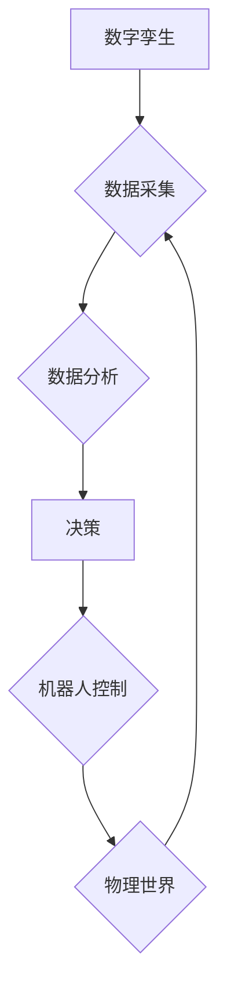

> 自动化、人工智能、机器学习、机器人、物联网、数字孪生、物理世界

## 1. 背景介绍

自动化一直是人类文明进步的驱动力。从最初的轮子发明到如今的智能机器，自动化不断改变着我们的生活方式和生产方式。随着人工智能、机器学习、物联网等技术的快速发展，自动化正迎来一个新的黄金时代。

数字技术与物理世界的融合正在加速，这为自动化带来了前所未有的机遇。数字孪生技术可以模拟物理世界的运行状态，为自动化系统提供精准的决策依据。机器学习算法可以从海量数据中学习，不断提升自动化的智能水平。机器人技术不断突破，赋予机器更强的感知、运动和交互能力。

## 2. 核心概念与联系

**2.1 数字孪生**

数字孪生是指基于物理对象的虚拟模型，通过实时数据采集和分析，模拟物理对象的运行状态、行为模式和未来发展趋势。它可以帮助我们更好地理解物理世界的复杂性，并为自动化系统提供精准的决策依据。

**2.2 物联网**

物联网是指通过传感器、网络和数据分析技术，将物理世界中的各种设备和物体连接起来，形成一个互联互通的网络。物联网为自动化系统提供了海量数据，并为机器与机器之间的通信提供了基础设施。

**2.3 人工智能**

人工智能是指模拟人类智能的计算机系统。机器学习是人工智能的重要分支，它通过算法从数据中学习，不断提升系统的智能水平。人工智能为自动化系统赋予了决策、推理和学习的能力。

**2.4 机器人**

机器人是指能够执行特定任务的机械装置。机器人技术不断发展，机器人拥有更强的感知、运动和交互能力，可以更好地与人类和环境互动。

**2.5 自动化流程图**



## 3. 核心算法原理 & 具体操作步骤

**3.1 算法原理概述**

自动化系统通常采用基于机器学习的算法，例如监督学习、无监督学习和强化学习。这些算法可以从数据中学习，并根据学习到的知识进行决策和控制。

**3.2 算法步骤详解**

1. **数据收集:** 收集与自动化任务相关的各种数据，例如传感器数据、图像数据、文本数据等。
2. **数据预处理:** 对收集到的数据进行清洗、转换和特征提取，使其适合机器学习算法的训练。
3. **模型选择:** 根据自动化任务的特点选择合适的机器学习算法，例如回归算法、分类算法、聚类算法等。
4. **模型训练:** 使用训练数据训练选择的机器学习模型，并调整模型参数，使其能够准确地完成自动化任务。
5. **模型评估:** 使用测试数据评估模型的性能，并根据评估结果进行模型优化。
6. **模型部署:** 将训练好的模型部署到自动化系统中，使其能够实时地进行决策和控制。

**3.3 算法优缺点**

**优点:**

* 自动化程度高，可以提高效率和精度。
* 能够处理复杂的任务，并不断学习和改进。
* 可以减少人工干预，降低成本。

**缺点:**

* 需要大量的训练数据，数据质量对算法性能有重要影响。
* 算法的解释性较差，难以理解模型的决策过程。
* 算法可能存在偏差，导致不公平的结果。

**3.4 算法应用领域**

* 制造业：自动化生产线、机器人焊接、智能巡检
* 交通运输：自动驾驶、智能交通管理
* 金融业：欺诈检测、风险评估、客户服务自动化
* 医疗保健：疾病诊断、药物研发、远程医疗
* 农业：智能农业、精准灌溉、病虫害监测

## 4. 数学模型和公式 & 详细讲解 & 举例说明

**4.1 数学模型构建**

自动化系统中的决策过程通常可以建模为一个优化问题。目标函数表示需要优化的指标，例如成本、时间、效率等。约束条件表示系统运行的限制条件，例如资源限制、安全限制等。

**4.2 公式推导过程**

可以使用线性规划、非线性规划等优化算法求解优化问题。这些算法通过迭代的方式，逐步逼近最优解。

**4.3 案例分析与讲解**

例如，在自动驾驶系统中，目标函数可以是行驶距离的最小化，约束条件可以是安全距离、速度限制等。可以使用线性规划算法求解最优路径，使车辆安全高效地到达目的地。

## 5. 项目实践：代码实例和详细解释说明

**5.1 开发环境搭建**

可以使用Python语言和相关的库进行自动化系统开发。例如，可以使用TensorFlow、PyTorch等库进行机器学习模型的训练和部署。

**5.2 源代码详细实现**

```python
# 这是一个简单的机器学习模型示例
import numpy as np
from sklearn.linear_model import LinearRegression

# 训练数据
X = np.array([[1], [2], [3], [4], [5]])
y = np.array([2, 4, 5, 4, 5])

# 创建线性回归模型
model = LinearRegression()

# 训练模型
model.fit(X, y)

# 预测新数据
new_data = np.array([[6]])
prediction = model.predict(new_data)

# 打印预测结果
print(prediction)
```

**5.3 代码解读与分析**

这段代码演示了如何使用Scikit-learn库训练一个简单的线性回归模型。首先，定义了训练数据和目标变量。然后，创建了一个线性回归模型对象。接着，使用`fit()`方法训练模型，并将训练数据输入模型。最后，使用`predict()`方法预测新数据的输出值。

**5.4 运行结果展示**

运行这段代码后，会输出预测结果，例如`[5.2]`。

## 6. 实际应用场景

**6.1 制造业**

在制造业中，自动化可以提高生产效率、降低成本、提高产品质量。例如，机器人可以代替人工进行重复性操作，例如焊接、喷漆、装配等。

**6.2 交通运输**

在交通运输领域，自动化可以提高交通效率、降低交通事故率、改善交通环境。例如，自动驾驶汽车可以减少交通拥堵，提高道路安全。

**6.3 金融业**

在金融业，自动化可以提高服务效率、降低运营成本、降低风险。例如，人工智能可以用于欺诈检测、风险评估、客户服务自动化等。

**6.4 未来应用展望**

随着人工智能、机器学习、物联网等技术的不断发展，自动化将应用到越来越多的领域，并带来更加深刻的变革。例如，未来可能出现更加智能的机器人，能够自主学习和决策，并与人类更加紧密地合作。

## 7. 工具和资源推荐

**7.1 学习资源推荐**

* **在线课程:** Coursera、edX、Udacity等平台提供丰富的自动化相关课程。
* **书籍:** 《人工智能：一种现代方法》、《深度学习》等书籍可以帮助您深入了解自动化相关知识。
* **开源项目:** TensorFlow、PyTorch等开源项目可以帮助您实践自动化技术。

**7.2 开发工具推荐**

* **Python:** Python是一种流行的编程语言，广泛应用于自动化开发。
* **ROS:** ROS（Robot Operating System）是一个开源机器人操作系统，可以帮助您开发机器人应用。
* **Docker:** Docker是一种容器化技术，可以帮助您构建和部署自动化系统。

**7.3 相关论文推荐**

* **AlphaGo论文:** 《Mastering the Game of Go with Deep Neural Networks and Tree Search》
* **BERT论文:** 《BERT: Pre-training of Deep Bidirectional Transformers for Language Understanding》
* **GPT-3论文:** 《Language Models are Few-Shot Learners》

## 8. 总结：未来发展趋势与挑战

**8.1 研究成果总结**

近年来，自动化技术取得了长足的进步，人工智能、机器学习、物联网等技术为自动化带来了新的机遇。自动化系统已经应用到越来越多的领域，并带来了显著的效益。

**8.2 未来发展趋势**

未来，自动化技术将朝着更加智能、更加安全、更加可解释的方向发展。例如，人工智能将更加强大，能够更好地理解和响应人类的需求。机器人将更加灵活，能够更好地与人类协作。

**8.3 面临的挑战**

自动化技术的发展也面临着一些挑战，例如：

* **数据安全:** 自动化系统依赖于大量数据，数据安全是一个重要的挑战。
* **算法偏见:** 算法可能存在偏见，导致不公平的结果。
* **伦理问题:** 自动化技术可能会带来一些伦理问题，例如工作岗位的替代、人工智能的控制等。

**8.4 研究展望**

未来，我们需要更加重视自动化技术的伦理问题，并制定相应的规范和政策。同时，还需要加强对自动化技术的安全性、可靠性和可解释性的研究，确保自动化技术能够安全、有效地服务于人类。

## 9. 附录：常见问题与解答

**9.1 如何选择合适的自动化算法？**

选择合适的自动化算法需要根据具体的应用场景和数据特点进行选择。例如，对于分类任务，可以使用支持向量机、决策树等算法；对于回归任务，可以使用线性回归、神经网络等算法。

**9.2 如何解决自动化算法的偏见问题？**

可以采用以下方法解决自动化算法的偏见问题：

* 使用更加多样化的训练数据。
* 使用公平性评估指标，评估算法的公平性。
* 开发公平性感知的算法。

**9.3 如何确保自动化系统的安全性？**

可以采用以下方法确保自动化系统的安全性：

* 进行安全评估和测试。
* 使用安全协议和加密技术。
* 设置访问控制和权限管理。


作者：禅与计算机程序设计艺术 / Zen and the Art of Computer Programming 
<end_of_turn>