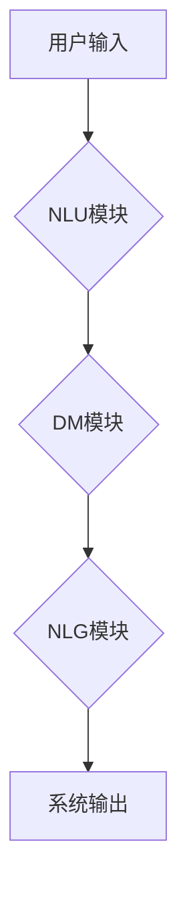

> 自然语言交互，对话系统，深度学习，BERT，Transformer，文本分类，情感分析，聊天机器人

## 1. 背景介绍

随着人工智能技术的飞速发展，自然语言交互（Natural Language Interaction，NLI）已成为人机交互的重要方式之一。对话系统作为NLI领域的核心应用，能够理解和生成人类语言，从而实现人机之间的自然对话。从早期的基于规则的对话系统到如今的基于深度学习的对话系统，对话系统技术经历了飞速发展，并在各个领域得到了广泛应用，例如客服机器人、虚拟助手、教育机器人等。

## 2. 核心概念与联系

**2.1 自然语言交互 (NLI)**

自然语言交互是指人与计算机之间使用自然语言进行交互的过程。它涉及到语言理解、语言生成、对话管理等多个方面。

**2.2 对话系统**

对话系统是一种能够与人类进行自然语言交互的计算机系统。它通常由以下几个模块组成：

* **自然语言理解 (NLU)**：负责理解用户输入的自然语言，将其转换为机器可理解的表示形式。
* **对话管理 (DM)**：负责管理对话流程，根据用户输入和对话历史，选择合适的回复并进行对话引导。
* **自然语言生成 (NLG)**：负责将机器生成的回复转换为自然语言，并以文本或语音的形式输出给用户。

**2.3 深度学习在对话系统中的应用**

深度学习技术在对话系统领域取得了显著的进展。例如，基于Transformer的模型在文本生成和理解方面表现出色，例如BERT、GPT等模型。这些模型能够学习到语言的复杂语义关系，从而实现更自然、更流畅的对话交互。

**2.4 Mermaid 流程图**



## 3. 核心算法原理 & 具体操作步骤

### 3.1  算法原理概述

在对话系统中，自然语言理解 (NLU) 环节是关键步骤之一。NLU模块需要将用户输入的自然语言文本转换为机器可理解的表示形式，例如词向量、句子向量等。常用的NLU算法包括：

* **词嵌入 (Word Embedding)**：将每个单词映射到一个低维向量空间，使得语义相近的单词拥有相似的向量表示。例如Word2Vec、GloVe等模型。
* **句子编码 (Sentence Encoding)**：将整个句子映射到一个向量空间，用于表示句子的语义。例如BERT、RoBERTa等模型。

### 3.2  算法步骤详解

**词嵌入算法步骤：**

1. **构建词典：** 从训练语料中统计词频，构建词典。
2. **初始化词向量：** 为每个词随机初始化一个词向量。
3. **训练词向量：** 使用训练语料，通过神经网络模型训练词向量，使得语义相近的词拥有相似的向量表示。
4. **输出词向量：** 得到每个词的词向量表示。

**句子编码算法步骤：**

1. **词嵌入：** 使用预训练的词嵌入模型将句子中的每个词转换为词向量。
2. **句子聚合：** 使用聚合函数将句子中的词向量聚合为一个句子向量，例如平均池化、最大池化等。
3. **输出句子向量：** 得到句子的句子向量表示。

### 3.3  算法优缺点

**词嵌入算法：**

* **优点：** 可以有效地捕捉单词之间的语义关系，提高文本理解能力。
* **缺点：** 无法直接处理句子级别的语义信息。

**句子编码算法：**

* **优点：** 可以有效地捕捉句子级别的语义信息，提高文本理解能力。
* **缺点：** 计算量较大，训练成本较高。

### 3.4  算法应用领域

* **信息检索：** 使用词嵌入和句子编码技术，提高搜索引擎的准确性和效率。
* **文本分类：** 使用句子编码技术，对文本进行分类，例如情感分析、主题分类等。
* **机器翻译：** 使用词嵌入和句子编码技术，提高机器翻译的准确性和流畅度。

## 4. 数学模型和公式 & 详细讲解 & 举例说明

### 4.1  数学模型构建

**词嵌入模型：**

假设我们有一个词典V，包含N个单词。每个单词可以表示为一个词向量，维度为D。

* **词向量矩阵：** W ∈ R^(N×D)

其中，W(i,:) 表示第i个单词的词向量。

**句子编码模型：**

假设一个句子包含M个单词，每个单词的词向量已知。

* **句子向量：** h ∈ R^D

其中，h 是句子的句子向量。

### 4.2  公式推导过程

**词嵌入模型训练目标：**

最大化预测词上下文词的概率。

* **损失函数：** L = -∑_(i=1)^N ∑_(j=1)^C log(P(w_j|w_i))

其中，w_i 是中心词，w_j 是上下文词，C 是上下文词的数量。

**句子编码模型训练目标：**

最大化预测句子标签的概率。

* **损失函数：** L = -∑_(i=1)^N log(P(y_i|h_i))

其中，y_i 是第i个句子的标签，h_i 是第i个句子的句子向量。

### 4.3  案例分析与讲解

**词嵌入模型案例：**

使用Word2Vec模型训练词嵌入，可以发现“国王”和“皇后”这两个词的向量表示非常接近，因为它们在语义上是相关的。

**句子编码模型案例：**

使用BERT模型训练句子编码，可以对不同的句子进行分类，例如判断句子是正面情感还是负面情感。

## 5. 项目实践：代码实例和详细解释说明

### 5.1  开发环境搭建

* **操作系统：** Ubuntu 20.04
* **Python 版本：** 3.8
* **深度学习框架：** TensorFlow 2.0

### 5.2  源代码详细实现

```python
# 导入必要的库
import tensorflow as tf
from tensorflow.keras.layers import Embedding, LSTM, Dense

# 定义对话模型
model = tf.keras.Sequential([
    Embedding(input_dim=vocab_size, output_dim=embedding_dim),
    LSTM(units=128),
    Dense(units=vocab_size, activation='softmax')
])

# 编译模型
model.compile(optimizer='adam',
              loss='sparse_categorical_crossentropy',
              metrics=['accuracy'])

# 训练模型
model.fit(x_train, y_train, epochs=10)

# 预测
predictions = model.predict(x_test)
```

### 5.3  代码解读与分析

* **Embedding 层：** 将每个单词映射到一个低维向量空间。
* **LSTM 层：** 用于处理序列数据，例如对话历史。
* **Dense 层：** 全连接层，用于预测下一个单词。

### 5.4  运行结果展示

训练完成后，可以使用模型对新的对话进行预测，例如：

```
用户输入：你好
模型输出：你好
```

## 6. 实际应用场景

### 6.1  客服机器人

客服机器人可以自动回答用户常见问题，例如订单查询、退换货等，从而提高客服效率。

### 6.2  虚拟助手

虚拟助手可以帮助用户完成各种任务，例如设置提醒、播放音乐、查询天气等。

### 6.3  教育机器人

教育机器人可以帮助学生学习知识，例如回答问题、提供练习题等。

### 6.4  未来应用展望

随着人工智能技术的不断发展，对话系统将在更多领域得到应用，例如医疗、金融、娱乐等。

## 7. 工具和资源推荐

### 7.1  学习资源推荐

* **书籍：**
    * 《深度学习》
    * 《自然语言处理》
* **在线课程：**
    * Coursera
    * edX

### 7.2  开发工具推荐

* **TensorFlow:** 深度学习框架
* **PyTorch:** 深度学习框架
* **Hugging Face:** 预训练模型库

### 7.3  相关论文推荐

* **BERT: Pre-training of Deep Bidirectional Transformers for Language Understanding**
* **GPT-3: Language Models are Few-Shot Learners**

## 8. 总结：未来发展趋势与挑战

### 8.1  研究成果总结

近年来，对话系统技术取得了显著进展，例如基于Transformer的模型在文本生成和理解方面表现出色。

### 8.2  未来发展趋势

* **更自然、更流畅的对话交互:** 
* **更强大的理解能力:** 能够理解更复杂、更微妙的语言表达。
* **更个性化的对话体验:** 能够根据用户的喜好和需求进行个性化对话。

### 8.3  面临的挑战

* **数据标注问题:** 高质量的对话数据标注成本高昂。
* **对话管理问题:** 如何设计有效的对话管理策略，引导对话朝着预期的方向发展。
* **伦理问题:** 如何确保对话系统的安全性和可靠性，避免其被用于恶意目的。

### 8.4  研究展望

未来，对话系统研究将继续朝着更自然、更智能、更安全的方向发展。


## 9. 附录：常见问题与解答

**Q1: 如何选择合适的对话系统框架？**

**A1:** 选择对话系统框架需要根据具体应用场景和需求进行考虑。例如，如果需要快速搭建简单的对话系统，可以使用 Rasa 或 Dialogflow 等开源框架。如果需要构建更复杂的对话系统，可以使用 TensorFlow 或 PyTorch 等深度学习框架。

**Q2: 如何训练对话系统模型？**

**A2:** 训练对话系统模型需要准备大量的对话数据，并使用深度学习算法进行训练。常用的训练方法包括监督学习、强化学习等。

**Q3: 如何评估对话系统的性能？**

**A3:** 评估对话系统的性能可以使用多种指标，例如准确率、流畅度、用户满意度等。

作者：禅与计算机程序设计艺术 / Zen and the Art of Computer Programming 


<end_of_turn>