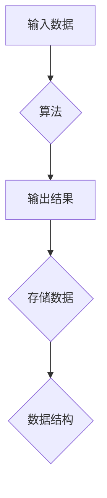

> 计算、算法、数据结构、编程语言、计算机体系结构、逻辑推理、计算模型

## 1. 背景介绍

从人类文明的起源，我们便开始对世界进行抽象和建模。我们用语言记录经验，用工具改造环境，用符号表达逻辑。随着时间的推移，人类对抽象和建模的能力不断提升，最终诞生了“计算”这一概念。

计算，本质上是一种逻辑推理的过程，它通过一系列步骤，对输入数据进行处理，最终生成输出结果。这种逻辑推理可以是简单的，例如加减乘除；也可以是复杂的，例如解决复杂的数学问题、模拟物理现象、识别图像等。

计算机的出现，标志着人类对计算的理解和应用进入了新的阶段。计算机能够以极高的速度执行复杂的计算，并存储海量的计算结果。这使得计算成为现代社会不可或缺的一部分，它推动了科学技术的发展，改变了人们的生活方式。

## 2. 核心概念与联系

### 2.1 计算模型

计算模型是描述计算过程的抽象框架。它定义了计算的基本单元、数据类型、操作规则以及计算流程。常见的计算模型包括：

* **图灵机模型:** 这是最基础的计算模型，它由一个无限长的带、一个读写头和一个状态机组成。图灵机通过读取和写入带上的符号，以及改变状态机状态，来执行计算。
* **冯·诺伊曼体系结构:** 这是现代计算机的通用体系结构，它将数据和程序存储在同一个内存空间中，并通过控制单元协调数据和程序的访问和处理。

### 2.2 算法

算法是解决特定问题的计算步骤序列。它是一个明确、可执行的指令集，能够将输入数据转换为输出结果。

* **算法的特性:**
    * **确定性:** 对于给定的输入，算法必须产生唯一的输出。
    * **有效性:** 算法的步骤必须能够被计算机执行。
    * **终结性:** 算法必须在有限的时间内结束执行。

### 2.3 数据结构

数据结构是用于组织和存储数据的特定方式。不同的数据结构具有不同的特点和应用场景。常见的例子包括：

* **数组:** 一组连续存储的元素。
* **链表:** 一系列节点，每个节点包含数据和指向下一个节点的指针。
* **树:** 一种层次结构的数据结构，每个节点可以有零个或多个子节点。

**Mermaid 流程图**



## 3. 核心算法原理 & 具体操作步骤

### 3.1 算法原理概述

**排序算法**是一种将给定序列的元素按照特定顺序排列的算法。常见的排序算法包括：

* **冒泡排序:** 比较相邻元素，如果顺序错误则交换位置，重复此过程直到整个序列有序。
* **插入排序:** 将一个元素插入到已经排序的序列中，使其保持有序。
* **快速排序:** 选择一个元素作为枢轴，将小于枢轴的元素放在左边，大于枢轴的元素放在右边，递归地对左右子序列进行排序。

### 3.2 算法步骤详解

**冒泡排序算法步骤:**

1. 从序列的第一个元素开始，比较相邻元素。
2. 如果相邻元素的顺序错误，则交换它们的位置。
3. 重复步骤1和2，直到整个序列有序。

**代码示例 (Python):**

```python
def bubble_sort(arr):
    n = len(arr)
    for i in range(n):
        for j in range(0, n-i-1):
            if arr[j] > arr[j+1]:
                arr[j], arr[j+1] = arr[j+1], arr[j]
    return arr

# 测试代码
arr = [64, 34, 25, 12, 22, 11, 90]
sorted_arr = bubble_sort(arr)
print("排序后的数组:", sorted_arr)
```

### 3.3 算法优缺点

**冒泡排序算法的优点:**

* 实现简单，易于理解和实现。

**冒泡排序算法的缺点:**

* 时间复杂度较高，在最坏情况下为 O(n^2)，效率较低。

### 3.4 算法应用领域

排序算法广泛应用于各种领域，例如：

* **数据库管理:** 用于对数据进行排序，提高查询效率。
* **搜索引擎:** 用于对网页进行排序，提高搜索结果的 relevance。
* **人工智能:** 用于对数据进行分类和聚类，提高模型的性能。

## 4. 数学模型和公式 & 详细讲解 & 举例说明

### 4.1 数学模型构建

**时间复杂度**是衡量算法效率的重要指标。它表示算法执行时间与输入数据大小的增长关系。

常见的复杂度表示方法包括：

* **O(n):** 线性时间复杂度，执行时间与输入数据大小成正比。
* **O(n^2):** 平方时间复杂度，执行时间与输入数据大小的平方成正比。
* **O(log n):** 对数时间复杂度，执行时间与输入数据大小的对数成正比。

### 4.2 公式推导过程

**冒泡排序算法的时间复杂度分析:**

* 外层循环执行 n-1 次。
* 内层循环在最坏情况下执行 n-1 次。
* 因此，总共执行时间为 (n-1) * (n-1) = O(n^2)。

### 4.3 案例分析与讲解

**举例说明:**

假设输入数据大小为 n = 10，则冒泡排序算法的时间复杂度为 O(10^2) = O(100)。

## 5. 项目实践：代码实例和详细解释说明

### 5.1 开发环境搭建

* 操作系统: Windows/macOS/Linux
* 编程语言: Python
* 开发工具: VS Code/PyCharm

### 5.2 源代码详细实现

```python
def bubble_sort(arr):
    n = len(arr)
    for i in range(n):
        for j in range(0, n-i-1):
            if arr[j] > arr[j+1]:
                arr[j], arr[j+1] = arr[j+1], arr[j]
    return arr

# 测试代码
arr = [64, 34, 25, 12, 22, 11, 90]
sorted_arr = bubble_sort(arr)
print("排序后的数组:", sorted_arr)
```

### 5.3 代码解读与分析

* 函数 `bubble_sort(arr)`:
    * 接收一个数组 `arr` 作为输入。
    * 使用两个嵌套循环遍历数组，比较相邻元素，并交换位置。
    * 返回排序后的数组。
* 测试代码:
    * 创建一个示例数组 `arr`.
    * 调用 `bubble_sort()` 函数对数组进行排序。
    * 打印排序后的数组。

### 5.4 运行结果展示

```
排序后的数组: [11, 12, 22, 25, 34, 64, 90]
```

## 6. 实际应用场景

排序算法在现实世界中应用广泛，例如：

* **搜索引擎:** 排序网页结果，提高用户体验。
* **电子商务平台:** 排序商品，根据价格、销量、评价等因素进行排序。
* **社交媒体:** 排序用户动态，根据时间、点赞数、评论数等因素进行排序。

### 6.4 未来应用展望

随着人工智能和机器学习的发展，排序算法将应用于更广泛的领域，例如：

* **个性化推荐:** 根据用户的兴趣和行为，推荐个性化的商品、服务和内容。
* **数据分析:** 对海量数据进行排序和分析，发现隐藏的模式和趋势。
* **生物信息学:** 对基因序列进行排序和分析，帮助研究疾病和药物开发。

## 7. 工具和资源推荐

### 7.1 学习资源推荐

* **书籍:**
    * 《算法导论》
    * 《数据结构与算法分析》
* **在线课程:**
    * Coursera: 数据结构与算法
    * edX: 算法导论

### 7.2 开发工具推荐

* **Python:** 
    * VS Code
    * PyCharm
* **C++:**
    * Visual Studio
    * CLion

### 7.3 相关论文推荐

* **The Analysis of Algorithms** by Thomas H. Cormen, Charles E. Leiserson, Ronald L. Rivest, and Clifford Stein
* **Introduction to Algorithms** by Thomas H. Cormen, Charles E. Leiserson, Ronald L. Rivest, and Clifford Stein

## 8. 总结：未来发展趋势与挑战

### 8.1 研究成果总结

计算理论的发展推动了计算机科学的进步，并深刻地影响了人类社会。从图灵机的概念到现代计算机体系结构，从简单的算法到复杂的机器学习模型，计算理论不断拓展着人类对计算的理解和应用。

### 8.2 未来发展趋势

* **量子计算:** 利用量子力学原理进行计算，具有超越经典计算机的计算能力。
* **人工智能:** 通过算法和数据驱动，使计算机能够模拟人类的智能行为。
* **边缘计算:** 将计算能力部署到靠近数据源的位置，降低延迟和提高效率。

### 8.3 面临的挑战

* **算法效率:** 如何设计更高效的算法，解决大规模数据处理和复杂计算问题。
* **数据安全:** 如何保障数据在计算过程中的安全性和隐私性。
* **伦理问题:** 如何确保人工智能的伦理道德，避免算法偏见和歧视。

### 8.4 研究展望

未来，计算理论将继续深入探索计算的本质，并推动计算技术向更智能、更安全、更可持续的方向发展。


## 9. 附录：常见问题与解答

**常见问题:**

* **什么是算法？**
* **什么是时间复杂度？**
* **冒泡排序算法的优缺点是什么？**

**解答:**

* **什么是算法？** 算法是一种解决特定问题的计算步骤序列。它是一个明确、可执行的指令集，能够将输入数据转换为输出结果。
* **什么是时间复杂度？** 时间复杂度是衡量算法效率的重要指标。它表示算法执行时间与输入数据大小的增长关系。
* **冒泡排序算法的优缺点是什么？** 冒泡排序算法的优点是实现简单，易于理解和实现。缺点是时间复杂度较高，在最坏情况下为 O(n^2)，效率较低。


作者：禅与计算机程序设计艺术 / Zen and the Art of Computer Programming 
<end_of_turn>