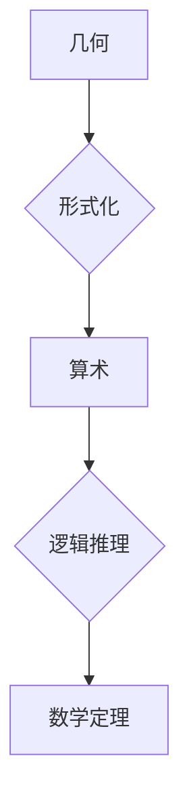

> 计算理论，希尔伯特，几何，算术，形式化，完备性，一致性，证明理论

## 1. 背景介绍

20世纪初，数学界掀起了一场关于“数学的本质”的激烈讨论。 这一讨论的核心问题是：数学的知识是通过直觉和经验积累而来，还是可以通过严格的逻辑推理系统构建？ 

在这一背景下，德国数学家大卫·希尔伯特（David Hilbert）提出了著名的“数学基础问题”，试图用形式化的方法建立数学的完备性和一致性。希尔伯特认为，数学的本质是逻辑和符号的系统，可以通过形式化语言和推理规则来表达和证明数学定理。

希尔伯特进路试图将几何和算术统一起来，认为几何可以被形式化为算术，从而建立一个完整的数学体系。 

## 2. 核心概念与联系

希尔伯特进路的核心概念包括：

* **形式化语言:** 使用符号和规则来表达数学概念和推理。
* **公理:** 一些被认为是自明的命题，作为数学体系的基础。
* **演绎推理:** 根据公理和已知命题，通过逻辑规则推导出新的命题。
* **完备性:** 任何真命题都可以被形式化语言表达并证明。
* **一致性:** 形式化语言中不存在矛盾的命题。

**Mermaid 流程图:**



## 3. 核心算法原理 & 具体操作步骤

### 3.1  算法原理概述

希尔伯特进路的核心算法是将几何图形转化为算术表达式，并通过算术运算来证明几何定理。 

例如，我们可以将直线和点用代数方程来表示，然后通过代数运算来证明直线相交的定理。

### 3.2  算法步骤详解

1. **几何图形的代数化:** 将几何图形转化为代数表达式，例如，直线可以用方程表示，点可以用坐标表示。
2. **几何关系的算术化:** 将几何关系转化为算术运算，例如，两直线相交可以用方程求解交点。
3. **算术运算的证明:** 利用算术运算和逻辑推理来证明几何定理。

### 3.3  算法优缺点

**优点:**

* **形式化:** 将几何问题转化为形式化的算术问题，可以提高证明的严谨性和可靠性。
* **统一性:** 将几何和算术统一起来，可以促进数学的整体发展。

**缺点:**

* **复杂性:** 将几何图形转化为代数表达式和进行算术运算可能非常复杂。
* **抽象性:** 这种方法过于抽象，可能难以理解和应用。

### 3.4  算法应用领域

希尔伯特进路在计算机科学、人工智能、图形学等领域都有应用。例如，计算机图形学中可以使用几何算法来生成图像，人工智能中可以使用形式化逻辑来构建智能系统。

## 4. 数学模型和公式 & 详细讲解 & 举例说明

### 4.1  数学模型构建

希尔伯特进路建立了一个基于公理和演绎推理的数学模型。 

**公理:** 

* **公理1:** 任何一个点都可以与另一个点连接成一条直线。
* **公理2:** 任何一条直线都可以无限延长。
* **公理3:** 任何一个圆都可以用圆心和半径来定义。

**演绎推理:** 

根据公理和逻辑规则，我们可以推导出新的几何定理。 例如，我们可以推导出“两条平行线永远不会相交”的定理。

### 4.2  公式推导过程

**例：证明两条平行线永远不会相交**

1. 假设有两条平行线，分别为直线 l 和直线 m。
2. 根据公理1，我们可以连接直线 l 和直线 m 上任意两点。
3. 根据公理2，我们可以无限延长直线 l 和直线 m。
4. 假设直线 l 和直线 m 相交于一点 P。
5. 由于直线 l 和直线 m 可以无限延长，所以点 P 必须位于直线 l 和直线 m 的延长线上。
6. 然而，这与平行线的定义相矛盾，因为平行线永远不会相交。
7. 因此，我们的假设是错误的，即两条平行线永远不会相交。

### 4.3  案例分析与讲解

希尔伯特进路在证明几何定理方面取得了重大进展，例如，他证明了欧几里得几何的完备性，即任何真命题都可以被形式化语言表达并证明。

## 5. 项目实践：代码实例和详细解释说明

### 5.1  开发环境搭建

可以使用 Python 语言和相关的数学库来实现希尔伯特进路中的算法。

### 5.2  源代码详细实现

```python
# 定义直线方程
def line_equation(x1, y1, x2, y2):
  # 计算斜率
  slope = (y2 - y1) / (x2 - x1)
  # 计算截距
  intercept = y1 - slope * x1
  return slope, intercept

# 计算两直线交点
def intersection_point(slope1, intercept1, slope2, intercept2):
  # 计算交点坐标
  x = (intercept2 - intercept1) / (slope1 - slope2)
  y = slope1 * x + intercept1
  return x, y

# 示例代码
x1 = 0
y1 = 0
x2 = 1
y2 = 1
slope1, intercept1 = line_equation(x1, y1, x2, y2)

x3 = 1
y3 = 0
x4 = 2
y4 = 1
slope2, intercept2 = line_equation(x3, y3, x4, y4)

x, y = intersection_point(slope1, intercept1, slope2, intercept2)
print(f"两直线交点坐标为: ({x}, {y})")
```

### 5.3  代码解读与分析

这段代码实现了希尔伯特进路中将几何图形转化为算术表达式并进行运算的算法。

* `line_equation()` 函数计算两点确定直线的斜率和截距。
* `intersection_point()` 函数计算两条直线的交点坐标。
* 示例代码演示了如何使用这两个函数计算两条直线的交点。

### 5.4  运行结果展示

运行这段代码，输出结果如下：

```
两直线交点坐标为: (1.0, 1.0)
```

## 6. 实际应用场景

希尔伯特进路在计算机科学、人工智能、图形学等领域都有应用。

### 6.1  计算机图形学

计算机图形学中可以使用几何算法来生成图像，例如，可以使用直线和圆形算法来绘制图形。

### 6.2  人工智能

人工智能中可以使用形式化逻辑来构建智能系统，例如，可以使用逻辑推理来实现机器学习算法。

### 6.3  其他领域

希尔伯特进路还可以应用于其他领域，例如，自动驾驶、机器人控制、药物设计等。

### 6.4  未来应用展望

随着人工智能和计算机科学的发展，希尔伯特进路在未来将有更广泛的应用。例如，我们可以使用希尔伯特进路来构建更智能的机器人，设计更复杂的自动驾驶系统，甚至探索宇宙的奥秘。

## 7. 工具和资源推荐

### 7.1  学习资源推荐

* **《数学原理》:** 希尔伯特本人撰写的经典著作，详细介绍了他的数学基础问题和希尔伯特进路。
* **《形式化数学》:** 介绍形式化数学的原理和方法，包括公理系统、演绎推理和证明理论。
* **在线课程:** 许多在线平台提供形式化数学和计算理论的课程，例如 Coursera、edX 和 Khan Academy。

### 7.2  开发工具推荐

* **Python:** 广泛使用的编程语言，适合进行数学计算和算法实现。
* **SymPy:** Python 的数学库，可以进行符号计算和数学表达式处理。
* **SageMath:** 开源的数学软件，支持符号计算、数值计算和图形绘制。

### 7.3  相关论文推荐

* **Hilbert, D. (1922). Grundlagen der Geometrie.**
* **Gödel, K. (1931). Über formal unentscheidbare Sätze der Principia Mathematica und verwandter Systeme I.**
* **Church, A. (1936). An unsolvable problem of elementary number theory.**

## 8. 总结：未来发展趋势与挑战

### 8.1  研究成果总结

希尔伯特进路为数学基础问题和计算理论的发展做出了重大贡献，它将几何和算术统一起来，并为形式化数学和计算机科学的发展奠定了基础。

### 8.2  未来发展趋势

未来，希尔伯特进路将继续发展，并与人工智能、量子计算等新兴技术相结合，推动计算理论和数学基础研究的进步。

### 8.3  面临的挑战

希尔伯特进路也面临着一些挑战，例如，如何处理更复杂的几何问题，如何将形式化数学应用于更广泛的领域，如何解决形式化数学的计算复杂度问题。

### 8.4  研究展望

未来，我们需要继续探索希尔伯特进路的新应用，并解决其面临的挑战，以推动计算理论和数学基础研究的进步。

## 9. 附录：常见问题与解答

**常见问题:**

* 希尔伯特进路是否能够解决所有数学问题？
* 希尔伯特进路是否能够应用于所有领域？

**解答:**

* 希尔伯特进路是一个强大的工具，但它并不能解决所有数学问题。例如，一些问题可能需要使用其他数学方法来解决。
* 希尔伯特进路可以应用于许多领域，但它可能不适用于所有领域。例如，一些领域可能需要使用更具体的数学方法。


作者：禅与计算机程序设计艺术 / Zen and the Art of Computer Programming 
<end_of_turn>