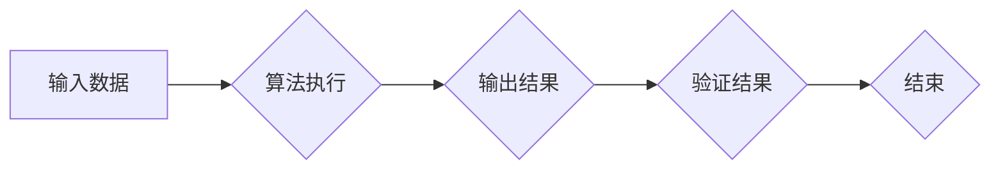

> 计算复杂性，时间复杂度，空间复杂度，NP问题，P问题，算法分析，复杂度理论

## 1. 背景介绍

在计算机科学领域，计算复杂性是研究算法效率和资源消耗的关键问题。随着计算机技术的发展，我们面临着越来越复杂的计算任务，例如破解密码、优化物流、预测天气等。因此，深入理解计算复杂性，并设计出高效的算法，对于解决实际问题至关重要。

计算复杂性理论主要关注算法的运行时间和空间资源消耗。时间复杂度是指算法执行所需的时间，通常用大O符号表示，例如O(n)，O(n^2)，O(log n)等。空间复杂度是指算法执行过程中使用的内存空间，也通常用大O符号表示。

## 2. 核心概念与联系

### 2.1  时间复杂度

时间复杂度是衡量算法效率的重要指标，它描述了算法执行时间随输入规模变化的趋势。

* **O(1)：常数时间复杂度**：算法执行时间与输入规模无关，无论输入大小如何，执行时间始终为常数。
* **O(log n)：对数时间复杂度**：算法执行时间随输入规模的增长而增长，但增长速度非常缓慢，例如二分查找算法。
* **O(n)：线性时间复杂度**：算法执行时间与输入规模成正比，例如线性搜索算法。
* **O(n log n)：线性对数时间复杂度**：算法执行时间与输入规模的乘积与对数成正比，例如快速排序算法。
* **O(n^2)：平方时间复杂度**：算法执行时间与输入规模的平方成正比，例如冒泡排序算法。

### 2.2  空间复杂度

空间复杂度是指算法执行过程中使用的内存空间大小。

* **O(1)：常数空间复杂度**：算法使用的内存空间与输入规模无关，始终为常数。
* **O(n)：线性空间复杂度**：算法使用的内存空间与输入规模成正比，例如存储输入数据所需的内存空间。
* **O(n^2)：平方空间复杂度**：算法使用的内存空间与输入规模的平方成正比。

### 2.3  NP问题和P问题

NP问题是指可以通过多项式时间验证的语言，但可能需要指数时间才能找到解。P问题是指可以在多项式时间内被解决的语言。

NP问题和P问题之间的关系是计算机科学领域的一个重要未解之谜。如果P=NP，则意味着任何NP问题都可以被高效解决，这将对许多领域产生革命性的影响。

**Mermaid 流程图**



## 3. 核心算法原理 & 具体操作步骤

### 3.1  算法原理概述

**举例说明：**

快速排序算法是一种高效的排序算法，其时间复杂度为O(n log n)。其原理是通过选择一个“枢轴”元素，将数组划分为两个子数组，其中一个子数组包含小于枢轴元素的元素，另一个子数组包含大于枢轴元素的元素。然后递归地对两个子数组进行排序，直到整个数组被排序完成。

### 3.2  算法步骤详解

1. 选择一个枢轴元素。
2. 将数组划分为两个子数组，一个包含小于枢轴元素的元素，另一个包含大于枢轴元素的元素。
3. 递归地对两个子数组进行排序。

### 3.3  算法优缺点

**优点：**

* 时间复杂度为O(n log n)，在大多数情况下都非常高效。
* 空间复杂度为O(log n)，相对较低。

**缺点：**

* 在某些情况下，例如数组已经有序时，时间复杂度可能会退化为O(n^2)。
* 选择枢轴元素的方式可能会影响算法的效率。

### 3.4  算法应用领域

快速排序算法广泛应用于各种场景，例如：

* 数据排序
* 搜索算法
* 图算法

## 4. 数学模型和公式 & 详细讲解 & 举例说明

### 4.1  数学模型构建

时间复杂度通常用大O符号表示，例如O(n)，O(n^2)，O(log n)等。这些符号表示算法执行时间随输入规模变化的趋势。

### 4.2  公式推导过程

例如，对于线性时间复杂度算法，其执行时间可以表示为T(n) = an + b，其中a和b为常数。当输入规模n趋于无穷大时，T(n)也趋于无穷大，因此其时间复杂度为O(n)。

### 4.3  案例分析与讲解

**举例说明：**

对于冒泡排序算法，其时间复杂度为O(n^2)。其执行过程是比较相邻的两个元素，如果顺序错误则交换位置。这个过程需要进行n-1次比较，每次比较都需要进行n-1次交换，因此总共需要进行O(n^2)次比较和交换。

## 5. 项目实践：代码实例和详细解释说明

### 5.1  开发环境搭建

* 操作系统：Windows/macOS/Linux
* 编程语言：Python
* 开发工具：VS Code/Atom/Sublime Text

### 5.2  源代码详细实现

```python
def bubble_sort(arr):
    n = len(arr)
    for i in range(n):
        for j in range(0, n-i-1):
            if arr[j] > arr[j+1]:
                arr[j], arr[j+1] = arr[j+1], arr[j]
    return arr

# 测试代码
arr = [64, 34, 25, 12, 22, 11, 90]
sorted_arr = bubble_sort(arr)
print("排序后的数组:", sorted_arr)
```

### 5.3  代码解读与分析

* `bubble_sort(arr)`函数接收一个数组`arr`作为输入。
* 外层循环`for i in range(n)`控制迭代次数，每次迭代将最大的元素“冒泡”到数组末尾。
* 内层循环`for j in range(0, n-i-1)`比较相邻元素，如果顺序错误则交换位置。
* `arr[j], arr[j+1] = arr[j+1], arr[j]`使用Python的元组解包语法进行元素交换。
* 最后返回排序后的数组`sorted_arr`。

### 5.4  运行结果展示

```
排序后的数组: [11, 12, 22, 25, 34, 64, 90]
```

## 6. 实际应用场景

### 6.1  数据排序

快速排序算法广泛应用于数据排序，例如：

* 数据库索引
* 搜索引擎结果排序
* 数据分析

### 6.2  搜索算法

快速排序算法可以用于优化搜索算法，例如：

* 二分查找

### 6.3  图算法

快速排序算法也可以应用于图算法，例如：

* 图的排序

### 6.4  未来应用展望

随着计算机技术的发展，计算复杂性理论将继续发挥重要作用。未来，我们可能会看到：

* 更高效的算法
* 更强大的计算能力
* 更广泛的应用场景

## 7. 工具和资源推荐

### 7.1  学习资源推荐

* **书籍:**
    * 《算法导论》
    * 《计算复杂性导论》
* **在线课程:**
    * Coursera: Algorithms
    * edX: Introduction to Algorithms

### 7.2  开发工具推荐

* **编程语言:** Python, Java, C++
* **开发环境:** VS Code, Atom, Sublime Text

### 7.3  相关论文推荐

* **P vs NP问题:**
    * The P versus NP Problem
* **快速排序算法:**
    * Quicksort Algorithm

## 8. 总结：未来发展趋势与挑战

### 8.1  研究成果总结

计算复杂性理论已经取得了巨大的进展，我们已经了解了许多算法的效率和资源消耗。

### 8.2  未来发展趋势

未来，计算复杂性理论的研究将继续深入，例如：

* 研究更复杂的算法
* 探索新的计算模型
* 寻找解决P vs NP问题的线索

### 8.3  面临的挑战

计算复杂性理论也面临着一些挑战，例如：

* 许多NP问题仍然无法被高效解决
* 随着计算任务的复杂化，算法效率的提升变得更加困难

### 8.4  研究展望

尽管面临挑战，但计算复杂性理论的研究仍然充满希望。未来，我们将继续探索计算的极限，并开发出更强大、更高效的算法，以解决人类面临的各种挑战。

## 9. 附录：常见问题与解答

### 9.1  什么是时间复杂度？

时间复杂度是指算法执行时间随输入规模变化的趋势，通常用大O符号表示。

### 9.2  什么是空间复杂度？

空间复杂度是指算法执行过程中使用的内存空间大小，通常用大O符号表示。

### 9.3  什么是NP问题？

NP问题是指可以通过多项式时间验证的语言，但可能需要指数时间才能找到解。

### 9.4  什么是P问题？

P问题是指可以在多项式时间内被解决的语言。

### 9.5  P=NP吗？

P=NP问题是计算机科学领域的一个重要未解之谜。

作者：禅与计算机程序设计艺术 / Zen and the Art of Computer Programming


<end_of_turn>