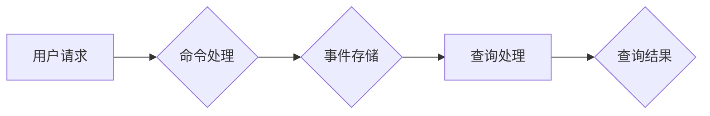

> 软件2.0, 事件溯源, CQRS, 命令模式, 查询模式, 事件存储, 数据一致性, 分布式系统

## 1. 背景介绍

随着软件系统规模的不断扩大，对系统可靠性、可维护性和可扩展性的要求也越来越高。传统的软件架构模式已经难以满足这些需求，因此，软件2.0时代应运而生。软件2.0强调事件驱动、微服务、数据一致性等理念，旨在构建更加灵活、高效、可扩展的软件系统。

事件溯源是软件2.0的重要组成部分，它通过记录和追踪系统内发生的事件，实现对系统状态的完整记录和可追溯性。而CQRS模式（Command Query Responsibility Segregation）则是一种常见的软件架构模式，它将系统功能分为命令处理和查询处理两部分，并分别使用不同的数据存储和处理机制，从而提高系统的性能和可维护性。

## 2. 核心概念与联系

**2.1 CQRS模式**

CQRS模式的核心思想是将系统功能分为两个职责：

* **命令处理（Command）：** 处理用户请求，修改系统状态。
* **查询处理（Query）：** 读取系统状态，返回给用户。

CQRS模式将命令和查询分离，并使用不同的数据存储和处理机制，从而提高系统的性能和可维护性。

**2.2 事件溯源**

事件溯源是指记录和追踪系统内发生的事件，并能够根据事件历史追溯系统状态变化的过程。

**2.3 CQRS与事件溯源的联系**

CQRS模式与事件溯源相结合，可以实现更加完善的事件溯源功能。

* CQRS模式中的命令处理可以将事件记录到事件存储中。
* 查询处理可以根据事件历史查询系统状态。

**2.4 CQRS与事件溯源的架构图**



## 3. 核心算法原理 & 具体操作步骤

**3.1 算法原理概述**

CQRS模式与事件溯源的结合，主要基于以下算法原理：

* **命令模式:** 将用户请求转换为命令对象，并将其存储到事件存储中。
* **查询模式:** 根据事件历史查询系统状态，并返回给用户。
* **事件存储:** 使用事件存储来记录系统内发生的事件，并提供查询接口。

**3.2 算法步骤详解**

1. **用户请求:** 用户发出请求，例如创建订单、修改商品信息等。
2. **命令处理:** 系统将用户请求转换为命令对象，并将其存储到事件存储中。
3. **事件存储:** 事件存储将事件记录到数据库或消息队列中。
4. **查询处理:** 用户发出查询请求，例如查询订单状态、查询商品信息等。
5. **查询处理:** 系统根据事件历史查询系统状态，并返回给用户。

**3.3 算法优缺点**

**优点:**

* **提高性能:** 命令处理和查询处理分离，可以提高系统的性能。
* **提高可维护性:** CQRS模式可以将系统功能模块化，提高系统的可维护性。
* **实现事件溯源:** 事件存储可以实现对系统状态的完整记录和可追溯性。

**缺点:**

* **复杂性增加:** CQRS模式的实现相对复杂，需要更多的开发和维护成本。
* **数据一致性问题:** 需要考虑命令处理和查询处理之间的数据一致性问题。

**3.4 算法应用领域**

CQRS模式与事件溯源的结合，广泛应用于以下领域:

* **电商平台:** 记录订单、商品信息等事件，实现订单追踪和商品溯源。
* **金融系统:** 记录交易、账户变动等事件，实现交易记录和资金流向追踪。
* **社交网络:** 记录用户行为、消息发送等事件，实现用户行为分析和消息溯源。

## 4. 数学模型和公式 & 详细讲解 & 举例说明

**4.1 数学模型构建**

我们可以使用状态机模型来描述系统状态的演变过程。

* 状态机：一个具有状态和转换规则的模型。
* 状态：系统当前的状态。
* 转换规则：描述系统状态如何根据事件发生而改变的规则。

**4.2 公式推导过程**

假设系统有状态 S 和事件 E，则状态转换规则可以表示为：

```latex
S' = f(S, E)
```

其中：

* S'：系统新的状态。
* f：状态转换函数。

**4.3 案例分析与讲解**

例如，一个简单的订单系统，状态可以分为“待支付”、“已支付”、“已发货”、“已收货”等。当用户发起支付请求时，系统状态会从“待支付”转换为“已支付”。

**4.4 事件存储模型**

事件存储可以采用以下模型：

* **时间序列存储:** 将事件按照时间顺序存储。
* **主题订阅存储:** 将事件按照主题分类存储。

**4.5 数据一致性问题**

在CQRS模式中，需要考虑命令处理和查询处理之间的数据一致性问题。可以使用以下方法保证数据一致性：

* **乐观锁:** 在命令处理过程中，使用乐观锁机制来避免数据冲突。
* **悲观锁:** 在命令处理过程中，使用悲观锁机制来保证数据一致性。
* **事件补偿:** 当命令处理失败时，使用事件补偿机制来恢复系统状态。

## 5. 项目实践：代码实例和详细解释说明

**5.1 开发环境搭建**

* 语言：Python
* 框架：Django
* 数据库：PostgreSQL
* 事件存储：RabbitMQ

**5.2 源代码详细实现**

```python
# 命令处理类
class CreateOrderCommand:
    def __init__(self, user_id, product_id, quantity):
        self.user_id = user_id
        self.product_id = product_id
        self.quantity = quantity

    def execute(self):
        # 创建订单逻辑
        # ...

# 查询处理类
class GetOrderQuery:
    def __init__(self, order_id):
        self.order_id = order_id

    def execute(self):
        # 查询订单逻辑
        # ...

# 事件存储类
class EventStore:
    def save_event(self, event):
        # 保存事件到数据库或消息队列
        # ...

    def get_events(self, order_id):
        # 查询事件历史
        # ...
```

**5.3 代码解读与分析**

* 命令处理类负责处理用户请求，并将其转换为命令对象。
* 查询处理类负责根据事件历史查询系统状态。
* 事件存储类负责记录和查询事件历史。

**5.4 运行结果展示**

当用户发起创建订单请求时，系统会执行CreateOrderCommand命令，并将事件存储到事件存储中。用户可以根据订单ID查询订单状态，系统会根据事件历史返回订单状态信息。

## 6. 实际应用场景

**6.1 电商平台**

* 记录订单、商品信息等事件，实现订单追踪和商品溯源。
* 根据用户行为记录，进行个性化推荐和营销活动。

**6.2 金融系统**

* 记录交易、账户变动等事件，实现交易记录和资金流向追踪。
* 根据交易记录，进行风险控制和欺诈检测。

**6.3 社交网络**

* 记录用户行为、消息发送等事件，实现用户行为分析和消息溯源。
* 根据用户行为，进行个性化内容推荐和社交关系分析。

**6.4 未来应用展望**

* 事件溯源技术将更加广泛地应用于各个领域，例如医疗、教育、制造业等。
* 事件驱动架构将成为主流的软件架构模式，并与人工智能、云计算等技术深度融合。

## 7. 工具和资源推荐

**7.1 学习资源推荐**

* CQRS模式：https://martinfowler.com/bliki/CQRS.html
* 事件溯源：https://en.wikipedia.org/wiki/Event_sourcing

**7.2 开发工具推荐**

* 事件存储：RabbitMQ, Kafka
* 数据库：PostgreSQL, MongoDB

**7.3 相关论文推荐**

* Event Sourcing: A New Paradigm for Software Development
* CQRS: Command Query Responsibility Segregation

## 8. 总结：未来发展趋势与挑战

**8.1 研究成果总结**

CQRS模式与事件溯源的结合，为软件系统提供了更加灵活、高效、可扩展的架构模式。

**8.2 未来发展趋势**

* 事件驱动架构将更加成熟和完善。
* 事件溯源技术将更加广泛地应用于各个领域。
* 事件驱动架构将与人工智能、云计算等技术深度融合。

**8.3 面临的挑战**

* CQRS模式的实现相对复杂，需要更多的开发和维护成本。
* 数据一致性问题需要得到更加有效的解决。
* 事件存储的规模和性能需要得到进一步提升。

**8.4 研究展望**

* 研究更加高效、可扩展的事件驱动架构模式。
* 研究更加有效的解决数据一致性问题的方法。
* 研究更加智能、自适应的事件存储系统。

## 9. 附录：常见问题与解答

**9.1 如何保证数据一致性？**

可以使用乐观锁、悲观锁或事件补偿机制来保证数据一致性。

**9.2 如何选择合适的事件存储？**

需要根据系统的需求和规模选择合适的事件存储，例如RabbitMQ、Kafka等。

**9.3 CQRS模式的实现难度大吗？**

CQRS模式的实现相对复杂，需要一定的开发经验和架构设计能力。


作者：禅与计算机程序设计艺术 / Zen and the Art of Computer Programming 
<end_of_turn>