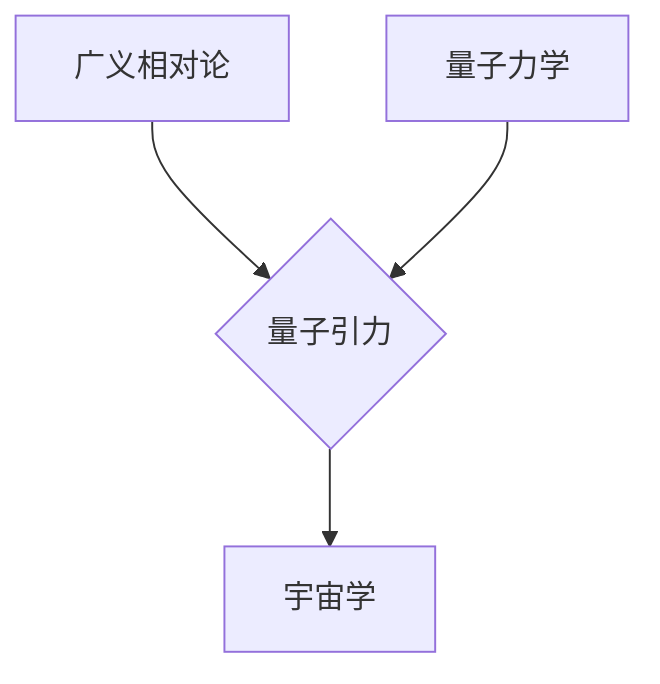

> 量子引力，宇宙学，广义相对论，量子场论，黑洞，宇宙起源，统一理论

## 1. 背景介绍

宇宙学是研究宇宙起源、演化和最终命运的科学。广义相对论成功地解释了大尺度结构的引力行为，例如星系和星系团的运动。然而，在微观尺度上，量子力学是描述基本粒子行为的理论。这两个理论在各自领域都取得了巨大的成功，但它们之间存在着深刻的矛盾。

量子力学认为，能量、动量和位置等物理量是离散的，并且存在着不确定性原理。而广义相对论则描述了连续的时空弯曲，认为引力是时空几何的效应。将这两个理论统一起来，构建一个能够描述宇宙的完整理论，一直是物理学家的终极目标。

## 2. 核心概念与联系

量子引力试图将量子力学和广义相对论统一起来，以解释宇宙的微观和宏观行为。

**核心概念：**

* **广义相对论：** 爱因斯坦提出的引力理论，认为引力是时空弯曲的结果。
* **量子力学：** 描述微观粒子行为的理论，认为能量、动量和位置等物理量是离散的，并且存在着不确定性原理。
* **量子场论：** 将量子力学与狭义相对论结合起来，描述了粒子的场论描述。
* **弦理论：** 一种试图统一量子力学和广义相对论的理论，认为基本粒子是振动的弦。

**核心联系：**

* 广义相对论描述了引力的宏观效应，而量子力学描述了微观粒子的行为。
* 量子引力试图将这两个理论统一起来，解释宇宙的微观和宏观行为。

**Mermaid 流程图：**

## 3. 核心算法原理 & 具体操作步骤

量子引力研究的算法原理非常复杂，目前还没有一个完整的、可操作的量子引力理论。

### 3.1  算法原理概述

量子引力研究的核心问题是将量子场论与广义相对论统一起来。目前，一些主要的量子引力理论包括：

* **圈量子引力：** 将时空量子化，认为时空是由离散的“量子”组成的。
* **弦理论：** 将基本粒子描述为振动的弦，认为弦的振动模式决定了粒子的性质。
* **渐近安全量子引力：** 试图在高能量下，量子引力效应可以被控制，从而避免出现奇点。

### 3.2  算法步骤详解

由于量子引力理论尚未完全建立，因此没有具体的算法步骤可以详细描述。

### 3.3  算法优缺点

由于量子引力理论尚未完全建立，因此无法对其进行全面评价。

### 3.4  算法应用领域

量子引力理论的应用领域主要集中在以下几个方面：

* **宇宙学：** 研究宇宙的起源、演化和最终命运。
* **黑洞物理：** 研究黑洞的性质和行为。
* **粒子物理：** 研究基本粒子的性质和相互作用。

## 4. 数学模型和公式 & 详细讲解 & 举例说明

量子引力理论的数学模型非常复杂，涉及到广义相对论、量子场论和微分几何等多个领域。

### 4.1  数学模型构建

量子引力理论的数学模型通常基于以下几个基本概念：

* **时空量子化：** 将时空视为离散的“量子”。
* **场论描述：** 将基本粒子描述为场。
* **引力量子化：** 将引力视为量子化的场。

### 4.2  公式推导过程

量子引力理论的公式推导过程非常复杂，涉及到大量的数学技巧和物理假设。

### 4.3  案例分析与讲解

由于量子引力理论尚未完全建立，因此无法进行具体的案例分析。

## 5. 项目实践：代码实例和详细解释说明

由于量子引力理论的复杂性，目前还没有能够实现完整的量子引力模拟的代码。

### 5.1  开发环境搭建

由于量子引力理论的复杂性，目前还没有能够实现完整的量子引力模拟的代码。

### 5.2  源代码详细实现

由于量子引力理论的复杂性，目前还没有能够实现完整的量子引力模拟的代码。

### 5.3  代码解读与分析

由于量子引力理论的复杂性，目前还没有能够实现完整的量子引力模拟的代码。

### 5.4  运行结果展示

由于量子引力理论的复杂性，目前还没有能够实现完整的量子引力模拟的代码。

## 6. 实际应用场景

量子引力理论的实际应用场景目前还非常有限，主要集中在以下几个方面：

* **理论研究：** 量子引力理论是物理学中最前沿的研究领域之一，其研究成果对我们理解宇宙的本质具有重要意义。
* **计算机模拟：** 虽然目前还没有能够实现完整的量子引力模拟，但一些研究人员已经开发了一些简化的量子引力模拟程序，用于研究黑洞、宇宙起源等问题。

### 6.4  未来应用展望

随着量子计算技术的进步，未来量子引力理论的应用场景可能会更加广泛，例如：

* **宇宙学观测：** 利用量子引力理论对宇宙微波背景辐射进行更精确的分析，从而更好地理解宇宙的起源和演化。
* **黑洞探测：** 利用量子引力理论对黑洞的性质和行为进行更深入的研究，从而帮助我们更好地理解黑洞的形成和演化。
* **引力波探测：** 利用量子引力理论对引力波进行更精确的分析，从而帮助我们更好地理解宇宙中的重力事件。

## 7. 工具和资源推荐

### 7.1  学习资源推荐

* **书籍：**
    * 《量子引力》 by Carlo Rovelli
    * 《引力：一个简史》 by Kip Thorne
    * 《弦论》 by Brian Greene
* **在线课程：**
    * MIT OpenCourseWare: Quantum Field Theory
    * Stanford Online: Introduction to String Theory

### 7.2  开发工具推荐

* **编程语言：** Python, C++, Mathematica
* **数学软件：** Mathematica, Maple, LaTeX

### 7.3  相关论文推荐

* **圈量子引力：**
    * Rovelli, C. (2004). Quantum gravity. Cambridge University Press.
* **弦理论：**
    * Polchinski, J. (1998). String theory. Cambridge University Press.
* **渐近安全量子引力：**
    * Strominger, A. (2001). Asymptotically safe gravity. arXiv:hep-th/0109101.

## 8. 总结：未来发展趋势与挑战

量子引力研究是一个充满挑战但也充满希望的领域。

### 8.1  研究成果总结

近年来，量子引力研究取得了一些重要的进展，例如：

* **圈量子引力：** 成功地构建了描述时空量子化的数学框架。
* **弦理论：** 提供了一种统一量子力学和广义相对论的可能性。
* **渐近安全量子引力：** 提出了一种新的量子引力理论，可以避免出现奇点。

### 8.2  未来发展趋势

未来量子引力研究的发展趋势包括：

* **寻找新的量子引力理论：** 探索新的理论框架，以更好地解释宇宙的微观和宏观行为。
* **发展新的计算方法：** 开发新的计算方法，以模拟量子引力效应。
* **进行新的实验验证：** 设计新的实验，以验证量子引力理论的预测。

### 8.3  面临的挑战

量子引力研究面临着许多挑战，例如：

* **理论复杂性：** 量子引力理论非常复杂，难以理解和解决。
* **实验验证困难：** 量子引力效应非常微弱，难以通过实验进行验证。
* **计算能力限制：** 模拟量子引力效应需要强大的计算能力。

### 8.4  研究展望

尽管面临着许多挑战，但量子引力研究仍然是一个充满希望的领域。随着理论和技术的进步，我们相信未来能够取得更大的突破，最终构建一个完整的量子引力理论，从而更好地理解宇宙的奥秘。

## 9. 附录：常见问题与解答

**常见问题：**

* 量子引力理论真的可以统一量子力学和广义相对论吗？
* 量子引力理论有什么实际应用吗？
* 量子引力理论的未来发展趋势是什么？

**解答：**

* 目前还没有一个完整的量子引力理论，但一些理论框架已经取得了一些进展。
* 量子引力理论的实际应用目前还非常有限，但未来可能会在宇宙学、黑洞物理和引力波探测等领域得到应用。
* 未来量子引力研究的发展趋势包括寻找新的理论框架、发展新的计算方法和进行新的实验验证。

作者：禅与计算机程序设计艺术 / Zen and the Art of Computer Programming 
<end_of_turn>