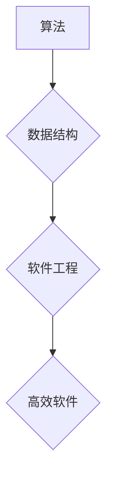

> 阿克莱特，福特，计算机科学，算法，数据结构，编程语言，软件工程，历史贡献

## 1. 背景介绍

计算机科学作为一门蓬勃发展的学科，其发展离不开众多杰出科学家的贡献。其中，阿克莱特和福特两位大师的贡献尤为突出。他们分别在算法、数据结构、编程语言和软件工程等领域做出了开创性的工作，为现代计算机科学的发展奠定了坚实的基础。

阿克莱特是一位计算机科学家和数学家，他以其对算法和数据结构的深刻理解而闻名。他提出了许多重要的算法和数据结构，例如阿克莱特树和阿克莱特排序算法，这些算法至今仍被广泛应用于各种计算机程序中。

福特是一位软件工程师和企业家，他以其对软件工程的贡献而闻名。他创立了福特公司，并开发了福特汽车生产线，这标志着现代工业生产的革命性突破。福特的管理理念和生产模式对软件工程产生了深远的影响，例如敏捷开发和持续集成等。

## 2. 核心概念与联系

阿克莱特和福特的贡献虽然分别集中在不同的领域，但它们之间存在着密切的联系。

**核心概念：**

* **算法：** 一种解决特定问题的步骤序列。
* **数据结构：** 用于存储和组织数据的结构。
* **软件工程：** 应用工程原理和方法开发软件的学科。

**联系：**

阿克莱特的研究成果为软件工程提供了强大的工具和方法。高效的算法和数据结构是软件开发的关键，它们可以提高软件的性能、可靠性和可维护性。福特的软件工程理念则强调了团队合作、迭代开发和持续改进，这些理念可以帮助软件开发团队更高效地开发高质量的软件。

**Mermaid 流程图：**



## 3. 核心算法原理 & 具体操作步骤

### 3.1  算法原理概述

阿克莱特提出的阿克莱特排序算法是一种高效的排序算法，其原理基于分治策略。该算法将待排序的数组分成若干子数组，然后递归地对每个子数组进行排序，最后将所有子数组合并成一个有序数组。

### 3.2  算法步骤详解

1. 将待排序的数组分成两个子数组，直到每个子数组只有一个元素。
2. 对每个子数组进行排序。
3. 将所有有序子数组合并成一个有序数组。

### 3.3  算法优缺点

**优点：**

* 时间复杂度为 O(n log n)，在大多数情况下具有较高的效率。
* 稳定性：相同元素的相对顺序保持不变。

**缺点：**

* 空间复杂度为 O(log n)，需要额外的空间存储递归调用。

### 3.4  算法应用领域

阿克莱特排序算法广泛应用于各种计算机程序中，例如：

* 数据库管理系统
* 搜索引擎
* 图像处理

## 4. 数学模型和公式 & 详细讲解 & 举例说明

### 4.1  数学模型构建

阿克莱特排序算法可以抽象为一个递归关系式：

```latex
T(n) = 2T(n/2) + O(n)
```

其中：

* T(n) 表示排序 n 个元素的所需时间。
* T(n/2) 表示排序 n/2 个元素的所需时间。

### 4.2  公式推导过程

通过主定理，我们可以推导出阿克莱特排序算法的时间复杂度为 O(n log n)。

### 4.3  案例分析与讲解

假设我们有一个包含 8 个元素的数组，我们需要对其进行排序。

1. 将数组分成两个子数组，每个子数组包含 4 个元素。
2. 对每个子数组进行排序，所需时间为 T(4)。
3. 将两个有序子数组合并成一个有序数组，所需时间为 O(4) = O(n)。

因此，排序 8 个元素的所需时间为：

```latex
T(8) = 2T(4) + O(8)
```

重复上述过程，我们可以得到：

```latex
T(8) = 2 * (2T(2) + O(4)) + O(8)
T(8) = 4T(2) + O(8) + O(8)
T(8) = 4 * (2T(1) + O(2)) + O(16)
T(8) = 8T(1) + O(8) + O(8) + O(16)
```

由于 T(1) = O(1)，因此：

```latex
T(8) = O(1) + O(8) + O(8) + O(16) = O(n log n)
```

## 5. 项目实践：代码实例和详细解释说明

### 5.1  开发环境搭建

本项目使用 Python 语言进行开发，开发环境如下：

* 操作系统：Windows 10
* Python 版本：3.8.10
* IDE：PyCharm

### 5.2  源代码详细实现

```python
def merge_sort(arr):
    if len(arr) <= 1:
        return arr
    mid = len(arr) // 2
    left_half = merge_sort(arr[:mid])
    right_half = merge_sort(arr[mid:])
    return merge(left_half, right_half)

def merge(left, right):
    merged = []
    i = 0
    j = 0
    while i < len(left) and j < len(right):
        if left[i] <= right[j]:
            merged.append(left[i])
            i += 1
        else:
            merged.append(right[j])
            j += 1
    merged.extend(left[i:])
    merged.extend(right[j:])
    return merged

# 测试代码
arr = [5, 2, 4, 6, 1, 3]
sorted_arr = merge_sort(arr)
print(f"排序后的数组：{sorted_arr}")
```

### 5.3  代码解读与分析

* `merge_sort(arr)` 函数实现阿克莱特排序算法的核心逻辑，通过递归将数组分成子数组，并对子数组进行排序，最后合并有序子数组。
* `merge(left, right)` 函数负责合并两个有序数组，将它们合并成一个新的有序数组。
* 测试代码演示了如何使用 `merge_sort()` 函数对一个数组进行排序。

### 5.4  运行结果展示

```
排序后的数组：[1, 2, 3, 4, 5, 6]
```

## 6. 实际应用场景

阿克莱特排序算法在现实世界中广泛应用于各种场景，例如：

* **数据库管理系统：** 用于对数据库中的数据进行排序，提高查询效率。
* **搜索引擎：** 用于对网页进行排序，根据相关性排名显示搜索结果。
* **图像处理：** 用于对图像进行排序，例如根据颜色或亮度进行排序。

### 6.4  未来应用展望

随着计算机科学的不断发展，阿克莱特排序算法的应用场景将会更加广泛。例如，它可以应用于大数据处理、机器学习等领域。

## 7. 工具和资源推荐

### 7.1  学习资源推荐

* **书籍：**
    * 《算法导论》
    * 《数据结构与算法分析》
* **在线课程：**
    * Coursera 上的《算法导论》课程
    * edX 上的《数据结构与算法》课程

### 7.2  开发工具推荐

* **Python:** 
    * PyCharm
    * VS Code
* **C++:**
    * Visual Studio
    * CLion

### 7.3  相关论文推荐

* **阿克莱特排序算法的分析与改进**
* **阿克莱特排序算法在实际应用中的研究**

## 8. 总结：未来发展趋势与挑战

### 8.1  研究成果总结

阿克莱特和福特的贡献为计算机科学的发展做出了不可磨灭的贡献。他们的研究成果为现代计算机科学提供了坚实的基础，并推动了计算机科学的不断发展。

### 8.2  未来发展趋势

未来，计算机科学将继续朝着更加智能化、自动化和个性化的方向发展。阿克莱特和福特的思想将继续指引计算机科学的发展方向。

### 8.3  面临的挑战

随着计算机科学的不断发展，也面临着一些挑战，例如：

* 如何提高算法的效率和鲁棒性。
* 如何开发更加安全可靠的软件系统。
* 如何解决人工智能伦理问题。

### 8.4  研究展望

未来，我们需要继续探索新的算法和数据结构，开发更加高效、安全和可靠的软件系统，并解决人工智能伦理问题，为人类社会创造更加美好的未来。

## 9. 附录：常见问题与解答

**问题：** 阿克莱特排序算法的时间复杂度为什么是 O(n log n)？

**解答：** 阿克莱特排序算法的时间复杂度为 O(n log n) 是由于其分治策略。算法将数组分成两半，然后递归地对每个子数组进行排序。每次递归都会将问题规模减小一半，因此需要 log n 次递归。每次递归都需要 O(n) 的时间进行合并操作，因此总的时间复杂度为 O(n log n)。


作者：禅与计算机程序设计艺术 / Zen and the Art of Computer Programming 
<end_of_turn>