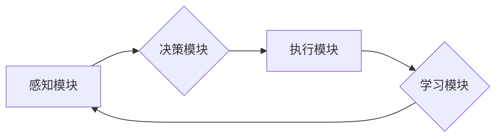

> AI Agent, 软件架构, 硬件协同, 深度学习, 机器学习, 智能代理, 嵌入式系统, 

## 1. 背景介绍

人工智能（AI）正在经历前所未有的发展，从语音识别到图像生成，AI已经渗透到我们生活的方方面面。然而，传统的AI模型大多依赖于庞大的数据中心和高性能计算资源，这限制了其在边缘设备和资源受限环境中的应用。

为了解决这一问题，AI Agent的概念应运而生。AI Agent是一种能够自主学习、决策和执行任务的智能实体，它可以独立运行在各种硬件平台上，并与环境进行交互。AI Agent的出现，标志着AI技术迈向下一个阶段，将AI应用场景扩展到更广泛的领域。

## 2. 核心概念与联系

**2.1 AI Agent 的定义**

AI Agent是一个能够感知环境、做出决策并执行行动的智能实体。它具有以下关键特征：

* **自主性:** AI Agent能够独立运行，无需人工干预。
* **学习能力:** AI Agent能够从经验中学习，不断改进其决策和行为。
* **目标导向:** AI Agent拥有明确的目标，并努力实现这些目标。
* **交互性:** AI Agent能够与环境进行交互，获取信息并影响环境。

**2.2 软件与硬件的协同**

AI Agent的实现需要软件和硬件的紧密协同。

* **软件方面:** 包括AI算法、模型训练、代理控制逻辑等。
* **硬件方面:** 包括处理器、内存、存储、传感器、 actuators等。

软件和硬件需要相互配合，才能实现AI Agent的完整功能。

**2.3 AI Agent 架构**

AI Agent的架构通常包括以下几个模块：

* **感知模块:** 收集环境信息，例如传感器数据、网络数据等。
* **决策模块:** 基于感知信息和目标，做出决策。
* **执行模块:** 执行决策，控制 actuators 或发出指令。
* **学习模块:** 从经验中学习，更新模型参数。

**Mermaid 流程图**



## 3. 核心算法原理 & 具体操作步骤

**3.1 算法原理概述**

AI Agent的决策和行为通常基于机器学习算法，例如强化学习、深度学习等。

* **强化学习:** AI Agent通过与环境交互，获得奖励或惩罚，并根据这些反馈调整其行为策略，以最大化奖励。
* **深度学习:** 利用多层神经网络，从大量数据中学习复杂的特征和模式，从而实现更精准的决策和预测。

**3.2 算法步骤详解**

**强化学习算法步骤:**

1. **环境建模:** 建立环境模型，描述环境状态、动作空间和奖励函数。
2. **策略初始化:** 初始化代理的策略，即根据当前状态选择动作的规则。
3. **环境交互:** 代理与环境交互，执行动作并观察环境状态变化和奖励。
4. **策略更新:** 根据获得的奖励和环境反馈，更新代理的策略，使其在未来能够获得更高的奖励。
5. **重复步骤3-4:** 持续与环境交互和策略更新，直到代理达到预设的目标或收敛。

**3.3 算法优缺点**

**强化学习算法优点:**

* 能够学习复杂的行为策略。
* 不需要明确的规则和知识，能够从经验中学习。

**强化学习算法缺点:**

* 训练过程可能很长，需要大量的样本数据和计算资源。
* 难以处理高维环境和复杂决策问题。

**3.4 算法应用领域**

强化学习算法广泛应用于以下领域:

* **机器人控制:** 训练机器人执行复杂的任务，例如导航、抓取、组装等。
* **游戏 AI:** 开发智能游戏对手，例如围棋、Go、策略游戏等。
* **推荐系统:** 建立个性化推荐系统，推荐用户感兴趣的内容。
* **金融交易:** 开发智能交易策略，自动进行股票、期货等交易。

## 4. 数学模型和公式 & 详细讲解 & 举例说明

**4.1 数学模型构建**

强化学习算法的核心是价值函数，它用来评估某个状态下采取某个动作的长期回报。

**价值函数定义:**

$$
V(s) = E[\sum_{t=0}^{\infty} \gamma^t r_{t+1}|s_t = s]
$$

其中:

* $V(s)$ 是状态 $s$ 的价值函数。
* $E$ 表示期望值。
* $\gamma$ 是折扣因子，控制未来回报的权重。
* $r_{t+1}$ 是时间步 $t+1$ 的奖励。
* $s_t$ 是时间步 $t$ 的状态。

**4.2 公式推导过程**

价值函数的更新规则通常使用贝尔曼方程:

$$
V(s) = \max_{\alpha} \sum_{a} \pi(a|s) [r(s,a) + \gamma \max_{s'} V(s')]
$$

其中:

* $\alpha$ 是策略。
* $\pi(a|s)$ 是策略在状态 $s$ 下选择动作 $a$ 的概率。
* $r(s,a)$ 是状态 $s$ 下执行动作 $a$ 的奖励。
* $s'$ 是执行动作 $a$ 后到达的状态。

**4.3 案例分析与讲解**

例如，在玩游戏时，AI Agent的目标是获得尽可能高的分数。

* 状态 $s$ 可以表示游戏中的当前场景，例如玩家位置、敌人位置等。
* 动作 $a$ 可以表示玩家可以执行的操作，例如移动、攻击、跳跃等。
* 奖励 $r$ 可以表示玩家获得的分数或惩罚。

通过强化学习算法，AI Agent可以学习到最佳的策略，从而获得更高的分数。

## 5. 项目实践：代码实例和详细解释说明

**5.1 开发环境搭建**

* 操作系统: Ubuntu 20.04
* Python 版本: 3.8
* 深度学习框架: TensorFlow 2.x

**5.2 源代码详细实现**

```python
import tensorflow as tf

# 定义神经网络模型
model = tf.keras.models.Sequential([
    tf.keras.layers.Dense(128, activation='relu', input_shape=(input_dim,)),
    tf.keras.layers.Dense(64, activation='relu'),
    tf.keras.layers.Dense(num_actions)
])

# 定义损失函数和优化器
loss_fn = tf.keras.losses.CategoricalCrossentropy()
optimizer = tf.keras.optimizers.Adam()

# 训练模型
for epoch in range(num_epochs):
    for batch in dataset:
        with tf.GradientTape() as tape:
            predictions = model(batch['state'])
            loss = loss_fn(batch['action'], predictions)
        gradients = tape.gradient(loss, model.trainable_variables)
        optimizer.apply_gradients(zip(gradients, model.trainable_variables))

# 保存模型
model.save('ai_agent_model.h5')
```

**5.3 代码解读与分析**

* 代码定义了一个简单的深度学习模型，用于预测AI Agent在不同状态下采取的动作。
* 模型使用ReLU激活函数，并包含多个隐藏层。
* 损失函数使用CategoricalCrossentropy，用于计算预测动作与真实动作之间的差异。
* 优化器使用Adam，用于更新模型参数。
* 训练过程迭代地更新模型参数，直到达到预设的精度。

**5.4 运行结果展示**

训练完成后，可以将模型应用于实际环境中，例如游戏环境或机器人控制环境。

## 6. 实际应用场景

**6.1 智能家居**

AI Agent可以控制智能家居设备，例如灯光、空调、窗帘等，根据用户的需求和环境变化自动调节。

**6.2 自动驾驶**

AI Agent可以作为自动驾驶汽车的核心组件，感知周围环境、做出决策并控制车辆行驶。

**6.3 医疗诊断**

AI Agent可以辅助医生进行医疗诊断，例如分析医学影像、预测疾病风险等。

**6.4 金融交易**

AI Agent可以自动进行股票、期货等金融交易，根据市场数据和策略进行决策。

**6.5 未来应用展望**

AI Agent的应用场景还在不断扩展，未来将应用于更多领域，例如教育、娱乐、工业自动化等。

## 7. 工具和资源推荐

**7.1 学习资源推荐**

* **书籍:**
    * Reinforcement Learning: An Introduction by Richard S. Sutton and Andrew G. Barto
    * Deep Learning by Ian Goodfellow, Yoshua Bengio, and Aaron Courville
* **在线课程:**
    * Coursera: Reinforcement Learning Specialization
    * Udacity: Deep Learning Nanodegree

**7.2 开发工具推荐**

* **Python:** 广泛用于AI开发，拥有丰富的库和框架。
* **TensorFlow:** 开源深度学习框架，支持多种硬件平台。
* **PyTorch:** 开源深度学习框架，灵活易用。

**7.3 相关论文推荐**

* Deep Reinforcement Learning with Double Q-learning
* Proximal Policy Optimization Algorithms
* Asynchronous Methods for Deep Reinforcement Learning

## 8. 总结：未来发展趋势与挑战

**8.1 研究成果总结**

AI Agent技术取得了显著进展，在多个领域取得了成功应用。

**8.2 未来发展趋势**

* **更强大的计算能力:** 随着硬件技术的进步，AI Agent能够处理更复杂的任务。
* **更有效的算法:** 研究人员不断开发新的算法，提高AI Agent的学习效率和决策能力。
* **更广泛的应用场景:** AI Agent将应用于更多领域，例如医疗、教育、工业等。

**8.3 面临的挑战**

* **数据安全和隐私:** AI Agent需要大量数据进行训练，如何保证数据安全和隐私是一个重要挑战。
* **算法可解释性:** AI Agent的决策过程往往难以理解，如何提高算法的可解释性是一个关键问题。
* **伦理问题:** AI Agent的应用可能带来伦理问题，例如算法偏见、责任归属等。

**8.4 研究展望**

未来研究将重点关注以下方面:

* 开发更安全、更可靠的AI Agent。
* 提高AI Agent的学习效率和决策能力。
* 探索AI Agent在更多领域的新应用场景。

## 9. 附录：常见问题与解答

**9.1 如何选择合适的AI Agent框架？**

选择AI Agent框架需要考虑以下因素:

* 应用场景
* 数据规模
* 计算资源
* 开发人员经验

**9.2 如何训练一个有效的AI Agent？**

训练一个有效的AI Agent需要以下步骤:

* 确定目标和奖励函数
* 选择合适的算法和模型
* 准备训练数据
* 训练模型并评估性能
* 调优模型参数

**9.3 如何部署AI Agent？**

部署AI Agent需要考虑以下因素:

* 硬件平台
* 软件环境
* 网络连接
* 安全性


作者：禅与计算机程序设计艺术 / Zen and the Art of Computer Programming 
<end_of_turn>