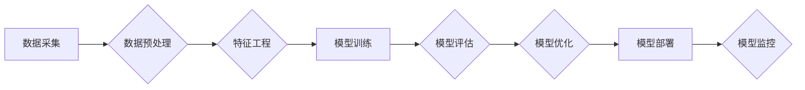

> 人工智能 (AI)
> 机器学习 (ML)
> 深度学习 (DL)
> 自然语言处理 (NLP)
> computer vision
> 解决方案
> 代码实战

## 1. 背景介绍

人工智能 (AI) 正以惊人的速度发展，并开始深刻地改变着各个行业。从医疗保健到金融，从制造业到零售，AI 正在提供前所未有的效率、洞察力和创新。

随着 AI 技术的不断进步，其应用场景也日益广泛。本文将深入探讨 AI 在不同行业中的应用案例，分析其背后的原理和解决方案，并通过代码实战案例，帮助读者更好地理解 AI 的应用和开发。

## 2. 核心概念与联系

**2.1  人工智能 (AI)**

人工智能是指模拟人类智能行为的计算机系统。AI 系统能够学习、推理、解决问题和做出决策，就像人类一样。

**2.2  机器学习 (ML)**

机器学习是 AI 的一个子领域，它使计算机能够从数据中学习，无需明确编程。机器学习算法通过分析数据模式，识别趋势和关系，从而提高其预测和决策能力。

**2.3  深度学习 (DL)**

深度学习是机器学习的一个更高级的子领域，它使用多层神经网络来模拟人类大脑的结构和功能。深度学习算法能够处理海量数据，并学习更复杂的模式，从而在图像识别、自然语言处理等领域取得突破性进展。

**2.4  自然语言处理 (NLP)**

自然语言处理是指使计算机能够理解、处理和生成人类语言的技术。NLP 广泛应用于聊天机器人、机器翻译、文本摘要等领域。

**2.5  计算机视觉 (CV)**

计算机视觉是指使计算机能够“看”和理解图像的技术。计算机视觉应用于图像识别、物体检测、人脸识别等领域。

**2.6  AI 应用场景**

AI 技术在各个行业都有广泛的应用场景，例如：

* **医疗保健:** 疾病诊断、药物研发、个性化医疗
* **金融:** 风险管理、欺诈检测、投资决策
* **制造业:** 自动化生产、质量控制、预测性维护
* **零售:** 个性化推荐、库存管理、客户服务
* **交通:** 自动驾驶、交通流量预测、智能交通管理

**2.7  AI 解决方案架构**

AI 解决方案通常包括以下几个关键组件：

* **数据采集和预处理:** 收集和清洗数据，使其适合 AI 模型训练。
* **特征工程:** 从原始数据中提取有价值的特征，用于训练 AI 模型。
* **模型训练:** 使用机器学习算法训练 AI 模型，使其能够学习数据模式。
* **模型评估和优化:** 评估模型性能，并进行调整以提高其准确性和效率。
* **模型部署和监控:** 将训练好的模型部署到生产环境中，并持续监控其性能。

**2.8  Mermaid 流程图**



## 3. 核心算法原理 & 具体操作步骤

### 3.1  算法原理概述

**3.1.1  线性回归**

线性回归是一种用于预测连续数值的监督学习算法。它假设数据之间存在线性关系，并通过最小化预测值与实际值的误差来找到最佳拟合直线。

**3.1.2  逻辑回归**

逻辑回归是一种用于分类问题的监督学习算法。它将线性回归的结果映射到0到1之间的概率区间，从而预测样本属于某个类别的概率。

**3.1.3  决策树**

决策树是一种树形结构的分类或回归算法。它通过一系列的决策规则，将数据分割成不同的子集，最终预测每个子集的类别或值。

**3.1.4  支持向量机 (SVM)**

支持向量机是一种用于分类和回归的监督学习算法。它通过寻找数据中最大间隔的超平面来划分不同类别的数据点。

**3.1.5  k 近邻 (KNN)**

k 近邻是一种非参数的监督学习算法。它根据训练数据中与新样本最近的k个邻居的类别或值来预测新样本的类别或值。

### 3.2  算法步骤详解

**3.2.1  线性回归**

1. 收集和预处理数据。
2. 选择合适的特征。
3. 使用梯度下降算法训练模型，最小化预测值与实际值的误差。
4. 评估模型性能。
5. 优化模型参数。

**3.2.2  逻辑回归**

1. 收集和预处理数据。
2. 选择合适的特征。
3. 使用梯度下降算法训练模型，最大化似然函数。
4. 评估模型性能。
5. 优化模型参数。

**3.2.3  决策树**

1. 收集和预处理数据。
2. 选择合适的特征。
3. 使用信息增益或基尼系数等指标选择最佳分割特征。
4. 递归地构建决策树，直到满足停止条件。
5. 评估模型性能。
6. 剪枝决策树，避免过拟合。

**3.2.4  支持向量机 (SVM)**

1. 收集和预处理数据。
2. 选择合适的核函数。
3. 使用拉格朗日乘子法求解优化问题，找到最大间隔超平面。
4. 评估模型性能。
5. 优化模型参数。

**3.2.5  k 近邻 (KNN)**

1. 收集和预处理数据。
2. 选择合适的k值。
3. 计算新样本与训练数据之间的距离。
4. 根据k个最近邻居的类别或值预测新样本的类别或值。
5. 评估模型性能。

### 3.3  算法优缺点

| 算法 | 优点 | 缺点 |
|---|---|---|
| 线性回归 | 简单易懂，易于实现 | 只能处理线性关系，容易过拟合 |
| 逻辑回归 | 适用于分类问题，解释性强 | 只能处理线性关系，容易过拟合 |
| 决策树 | 易于理解和解释，可以处理非线性关系 | 容易过拟合，对数据噪声敏感 |
| 支持向量机 (SVM) | 能够处理高维数据，具有较好的泛化能力 | 训练时间较长，参数选择较复杂 |
| k 近邻 (KNN) | 简单易懂，无需训练模型 | 容易受到噪声影响，计算复杂度高 |

### 3.4  算法应用领域

* **线性回归:** 房价预测、股票价格预测
* **逻辑回归:** 垃圾邮件分类、客户流失预测
* **决策树:** 医疗诊断、信用评分
* **支持向量机 (SVM):** 手写数字识别、图像分类
* **k 近邻 (KNN):** 推荐系统、聚类分析

## 4. 数学模型和公式 & 详细讲解 & 举例说明

### 4.1  数学模型构建

**4.1.1  线性回归模型**

线性回归模型假设数据之间存在线性关系，可以用以下公式表示：

$$y = w_0 + w_1x_1 + w_2x_2 + ... + w_nx_n + \epsilon$$

其中：

* $y$ 是目标变量
* $x_1, x_2, ..., x_n$ 是特征变量
* $w_0, w_1, w_2, ..., w_n$ 是模型参数
* $\epsilon$ 是误差项

**4.1.2  逻辑回归模型**

逻辑回归模型将线性回归的结果映射到0到1之间的概率区间，可以使用sigmoid函数进行转换：

$$p(y=1|x) = \frac{1}{1 + e^{-(w_0 + w_1x_1 + w_2x_2 + ... + w_nx_n)}}$$

其中：

* $p(y=1|x)$ 是样本属于类别1的概率
* $x$ 是特征向量
* $w_0, w_1, w_2, ..., w_n$ 是模型参数

### 4.2  公式推导过程

**4.2.1  线性回归模型参数估计**

线性回归模型的参数估计可以使用最小二乘法，其目标是最小化预测值与实际值的平方误差。

**4.2.2  逻辑回归模型参数估计**

逻辑回归模型的参数估计可以使用最大似然估计，其目标是最大化似然函数，即模型参数下观测数据的概率。

### 4.3  案例分析与讲解

**4.3.1  线性回归案例分析**

假设我们想要预测房屋价格，已知房屋面积和房间数量等特征。我们可以使用线性回归模型建立预测模型，并根据训练数据估计模型参数。

**4.3.2  逻辑回归案例分析**

假设我们想要判断客户是否会流失，已知客户的消费记录、使用频率等特征。我们可以使用逻辑回归模型建立预测模型，并根据训练数据估计模型参数，从而预测客户流失的概率。

## 5. 项目实践：代码实例和详细解释说明

### 5.1  开发环境搭建

* Python 3.x
* Jupyter Notebook
* scikit-learn

### 5.2  源代码详细实现

```python
# 导入必要的库
import pandas as pd
from sklearn.linear_model import LinearRegression
from sklearn.model_selection import train_test_split
from sklearn.metrics import mean_squared_error

# 加载数据
data = pd.read_csv('house_price.csv')

# 选择特征和目标变量
X = data[['area', 'rooms']]
y = data['price']

# 将数据分割为训练集和测试集
X_train, X_test, y_train, y_test = train_test_split(X, y, test_size=0.2, random_state=42)

# 创建线性回归模型
model = LinearRegression()

# 训练模型
model.fit(X_train, y_train)

# 预测测试集数据
y_pred = model.predict(X_test)

# 计算模型性能
mse = mean_squared_error(y_test, y_pred)
print(f'Mean Squared Error: {mse}')
```

### 5.3  代码解读与分析

* 首先，我们导入必要的库，并加载数据。
* 然后，我们选择特征和目标变量，并将数据分割为训练集和测试集。
* 接下来，我们创建线性回归模型，并使用训练数据训练模型。
* 接着，我们使用训练好的模型预测测试集数据，并计算模型性能。

### 5.4  运行结果展示

运行上述代码后，会输出模型的均方误差 (MSE) 值，该值越小，模型性能越好。

## 6. 实际应用场景

**6.1  医疗保健**

* **疾病诊断:** 使用 AI 算法分析患者的医疗记录、影像数据等，辅助医生诊断疾病。
* **药物研发:** 利用 AI 算法加速药物研发过程，例如预测药物的有效性、安全性等。
* **个性化医疗:** 根据患者的基因信息、生活习惯等，为患者提供个性化的治疗方案。

**6.2  金融**

* **风险管理:** 使用 AI 算法分析客户的信用风险、市场风险等，帮助金融机构进行风险管理。
* **欺诈检测:** 利用 AI 算法识别异常交易行为，防止金融欺诈。
* **投资决策:** 使用 AI 算法分析市场数据，辅助投资决策。

**6.3  制造业**

* **自动化生产:** 使用 AI 算法控制机器人的动作，实现自动化生产。
* **质量控制:** 利用 AI 算法检测产品缺陷，提高产品质量。
* **预测性维护:** 使用 AI 算法预测设备故障，提前进行维护，降低设备停机时间