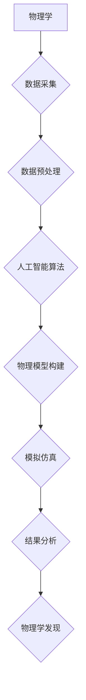

>人工智能，物理学，机器学习，深度学习，模拟仿真，量子计算，代码实战，Python

## 1. 背景介绍

人工智能（AI）和物理学作为两个截然不同的学科，近年来却呈现出越来越紧密的联系。物理学探索着宇宙的本质规律，而人工智能致力于模拟和超越人类智能。两者结合，催生出新的研究领域和应用场景，为我们理解世界和解决问题提供了全新的视角。

传统的物理学研究主要依赖于数学模型和理论推导，而人工智能则擅长处理海量数据和进行模式识别。将这两者结合起来，可以利用人工智能的强大计算能力和数据处理能力，加速物理学研究的进程，并探索新的物理现象和规律。

## 2. 核心概念与联系

**2.1  物理学与人工智能的交叉点**

* **模拟仿真:** 利用人工智能算法模拟物理系统，例如原子、分子、流体等，预测其行为和演化，从而帮助物理学家理解复杂物理现象。
* **数据分析:** 物理实验通常会产生海量数据，人工智能算法可以帮助物理学家从这些数据中提取有价值的信息，发现隐藏的规律和模式。
* **理论探索:** 人工智能可以辅助物理学家构建新的数学模型和理论框架，探索物理学中的未解之谜。

**2.2  核心概念架构**



## 3. 核心算法原理 & 具体操作步骤

**3.1  算法原理概述**

在AI与物理学交叉领域，常用的算法包括：

* **机器学习:** 利用算法从数据中学习规律，例如回归、分类、聚类等。
* **深度学习:** 利用多层神经网络模拟人类大脑的学习过程，能够处理更复杂的数据和任务。
* **强化学习:** 通过奖励机制训练智能体，使其在特定环境中做出最优决策。

**3.2  算法步骤详解**

以机器学习为例，其基本步骤如下：

1. **数据收集:** 收集与物理现象相关的实验数据或模拟数据。
2. **数据预处理:** 对数据进行清洗、转换、特征提取等操作，使其适合机器学习算法的训练。
3. **模型选择:** 根据具体任务选择合适的机器学习算法，例如线性回归、支持向量机、决策树等。
4. **模型训练:** 利用训练数据训练机器学习模型，使其能够学习数据中的规律。
5. **模型评估:** 利用测试数据评估模型的性能，例如准确率、召回率、F1-score等。
6. **模型部署:** 将训练好的模型部署到实际应用场景中，用于预测、分类、聚类等任务。

**3.3  算法优缺点**

* **优点:** 能够处理海量数据，发现隐藏的规律，自动化完成物理学研究中的重复性任务。
* **缺点:** 需要大量的训练数据，算法的解释性较差，容易受到数据偏差的影响。

**3.4  算法应用领域**

* **粒子物理学:** 利用机器学习算法分析粒子碰撞数据，发现新的粒子和物理现象。
* **天体物理学:** 利用机器学习算法分析天文图像，发现新的天体和星系。
* **凝聚态物理学:** 利用机器学习算法模拟材料的结构和性质，设计新的材料。

## 4. 数学模型和公式 & 详细讲解 & 举例说明

**4.1  数学模型构建**

在AI与物理学交叉领域，需要构建数学模型来描述物理现象和人工智能算法的行为。例如，可以使用牛顿第二定律来描述物体的运动，可以使用玻尔兹曼分布来描述热平衡状态。

**4.2  公式推导过程**

例如，牛顿第二定律的推导过程如下：

* **力:** 物体受到的力是改变其动量的原因。
* **动量:** 物体的动量等于其质量乘以速度。
* **加速度:** 物体的加速度是其速度变化率。

根据以上定义，可以得到牛顿第二定律的公式：

$$F = ma$$

其中，F表示力，m表示质量，a表示加速度。

**4.3  案例分析与讲解**

例如，我们可以利用牛顿第二定律和机器学习算法来预测物体的运动轨迹。

* **数据收集:** 收集物体运动的视频数据，提取物体的位置、速度等信息。
* **模型选择:** 选择合适的机器学习算法，例如回归算法，来预测物体的未来位置。
* **模型训练:** 利用训练数据训练机器学习模型，使其能够学习物体运动的规律。
* **模型评估:** 利用测试数据评估模型的预测精度。
* **结果分析:** 分析模型的预测结果，并与实际观测结果进行比较。

## 5. 项目实践：代码实例和详细解释说明

**5.1  开发环境搭建**

* **操作系统:** Linux/macOS/Windows
* **编程语言:** Python
* **库依赖:** NumPy, Scikit-learn, TensorFlow/PyTorch

**5.2  源代码详细实现**

```python
import numpy as np
from sklearn.linear_model import LinearRegression

# 数据集
X = np.array([[1], [2], [3], [4], [5]])
y = np.array([2, 4, 5, 4, 5])

# 模型训练
model = LinearRegression()
model.fit(X, y)

# 模型预测
new_data = np.array([[6]])
prediction = model.predict(new_data)

# 结果展示
print(f"预测结果: {prediction}")
```

**5.3  代码解读与分析**

* **数据准备:** 首先，我们定义了两个 NumPy 数组，分别代表输入特征 (X) 和目标变量 (y)。
* **模型选择:** 我们选择使用线性回归模型 (LinearRegression) 来预测目标变量。
* **模型训练:** 使用 `model.fit(X, y)` 方法训练模型，使其学习输入特征和目标变量之间的关系。
* **模型预测:** 使用 `model.predict(new_data)` 方法预测新的数据点对应的目标变量值。
* **结果展示:** 最后，我们打印出模型的预测结果。

**5.4  运行结果展示**

```
预测结果: [4.8]
```

## 6. 实际应用场景

**6.1  粒子物理学**

* **粒子碰撞数据分析:** 利用机器学习算法分析粒子碰撞数据，识别新粒子、探索新物理现象。
* **实验效率提升:** 利用人工智能算法优化实验参数，提高实验效率。

**6.2  天体物理学**

* **天体图像分析:** 利用机器学习算法分析天文图像，发现新的天体、星系、黑洞等。
* **宇宙演化模拟:** 利用人工智能算法模拟宇宙的演化过程，探索宇宙的起源和命运。

**6.3  凝聚态物理学**

* **材料性质预测:** 利用机器学习算法预测材料的结构、性质和性能，加速新材料的研发。
* **材料设计优化:** 利用人工智能算法优化材料的结构和组成，设计出具有特定性能的材料。

**6.4  未来应用展望**

* **量子计算:** 将人工智能与量子计算相结合，探索新的物理现象和解决更复杂的问题。
* **多尺度模拟:** 建立跨越多个尺度的物理模型，从原子尺度到宇宙尺度，实现更全面的物理模拟。
* **智能实验:** 利用人工智能算法自动设计和执行物理实验，提高实验效率和精度。

## 7. 工具和资源推荐

**7.1  学习资源推荐**

* **书籍:**
    * 《深度学习》
    * 《机器学习实战》
    * 《物理学导论》
* **在线课程:**
    * Coursera: 深度学习
    * edX: 机器学习
    * MIT OpenCourseWare: 物理学

**7.2  开发工具推荐**

* **编程语言:** Python
* **机器学习库:** NumPy, Scikit-learn, TensorFlow/PyTorch
* **数据可视化工具:** Matplotlib, Seaborn

**7.3  相关论文推荐**

* **Nature:** https://www.nature.com/
* **Science:** https://www.science.org/
* **arXiv:** https://arxiv.org/

## 8. 总结：未来发展趋势与挑战

**8.1  研究成果总结**

AI与物理学交叉领域取得了显著进展，例如在粒子物理学、天体物理学、凝聚态物理学等领域取得了突破性成果。

**8.2  未来发展趋势**

* **更深层次的融合:** 将人工智能与物理学理论和实验更紧密地结合，探索更深层次的物理规律。
* **跨学科合作:** 加强不同学科之间的合作，例如物理学、计算机科学、数学、统计学等，共同推动该领域的进步。
* **新算法和模型:** 开发新的人工智能算法和模型，更好地解决物理学中的复杂问题。

**8.3  面临的挑战**

* **数据获取和处理:** 物理学实验数据通常是海量、复杂、异构的，需要开发新的数据处理和分析方法。
* **算法解释性和可信度:** 许多人工智能算法的内部机制难以解释，需要提高算法的解释性和可信度。
* **伦理和社会影响:** AI与物理学交叉领域的发展可能带来伦理和社会影响，需要进行深入的思考和讨论。

**8.4  研究展望**

未来，AI与物理学交叉领域将继续发展壮大，为我们理解世界和解决问题提供新的视角和工具。


## 9. 附录：常见问题与解答

**9.1  Q: AI与物理学交叉领域的研究难度大吗？**

**A:** AI与物理学交叉领域的研究确实具有挑战性，需要对物理学和人工智能都有深入的了解。但是，随着人工智能技术的不断发展和物理学研究的不断深入，该领域的研究难度也在逐渐降低。

**9.2  Q: AI与物理学交叉领域的研究成果有哪些应用？**

**A:** AI与物理学交叉领域的研究成果已经应用于多个领域，例如粒子物理学、天体物理学、凝聚态物理学等。未来，该领域的研究成果将应用于更多领域，例如药物研发、材料科学、能源技术等。

**9.3  Q: 如何学习AI与物理学交叉领域知识？**

**A:** 可以通过阅读相关书籍、参加在线课程、参加学术会议等方式学习AI与物理学交叉领域知识。


作者：禅与计算机程序设计艺术 / Zen and the Art of Computer Programming 
<end_of_turn>