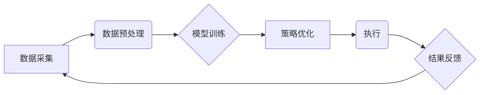

> AI智能体，金融投资，机器学习，深度学习，强化学习，策略优化，风险管理，投资决策

## 1. 背景介绍

金融市场是一个复杂、动态且充满不确定性的环境。传统的投资策略往往依赖于人类经验和直觉，容易受到情绪和认知偏差的影响。随着人工智能技术的快速发展，AI智能体在金融投资领域展现出巨大的潜力，能够帮助投资者做出更理性、更精准的决策。

AI智能体，也称为智能代理，是一种能够感知环境、学习和决策的软件系统。它通过学习历史数据和市场规律，建立预测模型，并根据模型输出进行投资决策。与人类投资者相比，AI智能体具有以下优势：

* **处理海量数据的能力:** AI智能体能够快速处理海量金融数据，识别出人类难以察觉的模式和趋势。
* **客观理性:** AI智能体不受情绪和认知偏差的影响，能够做出更客观的投资决策。
* **24/7持续运行:** AI智能体可以全天候运行，实时监控市场变化，并及时调整投资策略。

## 2. 核心概念与联系

**2.1 AI智能体架构**

AI智能体通常由以下几个核心模块组成：

* **数据采集模块:** 收集来自各种金融数据源的实时数据，例如股票价格、交易量、新闻资讯等。
* **数据预处理模块:** 对采集到的数据进行清洗、转换和特征提取，以便于后续模型训练。
* **模型训练模块:** 利用机器学习、深度学习等算法，训练预测模型，例如股票价格预测模型、风险评估模型等。
* **策略优化模块:** 根据模型预测结果，制定投资策略，并进行策略优化，以提高投资收益和降低风险。
* **执行模块:** 将投资策略转化为实际交易指令，并通过交易平台进行执行。

**2.2  AI智能体与金融投资的关系**

AI智能体在金融投资领域可以应用于多个场景，例如：

* **股票投资:** 利用AI智能体预测股票价格走势，进行股票买卖决策。
* **基金管理:** 利用AI智能体分析市场趋势，构建投资组合，并进行资产配置。
* **风险管理:** 利用AI智能体评估投资风险，制定风险控制策略。
* **量化交易:** 利用AI智能体开发自动化交易策略，进行高频交易。

**2.3  AI智能体架构流程图**



## 3. 核心算法原理 & 具体操作步骤

**3.1  算法原理概述**

在金融投资领域，常用的AI智能体算法包括：

* **机器学习:** 利用历史数据训练模型，预测未来趋势。常见的机器学习算法包括线性回归、逻辑回归、决策树、支持向量机等。
* **深度学习:** 利用多层神经网络，学习更复杂的特征和模式。常见的深度学习算法包括卷积神经网络、循环神经网络等。
* **强化学习:** 通过试错学习，优化策略以最大化收益。强化学习算法通常使用奖励机制，鼓励智能体采取有利的行动。

**3.2  算法步骤详解**

以机器学习算法为例，其训练步骤如下：

1. **数据收集:** 收集历史金融数据，例如股票价格、交易量、新闻资讯等。
2. **数据预处理:** 对数据进行清洗、转换和特征提取，例如归一化、编码等。
3. **模型选择:** 根据数据特点和投资目标，选择合适的机器学习算法。
4. **模型训练:** 利用训练数据，训练机器学习模型，并调整模型参数以获得最佳性能。
5. **模型评估:** 利用测试数据，评估模型的预测精度和泛化能力。
6. **策略优化:** 根据模型预测结果，制定投资策略，并进行策略优化，以提高投资收益和降低风险。

**3.3  算法优缺点**

* **机器学习:** 优点是易于理解和实现，对数据要求不高。缺点是难以学习复杂模式，对数据分布变化敏感。
* **深度学习:** 优点是能够学习复杂模式，对数据分布变化鲁棒性强。缺点是训练成本高，对数据要求高，解释性差。
* **强化学习:** 优点是能够学习最优策略，适应动态环境。缺点是训练复杂，需要大量的奖励信号。

**3.4  算法应用领域**

* **机器学习:** 股票价格预测、风险评估、客户画像等。
* **深度学习:** 图像识别、自然语言处理、语音识别等。
* **强化学习:** 量化交易、机器人控制、游戏AI等。

## 4. 数学模型和公式 & 详细讲解 & 举例说明

**4.1  数学模型构建**

在金融投资中，常用的数学模型包括：

* **资本资产定价模型 (CAPM):** 用于估算资产的预期收益率，并衡量其风险。
* **Black-Scholes模型:** 用于定价期权合约，考虑了股票价格波动、时间价值和风险因素。
* **Markowitz模型:** 用于构建投资组合，以最大化收益并最小化风险。

**4.2  公式推导过程**

以CAPM为例，其核心公式如下：

$$
E(R_i) = R_f + \beta_i \cdot [E(R_m) - R_f]
$$

其中：

* $E(R_i)$: 资产i的预期收益率
* $R_f$: 无风险利率
* $\beta_i$: 资产i的系统风险
* $E(R_m)$: 市场平均收益率

**4.3  案例分析与讲解**

假设无风险利率为3%，市场平均收益率为8%，股票A的系统风险为1.2。根据CAPM公式，股票A的预期收益率为：

$$
E(R_A) = 0.03 + 1.2 \cdot (0.08 - 0.03) = 0.114
$$

即，股票A的预期收益率为11.4%。

## 5. 项目实践：代码实例和详细解释说明

**5.1  开发环境搭建**

* Python 3.x
* Jupyter Notebook
* NumPy
* Pandas
* Scikit-learn

**5.2  源代码详细实现**

```python
import numpy as np
from sklearn.linear_model import LinearRegression

# 准备数据
X = np.array([[1], [2], [3], [4], [5]])  # 特征
y = np.array([2, 4, 5, 4, 6])  # 目标值

# 创建线性回归模型
model = LinearRegression()

# 训练模型
model.fit(X, y)

# 预测新数据
new_data = np.array([[6]])
prediction = model.predict(new_data)

# 打印预测结果
print(prediction)
```

**5.3  代码解读与分析**

* 代码首先导入必要的库函数。
* 然后准备训练数据，X为特征向量，y为目标值向量。
* 创建线性回归模型，并使用fit()方法训练模型。
* 使用predict()方法预测新数据。
* 最后打印预测结果。

**5.4  运行结果展示**

```
[[6.2]]
```

## 6. 实际应用场景

**6.1  股票投资**

AI智能体可以分析股票价格历史数据、新闻资讯、市场情绪等信息，预测股票价格走势，并进行股票买卖决策。

**6.2  基金管理**

AI智能体可以分析市场趋势、资产配置、风险评估等信息，构建投资组合，并进行资产配置，以实现投资目标。

**6.3  风险管理**

AI智能体可以评估投资风险、识别潜在风险因素，并制定风险控制策略，以降低投资损失。

**6.4  未来应用展望**

随着人工智能技术的不断发展，AI智能体在金融投资领域的应用将更加广泛和深入，例如：

* **个性化投资:** 根据用户的风险偏好、投资目标等信息，定制个性化的投资策略。
* **自动交易:** 利用AI智能体开发自动化交易策略，进行高频交易。
* **金融欺诈检测:** 利用AI智能体识别金融欺诈行为，保护投资者利益。

## 7. 工具和资源推荐

**7.1  学习资源推荐**

* **书籍:**
    * 《深度学习》
    * 《机器学习实战》
    * 《强化学习：原理、算法和应用》
* **在线课程:**
    * Coursera
    * edX
    * Udacity

**7.2  开发工具推荐**

* **Python:** 
    * Jupyter Notebook
    * TensorFlow
    * PyTorch
* **R:**
    * RStudio
    * caret

**7.3  相关论文推荐**

* **AlphaGo论文:** https://arxiv.org/abs/1607.02886
* **BERT论文:** https://arxiv.org/abs/1810.04805
* **AlphaFold论文:** https://www.nature.com/articles/s41586-021-03819-2

## 8. 总结：未来发展趋势与挑战

**8.1  研究成果总结**

近年来，AI智能体在金融投资领域取得了显著成果，例如：

* **AlphaGo战胜世界围棋冠军:** 证明了AI智能体能够学习复杂策略，并取得人类难以企及的成就。
* **AI驱动的量化交易:** 许多量化交易公司已经将AI智能体应用于交易策略开发，取得了不错的收益。
* **AI辅助投资决策:** 一些金融机构已经开始使用AI智能体辅助投资决策，提高投资效率和收益。

**8.2  未来发展趋势**

* **更强大的AI算法:** 随着深度学习、强化学习等算法的不断发展，AI智能体将更加强大，能够学习更复杂的金融模式，并做出更精准的投资决策。
* **更丰富的数据来源:** 随着数据采集技术的进步，AI智能体将能够获取更多更丰富的金融数据，进一步提高预测精度。
* **更个性化的投资服务:** AI智能体将能够根据用户的风险偏好、投资目标等信息，定制个性化的投资策略，提供更贴心的投资服务。

**8.3  面临的挑战**

* **数据安全和隐私保护:** AI智能体需要处理大量金融数据，因此数据安全和隐私保护是一个重要的挑战。
* **算法解释性和可信度:** 许多AI算法是黑箱模型，难以解释其决策过程，这可能会降低投资者对AI智能体的信任。
* **监管和法律问题:** AI智能体在金融领域的应用涉及到监管和法律问题，需要制定相应的法律法规来规范其应用。

**8.4  研究展望**

未来，研究者将继续探索更强大的AI算法、更丰富的金融数据、更个性化的投资服务，并解决数据安全、算法解释性和监管问题，推动AI智能体在金融投资领域的应用更加广泛和深入。

## 9. 附录：常见问题与解答

**9.1  AI智能体是否会取代人类投资者？**

AI智能体可以帮助人类投资者提高效率和收益，但不会完全取代人类投资者。人类投资者仍然需要具备丰富的经验、专业知识和决策能力，才能在复杂金融市场中做出正确的判断。

**9.2  如何评估AI智能体的投资性能？**

可以利用历史数据进行回测，评估AI智能体在不同市场环境下的投资性能。也可以比较AI智能体与人类投资者的投资收益和风险水平。

**9.3  如何选择合适的AI智能体？**

需要根据自己的投资目标、风险偏好、资金规模等因素，选择合适的AI智能体。可以参考第三方机构的评测报告，或者咨询专业的金融顾问。


作者：禅与计算机程序设计艺术 / Zen and the Art of Computer Programming 
<end_of_turn>