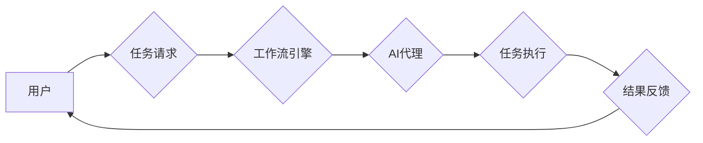

> AI代理，工作流自动化，行业应用，机器学习，自然语言处理，流程建模

## 1. 背景介绍

随着人工智能技术的飞速发展，AI代理作为一种新型的智能化应用，正在逐渐改变着我们与工作、生活方式的交互方式。AI代理是指能够自主执行任务、学习和适应环境的智能软件实体。它可以理解人类的指令，并根据预设规则或学习到的知识，自动完成一系列操作，从而解放人类从繁琐重复的工作中解放出来，提高工作效率和创造力。

在行业研究领域，AI代理的工作流自动化应用前景广阔。它可以帮助企业优化流程、提高效率、降低成本，并为用户提供更便捷、个性化的服务体验。例如，在金融领域，AI代理可以自动处理客户的贷款申请、理财咨询等任务；在医疗领域，AI代理可以协助医生进行诊断、预约挂号等工作；在教育领域，AI代理可以为学生提供个性化的学习辅导、答疑解惑等服务。

## 2. 核心概念与联系

**2.1 AI代理的概念**

AI代理是一个能够自主执行任务的智能软件实体，它具备以下核心特征：

* **自主性:** AI代理能够根据预设规则或学习到的知识，独立完成任务，无需人工干预。
* **学习能力:** AI代理能够从数据中学习，不断改进自身的行为策略，提高任务执行效率。
* **适应性:** AI代理能够根据环境变化，调整自身行为，适应不同的任务需求。
* **交互性:** AI代理能够与用户进行交互，接收指令、提供反馈，实现人机协作。

**2.2 工作流的概念**

工作流是指一系列相互关联的活动或任务，按照一定的顺序和逻辑进行执行，最终实现某个目标的过程。工作流通常由多个步骤组成，每个步骤都包含特定的任务和操作。

**2.3 AI代理工作流的联系**

AI代理工作流是指利用AI代理技术，自动执行工作流中的任务，实现工作流程的自动化和智能化。

**2.4 AI代理工作流架构**



**2.5 核心概念关系图**


## 3. 核心算法原理 & 具体操作步骤

**3.1 算法原理概述**

AI代理工作流的核心算法主要包括：

* **任务分解:** 将复杂的业务流程分解成一系列可执行的子任务。
* **规则引擎:** 根据预设规则，匹配任务与合适的AI代理。
* **机器学习:** 利用机器学习算法，训练AI代理，使其能够自动完成任务。
* **流程控制:** 控制AI代理的执行顺序和逻辑，确保工作流的顺利进行。

**3.2 算法步骤详解**

1. **任务请求:** 用户提交任务请求，例如申请贷款、预约挂号等。
2. **任务分解:** 工作流引擎将任务分解成一系列子任务，例如收集客户信息、进行风险评估、审批贷款申请等。
3. **AI代理匹配:** 根据任务类型和AI代理的技能，规则引擎匹配合适的AI代理。
4. **任务执行:** AI代理执行子任务，例如从数据库中获取客户信息、调用风险评估模型、发送审批通知等。
5. **结果反馈:** AI代理将执行结果反馈给工作流引擎，并最终反馈给用户。

**3.3 算法优缺点**

**优点:**

* **自动化:** 自动化工作流程，提高效率。
* **智能化:** 利用AI技术，提高决策质量。
* **个性化:** 根据用户需求，提供个性化服务。

**缺点:**

* **复杂性:** 设计和部署AI代理工作流需要专业知识和技术。
* **数据依赖:** AI代理需要大量数据进行训练，数据质量直接影响其性能。
* **安全风险:** AI代理可能存在安全漏洞，需要加强安全防护。

**3.4 算法应用领域**

AI代理工作流的应用领域非常广泛，例如：

* **金融:** 贷款申请、理财咨询、风险管理
* **医疗:** 诊断辅助、预约挂号、病历管理
* **教育:** 个性化学习辅导、答疑解惑、考试批改
* **客服:** 自动回复客户咨询、处理投诉

## 4. 数学模型和公式 & 详细讲解 & 举例说明

**4.1 数学模型构建**

AI代理工作流可以抽象为一个状态机模型，其中每个状态代表一个工作流程中的步骤，每个状态之间的转换由条件触发。

**状态机模型:**

```
状态 = {初始状态, 状态1, 状态2, ..., 状态n}
条件 = {条件1, 条件2, ..., 条件m}
转换 = {(状态i, 条件j) -> 状态k}
```

**4.2 公式推导过程**

假设一个简单的AI代理工作流，包含三个状态：

* 状态1: 收集客户信息
* 状态2: 进行风险评估
* 状态3: 审批贷款申请

对应的条件和转换关系如下：

* (状态1, 条件1) -> 状态2
* (状态2, 条件2) -> 状态3
* (状态3, 条件3) -> 状态结束

其中，条件1表示客户信息收集完成，条件2表示风险评估通过，条件3表示审批通过。

**4.3 案例分析与讲解**

例如，一个用户申请贷款，AI代理工作流会按照以下步骤进行：

1. AI代理进入状态1，收集客户信息。
2. 当客户信息收集完成时，触发条件1，AI代理进入状态2，进行风险评估。
3. 当风险评估通过时，触发条件2，AI代理进入状态3，审批贷款申请。
4. 当审批通过时，触发条件3，AI代理进入状态结束，贷款申请成功。

## 5. 项目实践：代码实例和详细解释说明

**5.1 开发环境搭建**

* Python 3.x
* TensorFlow/PyTorch
* Flask/Django

**5.2 源代码详细实现**

```python
# AI代理工作流示例代码

class LoanAgent:
    def __init__(self):
        self.state = "collect_info"

    def collect_info(self):
        # 收集客户信息
        print("正在收集客户信息...")
        # ...

    def assess_risk(self):
        # 进行风险评估
        print("正在进行风险评估...")
        # ...

    def approve_loan(self):
        # 审批贷款申请
        print("正在审批贷款申请...")
        # ...

    def run(self):
        while True:
            if self.state == "collect_info":
                self.collect_info()
                if self.is_info_complete():
                    self.state = "assess_risk"
            elif self.state == "assess_risk":
                self.assess_risk()
                if self.is_risk_passed():
                    self.state = "approve_loan"
            elif self.state == "approve_loan":
                self.approve_loan()
                break

# ...

# 实例化AI代理
agent = LoanAgent()
agent.run()
```

**5.3 代码解读与分析**

* `LoanAgent`类代表一个贷款申请AI代理。
* `state`属性记录当前状态。
* `collect_info()`, `assess_risk()`, `approve_loan()`方法分别代表三个状态下的操作。
* `run()`方法实现AI代理的工作流程。

**5.4 运行结果展示**

运行代码后，AI代理会按照预设流程，收集客户信息、进行风险评估、审批贷款申请，最终完成贷款申请流程。

## 6. 实际应用场景

**6.1 金融领域**

* **贷款申请自动化:** AI代理可以自动处理贷款申请，包括收集客户信息、进行风险评估、审批贷款申请等。
* **理财咨询:** AI代理可以根据用户的风险偏好和投资目标，提供个性化的理财建议。
* **欺诈检测:** AI代理可以分析交易数据，识别潜在的欺诈行为。

**6.2 医疗领域**

* **诊断辅助:** AI代理可以辅助医生进行诊断，例如分析病历、影像数据，提供诊断建议。
* **预约挂号:** AI代理可以帮助患者预约挂号、查询医生信息、缴费等。
* **病历管理:** AI代理可以自动整理病历、提取关键信息，方便医生查看和分析。

**6.3 教育领域**

* **个性化学习辅导:** AI代理可以根据学生的学习进度和能力，提供个性化的学习辅导。
* **答疑解惑:** AI代理可以回答学生的学习问题，提供学习资源。
* **考试批改:** AI代理可以自动批改学生的作业和考试卷，提供反馈和评分。

**6.4 未来应用展望**

AI代理工作流的应用前景广阔，未来将应用于更多领域，例如：

* **法律服务:** 自动化法律文件处理、合同审查、法律咨询等。
* **人力资源:** 自动化招聘流程、员工培训、绩效评估等。
* **制造业:** 自动化生产流程、设备维护、质量控制等。

## 7. 工具和资源推荐

**7.1 学习资源推荐**

* **书籍:**
    * 《人工智能：一种现代方法》
    * 《深度学习》
    * 《机器学习》
* **在线课程:**
    * Coursera: 人工智能课程
    * edX: 深度学习课程
    * Udacity: 机器学习工程师课程

**7.2 开发工具推荐**

* **Python:** 广泛应用于AI开发，拥有丰富的库和框架。
* **TensorFlow/PyTorch:** 深度学习框架，用于训练和部署AI模型。
* **Flask/Django:** Web框架，用于构建AI代理的接口和用户界面。

**7.3 相关论文推荐**

* **Reinforcement Learning: An Introduction**
* **Deep Learning**
* **A Survey of Transfer Learning**

## 8. 总结：未来发展趋势与挑战

**8.1 研究成果总结**

AI代理工作流技术取得了显著进展，在金融、医疗、教育等领域取得了成功应用。

**8.2 未来发展趋势**

* **更智能的AI代理:** 利用更先进的AI算法，使AI代理更加智能、高效。
* **更广泛的应用场景:** AI代理工作流将应用于更多领域，例如法律、人力资源、制造业等。
* **更安全的AI代理:** 加强AI代理的安全防护，防止数据泄露和恶意攻击。

**8.3 面临的挑战**

* **数据质量:** AI代理需要大量高质量数据进行训练，数据质量直接影响其性能。
* **算法复杂性:** 设计和训练复杂的AI代理算法需要高水平的专业知识和技术。
* **伦理问题:** AI代理的应用可能引发伦理问题，例如算法偏见、隐私泄露等，需要谨慎考虑和解决。

**8.4 研究展望**

未来，我们将继续研究AI代理工作流技术，使其更加智能、高效、安全，并将其应用于更多领域，为人类社会带来更多福祉。

## 9. 附录：常见问题与解答

**9.1 如何选择合适的AI代理？**

选择合适的AI代理需要根据具体任务需求和业务场景进行评估，考虑AI代理的技能、经验、性能等因素。

**9.2 如何保证AI代理的安全？**

需要采取多种安全措施，例如数据加密、身份验证、访问控制等，防止数据泄露和恶意攻击。

**9.3 如何解决AI代理的算法偏见问题？**

需要使用公平的训练数据，并采用算法调优技术，减少算法偏见。

**9.4 如何评估AI代理的性能？**

可以使用多种指标来评估AI代理的性能