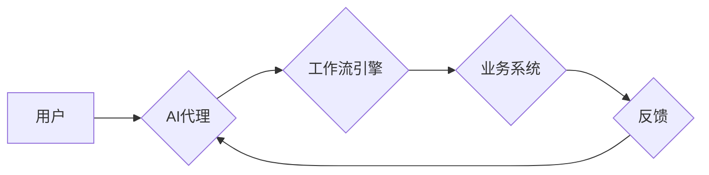

> AI代理，工作流，金融，自动化，决策，风险管理，机器学习

## 1. 背景介绍

金融行业是一个高度复杂、数据密集型和竞争激烈的行业。传统金融服务模式面临着效率低下、成本高昂、客户体验差等挑战。随着人工智能（AI）技术的快速发展，AI代理工作流（AI Agent WorkFlow）应运而生，为金融行业带来了新的机遇和可能性。

AI代理工作流是指利用人工智能技术，构建智能代理系统，自动执行金融业务流程，提高效率、降低成本、提升客户体验。AI代理可以理解和响应用户的需求，自动完成交易、风险评估、客户服务等任务，从而解放人力资源，提高工作效率。

## 2. 核心概念与联系

**2.1 AI代理**

AI代理是一种能够自主学习、决策和执行任务的智能软件实体。它可以模拟人类的行为，理解用户的意图，并根据预设规则或机器学习模型做出相应的决策。

**2.2 工作流**

工作流是指一系列相互关联的活动或任务，用于完成特定业务流程。它通常由多个步骤组成，每个步骤都有明确的输入、输出和执行者。

**2.3 AI代理工作流**

AI代理工作流将AI代理与工作流技术相结合，构建智能化的业务流程自动化系统。AI代理可以自动执行工作流中的任务，根据实际情况动态调整流程，提高工作效率和灵活性。

**2.4 架构图**



## 3. 核心算法原理 & 具体操作步骤

**3.1 算法原理概述**

AI代理工作流的核心算法主要包括：

* **自然语言处理（NLP）:** 用于理解用户的自然语言输入，提取关键信息。
* **机器学习（ML）:** 用于训练AI代理，使其能够根据历史数据做出决策。
* **规则引擎:** 用于定义AI代理的行为规则，确保其决策符合业务逻辑。
* **工作流引擎:** 用于管理和执行工作流，协调AI代理和业务系统的交互。

**3.2 算法步骤详解**

1. **用户请求:** 用户向AI代理提出请求，例如申请贷款、查询账户余额等。
2. **自然语言理解:** AI代理使用NLP算法解析用户的请求，提取关键信息，例如贷款金额、期限等。
3. **决策推理:** AI代理根据预设规则或机器学习模型，对用户的请求进行决策推理，例如是否批准贷款申请、计算利息等。
4. **工作流执行:** AI代理将决策结果传递给工作流引擎，工作流引擎根据流程规则，自动执行后续任务，例如发送审批通知、更新账户信息等。
5. **反馈处理:** 工作流引擎将执行结果反馈给AI代理，AI代理根据反馈信息，进行后续处理，例如更新用户状态、提供客户服务等。

**3.3 算法优缺点**

**优点:**

* **自动化:** 自动化执行金融业务流程，提高效率和准确性。
* **个性化:** 根据用户的需求和行为，提供个性化的服务。
* **24/7可用:** 不受时间和地域限制，随时随地提供服务。
* **降低成本:** 释放人力资源，降低运营成本。

**缺点:**

* **数据依赖:** 需要大量的数据进行训练和优化。
* **算法复杂:** 需要专业的技术人员进行开发和维护。
* **伦理风险:** AI代理的决策可能会存在偏见或不公平性。

**3.4 算法应用领域**

* **贷款审批:** 自动评估贷款申请，提高审批效率和准确性。
* **风险管理:** 识别和评估金融风险，及时采取措施。
* **客户服务:** 自动回答客户常见问题，提供24/7客户服务。
* **投资理财:** 根据用户的风险偏好和投资目标，提供个性化的投资建议。

## 4. 数学模型和公式 & 详细讲解 & 举例说明

**4.1 数学模型构建**

AI代理工作流的数学模型通常基于概率论和统计学，用于描述AI代理的决策过程和工作流的执行路径。

**4.2 公式推导过程**

例如，在贷款审批场景中，可以使用贝叶斯定理来计算贷款申请的审批概率。

$$P(A|B) = \frac{P(B|A)P(A)}{P(B)}$$

其中：

* $P(A|B)$: 贷款申请被批准的概率，给定申请人的信用评分为B。
* $P(B|A)$: 申请人信用评分为B的概率，给定贷款申请被批准。
* $P(A)$: 贷款申请被批准的概率。
* $P(B)$: 申请人信用评分为B的概率。

**4.3 案例分析与讲解**

假设一个金融机构使用AI代理工作流进行贷款审批。

* $P(A)$: 历史数据显示，贷款申请被批准的概率为20%。
* $P(B|A)$: 历史数据显示，信用评分为B的申请人，被批准的概率为80%。
* $P(B)$: 历史数据显示，信用评分为B的申请人的比例为30%。

根据贝叶斯定理，我们可以计算出信用评分为B的申请人，被批准的概率为：

$$P(A|B) = \frac{0.8 \times 0.2}{0.3} = 0.533$$

因此，信用评分为B的申请人，被批准的概率为53.3%。

## 5. 项目实践：代码实例和详细解释说明

**5.1 开发环境搭建**

* Python 3.x
* TensorFlow/PyTorch
* Flask/Django
* Redis/MongoDB

**5.2 源代码详细实现**

```python
# 贷款审批AI代理示例代码

import tensorflow as tf

# 加载训练数据
(x_train, y_train), (x_test, y_test) = tf.keras.datasets.mnist.load_data()

# 创建模型
model = tf.keras.models.Sequential([
    tf.keras.layers.Flatten(input_shape=(28, 28)),
    tf.keras.layers.Dense(128, activation='relu'),
    tf.keras.layers.Dense(10, activation='softmax')
])

# 编译模型
model.compile(optimizer='adam',
              loss='sparse_categorical_crossentropy',
              metrics=['accuracy'])

# 训练模型
model.fit(x_train, y_train, epochs=5)

# 预测贷款审批结果
def predict_loan_approval(credit_score):
    # 将信用评分转换为模型输入格式
    input_data = tf.convert_to_tensor([credit_score])
    # 使用模型预测贷款审批结果
    prediction = model.predict(input_data)
    # 返回预测结果
    return prediction

# 示例使用
credit_score = 750
approval_probability = predict_loan_approval(credit_score)
print(f"贷款审批概率: {approval_probability}")
```

**5.3 代码解读与分析**

* 代码示例展示了使用TensorFlow构建一个简单的贷款审批AI代理。
* 模型训练使用MNIST数据集，但可以根据实际需求替换为金融领域的信用评分数据。
* `predict_loan_approval`函数接收信用评分作为输入，使用训练好的模型预测贷款审批概率。

**5.4 运行结果展示**

运行代码后，会输出贷款审批概率。例如，如果信用评分为750，则输出的贷款审批概率可能为0.85，表示贷款申请被批准的概率为85%。

## 6. 实际应用场景

**6.1 贷款审批自动化**

AI代理可以自动评估贷款申请，根据用户的信用评分、收入、负债等信息，快速判断贷款申请是否通过。

**6.2 风险管理**

AI代理可以分析用户的交易记录、行为模式等数据，识别潜在的风险，例如欺诈、洗钱等，及时采取措施进行风险控制。

**6.3 客户服务智能化**

AI代理可以接入聊天机器人平台，自动回答客户常见问题，例如账户余额查询、交易记录查询等，提高客户服务效率。

**6.4 个性化投资建议**

AI代理可以根据用户的风险偏好、投资目标等信息，提供个性化的投资建议，帮助用户做出更明智的投资决策。

**6.5 未来应用展望**

随着AI技术的不断发展，AI代理工作流将在金融行业得到更广泛的应用，例如：

* **智能理财:** 提供更精准、个性化的理财服务。
* **金融科技创新:** 推动金融科技的创新发展。
* **金融监管:** 提高金融监管的效率和精准度。

## 7. 工具和资源推荐

**7.1 学习资源推荐**

* **书籍:**
    * 《深度学习》
    * 《机器学习》
    * 《自然语言处理》
* **在线课程:**
    * Coursera
    * edX
    * Udacity

**7.2 开发工具推荐**

* **Python:** 
* **TensorFlow/PyTorch:** 深度学习框架
* **Flask/Django:** Web框架
* **Redis/MongoDB:** 数据存储

**7.3 相关论文推荐**

* **Reinforcement Learning for Financial Decision Making**
* **Deep Learning for Credit Risk Assessment**
* **AI-Powered Chatbots for Financial Services**

## 8. 总结：未来发展趋势与挑战

**8.1 研究成果总结**

AI代理工作流在金融行业取得了显著的成果，例如提高了贷款审批效率、降低了风险，提升了客户体验。

**8.2 未来发展趋势**

* **更智能的AI代理:** 利用更先进的AI算法，例如强化学习、迁移学习等，构建更智能、更灵活的AI代理。
* **更广泛的应用场景:** 将AI代理工作流应用到更多金融领域，例如保险、证券、基金等。
* **更安全的AI系统:** 加强AI系统的安全性和可靠性，防止数据泄露、算法攻击等风险。

**8.3 面临的挑战**

* **数据质量:** AI代理需要大量高质量的数据进行训练，数据质量直接影响AI代理的性能。
* **算法解释性:** AI代理的决策过程通常是复杂的，难以解释，这可能会导致用户信任问题。
* **伦理风险:** AI代理的决策可能会存在偏见或不公平性，需要进行伦理评估和监管。

**8.4 研究展望**

未来，AI代理工作流的研究将继续深入，探索更智能、更安全、更可解释的AI代理，为金融行业带来更多创新和价值。

## 9. 附录：常见问题与解答

**9.1 如何选择合适的AI代理工作流平台？**

选择合适的AI代理工作流平台需要考虑以下因素：

* **功能:** 平台是否支持所需的AI算法、工作流引擎、数据存储等功能。
* **易用性:** 平台是否易于使用和部署，是否提供完善的文档和支持。
* **安全性:** 平台是否具备足够的安全性保障，能够保护用户数据和系统安全。
* **成本:** 平台的费用是否合理，是否符合预算。

**9.2 如何保证AI代理的准确性和可靠性？**

保证AI代理的准确性和可靠性需要从以下几个方面入手：

* **数据质量:** 使用高质量的数据进行训练，并进行数据清洗和预处理。
* **算法选择:** 选择合适的AI算法，并进行模型调优。
* **测试和评估:** 对AI代理进行充分的测试和评估，确保其能够满足业务需求。
* **监控和维护:** 对AI代理进行持续的监控和维护，及时发现和解决问题。


作者：禅与计算机程序设计艺术 / Zen and the Art of Computer Programming 
<end_of_turn>