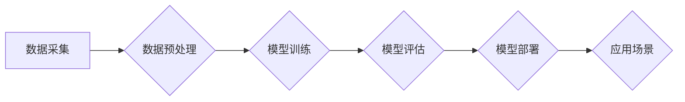

> 深度学习、航空航天、图像识别、预测维护、路径规划、无人机

## 1. 背景介绍

航空航天领域一直以来都是科技进步的先驱，其发展离不开不断涌现的先进技术。近年来，人工智能（AI）特别是深度学习算法的快速发展，为航空航天领域带来了前所未有的机遇。深度学习算法能够从海量数据中自动提取特征，并进行精准的预测和决策，在航空航天领域具有广泛的应用前景。

航空航天行业面临着诸多挑战，例如：

* **飞行安全:** 确保飞行安全是航空航天领域的首要任务。深度学习算法可以用于检测潜在的飞行风险，例如天气异常、机械故障等，从而提高飞行安全。
* **运营效率:** 航空航天运营成本高昂，提高运营效率是行业发展的关键。深度学习算法可以用于优化飞行路径、提高燃油效率、预测航班延误等，从而降低运营成本。
* **探索未知:** 航空航天领域不断探索未知领域，例如火星探测、太空探索等。深度学习算法可以用于分析遥感图像、识别未知物体、辅助导航等，从而推动人类探索未知领域的步伐。

## 2. 核心概念与联系

深度学习算法的核心概念是多层神经网络，它模仿了人类大脑的结构和功能。深度学习算法通过多层神经网络的叠加，能够学习到数据中的复杂特征，并进行精准的预测和决策。

**深度学习算法与航空航天应用的联系:**

* **图像识别:** 深度学习算法可以用于识别飞机、卫星、火箭等航空航天物体，并进行分类和定位。
* **预测维护:** 深度学习算法可以分析飞机的运行数据，预测潜在的机械故障，从而进行提前维护，降低维修成本。
* **路径规划:** 深度学习算法可以用于规划飞机的飞行路径，避开障碍物，提高飞行效率。
* **无人机控制:** 深度学习算法可以用于控制无人机的飞行，使其能够自主完成任务，例如航拍、物探等。

**Mermaid 流程图:**



## 3. 核心算法原理 & 具体操作步骤

### 3.1  算法原理概述

深度学习算法的核心是多层神经网络，它由多个神经元组成的层级结构组成。每个神经元接收来自上一层的输入信号，并对其进行处理，然后将处理后的信号传递到下一层。通过多层神经网络的叠加，深度学习算法能够学习到数据中的复杂特征。

常见的深度学习算法包括卷积神经网络（CNN）、循环神经网络（RNN）和生成对抗网络（GAN）。

* **卷积神经网络（CNN）:** CNN擅长处理图像数据，它利用卷积操作提取图像特征，并进行分类和识别。
* **循环神经网络（RNN）:** RNN擅长处理序列数据，例如文本和语音，它能够记忆过去的输入信息，并将其用于预测未来的输出。
* **生成对抗网络（GAN）:** GAN由两个神经网络组成，一个是生成器，一个是鉴别器。生成器试图生成逼真的数据，而鉴别器试图区分真实数据和生成数据。通过相互竞争，GAN能够生成高质量的合成数据。

### 3.2  算法步骤详解

深度学习算法的训练过程通常包括以下步骤：

1. **数据采集:** 收集相关的航空航天数据，例如飞机运行数据、遥感图像、飞行记录等。
2. **数据预处理:** 对收集到的数据进行清洗、转换、归一化等处理，使其能够被深度学习算法所接受。
3. **模型选择:** 根据具体的应用场景选择合适的深度学习算法，例如CNN、RNN或GAN。
4. **模型训练:** 使用训练数据训练深度学习模型，调整模型参数，使其能够准确地预测或决策。
5. **模型评估:** 使用测试数据评估模型的性能，例如准确率、召回率、F1-score等。
6. **模型部署:** 将训练好的模型部署到实际应用场景中，例如飞机控制系统、预测维护系统等。

### 3.3  算法优缺点

**优点:**

* **高精度:** 深度学习算法能够学习到数据中的复杂特征，从而实现高精度的预测和决策。
* **自动化:** 深度学习算法能够自动提取特征，无需人工干预，提高了效率。
* **适应性强:** 深度学习算法能够适应各种类型的航空航天数据，例如图像、文本、语音等。

**缺点:**

* **数据依赖:** 深度学习算法需要大量的训练数据，否则性能会下降。
* **计算资源:** 深度学习算法的训练过程需要大量的计算资源，例如GPU。
* **可解释性差:** 深度学习算法的决策过程比较复杂，难以解释其决策依据。

### 3.4  算法应用领域

深度学习算法在航空航天领域具有广泛的应用前景，例如：

* **飞行安全:** 检测飞行风险、预测机械故障、辅助飞行员决策。
* **运营效率:** 优化飞行路径、提高燃油效率、预测航班延误。
* **探索未知:** 分析遥感图像、识别未知物体、辅助导航。
* **无人机控制:** 控制无人机的飞行、自主完成任务。

## 4. 数学模型和公式 & 详细讲解 & 举例说明

### 4.1  数学模型构建

深度学习算法的数学模型通常基于神经网络，其核心是激活函数和权重参数。

* **激活函数:** 激活函数用于引入非线性，使神经网络能够学习到复杂的数据特征。常见的激活函数包括ReLU、Sigmoid和Tanh。

* **权重参数:** 权重参数决定了神经网络的输出，通过训练过程调整权重参数，使模型能够准确地预测或决策。

### 4.2  公式推导过程

深度学习算法的训练过程基于梯度下降算法，其目标是找到最优的权重参数，使模型的损失函数最小化。

损失函数通常定义为预测值与真实值的差值，例如均方误差（MSE）或交叉熵损失（Cross-Entropy Loss）。

梯度下降算法通过计算损失函数的梯度，更新权重参数，逐步逼近最优解。

### 4.3  案例分析与讲解

**举例说明：**

假设我们使用CNN算法进行飞机识别任务，训练数据包含飞机的图像和对应的标签。

* **输入层:** 接收飞机图像的像素数据。
* **卷积层:** 使用卷积核提取图像特征，例如边缘、纹理等。
* **池化层:** 对卷积层的输出进行降维，减少计算量。
* **全连接层:** 将池化层的输出连接到全连接层，进行分类决策。

训练过程中，通过计算损失函数的梯度，更新卷积层、池化层和全连接层的权重参数，使模型能够准确地识别飞机。

## 5. 项目实践：代码实例和详细解释说明

### 5.1  开发环境搭建

* **操作系统:** Ubuntu 18.04
* **编程语言:** Python 3.6
* **深度学习框架:** TensorFlow 2.0
* **GPU:** NVIDIA GeForce GTX 1080

### 5.2  源代码详细实现

```python
import tensorflow as tf

# 定义模型结构
model = tf.keras.models.Sequential([
    tf.keras.layers.Conv2D(32, (3, 3), activation='relu', input_shape=(224, 224, 3)),
    tf.keras.layers.MaxPooling2D((2, 2)),
    tf.keras.layers.Conv2D(64, (3, 3), activation='relu'),
    tf.keras.layers.MaxPooling2D((2, 2)),
    tf.keras.layers.Flatten(),
    tf.keras.layers.Dense(10, activation='softmax')
])

# 编译模型
model.compile(optimizer='adam',
              loss='sparse_categorical_crossentropy',
              metrics=['accuracy'])

# 训练模型
model.fit(x_train, y_train, epochs=10)

# 评估模型
loss, accuracy = model.evaluate(x_test, y_test)
print('Test loss:', loss)
print('Test accuracy:', accuracy)
```

### 5.3  代码解读与分析

* **模型结构:** 代码定义了一个简单的CNN模型，包含两个卷积层、两个池化层和一个全连接层。
* **激活函数:** 使用ReLU激活函数，引入非线性，提高模型的表达能力。
* **损失函数:** 使用交叉熵损失函数，用于分类任务。
* **优化器:** 使用Adam优化器，用于更新模型参数。
* **训练过程:** 使用训练数据训练模型，epochs参数指定训练轮数。
* **评估过程:** 使用测试数据评估模型的性能，计算损失函数和准确率。

### 5.4  运行结果展示

训练完成后，可以将模型应用于实际场景，例如识别飞机类型、检测飞机故障等。

## 6. 实际应用场景

### 6.1  飞行安全

* **飞行风险检测:** 深度学习算法可以分析飞机的运行数据，例如传感器数据、天气预报等，预测潜在的飞行风险，例如雷暴、冰雹、鸟类撞击等，从而提醒飞行员采取相应的措施，提高飞行安全。
* **机械故障预测:** 深度学习算法可以分析飞机的运行数据，例如发动机参数、结构振动等，预测潜在的机械故障，例如发动机故障、轮胎爆裂等，从而进行提前维护，降低维修成本，提高飞行安全。

### 6.2  运营效率

* **飞行路径优化:** 深度学习算法可以分析天气预报、空中交通流量等数据，优化飞机的飞行路径，避开障碍物，提高燃油效率，降低运营成本。
* **航班延误预测:** 深度学习算法可以分析航班历史数据、天气预报、机场拥堵情况等数据，预测航班延误的可能性，从而提前通知乘客，提高乘客体验。

### 6.3  探索未知

* **遥感图像分析:** 深度学习算法可以分析遥感图像，识别地面目标，例如城市、道路、河流等，辅助进行地形测绘、资源勘探等工作。
* **未知物体识别:** 深度学习算法可以识别未知物体，例如太空垃圾、陨石等，提高太空探索的安全性和效率。

### 6.4  未来应用展望

随着深度学习算法的不断发展，其在航空航天领域的应用前景更加广阔。未来，深度学习算法将被应用于更多领域，例如：

* **自动驾驶飞机:** 深度学习算法可以用于控制飞机的自动驾驶，提高飞行效率和安全性。
* **智能维护:** 深度学习算法可以用于智能维护，例如预测故障、诊断故障、优化维护方案等。
* **太空探索:** 深度学习算法可以用于太空探索，例如识别未知物体、分析遥感图像、辅助导航等。

## 7. 工具和资源推荐

### 7.1  学习资源推荐

* **书籍:**
    * 深度学习
    * 深度学习实战
    * TensorFlow实战
* **在线课程:**
    * Coursera 深度学习课程
    * Udacity 深度学习工程师 Nanodegree
    * fast.ai 深度学习课程

### 7.2  开发工具推荐

* **深度学习框架:** TensorFlow, PyTorch, Keras
* **编程语言:** Python
* **数据处理工具:** Pandas, NumPy

### 7.3  相关论文推荐

* **ImageNet Classification with Deep Convolutional Neural Networks**
* **Attention Is All You Need**
* **Generative Adversarial Networks**

## 8. 总结：未来发展趋势与挑战

### 8.1  研究成果总结

深度学习算法在航空航天领域取得了显著的成果，例如提高了飞行安全、优化了运营效率、推动了太空探索等。

### 8.2  未来发展趋势

* **模型更深更广:** 深度学习模型将更加深层、更加广阔