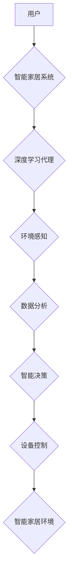

> 智能家居、深度学习、代理、强化学习、自然语言处理、计算机视觉

## 1. 背景介绍

智能家居作为未来生活的重要组成部分，正在以惊人的速度发展。它通过将各种智能设备连接起来，实现对家居环境的自动化控制和智能化管理，为人们带来更加便捷、舒适和安全的居住体验。然而，现有的智能家居系统往往存在着局限性，例如缺乏对用户需求的深度理解、交互方式单一、智能化程度有限等。

深度学习作为人工智能领域的一项重要突破，为智能家居的智能化发展提供了强大的技术支撑。深度学习算法能够从海量数据中学习，识别模式，并做出智能决策，从而实现对智能家居环境的更精准、更智能的控制。

## 2. 核心概念与联系

**2.1 智能家居系统架构**

智能家居系统通常由以下几个核心组件组成：

* **智能设备:** 包括各种传感器、执行器、控制单元等，例如智能灯泡、智能门锁、智能空调等。
* **网络平台:** 用于连接智能设备，实现数据传输和设备控制。
* **云平台:** 提供数据存储、处理和分析服务，以及用户管理和设备管理功能。
* **用户界面:** 用于用户与智能家居系统进行交互，例如手机APP、语音助手等。

**2.2 深度学习代理**

深度学习代理是一种能够自主学习和决策的智能代理，它利用深度学习算法从环境中获取信息，并根据学习到的知识和经验做出最优的行动。

**2.3 强化学习**

强化学习是一种机器学习方法，它通过奖励和惩罚机制来训练智能代理，使其在特定环境中学习最优策略。

**2.4 自然语言处理 (NLP)**

自然语言处理是人工智能领域的一个重要分支，它致力于使计算机能够理解和处理人类语言。在智能家居场景中，NLP技术可以用于理解用户的语音指令，并将其转换为智能设备可以执行的指令。

**2.5 计算机视觉**

计算机视觉是人工智能领域的一个重要分支，它致力于使计算机能够“看”和理解图像和视频。在智能家居场景中，计算机视觉技术可以用于识别物体、场景和人脸，从而实现更智能的设备控制和安全保障。

**2.6 智能家居系统与深度学习代理的结合**

将深度学习代理引入智能家居系统，可以实现以下优势：

* **更精准的智能控制:** 深度学习代理能够从用户行为、环境数据等多方面信息中学习，并根据学习到的知识做出更精准的智能控制决策。
* **更个性化的用户体验:** 深度学习代理可以根据用户的个人喜好和习惯，定制个性化的智能家居服务。
* **更强大的智能化功能:** 深度学习代理可以学习和执行更复杂的智能任务，例如自动规划家居环境、识别异常情况、提供智能建议等。

**2.7 Mermaid 流程图**



## 3. 核心算法原理 & 具体操作步骤

**3.1 算法原理概述**

智能家居场景中的深度学习代理通常基于强化学习算法进行训练。强化学习算法的核心思想是通过奖励和惩罚机制来引导智能代理学习最优策略。

在智能家居场景中，智能代理可以看作是一个智能决策者，它需要根据环境信息和用户需求做出最优的行动。环境信息包括智能家居设备的状态、用户行为等，用户需求可以是通过语音指令、手机APP等方式表达的。

智能代理通过与环境交互，获得奖励或惩罚，并根据这些奖励和惩罚来更新自己的策略，最终学习到最优的控制策略。

**3.2 算法步骤详解**

1. **环境建模:** 建立智能家居环境的数学模型，包括智能设备的状态、用户行为等因素。
2. **状态空间定义:** 定义智能家居环境的所有可能状态，例如智能灯泡的开关状态、空调的温度设置等。
3. **动作空间定义:** 定义智能代理可以执行的所有动作，例如打开灯泡、调节空调温度等。
4. **奖励函数设计:** 设计一个奖励函数，用于评估智能代理的动作是否符合用户需求和环境目标。
5. **强化学习算法训练:** 使用强化学习算法，例如Q学习、SARSA等，训练智能代理，使其学习到最优的控制策略。
6. **策略部署:** 将训练好的智能代理部署到智能家居系统中，使其能够自动控制智能设备。

**3.3 算法优缺点**

**优点:**

* **能够学习用户需求:** 强化学习算法能够从用户的行为数据中学习，并根据用户的喜好和习惯定制个性化的智能家居服务。
* **能够适应环境变化:** 强化学习算法能够根据环境的变化动态调整策略，使其能够适应智能家居环境的不断变化。
* **能够实现自主决策:** 强化学习算法能够使智能代理具备自主决策能力，无需人工干预即可完成智能家居控制任务。

**缺点:**

* **训练时间长:** 强化学习算法的训练过程通常需要大量的训练数据和计算资源，训练时间较长。
* **奖励函数设计困难:** 设计一个合适的奖励函数是强化学习算法的关键，但奖励函数的设计往往比较复杂，需要大量的经验和技巧。
* **数据安全问题:** 强化学习算法需要收集用户的行为数据进行训练，这可能会带来数据安全问题。

**3.4 算法应用领域**

强化学习算法在智能家居场景中的应用领域非常广泛，例如：

* **智能照明控制:** 根据用户的活动模式和光线条件，自动调节智能灯泡的亮度和颜色。
* **智能空调控制:** 根据用户的温度偏好和环境温度，自动调节空调的温度和风速。
* **智能家居安全保障:** 通过识别异常情况，例如门窗被打开、烟雾报警等，自动报警并采取相应的安全措施。
* **智能家居场景定制:** 根据用户的喜好和需求，自动定制智能家居场景，例如“睡前模式”、“工作模式”等。

## 4. 数学模型和公式 & 详细讲解 & 举例说明

**4.1 数学模型构建**

智能家居场景中的深度学习代理可以被建模为一个马尔可夫决策过程 (MDP)。

MDP 由以下几个要素组成：

* **状态空间 S:** 智能家居环境的所有可能状态。
* **动作空间 A:** 智能代理可以执行的所有动作。
* **转移概率 P(s', r | s, a):** 从状态 s 执行动作 a 到状态 s' 的概率，以及在该状态下获得的奖励 r。
* **奖励函数 R(s, a):** 在状态 s 执行动作 a 时获得的奖励。

**4.2 公式推导过程**

强化学习算法的目标是学习一个策略 π(s)，该策略能够最大化智能代理在智能家居环境中获得的总奖励。

常用的强化学习算法包括 Q 学习和 SARSA。

* **Q 学习:**

Q(s, a) = Q(s, a) + α[r + γ max<sub>a'</sub> Q(s', a') - Q(s, a)]

其中：

* Q(s, a) 是状态 s 下执行动作 a 的价值函数。
* α 是学习率。
* r 是在状态 s 执行动作 a 后获得的奖励。
* γ 是折扣因子。
* max<sub>a'</sub> Q(s', a') 是从状态 s' 执行所有动作 a' 的价值函数的最大值。

* **SARSA:**

Q(s, a) = Q(s, a) + α[r + γ Q(s', a') - Q(s, a)]

其中：

* Q(s, a) 是状态 s 下执行动作 a 的价值函数。
* α 是学习率。
* r 是在状态 s 执行动作 a 后获得的奖励。
* γ 是折扣因子。
* Q(s', a') 是从状态 s' 执行动作 a' 的价值函数。

**4.3 案例分析与讲解**

假设智能家居系统中有一个智能灯泡，用户可以通过语音指令控制灯泡的开关状态。

我们可以使用强化学习算法训练一个智能代理，使其能够根据用户的语音指令和环境光线条件自动控制灯泡的开关状态。

在训练过程中，我们可以将用户语音指令作为输入，环境光线条件作为状态，灯泡的开关状态作为动作，以及用户满意度作为奖励。

通过训练，智能代理能够学习到最优的控制策略，例如在用户说“打开灯”时，如果环境光线较暗，则打开灯泡；如果环境光线较亮，则不打开灯泡。

## 5. 项目实践：代码实例和详细解释说明

**5.1 开发环境搭建**

* 操作系统: Ubuntu 20.04
* Python 版本: 3.8
* 深度学习框架: TensorFlow 2.0
* 其他依赖库: numpy, pandas, matplotlib

**5.2 源代码详细实现**

```python
import tensorflow as tf
import numpy as np

# 定义状态空间和动作空间
state_space = 10  # 环境光线强度
action_space = 2  # 开灯/关灯

# 定义 Q 网络
class QNetwork(tf.keras.Model):
    def __init__(self):
        super(QNetwork, self).__init__()
        self.dense1 = tf.keras.layers.Dense(64, activation='relu')
        self.dense2 = tf.keras.layers.Dense(32, activation='relu')
        self.output = tf.keras.layers.Dense(action_space)

    def call(self, state):
        x = self.dense1(state)
        x = self.dense2(x)
        return self.output(x)

# 实例化 Q 网络
q_network = QNetwork()

# 定义损失函数和优化器
optimizer = tf.keras.optimizers.Adam(learning_rate=0.001)
loss_fn = tf.keras.losses.MeanSquaredError()

# 训练循环
for episode in range(1000):
    state = np.random.randint(0, state_space, size=1)
    done = False
    while not done:
        # 选择动作
        action = tf.argmax(q_network(tf.expand_dims(state, axis=0))).numpy()

        # 执行动作并获取奖励和下一个状态
        reward = ...  # 根据动作和环境状态计算奖励
        next_state = ...  # 根据动作和环境状态计算下一个状态

        # 更新 Q 值
        with tf.GradientTape() as tape:
            q_values = q_network(tf.expand_dims(state, axis=0))
            target_q_value = reward + gamma * tf.reduce_max(q_network(tf.expand_dims(next_state, axis=0)))
            loss = loss_fn(target_q_value, q_values[0, action])
        gradients = tape.gradient(loss, q_network.trainable_variables)
        optimizer.apply_gradients(zip(gradients, q_network.trainable_variables))

        # 更新状态
        state = next_state
        done = ...  # 判断是否结束

```

**5.3 代码解读与分析**

* 代码首先定义了智能家居环境的状态空间和动作空间。
* 然后定义了一个 Q 网络，用于估计状态-动作对的价值函数。
* 使用 Adam 优化器和均方误差损失函数训练 Q 网络。
* 训练循环中，智能代理根据当前状态选择动作，执行动作并获取奖励和下一个状态，然后更新 Q 值。

**5.4 运行结果展示**

训练完成后，可以将训练好的 Q 网络部署到智能家居系统中，使其能够自动控制智能设备。

## 6. 实际应用场景

**6.1 智能家居场景定制**

智能家居代理可以根据用户的个性化需求，定制