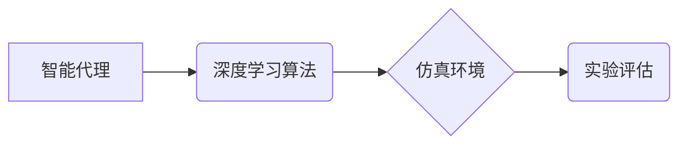

> 深度学习、智能代理、仿真环境、实验评估、算法优化

## 1. 背景介绍

深度学习作为人工智能领域最前沿的技术之一，在图像识别、自然语言处理、语音识别等领域取得了突破性的进展。智能代理作为人工智能研究的重要方向，旨在构建能够自主学习、决策和行动的智能体。将深度学习与智能代理相结合，可以构建更智能、更适应复杂环境的代理系统。

仿真环境为智能代理的开发和测试提供了理想的平台。在仿真环境中，可以模拟真实世界中的各种场景和事件，并对代理的性能进行评估。通过在仿真环境中进行实验，可以帮助我们更好地理解深度学习算法在智能代理中的应用，并优化算法参数以提高代理的性能。

## 2. 核心概念与联系

**2.1 智能代理**

智能代理是指能够感知环境、做出决策并执行行动的软件系统。智能代理通常具有以下特征：

* **自主性:** 智能代理能够自主地感知环境、制定决策并执行行动，无需人工干预。
* **学习能力:** 智能代理能够从经验中学习，并根据学习到的知识改进其决策和行动。
* **适应性:** 智能代理能够适应不断变化的环境，并调整其行为以实现目标。

**2.2 深度学习**

深度学习是一种机器学习的子领域，它利用多层神经网络来模拟人类大脑的学习过程。深度学习算法能够从海量数据中学习复杂的特征，并用于各种任务，例如图像识别、自然语言处理和语音识别。

**2.3 仿真环境**

仿真环境是一种模拟真实世界或特定场景的虚拟环境。在仿真环境中，可以控制环境参数、事件发生和代理的行为，并观察代理在不同环境下的表现。

**2.4 核心概念关系图**



## 3. 核心算法原理 & 具体操作步骤

**3.1 算法原理概述**

本文将介绍一种基于深度学习的智能代理算法，该算法利用深度神经网络来学习代理的决策策略。具体来说，该算法将环境观测数据作为输入，并输出代理的行动选择。

**3.2 算法步骤详解**

1. **环境建模:** 建立一个模拟真实世界或特定场景的仿真环境。
2. **代理设计:** 设计一个智能代理，该代理能够感知环境、做出决策并执行行动。
3. **深度神经网络训练:** 利用深度神经网络训练代理的决策策略。训练过程包括以下步骤：
    * 将环境观测数据作为输入，并将其映射到代理的行动空间。
    * 使用损失函数衡量代理的决策策略与目标行为之间的差异。
    * 利用优化算法更新神经网络参数，以最小化损失函数。
4. **代理测试:** 在仿真环境中测试代理的性能，并评估其决策策略的有效性。

**3.3 算法优缺点**

**优点:**

* **学习能力强:** 深度学习算法能够从海量数据中学习复杂的特征，并构建强大的决策策略。
* **适应性强:** 深度学习算法能够适应不断变化的环境，并根据新的信息更新其决策策略。
* **通用性强:** 深度学习算法可以应用于各种智能代理任务，例如机器人控制、游戏策略和金融交易。

**缺点:**

* **数据依赖性强:** 深度学习算法需要大量的训练数据才能达到良好的性能。
* **计算资源消耗大:** 深度学习算法的训练过程需要大量的计算资源。
* **可解释性差:** 深度学习算法的决策过程难以解释，这使得其应用在一些安全关键领域存在挑战。

**3.4 算法应用领域**

* **机器人控制:** 深度学习算法可以用于训练机器人进行自主导航、物体抓取和复杂任务执行。
* **游戏策略:** 深度学习算法可以用于训练游戏代理，使其能够在游戏中取得胜利。
* **金融交易:** 深度学习算法可以用于预测股票价格、识别交易机会和管理投资组合。
* **医疗诊断:** 深度学习算法可以用于分析医学图像、识别疾病和辅助医生诊断。

## 4. 数学模型和公式 & 详细讲解 & 举例说明

**4.1 数学模型构建**

智能代理的决策过程可以建模为一个马尔可夫决策过程 (MDP)。MDP 由以下要素组成：

* **状态空间 S:** 表示代理可能处于的所有状态。
* **动作空间 A:** 表示代理可以执行的所有动作。
* **转移概率 P(s', r | s, a):** 表示从状态 s 执行动作 a 后，转移到状态 s' 的概率，以及获得奖励 r 的概率。
* **奖励函数 R(s, a):** 表示代理在状态 s 执行动作 a 后获得的奖励。

**4.2 公式推导过程**

代理的目标是最大化其在所有状态和时间步长的累积奖励。可以使用动态规划算法或强化学习算法来求解 MDP，并获得代理的最佳策略。

**4.3 案例分析与讲解**

例如，考虑一个简单的机器人导航任务。机器人需要在迷宫中找到出口。

* **状态空间 S:** 表示机器人可能处于的每个位置。
* **动作空间 A:** 包括向上、向下、向左、向右四个动作。
* **转移概率 P(s', r | s, a):** 表示机器人执行动作 a 后，转移到状态 s' 的概率，以及获得奖励 r 的概率。例如，如果机器人执行向右的动作，并且当前位置不是迷宫的边界，则转移到下一个位置的概率为 1，奖励为 0。如果机器人执行向右的动作，并且当前位置是迷宫的边界，则转移到下一个位置的概率为 0，奖励为 -1。
* **奖励函数 R(s, a):** 当机器人到达出口时，奖励为 100，否则奖励为 0。

可以使用 Q-学习算法来训练机器人找到最佳的导航策略。Q-学习算法通过迭代更新 Q 值表，其中 Q(s, a) 表示从状态 s 执行动作 a 后获得的期望累积奖励。

## 5. 项目实践：代码实例和详细解释说明

**5.1 开发环境搭建**

本项目使用 Python 语言进行开发，并使用 TensorFlow 深度学习框架。

**5.2 源代码详细实现**

```python
import tensorflow as tf

# 定义神经网络模型
model = tf.keras.models.Sequential([
    tf.keras.layers.Dense(128, activation='relu', input_shape=(input_dim,)),
    tf.keras.layers.Dense(64, activation='relu'),
    tf.keras.layers.Dense(num_actions)
])

# 定义损失函数和优化器
loss_fn = tf.keras.losses.CategoricalCrossentropy()
optimizer = tf.keras.optimizers.Adam()

# 训练模型
for epoch in range(num_epochs):
    for batch in dataset:
        with tf.GradientTape() as tape:
            predictions = model(batch['observation'])
            loss = loss_fn(batch['action'], predictions)
        gradients = tape.gradient(loss, model.trainable_variables)
        optimizer.apply_gradients(zip(gradients, model.trainable_variables))

# 保存模型
model.save('agent_model.h5')
```

**5.3 代码解读与分析**

* 代码首先定义了一个深度神经网络模型，该模型包含多个全连接层和激活函数。
* 然后定义了损失函数和优化器，用于训练模型。
* 训练过程迭代地更新模型参数，以最小化损失函数。
* 最后，将训练好的模型保存为文件。

**5.4 运行结果展示**

在仿真环境中运行训练好的代理，并观察其决策和行为。可以记录代理的奖励、成功率和其他性能指标，并进行分析和评估。

## 6. 实际应用场景

**6.1 智能机器人**

深度学习算法可以用于训练机器人进行自主导航、物体抓取和复杂任务执行。例如，在制造业中，深度学习算法可以训练机器人进行零件装配和焊接任务。

**6.2 自动驾驶汽车**

深度学习算法可以用于训练自动驾驶汽车的感知系统，例如识别道路标志、车辆和行人。

**6.3 医疗诊断**

深度学习算法可以用于分析医学图像，识别疾病和辅助医生诊断。例如，深度学习算法可以用于检测肺癌、乳腺癌和脑肿瘤。

**6.4 金融交易**

深度学习算法可以用于预测股票价格、识别交易机会和管理投资组合。

**6.4 未来应用展望**

随着深度学习算法的不断发展，其在智能代理领域的应用将更加广泛。未来，深度学习算法将被用于构建更加智能、更加适应复杂环境的代理系统，例如：

* **个性化教育:** 深度学习算法可以根据学生的学习情况，提供个性化的学习内容和教学方法。
* **智能客服:** 深度学习算法可以训练智能客服系统，能够理解用户的自然语言请求，并提供准确的回复。
* **医疗辅助:** 深度学习算法可以辅助医生进行诊断、治疗和康复。

## 7. 工具和资源推荐

**7.1 学习资源推荐**

* **书籍:**
    * 深度学习 (Deep Learning) - Ian Goodfellow, Yoshua Bengio, Aaron Courville
    * 深度学习实践 (Hands-On Machine Learning with Scikit-Learn, Keras & TensorFlow) - Aurélien Géron
* **在线课程:**
    * 深度学习 Specialization - Andrew Ng (Coursera)
    * 深度学习 - fast.ai
* **博客和网站:**
    * TensorFlow 官方博客: https://blog.tensorflow.org/
    * Keras 官方文档: https://keras.io/

**7.2 开发工具推荐**

* **Python:** 
    * TensorFlow: https://www.tensorflow.org/
    * PyTorch: https://pytorch.org/
* **仿真环境:**
    * Gazebo: https://gazebosim.org/
    * Unity: https://unity.com/

**7.3 相关论文推荐**

* **DQN (Deep Q-Network):** Mnih et al. (2015)
* **Policy Gradient:** Sutton et al. (2000)
* **Actor-Critic:** Mnih et al. (2016)

## 8. 总结：未来发展趋势与挑战

**8.1 研究成果总结**

近年来，深度学习算法在智能代理领域取得了显著进展，例如在游戏、机器人控制和自动驾驶等领域取得了突破性成果。

**8.2 未来发展趋势**

* **更强大的深度学习算法:** 随着深度学习算法的不断发展，将出现更强大的算法，能够学习更复杂的特征，并构建更智能的代理系统。
* **更丰富的仿真环境:** 仿真环境将更加逼真和复杂，能够模拟更真实的场景和事件，从而提高代理的泛化能力。
* **更广泛的应用场景:** 深度学习算法将被应用于更多领域，例如医疗、教育和金融等。

**8.3 面临的挑战**

* **数据依赖性:** 深度学习算法仍然依赖于大量的训练数据，而获取高质量的训练数据仍然是一个挑战。
* **可解释性:** 深度学习算法的决策过程难以解释，这使得其应用在一些安全关键领域存在挑战。
* **计算资源消耗:** 深度学习算法的训练过程需要大量的计算资源，这限制了其在一些资源有限的场景中的应用。

**8.4 研究展望**

未来，研究人员将继续探索更强大的深度学习算法、更丰富的仿真环境和更广泛的应用场景，以推动智能代理技术的发展。


## 9. 附录：常见问题与解答

**9.1 如何选择合适的深度学习算法？**

选择合适的深度学习算法取决于具体的应用场景和数据特点。例如，对于图像识别任务，卷积神经网络 (CNN) 通常是一个不错的选择；对于自然语言处理任务，循环神经网络 (RNN