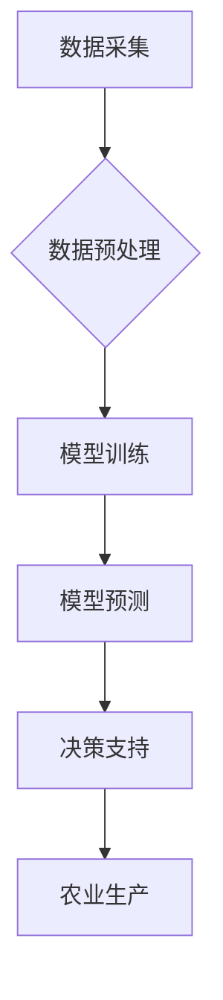

> AI, 农业, 精准农业, 机器学习, 深度学习, 计算机视觉, 农业机器人

## 1. 背景介绍

农业是人类文明的基石，也是全球经济的重要支柱。然而，随着人口增长和资源短缺，传统农业面临着诸多挑战，例如低效率、资源浪费、环境污染和气候变化的影响。为了应对这些挑战，精准农业应运而生。精准农业是指利用现代信息技术和数据分析手段，对农业生产进行精细化管理，提高资源利用效率、产量和产品质量，同时减少环境污染。

人工智能（AI）作为新兴技术，在精准农业领域展现出巨大的潜力。AI算法能够从海量农业数据中提取有价值的信息，为农业生产提供智能化决策支持。例如，AI可以用于预测作物产量、识别病虫害、优化施肥和灌溉等方面。

## 2. 核心概念与联系

**2.1 精准农业**

精准农业的核心是利用数据驱动决策，通过对田间环境、作物生长、土壤状况等多方面数据的收集和分析，实现对农业生产的精细化管理。

**2.2 人工智能**

人工智能是指模拟人类智能行为的计算机系统。AI算法能够学习和改进，并能够从数据中发现模式和规律。

**2.3 AI在精准农业中的应用**

AI技术可以应用于精准农业的各个环节，例如：

* **田间环境监测:** 利用传感器和无人机收集田间环境数据，如温度、湿度、光照、土壤水分等，为作物生长提供实时信息。
* **作物生长监测:** 利用计算机视觉技术识别作物生长状况，例如叶片面积、植株高度、果实大小等，并预测作物产量。
* **病虫害识别:** 利用深度学习算法识别病虫害，并提供防治建议。
* **精准施肥和灌溉:** 根据土壤状况和作物需求，精准施肥和灌溉，提高资源利用效率。
* **农业机器人:** 利用机器人技术进行田间作业，例如播种、除草、收获等，提高生产效率。

**2.4 AI在精准农业中的架构**



## 3. 核心算法原理 & 具体操作步骤

### 3.1  算法原理概述

在精准农业中，常用的AI算法包括机器学习、深度学习和强化学习等。

* **机器学习:** 机器学习算法能够从数据中学习模式和规律，并根据学习到的知识进行预测或分类。例如，可以使用机器学习算法预测作物产量、识别病虫害等。
* **深度学习:** 深度学习算法是一种更高级的机器学习算法，它使用多层神经网络来模拟人类大脑的学习过程。深度学习算法能够处理更复杂的数据，并取得更好的性能。例如，可以使用深度学习算法识别作物生长状况、进行精准定位等。
* **强化学习:** 强化学习算法是一种通过试错学习的算法，它通过奖励和惩罚来引导智能体做出最佳决策。例如，可以使用强化学习算法训练农业机器人进行田间作业。

### 3.2  算法步骤详解

以机器学习算法为例，其基本步骤如下：

1. **数据收集:** 收集相关农业数据，例如作物生长数据、土壤数据、天气数据等。
2. **数据预处理:** 对收集到的数据进行清洗、转换和特征工程等处理，使其适合机器学习算法的训练。
3. **模型选择:** 选择合适的机器学习算法，例如线性回归、逻辑回归、决策树、支持向量机等。
4. **模型训练:** 使用训练数据训练选择的机器学习模型，并调整模型参数，使其能够准确地预测或分类。
5. **模型评估:** 使用测试数据评估模型的性能，例如准确率、召回率、F1-score等。
6. **模型部署:** 将训练好的模型部署到实际应用场景中，例如用于预测作物产量、识别病虫害等。

### 3.3  算法优缺点

**优点:**

* 能够从海量数据中提取有价值的信息，提高决策效率。
* 能够根据数据变化自动调整决策，适应动态环境。
* 能够实现自动化决策，降低人工成本。

**缺点:**

* 需要大量的训练数据，数据质量对模型性能影响较大。
* 模型训练过程复杂，需要专业技术人员进行操作。
* 模型解释性较差，难以理解模型的决策过程。

### 3.4  算法应用领域

* **作物产量预测:** 利用历史数据和当前环境数据，预测作物产量，帮助农民制定种植计划。
* **病虫害识别:** 利用图像识别技术识别病虫害，并提供防治建议。
* **精准施肥和灌溉:** 根据土壤状况和作物需求，精准施肥和灌溉，提高资源利用效率。
* **农业机器人:** 利用机器人技术进行田间作业，例如播种、除草、收获等，提高生产效率。

## 4. 数学模型和公式 & 详细讲解 & 举例说明

### 4.1  数学模型构建

在精准农业中，常用的数学模型包括线性回归模型、逻辑回归模型、支持向量机模型等。

**4.1.1 线性回归模型**

线性回归模型是一种用于预测连续变量的机器学习算法。其基本假设是，目标变量与输入变量之间存在线性关系。

**公式:**

$$y = \beta_0 + \beta_1x_1 + \beta_2x_2 + ... + \beta_nx_n + \epsilon$$

其中：

* $y$ 是目标变量
* $x_1, x_2, ..., x_n$ 是输入变量
* $\beta_0, \beta_1, \beta_2, ..., \beta_n$ 是模型参数
* $\epsilon$ 是误差项

**4.1.2 逻辑回归模型**

逻辑回归模型是一种用于预测分类变量的机器学习算法。其基本假设是，目标变量服从伯努利分布。

**公式:**

$$P(y=1|x) = \frac{1}{1 + e^{-( \beta_0 + \beta_1x_1 + \beta_2x_2 + ... + \beta_nx_n)}}$$

其中：

* $P(y=1|x)$ 是目标变量为1的概率
* $x_1, x_2, ..., x_n$ 是输入变量
* $\beta_0, \beta_1, \beta_2, ..., \beta_n$ 是模型参数

### 4.2  公式推导过程

线性回归模型的参数可以通过最小二乘法估计，逻辑回归模型的参数可以通过最大似然估计估计。

### 4.3  案例分析与讲解

**案例:**

预测作物产量

**数据:**

* 作物品种
* 播种时间
* 施肥量
* 灌溉量
* 气温
* 降雨量

**模型:**

线性回归模型

**结果:**

模型能够准确预测作物产量，并提供产量变化趋势的预测。

## 5. 项目实践：代码实例和详细解释说明

### 5.1  开发环境搭建

* 操作系统: Ubuntu 20.04
* Python 版本: 3.8
* 必要的库: pandas, numpy, scikit-learn, matplotlib

### 5.2  源代码详细实现

```python
import pandas as pd
from sklearn.linear_model import LinearRegression
from sklearn.model_selection import train_test_split
from sklearn.metrics import mean_squared_error

# 加载数据
data = pd.read_csv('crop_yield_data.csv')

# 选择特征和目标变量
features = ['播种时间', '施肥量', '灌溉量', '气温', '降雨量']
target = '产量'

# 将数据分为训练集和测试集
X_train, X_test, y_train, y_test = train_test_split(data[features], data[target], test_size=0.2, random_state=42)

# 创建线性回归模型
model = LinearRegression()

# 训练模型
model.fit(X_train, y_train)

# 预测测试集数据
y_pred = model.predict(X_test)

# 计算模型性能
mse = mean_squared_error(y_test, y_pred)
print(f'模型均方误差: {mse}')

# 打印模型系数
print(f'模型系数: {model.coef_}')
```

### 5.3  代码解读与分析

* 代码首先加载数据，并选择特征和目标变量。
* 然后将数据分为训练集和测试集，用于训练和评估模型。
* 创建线性回归模型，并使用训练集训练模型。
* 使用训练好的模型预测测试集数据，并计算模型性能。
* 最后打印模型系数，以便了解每个特征对目标变量的影响。

### 5.4  运行结果展示

运行代码后，会输出模型的均方误差和模型系数。均方误差越小，模型性能越好。模型系数可以反映每个特征对目标变量的影响程度。

## 6. 实际应用场景

### 6.1  作物产量预测

利用历史数据和当前环境数据，预测作物产量，帮助农民制定种植计划，合理安排资源，提高产量。

### 6.2  病虫害识别

利用图像识别技术识别病虫害，并提供防治建议，帮助农民及时采取措施，减少病虫害损失。

### 6.3  精准施肥和灌溉

根据土壤状况和作物需求，精准施肥和灌溉，提高资源利用效率，减少环境污染。

### 6.4  未来应用展望

* **无人驾驶农业机械:** 利用AI技术控制无人驾驶农业机械，实现自动化作业，提高生产效率。
* **智能温室:** 利用AI技术控制温室环境，实现智能温室管理，提高产量和品质。
* **农业大数据分析:** 利用AI技术对农业大数据进行分析，挖掘农业生产规律，为农业决策提供支持。

## 7. 工具和资源推荐

### 7.1  学习资源推荐

* **书籍:**
    * 深度学习
    * 机器学习实战
* **在线课程:**
    * Coursera: 深度学习
    * edX: 机器学习
* **博客:**
    * 机器学习 Mastery
    * Towards Data Science

### 7.2  开发工具推荐

* **Python:** 
    * scikit-learn: 机器学习库
    * TensorFlow: 深度学习库
    * PyTorch: 深度学习库
* **数据可视化工具:**
    * Matplotlib
    * Seaborn

### 7.3  相关论文推荐

* **Deep Learning for Precision Agriculture: A Review**
* **Machine Learning in Agriculture: A Comprehensive Review**

## 8. 总结：未来发展趋势与挑战

### 8.1  研究成果总结

AI技术在精准农业领域取得了显著成果，例如作物产量预测、病虫害识别、精准施肥和灌溉等。

### 8.2  未来发展趋势

* **更强大的AI算法:** 随着AI技术的不断发展，将出现更强大的AI算法，能够处理更复杂的数据，并提供更精准的决策支持。
* **更广泛的应用场景:** AI技术将应用于更多农业领域，例如无人驾驶农业机械、智能温室、农业大数据分析等。
* **更智能的农业系统:** AI技术将与其他技术融合，构建更智能的农业系统，实现农业生产的自动化、智能化和可持续发展。

### 8.3  面临的挑战

* **数据质量问题:** AI算法的性能依赖于数据质量，而农业数据往往存在不完整、不准确、格式不统一等问题。
* **模型解释性问题:** 许多AI算法的决策过程难以解释，这使得农民难以理解模型的决策依据，难以信任模型的预测结果。
* **技术普及问题:**